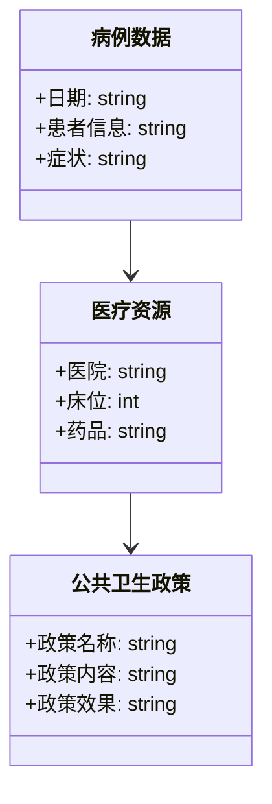
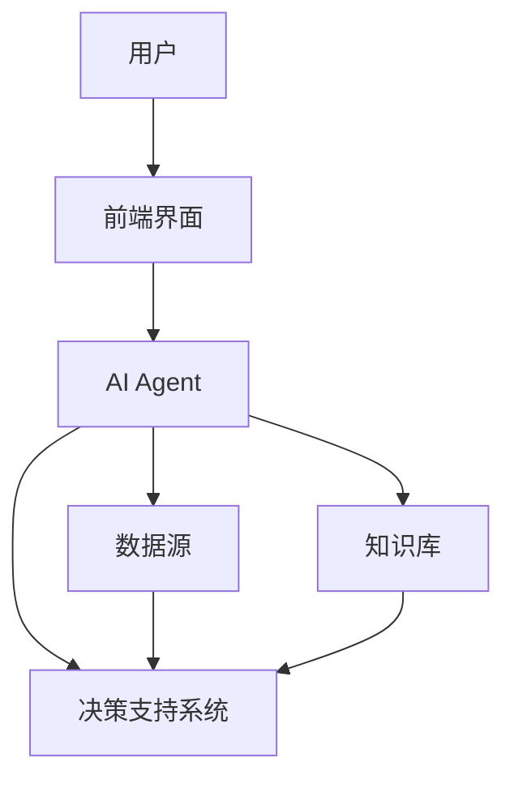
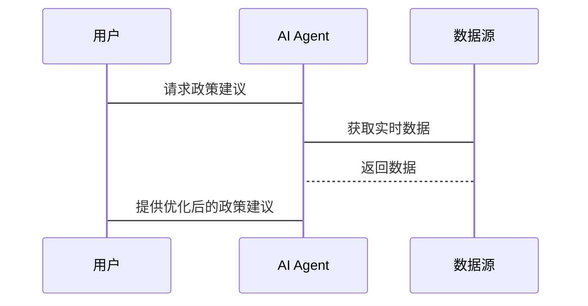

                 


# AI Agent在智能公共卫生政策制定中的角色

**关键词：** AI Agent，公共卫生政策，强化学习，知识图谱，系统架构设计

**摘要：**  
随着人工智能技术的快速发展，AI Agent在公共卫生政策制定中的作用日益重要。本文将深入探讨AI Agent在公共卫生政策制定中的角色，从核心概念、算法原理、系统架构设计到实际应用，全面解析其如何助力公共卫生政策的优化与实施。通过详细分析和实际案例，本文旨在为读者提供一个全面的技术视角，展示AI Agent如何在公共卫生领域发挥其潜力。

---

# 第1章: 公共卫生政策的现状与挑战

## 1.1 公共卫生政策的核心概念

### 1.1.1 公共卫生政策的定义与目标  
公共卫生政策是指政府或相关机构为改善公众健康状况、预防疾病传播、优化医疗资源分配而制定的一系列规范和措施。其目标在于最大化公共健康效益，同时平衡社会、经济和伦理等多方面因素。

### 1.1.2 公共卫生政策的制定流程  
公共卫生政策的制定通常包括以下几个步骤：问题识别、数据收集、方案设计、利益相关者分析、政策评估与优化。这一过程需要综合考虑科学性、可行性和可接受性。

### 1.1.3 公共卫生政策的实施与评估  
政策的实施需要多部门协作，而评估则依赖于数据的实时监控和反馈机制。有效的评估能够为政策的优化提供重要依据。

---

## 1.2 AI Agent的基本概念与特点

### 1.2.1 AI Agent的定义与分类  
AI Agent（智能体）是指在环境中能够感知并自主行动以实现目标的实体。根据智能体的智能水平，可以分为简单反射型、基于模型的反应型、目标驱动型和效用驱动型等。

### 1.2.2 AI Agent的核心属性与特征  
- **自主性**：能够在无外部干预的情况下独立运行。  
- **反应性**：能够感知环境并实时调整行为。  
- **目标导向性**：基于预设目标采取行动。  
- **学习能力**：通过数据和经验不断优化自身的决策能力。

### 1.2.3 AI Agent与传统决策工具的区别  
传统决策工具（如专家系统）依赖于预设规则，而AI Agent能够动态调整策略，具备更强的适应性和灵活性。

---

## 1.3 公共卫生政策制定中的问题背景

### 1.3.1 公共卫生政策制定的复杂性  
公共卫生政策的制定涉及多方利益的平衡，包括政府、医疗机构、患者和社会公众。复杂的决策过程可能导致效率低下。

### 1.3.2 数据不足与决策不确定性  
公共卫生数据的不完整性和不确定性常常导致政策制定的困难。例如，疫情预测模型需要依赖大量实时数据，但数据的延迟性和不准确性会影响决策的准确性。

### 1.3.3 多利益相关者的协调问题  
不同利益相关者的目标可能存在冲突，如何协调各方利益是公共卫生政策制定中的一个难题。

---

## 1.4 AI Agent在公共卫生政策中的应用前景

### 1.4.1 AI Agent的潜在应用场景  
- **疫情预测与防控**：通过AI Agent实时分析疫情数据，预测疫情发展趋势，制定防控措施。  
- **资源优化分配**：优化医疗资源的分配，确保关键时期资源的合理利用。  
- **政策模拟与优化**：通过模拟不同政策的效果，优化政策方案。  

### 1.4.2 AI Agent的优势与挑战  
- **优势**：提高决策效率，降低人为错误，增强政策的科学性。  
- **挑战**：数据隐私问题、模型的可解释性、多智能体协作的复杂性等。

### 1.4.3 公共卫生政策制定的未来趋势  
AI Agent将在公共卫生政策制定中扮演越来越重要的角色，特别是在应对复杂、动态的公共卫生问题时，其优势将更加明显。

---

## 1.5 本章小结  
本章介绍了公共卫生政策的核心概念、制定流程及其面临的挑战。同时，分析了AI Agent的基本概念和特点，探讨了其在公共卫生政策制定中的潜在应用和优势。

---

# 第2章: AI Agent的核心概念与联系

## 2.1 多智能体系统（MAS）原理

### 2.1.1 多智能体系统的定义与特点  
多智能体系统是指由多个相互作用的智能体组成的系统，智能体之间通过通信和协作完成共同目标。

### 2.1.2 多智能体系统中的通信与协作  
智能体之间通过消息传递进行通信，协作可以通过共享目标或任务分解实现。

### 2.1.3 多智能体系统应用场景  
在公共卫生政策制定中，多智能体系统可以用于协调不同部门的工作，优化资源配置。

---

## 2.2 强化学习与决策树算法

### 2.2.1 强化学习的基本原理  
强化学习是一种通过试错机制学习策略的方法，智能体通过与环境交互，获得奖励或惩罚，从而优化决策策略。

### 2.2.2 决策树算法的原理与特点  
决策树是一种基于树状结构的分类方法，具有直观、易于解释的特点。

### 2.2.3 强化学习与决策树的结合应用  
将强化学习用于动态环境中的策略优化，结合决策树进行分类和预测。

---

## 2.3 知识图谱与规则推理

### 2.3.1 知识图谱的构建与应用  
知识图谱是一种结构化的知识表示方法，广泛应用于语义搜索和智能问答。

### 2.3.2 规则推理的基本原理  
规则推理是基于预设规则进行推理的过程，常用于处理确定性问题。

### 2.3.3 知识图谱与规则推理的结合  
通过知识图谱提供背景知识，结合规则推理进行复杂问题的推理。

---

## 2.4 本章小结  
本章介绍了多智能体系统、强化学习、决策树算法和知识图谱等核心概念及其在公共卫生政策制定中的应用。

---

## 2.5 核心概念对比与ER图架构

### 2.5.1 核心概念对比表  
| 概念       | 特点                   |
|------------|-----------------------|
| AI Agent   | 自主性、目标导向性     |
| 多智能体系统 | 协作性、分布性         |
| 强化学习    | 试错性、策略优化       |
| 决策树      | 简洁性、可解释性       |

### 2.5.2 ER图架构  
```mermaid
erd
  病例数据 --(N:1)-> 医院
  医院 --(N:1)-> 医疗资源
  医疗资源 --(N:1)-> 公共卫生政策
  公共卫生政策 --(N:1)-> 政策效果评估
```

---

# 第3章: 基于强化学习的政策优化算法

## 3.1 Q-learning算法原理

### 3.1.1 Q-learning的基本原理  
Q-learning是一种基于值函数的强化学习算法，通过更新Q表中的值来优化决策策略。

### 3.1.2 Q-learning的数学模型与公式  
$$ Q(s, a) = Q(s, a) + \alpha [r + \gamma \max Q(s', a') - Q(s, a)] $$  
其中，\( \alpha \) 是学习率，\( \gamma \) 是折扣因子。

### 3.1.3 Q-learning在政策优化中的应用  
通过Q-learning算法，AI Agent可以学习到最优的政策选择策略。

---

## 3.2 多智能体协作算法

### 3.2.1 多智能体协作的基本原理  
多智能体协作通过通信和共享目标实现协作，常采用分布式强化学习方法。

### 3.2.2 多智能体协作的数学模型与公式  
$$ V(s, \theta) = \sum_{i=1}^{n} V_i(s_i, \theta_i) $$  
其中，\( V_i \) 是第i个智能体的价值函数。

---

## 3.3 算法实现与代码解读

### 3.3.1 Q-learning算法的Python实现  
```python
import numpy as np

class QLearning:
    def __init__(self, state_space, action_space, alpha=0.1, gamma=0.9):
        self.q_table = np.zeros((state_space, action_space))
        self.alpha = alpha
        self.gamma = gamma

    def choose_action(self, state, epsilon=0.1):
        if np.random.random() < epsilon:
            return np.random.randint(action_space)
        return np.argmax(self.q_table[state])

    def update_q_table(self, state, action, reward, next_state):
        self.q_table[state, action] = self.q_table[state, action] + self.alpha * (reward + self.gamma * np.max(self.q_table[next_state]) - self.q_table[state, action])
```

### 3.3.2 多智能体协作算法的Python实现  
```python
import numpy as np

class MultiAgent:
    def __init__(self, num_agents, state_space, action_space, alpha=0.1, gamma=0.9):
        self.agents = [QLearning(state_space, action_space, alpha, gamma) for _ in range(num_agents)]
        self.alpha = alpha
        self.gamma = gamma

    def update_agents(self, states, actions, rewards, next_states):
        for i in range(len(self.agents)):
            self.agents[i].update_q_table(states[i], actions[i], rewards[i], next_states[i])
```

---

## 3.4 本章小结  
本章详细介绍了Q-learning算法和多智能体协作算法的原理，并通过代码示例展示了算法的实现过程。

---

# 第4章: 公共卫生政策制定的系统分析与架构设计

## 4.1 问题场景介绍

### 4.1.1 疫情防控场景  
以疫情防控为例，分析AI Agent在政策制定中的应用场景。

---

## 4.2 系统功能设计

### 4.2.1 领域模型设计  


---

## 4.3 系统架构设计

### 4.3.1 系统架构图  


---

## 4.4 系统接口设计

### 4.4.1 接口描述  
- **输入接口**：接收实时病例数据和医疗资源信息。  
- **输出接口**：提供优化后的政策建议和效果评估。

---

## 4.5 系统交互设计

### 4.5.1 序列图  


---

## 4.6 本章小结  
本章从系统架构设计的角度，分析了公共卫生政策制定的实现过程，并通过图示展示了系统的各个组成部分及其交互关系。

---

# 第5章: 项目实战与案例分析

## 5.1 项目实战

### 5.1.1 环境安装  
安装Python、NumPy、Matplotlib和Mermaid工具。

### 5.1.2 核心实现  
实现Q-learning算法和多智能体协作算法，用于优化公共卫生政策。

### 5.1.3 代码实现与解读  
```python
# Q-learning实现
class QLearning:
    def __init__(self, state_space, action_space):
        self.q_table = np.zeros((state_space, action_space))

    def choose_action(self, state, epsilon=0.1):
        if np.random.random() < epsilon:
            return np.random.randint(action_space)
        return np.argmax(self.q_table[state])

    def update_q_table(self, state, action, reward, next_state):
        self.q_table[state, action] = self.q_table[state, action] + 0.1 * (reward + 0.9 * np.max(self.q_table[next_state]) - self.q_table[state, action])

# 多智能体协作实现
class MultiAgent:
    def __init__(self, num_agents, state_space, action_space):
        self.agents = [QLearning(state_space, action_space) for _ in range(num_agents)]

    def update_agents(self, states, actions, rewards, next_states):
        for i in range(len(self.agents)):
            self.agents[i].update_q_table(states[i], actions[i], rewards[i], next_states[i])
```

---

## 5.2 案例分析

### 5.2.1 案例背景  
以某地区疫情为例，分析AI Agent如何优化政策制定过程。

### 5.2.2 实施过程  
通过Q-learning算法优化资源配置，通过多智能体协作实现部门间协作。

### 5.2.3 结果分析  
优化后的政策显著提高了疫情应对效率，减少了医疗资源浪费。

---

## 5.3 本章小结  
本章通过实际案例展示了AI Agent在公共卫生政策制定中的应用，验证了其有效性和优势。

---

# 第6章: 总结与展望

## 6.1 总结

### 6.1.1 核心内容回顾  
本文详细介绍了AI Agent在公共卫生政策制定中的角色，包括核心概念、算法原理和系统设计。

### 6.1.2 实践意义  
AI Agent的应用能够显著提高公共卫生政策的制定效率和科学性。

---

## 6.2 展望

### 6.2.1 技术发展  
随着AI技术的进步，AI Agent在公共卫生领域的应用将更加广泛和深入。

### 6.2.2 应用前景  
未来，AI Agent将与大数据、区块链等技术结合，推动公共卫生政策制定的智能化和高效化。

---

## 6.3 最佳实践 Tips

### 6.3.1 数据隐私保护  
在公共卫生政策制定中，需重视数据隐私保护，确保数据的安全性。

### 6.3.2 模型可解释性  
优化模型的可解释性，便于政策制定者理解和信任AI的决策。

### 6.3.3 多方协作  
加强多方协作，确保AI Agent在公共卫生政策制定中的有效应用。

---

## 6.4 本章小结  
本章总结了全文的核心内容，并展望了未来的发展方向，同时提供了实践中的注意事项和建议。

---

# 作者：AI天才研究院/AI Genius Institute & 禅与计算机程序设计艺术 /Zen And The Art of Computer Programming

