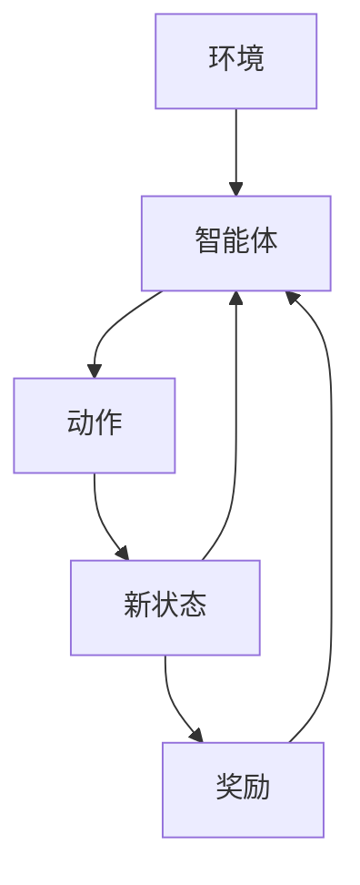
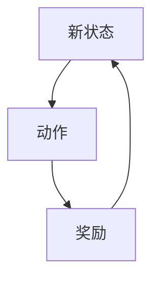
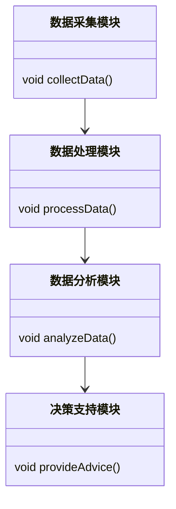
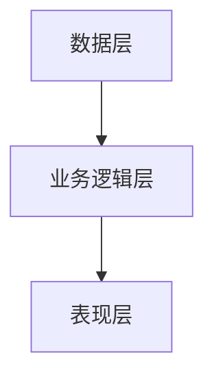
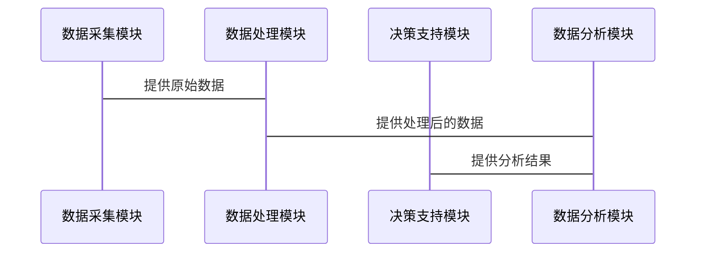

                 


# AI Agent在智能公共卫生监测中的角色

---

## 关键词：
AI Agent, 公共卫生监测, 智能监测, 知识表示, 强化学习, 多智能体协作

---

## 摘要：
AI Agent（人工智能代理）在智能公共卫生监测中扮演着越来越重要的角色。通过结合先进的算法和数学模型，AI Agent能够实时处理和分析海量数据，提供精准的决策支持，从而显著提升公共卫生事件的预防、监测和响应能力。本文将深入探讨AI Agent的核心概念、算法原理、系统架构以及实际应用，详细分析其在公共卫生监测中的独特优势和挑战，并结合实际案例展示其在智能公共卫生监测中的巨大潜力。

---

# 第1章: 公共卫生监测的现状与挑战

## 1.1 公共卫生监测的定义与重要性
公共卫生监测是指通过收集、分析和解释健康相关数据，以识别和评估公共卫生事件的趋势、风险和影响的过程。它是预防和控制疾病传播的重要手段，能够帮助政府和医疗机构及时采取措施，保护公众健康。

公共卫生监测的重要性体现在以下几个方面：
1. **疾病预防**：通过早期发现和预警，降低疾病传播风险。
2. **资源优化**：合理分配医疗资源，提高应对效率。
3. **政策制定**：为公共卫生政策的制定提供科学依据。

## 1.2 AI Agent的定义与特点
AI Agent是一种能够感知环境、自主决策并执行任务的智能体。它具有以下核心特点：
1. **自主性**：能够在没有外部干预的情况下独立运行。
2. **反应性**：能够实时感知环境变化并做出响应。
3. **学习能力**：通过数据和经验不断优化自身的决策能力。
4. **协作性**：能够与其他智能体或系统协同工作，共同完成复杂任务。

## 1.3 AI Agent在公共卫生监测中的角色
AI Agent在公共卫生监测中的角色可以概括为以下几个方面：
1. **数据采集与处理**：实时采集和分析来自多种数据源的健康数据。
2. **异常检测**：通过算法识别数据中的异常模式，发现潜在的公共卫生事件。
3. **决策支持**：基于分析结果提供实时的决策建议。
4. **协同工作**：与其他系统或智能体协作，共同应对公共卫生挑战。

---

# 第2章: AI Agent的核心概念与原理

## 2.1 AI Agent的核心概念
AI Agent的核心概念包括以下几个方面：
1. **知识表示**：通过符号逻辑或概率模型表示知识，帮助智能体理解和推理。
2. **问题求解**：通过搜索和优化算法解决复杂问题。
3. **多智能体协作**：多个智能体协同工作，共同完成复杂任务。

## 2.2 AI Agent的原理
AI Agent的原理可以分为以下几个步骤：
1. **感知环境**：通过传感器或数据接口获取环境信息。
2. **知识表示与推理**：将获取的信息转化为结构化的知识，并进行推理。
3. **决策与规划**：基于推理结果制定行动方案。
4. **执行与反馈**：执行决策并根据反馈调整行为。

## 2.3 AI Agent在公共卫生监测中的应用原理
在公共卫生监测中，AI Agent的主要任务是实时分析和处理数据，发现异常模式，并提供决策支持。其应用原理包括：
1. **数据流的处理与分析**：通过分布式计算和流数据处理技术，实时分析海量数据。
2. **实时决策与响应**：基于动态数据快速做出决策，并触发相应的响应措施。
3. **多源数据的融合与协同**：整合来自不同数据源的信息，进行协同分析。

---

# 第3章: AI Agent的算法原理与数学模型

## 3.1 基于概率论的决策模型
### 3.1.1 贝叶斯网络
贝叶斯网络是一种概率图模型，能够通过条件概率来表示变量之间的依赖关系。在公共卫生监测中，贝叶斯网络可以用于疾病传播的预测和风险评估。

公式：
$$ P(A|B) = \frac{P(B|A)P(A)}{P(B)} $$

### 3.1.2 马尔可夫决策过程
马尔可夫决策过程（MDP）是一种用于描述决策过程的数学模型，适用于状态转移和奖励函数已知的情况。

公式：
$$ V(s) = \max_{a} [ R(s,a) + \gamma \sum_{s'} P(s'|s,a) V(s') ] $$

## 3.2 基于图论的知识表示与推理
### 3.2.1 知识图谱
知识图谱是一种图结构，能够表示实体之间的关系。在公共卫生监测中，知识图谱可以用于疾病关联分析。

### 3.2.2 图神经网络
图神经网络（GNN）是一种适用于图结构数据的深度学习模型，能够通过节点和边的信息进行推理。

## 3.3 AI Agent的算法实现
### 3.3.1 状态空间与动作空间的定义
状态空间是指智能体可能处的状态集合，动作空间是指智能体可以执行的动作集合。

### 3.3.2 强化学习
强化学习是一种通过试错机制优化决策策略的算法。

流程图（使用mermaid）：



### 3.3.3 算法流程图（使用mermaid）



---

# 第4章: 系统架构设计

## 4.1 问题场景介绍
以疫情监测为例，系统需要实时监测疫情数据，识别疫情爆发的潜在风险，并提供预警和决策支持。

## 4.2 系统功能设计
### 4.2.1 领域模型
领域模型是系统功能的核心，包括数据采集、数据处理、数据分析和决策支持。

类图（使用mermaid）：



### 4.2.2 系统架构
系统架构采用分层设计，包括数据层、业务逻辑层和表现层。

架构图（使用mermaid）：



### 4.2.3 接口设计
系统需要与多种数据源和外部系统进行交互，接口设计包括数据采集接口和决策支持接口。

序列图（使用mermaid）：



---

# 第5章: 项目实战

## 5.1 环境安装
需要安装Python、TensorFlow、Kafka等工具。

## 5.2 核心实现
以下是核心代码示例：

```python
import tensorflow as tf
from tensorflow.keras import layers

# 定义模型
model = tf.keras.Sequential([
    layers.Dense(64, activation='relu'),
    layers.Dense(1, activation='sigmoid')
])

# 编译模型
model.compile(optimizer='adam', loss='binary_crossentropy', metrics=['accuracy'])

# 训练模型
model.fit(X_train, y_train, epochs=10, batch_size=32)
```

## 5.3 案例分析
以某市疫情监测为例，展示如何利用AI Agent进行实时监测和预警。

## 5.4 项目总结
通过实际案例展示AI Agent在公共卫生监测中的应用效果和优化空间。

---

# 第6章: 最佳实践与未来展望

## 6.1 最佳实践
1. 数据质量是关键，确保数据的准确性和完整性。
2. 强化学习算法需要大量的数据和计算资源，建议使用分布式计算。
3. 多智能体协作需要良好的通信机制和协同策略。

## 6.2 未来展望
随着AI技术的不断发展，AI Agent在公共卫生监测中的应用将更加广泛和深入。未来的研究方向包括更高效的算法、更强大的多智能体协作机制以及更智能化的决策支持系统。

---

# 作者：AI天才研究院 & 禅与计算机程序设计艺术

---

通过以上思考和分析，我们逐步完成了《AI Agent在智能公共卫生监测中的角色》的撰写。这篇文章详细介绍了AI Agent在公共卫生监测中的核心概念、算法原理、系统架构和实际应用，为读者提供了全面的技术解读和实践指南。

