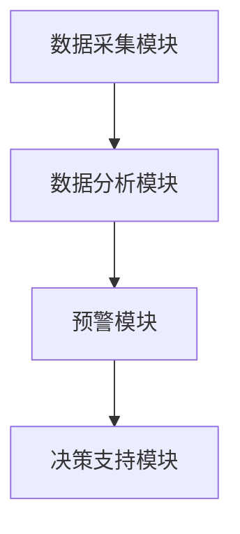

                 


# AI Agent在智能公共卫生监测中的角色

## 关键词：AI Agent, 公共卫生监测, 人工智能, 公共卫生管理, 智能监测

## 摘要：  
AI Agent（人工智能代理）在智能公共卫生监测中扮演着越来越重要的角色。随着全球公共卫生事件的频发，传统的公共卫生监测方法已经难以应对复杂多变的挑战。AI Agent通过智能化的数据采集、分析和决策能力，能够显著提升公共卫生监测的效率和准确性。本文将从AI Agent的基本概念、核心原理、应用场景、技术实现等方面，全面探讨AI Agent在智能公共卫生监测中的角色，并通过实际案例分析其在疾病传播监测、资源优化配置和应急响应中的应用效果。本文还将介绍AI Agent在公共卫生监测中的算法原理、系统架构设计以及最佳实践，为相关领域的研究和应用提供参考。

---

## 第1章 公共卫生监测的现状与挑战

### 1.1 公共卫生监测的基本概念

公共卫生监测是通过对人群健康状况及相关因素的系统观察和分析，及时发现和评估公共卫生问题，为制定和实施干预措施提供科学依据。其主要目标包括疾病预防、健康风险评估、资源优化配置等。

#### 1.1.1 数据采集的困难  
公共卫生监测的数据来源广泛，包括医院、疾控中心、社区卫生服务中心等。然而，数据的分散性、异构性和实时性要求带来了数据采集的挑战。例如，如何高效采集、整合和清洗多源数据是一个关键问题。

#### 1.1.2 数据分析的复杂性  
公共卫生数据通常具有高维性、时序性和关联性等特点，传统的统计方法难以应对复杂的分析需求。例如，在疫情预测中，需要考虑人口流动、环境因素、疫苗接种率等多个变量的综合影响。

#### 1.1.3 应急响应的及时性要求  
在突发公共卫生事件中，时间就是生命。如何快速分析数据、制定决策并执行响应是公共卫生监测的核心挑战。

---

### 1.2 AI Agent在公共卫生监测中的作用

AI Agent是一种能够感知环境、自主决策并执行任务的智能体。其在公共卫生监测中的优势体现在以下几个方面：

#### 1.2.1 数据感知与实时分析  
AI Agent能够实时采集、处理和分析多源数据，例如通过自然语言处理技术分析社交媒体上的健康信息，从而发现潜在的疫情苗头。

#### 1.2.2 智能化决策支持  
AI Agent可以通过强化学习算法优化资源分配策略，例如在疫情期间合理调配医疗资源，确保关键地区的物资供应。

#### 1.2.3 自适应学习与进化  
AI Agent能够根据实时数据和反馈不断优化自身的决策模型，从而在动态变化的环境中保持高效的监测能力。

---

## 第2章 AI Agent的核心概念与原理

### 2.1 AI Agent的基本原理

AI Agent由感知模块、决策模块和执行模块组成。感知模块负责数据的采集与处理，决策模块基于分析结果制定最优策略，执行模块则将决策转化为实际操作。

#### 2.1.1 数据感知模块  
数据感知模块通过多种传感器和数据接口实时采集健康数据，例如温度、湿度、人口流动等信息。

#### 2.1.2 决策优化算法  
决策模块采用多目标优化算法，例如基于强化学习的Q-learning算法，以最大化监测效率和资源利用率。

#### 2.1.3 系统反馈与学习  
AI Agent通过反馈机制不断优化自身的决策模型，例如通过监督学习调整权重参数，以提高预测的准确性。

---

## 第3章 AI Agent在公共卫生监测中的应用场景

### 3.1 疾病传播监测

#### 3.1.1 疾病传播模型的构建  
基于AI Agent的疾病传播模型可以实时模拟疫情扩散路径，为防控措施提供科学依据。

#### 3.1.2 疫情预测与预警  
AI Agent可以通过时间序列分析预测疫情发展趋势，并在潜在风险出现时发出预警。

#### 3.1.3 传播路径分析  
通过图论算法分析疫情传播网络，识别关键传播节点，从而制定精准的防控策略。

---

## 第4章 AI Agent在公共卫生监测中的技术实现

### 4.1 数据采集与处理

#### 4.1.1 数据源的多样化  
AI Agent可以从医院、疾控中心、社交媒体等多种数据源获取健康信息。

#### 4.1.2 数据清洗与预处理  
通过数据清洗和特征提取，消除噪声数据，提高分析结果的准确性。

#### 4.1.3 数据存储与管理  
采用分布式数据库存储大规模数据，并通过数据建模技术构建领域知识图谱。

---

### 4.2 数据分析与建模

#### 4.2.1 疾病传播模型  
基于图论的传播网络模型，例如使用NetworkX库构建图结构，并通过社区发现算法识别疫情传播簇。

#### 4.2.2 疫情预测模型  
采用LSTM（长短期记忆网络）进行时间序列预测，模型代码如下：

```python
import numpy as np
from tensorflow.keras.layers import LSTM, Dense
from tensorflow.keras.models import Sequential

model = Sequential()
model.add(LSTM(64, input_shape=(timesteps, features)))
model.add(Dense(1))
model.compile(optimizer='adam', loss='mse')
```

#### 4.2.3 资源分配优化  
通过强化学习算法优化医疗资源的分配策略，例如使用OpenAI Gym框架进行模拟训练。

---

## 第5章 项目实战：流感疫情监测系统

### 5.1 系统架构设计

#### 5.1.1 系统功能设计  
系统包括数据采集模块、数据分析模块、预警模块和决策支持模块。

#### 5.1.2 系统架构图  
使用Mermaid绘制系统架构图：



### 5.2 核心代码实现

#### 5.2.1 数据采集模块  
使用Flask框架开发API接口，采集实时疫情数据。

```python
from flask import Flask
import requests

app = Flask(__name__)

@app.route('/api/data', methods=['GET'])
def get_data():
    response = requests.get('https://example.com/api/flu_data')
    return response.json()

if __name__ == '__main__':
    app.run(debug=True)
```

#### 5.2.2 数据分析模块  
基于LSTM模型进行疫情预测。

```python
import numpy as np
from tensorflow.keras.models import Sequential
from tensorflow.keras.layers import LSTM, Dense

model = Sequential()
model.add(LSTM(64, input_shape=(timesteps, features)))
model.add(Dense(1))
model.compile(optimizer='adam', loss='mse')

# 训练模型
model.fit(X_train, y_train, epochs=100, batch_size=32)
```

### 5.3 实际案例分析

#### 5.3.1 疫情预测结果  
通过模型预测某地区流感疫情的未来发展趋势，并生成预警信息。

#### 5.3.2 资源分配优化  
根据预测结果优化医疗资源的分配，确保关键地区的防护物资充足。

---

## 第6章 最佳实践与注意事项

### 6.1 最佳实践

#### 6.1.1 数据质量管理  
确保数据的准确性和完整性，避免噪声数据对分析结果的影响。

#### 6.1.2 模型调优与评估  
定期对AI Agent的模型进行调优和评估，确保其预测精度和响应速度。

#### 6.1.3 安全与隐私保护  
在数据采集和分析过程中，严格遵守隐私保护法规，确保患者信息的安全。

---

## 第7章 总结

AI Agent在智能公共卫生监测中的应用前景广阔。通过智能化的数据分析和决策支持，AI Agent能够显著提升公共卫生监测的效率和准确性。然而，其应用也面临数据安全、模型优化等挑战，需要在实际应用中不断探索和改进。

---

## 作者：AI天才研究院 & 禅与计算机程序设计艺术

