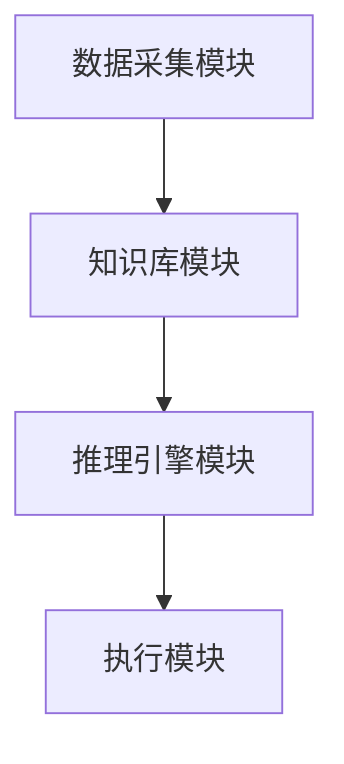
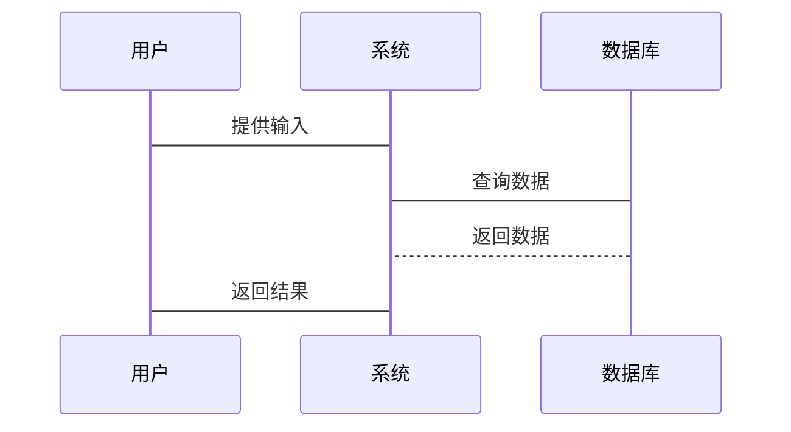

                 


# AI Agent在智能公共政策制定中的应用

> 关键词：AI Agent，智能公共政策，政策制定，人工智能，决策优化

> 摘要：本文探讨了AI Agent在智能公共政策制定中的应用，分析了其核心概念、算法原理和应用场景，并提供了实际案例和系统架构设计。文章详细阐述了AI Agent如何通过数据处理、决策优化和模拟预测等技术手段，提升公共政策制定的效率和科学性，为政策制定者提供有力支持。

---

## 第一部分：AI Agent的基本概念与背景介绍

### 第1章：AI Agent的定义与核心概念

#### 1.1 AI Agent的定义
AI Agent（人工智能代理）是指能够感知环境、自主决策并采取行动的智能实体。它通过传感器获取信息，利用知识库和推理引擎进行分析，并通过执行器采取行动，以实现特定目标。

#### 1.2 公共政策制定的背景与挑战
公共政策制定是一个复杂的过程，涉及多方面的利益平衡和社会目标的实现。传统方法依赖于专家经验和数据分析，但存在效率低、覆盖面有限的问题。AI Agent的引入，为政策制定提供了新的可能性。

### 1.3 AI Agent的核心要素
AI Agent的核心要素包括感知能力、知识库、推理引擎和执行能力。感知能力帮助AI Agent获取环境信息，知识库存储相关知识和数据，推理引擎用于分析和决策，执行能力则将决策转化为具体行动。

---

## 第二部分：AI Agent的核心概念与原理

### 第2章：AI Agent的类型与特点

#### 2.1 基于规则的AI Agent
基于规则的AI Agent通过预定义的规则进行决策。例如，在交通管理中，AI Agent可以根据交通流量规则进行信号灯控制。

#### 2.2 基于模型的AI Agent
基于模型的AI Agent利用数学模型进行预测和优化。例如，在经济政策制定中，AI Agent可以通过宏观经济模型预测政策效果。

#### 2.3 基于机器学习的AI Agent
基于机器学习的AI Agent通过数据驱动的方式进行学习和优化。例如，在环境保护政策中，AI Agent可以通过机器学习模型预测污染扩散趋势。

### 2.4 AI Agent的工作原理
AI Agent的工作原理包括信息感知、知识表示、推理决策和行为执行四个步骤。通过这些步骤，AI Agent能够自主完成任务并适应环境变化。

### 2.5 AI Agent在公共政策制定中的优势
AI Agent在公共政策制定中的优势体现在高效性、准确性和适应性。通过AI Agent，政策制定者可以快速分析大量数据，优化决策并实时调整策略。

---

## 第三部分：AI Agent在公共政策制定中的应用场景

### 第3章：公共政策问题的识别与分析

#### 3.1 数据收集与问题建模
AI Agent通过传感器和数据库获取相关信息，并构建问题模型。例如，在交通管理中，AI Agent可以收集交通流量、事故记录等数据，建立交通拥堵模型。

#### 3.2 问题分析与目标设定
AI Agent通过知识库和推理引擎分析问题，设定合理的决策目标。例如，在环境保护中，AI Agent可以分析污染源分布，设定减排目标。

#### 3.3 多利益相关者的协调与优化
AI Agent通过多目标优化算法协调不同利益相关者的诉求，制定最优政策。例如，在教育资源分配中，AI Agent可以通过多目标优化平衡公平性和效率性。

### 第4章：AI Agent在政策模拟与预测中的应用

#### 4.1 政策效果的模拟与预测
AI Agent可以通过模拟模型预测政策实施的效果。例如，在经济政策中，AI Agent可以模拟减税政策对GDP的影响。

#### 4.2 不同政策方案的比较与评估
AI Agent可以比较不同政策方案的优劣，评估其可行性和效果。例如，在能源政策中，AI Agent可以比较可再生能源补贴和碳税的效果。

#### 4.3 政策风险的识别与应对
AI Agent可以通过风险评估模型识别政策实施中的潜在风险，并制定应对策略。例如，在公共卫生政策中，AI Agent可以识别疫苗接种政策的风险并提出调整建议。

### 第5章：AI Agent在政策执行与反馈中的应用

#### 5.1 政策执行的监控与评估
AI Agent可以通过实时数据监控政策执行情况，并评估其效果。例如，在交通管理中，AI Agent可以实时监控信号灯运行情况，评估其对交通流量的影响。

#### 5.2 反馈机制的建立与优化
AI Agent可以通过反馈机制不断优化政策执行。例如，在教育政策中，AI Agent可以根据学生反馈优化教育资源分配。

#### 5.3 动态调整与持续改进
AI Agent可以根据环境变化动态调整政策，并持续改进政策效果。例如，在气候变化应对中，AI Agent可以根据实时天气数据调整减排策略。

---

## 第四部分：AI Agent的算法原理与实现

### 第6章：AI Agent的算法原理

#### 6.1 强化学习算法
强化学习是一种常用的AI Agent算法，通过试错学习优化决策。例如，在交通管理中，AI Agent可以通过强化学习优化信号灯控制策略。

#### 6.2 遗传算法
遗传算法是一种模拟生物进化过程的优化算法。例如，在经济政策中，AI Agent可以通过遗传算法优化税收政策参数。

#### 6.3 贝叶斯网络
贝叶斯网络是一种基于概率推理的算法。例如，在公共安全政策中，AI Agent可以通过贝叶斯网络分析犯罪风险。

### 第7章：AI Agent的数学模型与公式

#### 7.1 强化学习模型
强化学习模型包括状态、动作、奖励和策略四个部分。状态表示环境状态，动作表示AI Agent的行为，奖励表示动作的价值，策略表示动作选择的概率。

#### 7.2 贝叶斯网络公式
贝叶斯网络公式表示变量之间的概率关系。例如，P(A|B)表示在B发生的条件下，A发生的概率。

---

## 第五部分：AI Agent的系统架构与设计

### 第8章：系统架构设计

#### 8.1 系统功能模块
AI Agent系统包括数据采集模块、知识库模块、推理引擎模块和执行模块。数据采集模块负责获取环境数据，知识库模块存储相关知识，推理引擎模块进行分析和决策，执行模块将决策转化为具体行动。

#### 8.2 系统架构图
以下是AI Agent系统的架构图：



#### 8.3 系统接口设计
AI Agent系统需要与外部系统进行交互，例如与数据库、传感器和执行器进行接口设计。接口设计需要考虑数据格式、通信协议和安全性。

#### 8.4 系统交互流程图
以下是AI Agent系统的交互流程图：



---

## 第六部分：AI Agent的项目实战

### 第9章：项目实战

#### 9.1 环境安装
要实现AI Agent，首先需要安装Python、numpy、scikit-learn等库。

#### 9.2 核心代码实现
以下是AI Agent的强化学习实现代码：

```python
import numpy as np
from sklearn.model_selection import train_test_split
from sklearn.neighbors import KNeighborsRegressor

# 数据准备
X = np.array([[0, 0], [1, 1], [2, 2], [3, 3]])
y = np.array([0, 1, 2, 3])

# 数据划分
X_train, X_test, y_train, y_test = train_test_split(X, y, test_size=0.25)

# 模型训练
model = KNeighborsRegressor(n_neighbors=3)
model.fit(X_train, y_train)

# 模型预测
print(model.predict(X_test))
```

#### 9.3 案例分析
以交通信号灯控制为例，AI Agent可以通过强化学习优化信号灯切换策略，减少交通拥堵。

---

## 第七部分：总结与展望

### 第10章：总结与展望

#### 10.1 总结
本文详细探讨了AI Agent在智能公共政策制定中的应用，分析了其核心概念、算法原理和应用场景，并提供了实际案例和系统架构设计。

#### 10.2 展望
未来，随着AI技术的不断发展，AI Agent在公共政策制定中的应用将更加广泛和深入。需要进一步研究如何解决数据隐私、算法公平性等挑战。

---

## 作者

作者：AI天才研究院/AI Genius Institute & 禅与计算机程序设计艺术 /Zen And The Art of Computer Programming

