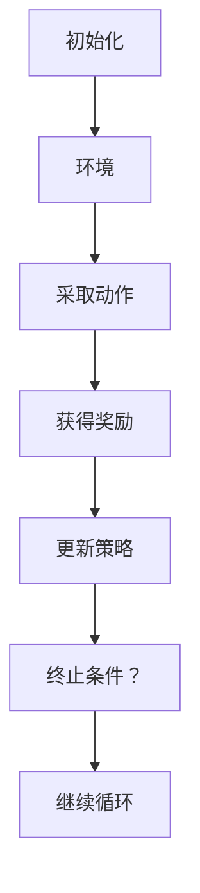
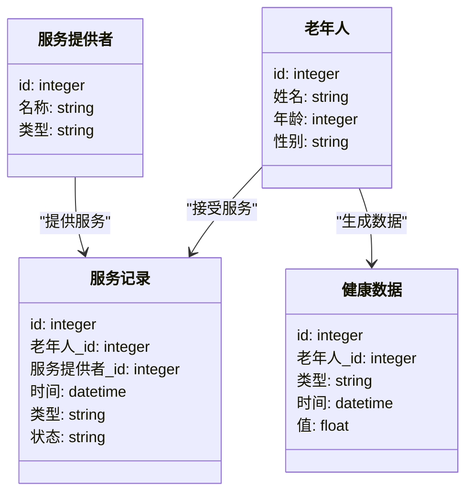
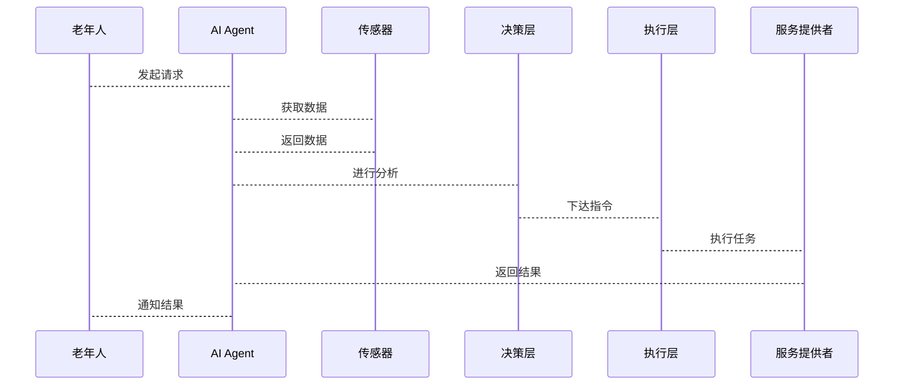

                 


# AI Agent在智能养老服务中的应用

> 关键词：AI Agent, 智能养老服务, 老龄化社会, 人工智能, 智能助手

> 摘要：本文探讨了AI Agent在智能养老服务中的应用，从背景、核心概念、算法原理到系统架构、项目实战及最佳实践，全面分析了AI Agent如何解决老龄化社会中的养老服务问题。文章结合实际案例和数学模型，详细阐述了AI Agent在智能养老服务中的潜力与实现方式。

---

# 第一部分: AI Agent在智能养老服务中的应用概述

# 第1章: 背景介绍

## 1.1 问题背景

### 1.1.1 老龄化社会的加剧
随着全球人口老龄化的加剧，传统的人工养老服务模式已经难以满足日益增长的需求。老年人数量的增加和年轻人工作压力的加重，使得养老服务资源的分配问题变得愈发突出。如何高效地为老年人提供个性化、智能化的养老服务，成为社会关注的焦点。

### 1.1.2 智能养老服务的需求
老年人群体的需求多样化且复杂化。除了基本的生活护理外，还需要医疗监测、心理陪伴、紧急响应等多种服务。传统的养老服务模式效率低下，难以覆盖这些复杂需求。因此，智能化养老服务的需求日益迫切。

### 1.1.3 AI Agent在养老服务中的潜力
AI Agent（人工智能代理）是一种能够自主感知环境、做出决策并执行任务的智能体。它能够通过学习和推理，为老年人提供个性化的服务，从而提高养老服务的效率和质量。AI Agent在智能养老服务中的应用潜力巨大。

## 1.2 问题描述

### 1.2.1 智能养老服务的核心问题
智能养老服务的核心问题在于如何通过技术手段解决老年人的生活需求，包括健康监测、紧急响应、心理陪伴等。同时，如何保证服务的实时性、准确性和个性化也是关键问题。

### 1.2.2 老年人的需求特点
老年人的需求具有多样性、个性化和复杂性。他们需要便捷的健康监测、及时的医疗响应、个性化的心理支持，以及安全的居住环境。此外，老年人的行动能力和认知能力可能有限，这也增加了服务的难度。

### 1.2.3 当前养老服务的痛点
当前养老服务存在资源分配不均、效率低下、服务单一化等问题。传统的养老服务模式难以满足老年人多样化的需求，且服务成本高，难以大规模推广。

## 1.3 问题解决

### 1.3.1 AI Agent如何解决养老服务问题
AI Agent可以通过智能化的感知、决策和执行，为老年人提供个性化的服务。例如，AI Agent可以实时监测老年人的健康状况，预测潜在的健康风险，并在紧急情况下及时响应。

### 1.3.2 AI Agent的优势与局限
AI Agent的优势在于其高效性、准确性和个性化。它可以24小时不间断地为老年人提供服务，且能够根据老年人的需求进行动态调整。然而，AI Agent也存在一些局限性，例如依赖传感器数据、算法的局限性以及隐私保护问题。

### 1.3.3 AI Agent在养老服务中的应用场景
AI Agent在养老服务中的应用场景包括健康监测、紧急响应、心理支持、生活辅助等。例如，AI Agent可以通过智能设备监测老年人的健康数据，及时发现异常并通知家属或医护人员。

## 1.4 边界与外延

### 1.4.1 AI Agent的定义与范围
AI Agent是一种能够自主感知环境、做出决策并执行任务的智能体。它可以在养老服务中作为辅助工具，帮助老年人解决生活中的各种问题。

### 1.4.2 与其他技术的区分
AI Agent与传统的人工智能技术（如机器学习、自然语言处理）有所不同。它强调自主性和实时性，能够根据环境的变化动态调整行为。

### 1.4.3 应用场景的边界
AI Agent在养老服务中的应用场景主要集中在健康监测、紧急响应和生活辅助等领域。目前，AI Agent还无法完全替代人类的直接服务，但在某些场景下可以显著提高服务效率。

## 1.5 核心要素组成

### 1.5.1 感知层
感知层是AI Agent的核心组成部分之一。它通过传感器、摄像头等设备，实时采集老年人的健康数据和环境信息。

### 1.5.2 决策层
决策层负责对感知层获取的数据进行分析和处理，生成相应的决策指令。这一步骤需要结合老年人的需求和环境信息，做出最优的选择。

### 1.5.3 执行层
执行层负责根据决策层的指令，通过智能设备或服务人员，执行具体的任务。例如，AI Agent可以控制智能设备为老年人提供健康监测或生活辅助。

## 1.6 本章小结

---

# 第2章: 核心概念与联系

## 2.1 核心概念原理

### 2.1.1 AI Agent的基本原理
AI Agent的基本原理包括感知、决策和执行三个环节。感知层通过传感器获取数据，决策层通过算法进行分析，执行层通过智能设备完成任务。

### 2.1.2 智能养老服务的核心要素
智能养老服务的核心要素包括健康监测、紧急响应、心理支持和生活辅助。这些要素需要通过AI Agent实现高效协同。

### 2.1.3 AI Agent与智能养老服务的关系
AI Agent是实现智能养老服务的核心技术。它通过智能化的感知、决策和执行，为老年人提供个性化的服务，从而提升养老服务的效率和质量。

## 2.2 概念属性特征对比

### 2.2.1 对比表格展示
| 对比维度         | 传统养老服务 | AI Agent养老服务 |
|------------------|--------------|------------------|
| 服务效率         | 低           | 高               |
| 服务个性化       | 低           | 高               |
| 服务实时性       | 低           | 高               |
| 服务成本         | 高           | 低               |

### 2.2.2 特征分析
从对比可以看出，AI Agent在养老服务中的应用具有高效性、个性化和实时性等优势，能够显著提升养老服务的质量和效率。

## 2.3 ER实体关系图

```mermaid
er
    entity 老年人 {
        id: integer
        姓名: string
        年龄: integer
        性别: string
    }
    entity 服务提供者 {
        id: integer
        名称: string
        类型: string
    }
    entity 服务记录 {
        id: integer
        老年人_id: integer
        服务提供者_id: integer
        时间: datetime
        类型: string
        状态: string
    }
    entity 健康数据 {
        id: integer
        老年人_id: integer
        类型: string
        时间: datetime
        值: float
    }
    老年人 --> 服务记录: "接受服务"
    服务提供者 --> 服务记录: "提供服务"
    老年人 --> 健康数据: "生成数据"
```

## 2.4 本章小结

---

# 第3章: 算法原理讲解

## 3.1 强化学习算法

### 3.1.1 算法流程图


### 3.1.2 算法实现
```python
import numpy as np
import gym

env = gym.make('CartPole-v0')
env.seed(1)
np.random.seed(1)

# 定义Q-learning算法
class QLearning:
    def __init__(self, env, learning_rate=0.1, gamma=0.9, epsilon=0.1):
        self.env = env
        self.lr = learning_rate
        self.gamma = gamma
        self.epsilon = epsilon
        self.q_table = np.zeros([env.observation_space.shape[0], env.action_space.n])

    def choose_action(self, state):
        if np.random.random() < self.epsilon:
            return self.env.action_space.sample()[0]
        else:
            return np.argmax(self.q_table[state])

    def learn(self, state, action, reward, next_state):
        q_target = reward + self.gamma * np.max(self.q_table[next_state])
        self.q_table[state][action] = self.q_table[state][action] + self.lr * (q_target - self.q_table[state][action])

# 训练过程
ql = QLearning(env)
for episode in range(100):
    state = env.reset()
    total_reward = 0
    while True:
        action = ql.choose_action(state)
        next_state, reward, done, _ = env.step(action)
        ql.learn(state, action, reward, next_state)
        total_reward += reward
        state = next_state
        if done:
            break
    print(f"Episode {episode}, Total Reward: {total_reward}")
```

### 3.1.3 数学模型
强化学习的核心是通过与环境的交互，学习最优策略。状态-动作-奖励的数学模型如下：

$$ Q(s, a) = Q(s, a) + \alpha [r + \gamma Q(s', a') - Q(s, a)] $$

其中，\( s \) 是当前状态，\( a \) 是当前动作，\( r \) 是奖励，\( s' \) 是下一个状态，\( \gamma \) 是折扣因子，\( \alpha \) 是学习率。

### 3.1.4 应用案例
通过强化学习算法，AI Agent可以学习如何在紧急情况下做出最优决策。例如，在跌倒检测中，AI Agent可以通过强化学习优化检测算法的准确性和响应速度。

## 3.2 本章小结

---

# 第4章: 系统分析与架构设计方案

## 4.1 问题场景介绍

### 4.1.1 老年人健康监测
AI Agent可以通过智能设备实时监测老年人的健康数据，如心率、血压、体温等。

### 4.1.2 紧急响应
当检测到老年人的健康数据异常或发生跌倒等紧急情况时，AI Agent可以立即启动紧急响应机制，通知家属或医护人员。

## 4.2 项目介绍

### 4.2.1 项目目标
通过AI Agent实现老年人健康监测、紧急响应和生活辅助的智能化服务。

### 4.2.2 项目范围
本项目涵盖健康监测、紧急响应、心理支持和生活辅助四大功能模块。

## 4.3 系统功能设计

### 4.3.1 领域模型


## 4.4 系统架构设计

### 4.4.1 分层架构
系统采用分层架构，包括数据层、服务层和应用层。

### 4.4.2 系统接口设计
系统接口设计包括API接口和交互流程。

### 4.4.3 交互流程图


## 4.5 本章小结

---

# 第5章: 项目实战

## 5.1 环境安装

### 5.1.1 安装Python
安装Python 3.8及以上版本。

### 5.1.2 安装TensorFlow
安装TensorFlow框架：`pip install tensorflow`

### 5.1.3 安装OpenCV
安装OpenCV库：`pip install opencv-python`

## 5.2 系统核心实现

### 5.2.1 核心代码
```python
import cv2
import numpy as np
import tensorflow as tf

# 加载预训练模型
model = tf.keras.models.load_model('model.h5')

# 图像预处理
def preprocess_image(image):
    image = cv2.resize(image, (224, 224))
    image = np.expand_dims(image, axis=0)
    image = image.astype(np.float32)
    return image

# 图像分类
def classify_image(image):
    prediction = model.predict(preprocess_image(image))
    return np.argmax(prediction)

# 示例
image = cv2.imread('test.jpg')
result = classify_image(image)
print(f"分类结果：{result}")
```

### 5.2.2 代码解读与分析
上述代码实现了图像分类功能。通过加载预训练模型，对输入图像进行预处理，并进行分类预测。

## 5.3 实际案例分析

### 5.3.1 跌倒检测
通过OpenCV和深度学习模型，实现跌倒检测功能。AI Agent可以实时监测老年人的活动状态，并在检测到跌倒时触发紧急响应。

## 5.4 本章小结

---

# 第6章: 最佳实践

## 6.1 小结

### 6.1.1 核心内容回顾
本文详细介绍了AI Agent在智能养老服务中的应用，包括核心概念、算法原理、系统架构和项目实战。

## 6.2 注意事项

### 6.2.1 数据隐私保护
在实际应用中，必须重视老年人的隐私保护，确保数据的安全性和合规性。

### 6.2.2 伦理问题
AI Agent的应用必须遵循伦理规范，避免对老年人造成心理或生理上的伤害。

## 6.3 拓展阅读

### 6.3.1 推荐书籍
1. 《强化学习：理论与应用》
2. 《深度学习入门：基于Python和Keras》

### 6.3.2 推荐论文
1. "Deep Learning for Fall Detection in Elderly Care"
2. "Reinforcement Learning in Healthcare Services"

## 6.4 本章小结

---

# 作者：AI天才研究院/AI Genius Institute & 禅与计算机程序设计艺术 /Zen And The Art of Computer Programming

