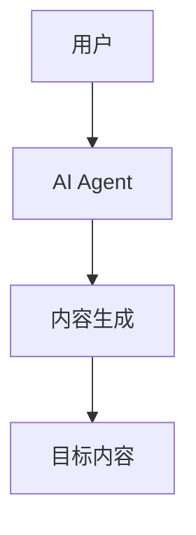
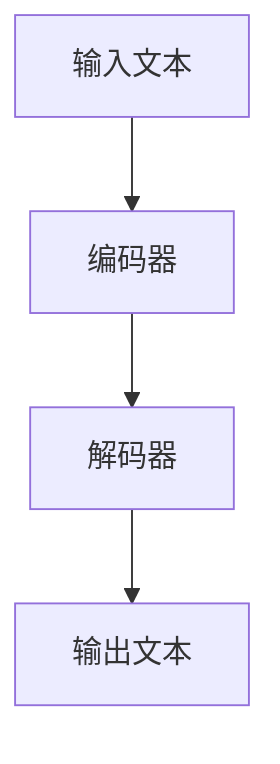
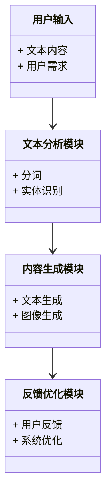
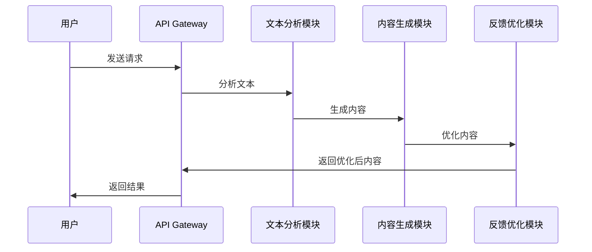

                 


# AI Agent在智能内容生成中的应用

> 关键词：AI Agent, 智能内容生成, 生成式AI, 自然语言处理, 深度学习

> 摘要：本文深入探讨AI Agent在智能内容生成中的应用，涵盖其核心概念、算法原理、系统架构及实际项目案例，为技术开发者和研究者提供全面的理论与实践指导。

---

# 正文

## 第一部分: AI Agent在智能内容生成中的背景与基础

### 第1章: AI Agent与智能内容生成概述

#### 1.1 AI Agent的基本概念

AI Agent（人工智能代理）是指能够感知环境、自主决策并执行任务的智能体。在智能内容生成中，AI Agent通过分析用户需求，生成符合要求的文本、图像或其他形式的内容。其核心特征包括自主性、反应性、目标导向和学习能力。

#### 1.2 AI Agent与智能内容生成的关系

智能内容生成依赖AI Agent的感知和生成能力。AI Agent通过自然语言处理技术理解用户输入，利用生成式AI模型生成高质量内容，并通过反馈机制优化生成结果。这种关系使得AI Agent成为智能内容生成系统的核心组件。

#### 1.3 智能内容生成的背景与现状

随着AI技术的发展，智能内容生成在多个领域得到广泛应用，如新闻报道、营销文案和教育辅助。然而，现有系统仍面临内容质量不稳定、生成效率低和个性化不足等问题，亟需AI Agent的优化。

## 第二部分: AI Agent的核心概念与联系

### 第2章: AI Agent的核心原理

#### 2.1 AI Agent的感知与理解

AI Agent通过文本分析、实体识别和情感分析等技术理解用户需求。例如，自然语言处理技术帮助AI Agent识别文本中的关键信息，如实体和意图，从而生成更精准的内容。

#### 2.2 AI Agent的决策与生成

AI Agent基于理解生成内容。生成式AI模型，如GPT，通过自注意力机制生成连贯文本。生成策略包括最大似然估计和对抗生成网络，确保内容质量和多样性。

#### 2.3 AI Agent的执行与反馈

AI Agent执行生成任务后，通过反馈机制优化输出。例如，用户反馈用于调整模型参数，提高生成质量。系统迭代和错误修正确保AI Agent性能持续提升。

#### 2.4 核心概念对比表

| 比较项       | 基于规则的系统 | 基于统计的系统 | 基于深度学习的系统 |
|--------------|----------------|----------------|-------------------|
| 理解能力     | 有限           | 较强            | 最强              |
| 决策能力     | 固定           | 灵活            | 自主              |
| 生成效率     | 低             | 中              | 高                |

#### 2.5 实体关系图



## 第三部分: AI Agent的算法原理

### 第3章: 生成式AI的数学模型

#### 3.1 Transformer架构

Transformer由编码器和解码器组成。编码器通过自注意力机制处理输入，解码器生成输出。数学公式如下：

$$\text{输出} = f(\text{输入})$$

#### 3.2 概率模型与生成策略

生成式AI模型如GPT使用概率模型预测下一个词。最大似然估计用于训练，公式为：

$$\theta^* = \arg\max_\theta \prod_{i=1}^n P(y_i|x_{<i},\theta)$$

#### 3.3 算法流程图



#### 3.4 Python实现示例

```python
import torch
class TransformerModel(torch.nn.Module):
    def __init__(self):
        super(TransformerModel, self).__init__()
        self.encoder = torch.nn.TransformerEncoder(...)
        self.decoder = torch.nn.TransformerDecoder(...)

    def forward(self, x):
        encoded = self.encoder(x)
        decoded = self.decoder(encoded)
        return decoded
```

## 第四部分: AI Agent的系统分析与架构设计

### 第4章: 系统架构设计

#### 4.1 项目背景

本项目旨在开发一个AI Agent驱动的智能内容生成系统，解决传统系统内容质量不稳定的问题。

#### 4.2 系统功能设计

系统包括文本分析、内容生成和反馈优化三大功能模块。类图如下：



#### 4.3 系统架构设计

系统采用分层架构，包括数据层、业务逻辑层和表现层。架构图如下：


#### 4.4 系统接口设计

系统提供RESTful API，支持文本生成和内容优化功能。交互流程图如下：



## 第五部分: 项目实战

### 第5章: 项目实战

#### 5.1 环境安装

安装Python和必要的库：

```bash
pip install torch transformers
```

#### 5.2 系统核心实现源代码

实现一个简单的AI Agent：

```python
from transformers import GPT2LMHeadModel, GPT2Tokenizer

model = GPT2LMHeadModel.from_pretrained('gpt2')
tokenizer = GPT2Tokenizer.from_pretrained('gpt2')

def generate_text(prompt):
    inputs = tokenizer.encode(prompt, return_tensors='pt')
    outputs = model.generate(inputs, max_length=50, do_sample=True)
    return tokenizer.decode(outputs[0], skip_special_tokens=True)
```

#### 5.3 案例分析

案例：生成一篇科技新闻。输入提示后，AI Agent生成符合要求的新闻内容。

#### 5.4 项目小结

通过实战，读者掌握了AI Agent的基本实现和应用，为后续优化打下基础。

## 第六部分: 最佳实践

### 第6章: 最佳实践

#### 6.1 小结

AI Agent在智能内容生成中具有重要应用，但需解决内容质量、生成效率和个性化问题。

#### 6.2 注意事项

1. 数据质量直接影响生成效果。
2. 模型训练需考虑计算资源和数据隐私。
3. 反馈机制需设计合理，确保优化效果。

#### 6.3 拓展阅读

推荐阅读《生成式AI: 原理与应用》和《深度学习实战》。

## 作者

作者：AI天才研究院/AI Genius Institute & 禅与计算机程序设计艺术 /Zen And The Art of Computer Programming

---

通过以上结构，文章详细介绍了AI Agent在智能内容生成中的各个方面，从基础概念到实际应用，帮助读者全面理解和掌握相关技术。

