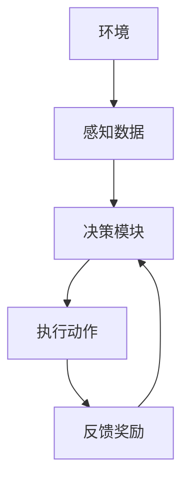
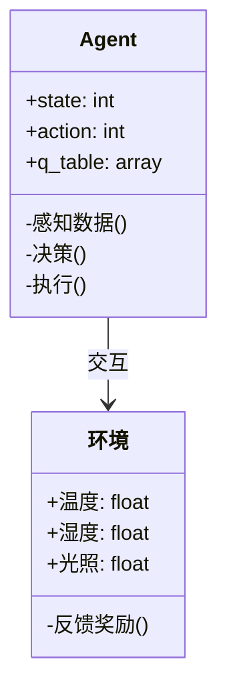
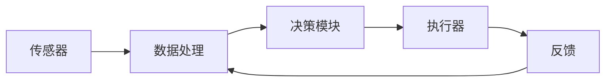
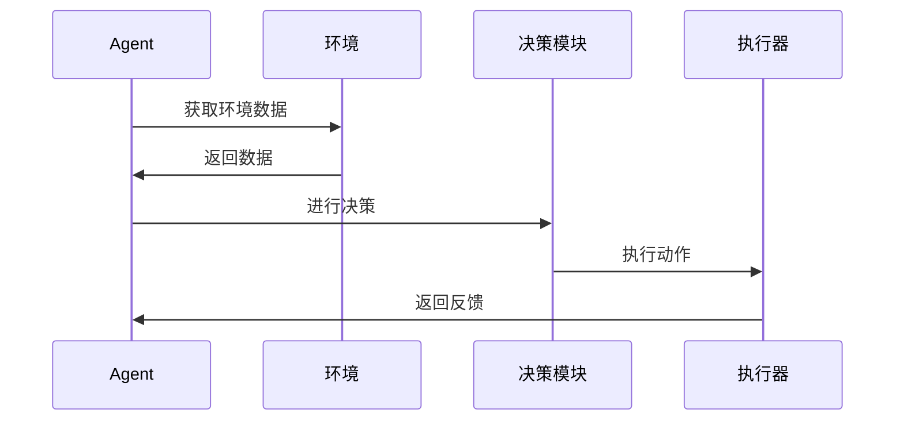

                 


# AI Agent在智能农业中的应用

> 关键词：AI Agent, 智能农业, 农业智能化, 强化学习, 图神经网络, 精准农业

> 摘要：本文将探讨AI Agent在智能农业中的应用，分析其在作物种植、畜牧业管理、农产品供应链优化等方面的优势。通过详细的技术背景、核心概念、算法原理、系统设计、项目实战和未来展望，全面解析AI Agent如何推动农业智能化。

---

# 第1章: AI Agent 的基本概念与农业智能化的背景

## 1.1 AI Agent 的定义与核心概念
### 1.1.1 AI Agent 的定义
AI Agent（人工智能代理）是指能够感知环境、自主决策并执行任务的智能系统。它通过传感器获取数据，利用算法进行分析，并通过执行器完成操作。

### 1.1.2 AI Agent 的核心属性与特征
- **自主性**：无需外部干预，自主完成任务。
- **反应性**：能够实时感知环境变化并做出反应。
- **学习能力**：通过数据和经验不断优化决策。
- **协作性**：能够与其他AI Agent或人类协同工作。

### 1.1.3 AI Agent 与传统农业的区别
| 特性       | 传统农业             | AI Agent驱动的智能农业                 |
|------------|----------------------|---------------------------------------|
| 决策方式     | 依赖人工经验         | 基于数据和算法的自动化决策             |
| 效率       | 低效，依赖经验       | 高效，优化资源利用                     |
| 可扩展性     | 有限，难以快速扩展   | 可无限扩展，覆盖更大范围               |

## 1.2 智能农业的发展背景
### 1.2.1 农业现代化的需求
随着人口增长和资源短缺，传统农业模式难以满足需求，农业现代化成为必然趋势。

### 1.2.2 数字化与智能化的趋势
互联网、物联网和大数据技术的发展为农业智能化提供了技术基础。

### 1.2.3 AI Agent 在农业中的应用潜力
AI Agent能够通过实时数据处理、优化决策和自动化执行，显著提高农业生产的效率和质量。

---

# 第2章: AI Agent 的核心概念与原理

## 2.1 AI Agent 的核心原理
### 2.1.1 感知与数据采集
AI Agent通过传感器、摄像头等设备采集环境数据，如温度、湿度、光照等。

### 2.1.2 决策与规划
基于感知数据，AI Agent利用算法进行决策，如作物种植的最佳时机、病虫害的防治策略等。

### 2.1.3 执行与反馈
AI Agent通过执行器（如无人机、自动化设备）执行决策，并通过反馈机制不断优化决策模型。

## 2.2 AI Agent 的主要模型与算法
### 2.2.1 强化学习模型
强化学习通过奖励机制训练AI Agent，使其在环境中不断优化决策。

### 2.2.2 图神经网络模型
图神经网络能够处理复杂的农业生态系统，分析作物、土壤、气候等多因素之间的关系。

### 2.2.3 联合学习与分布式计算
通过联合学习，多个AI Agent可以共享数据和模型，提高整体决策能力。

## 2.3 AI Agent 的系统架构
### 2.3.1 模块化设计
AI Agent系统通常包括感知模块、决策模块、执行模块和反馈模块。

### 2.3.2 数据流与信息处理
数据从传感器采集后，经过预处理、分析和决策，最终通过执行器完成任务。

### 2.3.3 系统接口与交互
AI Agent通过标准化接口与外部系统（如物联网平台）进行数据交互。

---

# 第3章: AI Agent 的算法原理与数学模型

## 3.1 强化学习算法
### 3.1.1 Q-learning 算法
Q-learning是一种经典的强化学习算法，通过状态-动作-奖励-状态（SARSA）循环更新Q值表。

### 3.1.2 Deep Q-Network (DQN) 算法
DQN通过深度神经网络近似Q值函数，解决高维状态空间的问题。

### 3.1.3 算法流程图（mermaid）


## 3.2 图神经网络模型
### 3.2.1 图的表示与学习
图神经网络将农业生态系统中的作物、土壤、气候等元素表示为图结构，分析其关系。

### 3.2.2 图卷积网络（Graph Convolutional Network）
图卷积网络通过聚合邻居节点的信息，推断出节点的特征表示。

### 3.2.3 图注意力机制（Graph Attention Mechanism）
图注意力机制通过计算节点间的注意力权重，提高模型对重要节点的重视程度。

## 3.3 算法实现与代码示例
### 3.3.1 强化学习代码实现
```python
class Agent:
    def __init__(self, state_space, action_space):
        self.state_space = state_space
        self.action_space = action_space
        self.q_table = np.zeros((state_space, action_space))

    def take_action(self, state):
        # 探索与利用策略
        if np.random.random() < 0.1:
            return np.random.randint(self.action_space)
        else:
            return np.argmax(self.q_table[state])

    def update_q_table(self, state, action, reward, next_state):
        self.q_table[state][action] = self.q_table[state][action] * 0.9 + reward
```

---

# 第4章: AI Agent 的系统架构设计

## 4.1 系统功能设计
### 4.1.1 领域模型（mermaid类图）


### 4.1.2 系统架构（mermaid架构图）


## 4.2 系统接口设计
### 4.2.1 标准化接口
AI Agent通过API与外部系统进行数据交互，确保系统的兼容性和扩展性。

### 4.2.2 交互流程（mermaid序列图）


---

# 第5章: AI Agent 的项目实战

## 5.1 精准种植管理系统的实现
### 5.1.1 环境搭建
安装Python、TensorFlow、Keras等开发环境和库。

### 5.1.2 核心代码实现
```python
def crop_management(agent):
    while True:
        state = get_env_data()
        action = agent.take_action(state)
        reward = compute_reward(state, action)
        next_state = get_new_env_data()
        agent.update_q_table(state, action, reward, next_state)
```

### 5.1.3 案例分析
以精准种植为例，分析AI Agent如何优化作物种植的决策过程，提高产量和资源利用率。

---

# 第6章: AI Agent 在智能农业中的未来展望

## 6.1 技术趋势与挑战
### 6.1.1 技术趋势
AI Agent在农业中的应用将更加普及，算法将更加高效和智能。

### 6.1.2 挑战
数据隐私、计算资源限制、算法解释性等问题需要进一步解决。

## 6.2 未来发展方向
AI Agent将在农业智能化、可持续发展和精准农业等领域发挥更大作用。

---

# 附录

## 附录 A: 扩展阅读资料
推荐相关书籍和论文，帮助读者深入学习AI Agent在农业中的应用。

## 附录 B: AI Agent 的数学公式
### 附录 B.1 强化学习的数学模型
$$ Q(s,a) = r + \gamma \max Q(s',a') $$

### 附录 B.2 图神经网络的公式
$$ h_i = \sigma(\sum_{j} W_{ij} h_j) $$

---

# 作者
作者：AI天才研究院 & 禅与计算机程序设计艺术

