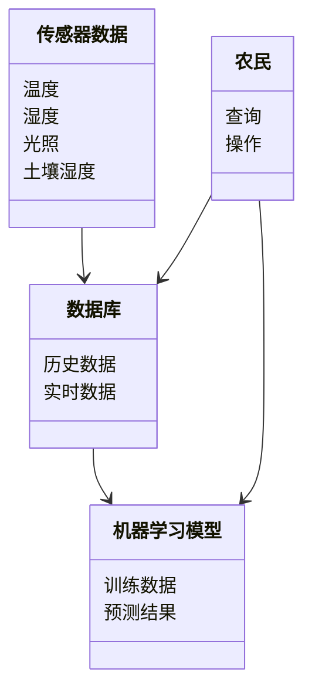
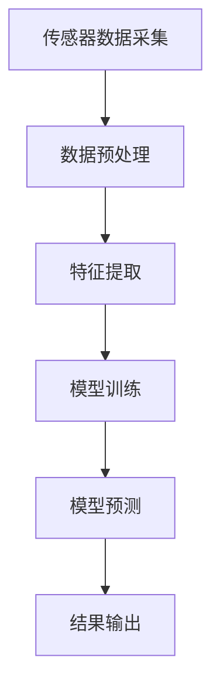
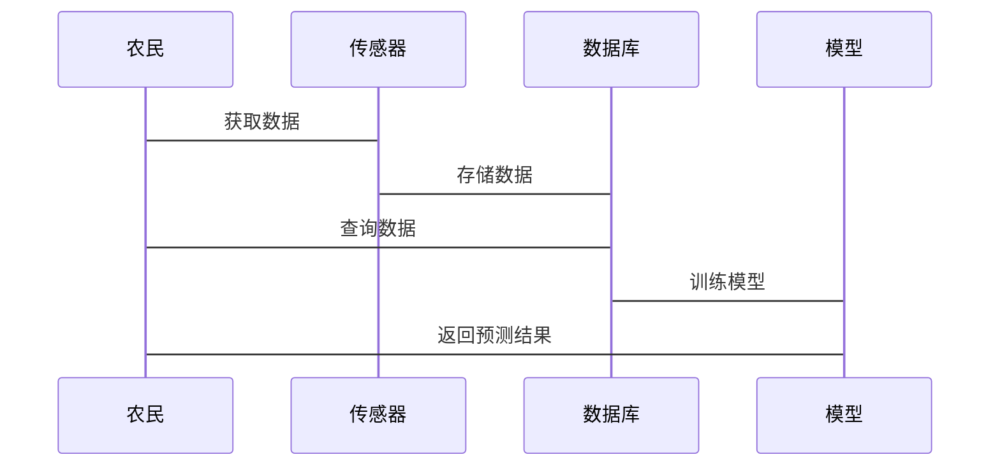

                 


# AI Agent在智能农业产量预测中的实践

> 关键词：AI Agent，智能农业，产量预测，机器学习，农业数据分析

> 摘要：本文详细探讨了AI Agent在智能农业中的应用，特别是如何利用AI Agent进行产量预测。文章从AI Agent的基本概念、农业产量预测的挑战、AI Agent的核心原理、系统设计与架构、项目实战以及优化与扩展等方面进行了全面分析。通过实际案例和详细的技术实现，展示了AI Agent在智能农业中的巨大潜力和实际应用价值。

---

## 第一部分: AI Agent与智能农业的背景介绍

### 第1章: AI Agent与智能农业概述

#### 1.1 AI Agent的基本概念
##### 1.1.1 AI Agent的定义
AI Agent（人工智能代理）是一种能够感知环境、自主决策并执行任务的智能实体。它可以理解为一个能够与环境交互的智能系统，通过传感器获取信息，并通过执行器采取行动。

##### 1.1.2 AI Agent的核心特征
- **自主性**：能够在没有外部干预的情况下自主运行。
- **反应性**：能够实时感知环境并做出反应。
- **学习能力**：通过数据和经验不断优化自身的决策能力。
- **协作性**：能够与其他Agent或系统协同工作。

##### 1.1.3 AI Agent与传统农业的区别
传统农业依赖人工经验进行决策，而AI Agent能够通过数据分析、机器学习等技术，提供更精准、更高效的决策支持。

#### 1.2 智能农业的背景与现状
##### 1.2.1 智能农业的发展历程
智能农业起源于20世纪末，随着计算机技术的发展，逐步引入传感器、物联网（IoT）和机器学习等技术，推动农业向智能化方向发展。

##### 1.2.2 当前智能农业的主要技术
- **物联网技术**：用于实时监测农田环境数据。
- **大数据技术**：用于分析和处理海量农业数据。
- **人工智能技术**：用于优化农业生产和预测产量。

##### 1.2.3 智能农业的典型应用场景
- **精准农业**：根据土壤、气候等条件，精准施肥、灌溉。
- **病虫害监测**：通过图像识别技术，快速识别病虫害。
- **产量预测**：利用历史数据和机器学习模型，预测作物产量。

### 第2章: AI Agent在农业中的应用价值

#### 2.1 农业产量预测的挑战与需求
##### 2.1.1 农业产量预测的关键问题
- **数据多样性**：农业数据包括气象、土壤、作物类型等多种数据，数据处理复杂。
- **数据稀疏性**：某些地区的数据不足，影响模型的准确性。
- **环境不确定性**：天气变化、病虫害等因素对产量影响显著，增加了预测的难度。

##### 2.1.2 AI Agent在产量预测中的优势
- **高效性**：AI Agent能够快速处理大量数据，提高预测效率。
- **准确性**：通过机器学习算法，AI Agent能够建立高精度的预测模型。
- **实时性**：AI Agent能够实时监测环境变化，及时调整预测结果。

##### 2.1.3 农业数据的特点与处理难点
- **多样性**：农业数据来源广泛，包括卫星图像、传感器数据、历史记录等。
- **时序性**：数据具有时间序列特征，需要考虑时间依赖性。
- **不确定性**：数据中存在噪声和缺失值，需要进行数据清洗和预处理。

#### 2.2 AI Agent的核心功能与应用场景
##### 2.2.1 数据采集与处理
AI Agent通过传感器、无人机和卫星等设备，实时采集农田的环境数据，包括温度、湿度、光照、土壤湿度等。

##### 2.2.2 产量预测模型构建
AI Agent利用历史数据和实时数据，结合机器学习算法，构建产量预测模型，帮助农民优化种植策略。

##### 2.2.3 农业决策支持系统
AI Agent通过分析数据，提供种植计划、病虫害预警、灌溉建议等决策支持，帮助农民提高产量和效率。

---

## 第二部分: AI Agent的核心原理与技术实现

### 第3章: AI Agent的核心原理

#### 3.1 多智能体系统的基本原理
##### 3.1.1 多智能体系统的定义与特点
多智能体系统由多个独立的智能体组成，通过协同工作完成复杂任务。每个智能体都有自己的目标和决策机制，能够与其他智能体通信和协作。

##### 3.1.2 多智能体系统的组成与交互
- **智能体**：系统的最基本单元，负责感知和执行任务。
- **通信协议**：智能体之间通信的规则和格式。
- **协作机制**：智能体之间协同工作的策略和算法。

##### 3.1.3 多智能体系统的协调机制
- **任务分配**：根据智能体的能力和目标，分配任务。
- **信息共享**：智能体之间共享信息，提高整体决策能力。
- **冲突解决**：当智能体之间发生冲突时，通过协商或仲裁机制解决。

#### 3.2 知识表示与推理
##### 3.2.1 知识表示的基本方法
知识表示是将现实世界中的知识转化为计算机可以理解的形式。常用的方法包括：
- **谓词逻辑**：通过谓词和逻辑连接词表示知识。
- **语义网络**：通过节点和边表示概念及其关系。
- **知识图谱**：通过实体和关系构建大规模的知识网络。

##### 3.2.2 知识推理的逻辑模型
知识推理是通过已有的知识，推导出新的结论。常用的逻辑模型包括：
- **一阶逻辑**：通过谓词和量词表示知识。
- **规则推理**：通过预定义的规则进行推理。
- **概率推理**：通过概率论进行不确定性推理。

##### 3.2.3 知识图谱的构建与应用
知识图谱是一种结构化的知识表示形式，广泛应用于语义搜索、实体识别等领域。在农业中，知识图谱可以用于作物知识库的构建，帮助AI Agent更好地理解农业知识。

### 第4章: AI Agent的机器学习算法

#### 4.1 常见机器学习算法概述
##### 4.1.1 监督学习
监督学习是一种通过标注数据训练模型的机器学习方法。常用的算法包括线性回归、支持向量机（SVM）、随机森林等。

##### 4.1.2 非监督学习
非监督学习是通过未标注数据训练模型的机器学习方法。常用的算法包括聚类、关联规则挖掘等。

##### 4.1.3 强化学习
强化学习是一种通过试错机制训练模型的机器学习方法。常用的算法包括Q-learning、Deep Q-Network（DQN）等。

#### 4.2 神经网络与深度学习
##### 4.2.1 神经网络的基本结构
神经网络是一种受生物神经网络启发的计算模型，由多个层次组成，包括输入层、隐藏层和输出层。

##### 4.2.2 深度学习的典型模型
深度学习是机器学习的一个分支，通过多层神经网络学习数据的高层次特征。常用的模型包括卷积神经网络（CNN）、循环神经网络（RNN）、长短期记忆网络（LSTM）等。

##### 4.2.3 深度学习在农业中的应用
深度学习在农业中的应用包括作物识别、病虫害检测、产量预测等。例如，利用卷积神经网络对卫星图像进行分类，识别不同类型的作物。

---

## 第三部分: AI Agent的系统设计与架构

### 第5章: AI Agent的系统设计与架构

#### 5.1 问题场景介绍
农业产量预测是一个复杂的系统工程，需要考虑多种因素，包括气象、土壤、作物类型等。AI Agent需要通过传感器、数据库、机器学习模型等多个模块协同工作，才能实现精准预测。

#### 5.2 系统功能设计
##### 5.2.1 领域模型（Domain Model）
领域模型描述了系统中的核心概念及其关系。以下是农业产量预测系统的领域模型：



##### 5.2.2 系统架构设计
以下是农业产量预测系统的架构设计：



##### 5.2.3 系统接口设计
系统接口设计包括传感器接口、数据库接口、模型接口等。以下是传感器接口的示例：

```python
class Sensor:
    def read_data(self):
        # 读取传感器数据
        pass
```

##### 5.2.4 系统交互设计
系统交互设计描述了系统中各个模块的协作流程。以下是系统交互的流程图：



---

## 第四部分: 项目实战

### 第6章: 项目实战

#### 6.1 环境安装
要运行AI Agent系统，首先需要安装以下环境：
- **Python**：3.6+
- **深度学习框架**：TensorFlow或Keras
- **数据处理库**：Pandas、NumPy
- **可视化库**：Matplotlib
- **机器学习库**：Scikit-learn

#### 6.2 系统核心实现
##### 6.2.1 数据采集与预处理
以下是数据采集与预处理的代码示例：

```python
import pandas as pd
import numpy as np

# 读取数据
data = pd.read_csv('agriculture_data.csv')

# 数据清洗
data.dropna()  # 删除缺失值
data = data[~data.duplicated()]  # 删除重复值

# 数据转换
data['date'] = pd.to_datetime(data['date'])  # 转换日期格式
data = data.set_index('date')  # 设置日期为索引
```

##### 6.2.2 模型训练与预测
以下是模型训练与预测的代码示例：

```python
from sklearn.model

