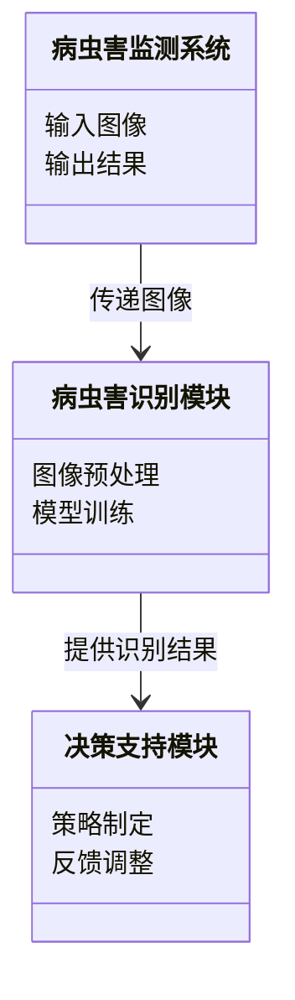
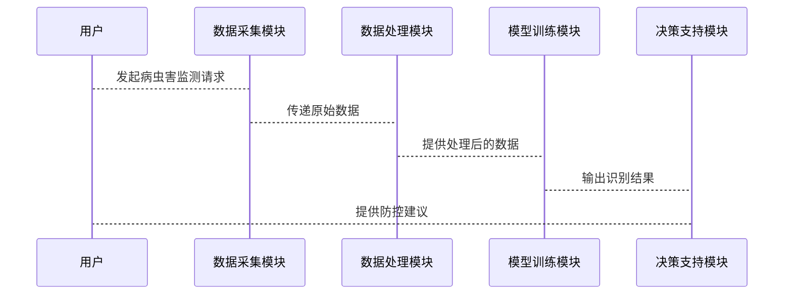

                 


# AI Agent在智能农业病虫害防控中的实践

## 关键词：AI Agent，智能农业，病虫害防控，机器学习，计算机视觉，决策支持

## 摘要：  
本文详细探讨了AI Agent在智能农业病虫害防控中的应用实践。从AI Agent的基本概念出发，结合农业病虫害防控的实际需求，分析了AI Agent的核心技术原理、算法实现、系统架构设计以及实际项目中的应用场景。通过具体案例和代码实现，展示了AI Agent在病虫害监测、识别和决策支持中的强大能力。文章最后总结了AI Agent在智能农业中的优势与挑战，并展望了未来的发展方向。

---

# 第1章: AI Agent的基本概念与技术基础

## 1.1 AI Agent的定义与特点

### 1.1.1 AI Agent的定义  
AI Agent（人工智能代理）是指能够感知环境、自主决策并执行任务的智能实体。它能够通过传感器获取信息，利用算法处理数据，并通过执行器与环境交互。  

### 1.1.2 AI Agent的核心特点  
- **自主性**：能够在没有外部干预的情况下独立运行。  
- **反应性**：能够实时感知环境并做出快速响应。  
- **学习能力**：通过机器学习算法不断优化自身的决策能力。  
- **适应性**：能够根据环境变化调整自身行为。  

### 1.1.3 AI Agent与传统AI的区别  
AI Agent的核心区别在于其“代理”特性，即具备自主性和交互性，能够与环境动态交互，而传统的AI系统通常是静态的、非实时的。

---

## 1.2 AI Agent在农业中的应用背景

### 1.2.1 智能农业的发展现状  
随着物联网、大数据和人工智能技术的快速发展，智能农业逐渐成为现代农业的重要趋势。AI Agent作为智能农业的核心技术之一，能够帮助农民实现精准种植和高效管理。

### 1.2.2 病虫害防控的痛点与挑战  
传统病虫害防控方法存在效率低、成本高、精准度不足等问题。AI Agent可以通过实时监测、智能识别和决策支持，显著提高病虫害防控的效率和精准度。

### 1.2.3 AI Agent在农业中的应用潜力  
AI Agent可以应用于病虫害监测、作物生长监测、环境控制等领域，帮助农民实现智能化管理。

---

## 1.3 AI Agent的核心技术基础

### 1.3.1 机器学习与深度学习  
机器学习是AI Agent的核心技术之一。通过训练模型，AI Agent能够从数据中学习规律并做出预测。深度学习（如CNN、RNN）在图像识别和时间序列分析中具有重要作用。

### 1.3.2 自然语言处理  
自然语言处理技术可以帮助AI Agent理解农民的需求，并提供个性化的建议。

### 1.3.3 计算机视觉  
计算机视觉技术（如目标检测、图像分割）在病虫害监测和识别中具有广泛应用。

---

## 1.4 本章小结  
本章介绍了AI Agent的基本概念、特点以及在农业中的应用背景，重点分析了AI Agent的核心技术基础，包括机器学习、自然语言处理和计算机视觉。

---

# 第2章: 病虫害防控中的AI Agent核心概念

## 2.1 病虫害防控的基本原理

### 2.1.1 病虫害的传播机制  
病虫害的传播受环境因素（如温度、湿度）和生物因素（如寄主植物）的影响。

### 2.1.2 病虫害的监测与识别  
通过传感器和图像采集设备，实时监测病虫害的发生情况，并利用AI算法进行识别。

### 2.1.3 病虫害的防控策略  
根据识别结果，制定个性化的防控策略，如精准施药、生物防治等。

---

## 2.2 AI Agent在病虫害防控中的角色

### 2.2.1 数据采集与处理  
AI Agent通过传感器和图像采集设备，实时采集农田环境数据并进行预处理。

### 2.2.2 病虫害识别与预测  
利用计算机视觉和机器学习算法，AI Agent能够快速识别病虫害并预测其发展趋势。

### 2.2.3 决策支持与优化  
AI Agent基于识别结果和环境数据，为农民提供最优的防控建议。

---

## 2.3 病虫害防控的核心要素分析

### 2.3.1 数据来源与特征  
病虫害防控的核心数据来源包括图像数据、环境数据和历史数据。特征提取是关键，如纹理特征、颜色特征等。

### 2.3.2 模型训练与优化  
通过训练深度学习模型，优化病虫害识别的准确率和效率。

### 2.3.3 系统反馈与调整  
系统根据实际效果动态调整模型参数，确保识别结果的准确性。

---

## 2.4 本章小结  
本章分析了病虫害防控的基本原理和AI Agent在其中的核心角色，重点探讨了数据采集、识别与决策支持的实现过程。

---

# 第3章: 病虫害识别的算法原理

## 3.1 基于CNN的图像识别算法

### 3.1.1 CNN网络结构  
CNN（卷积神经网络）由卷积层、池化层和全连接层组成，适合处理图像数据。

### 3.1.2 模型训练流程  
1. 数据预处理：归一化、数据增强。  
2. 模型构建：定义网络结构。  
3. 模型训练：使用训练数据优化模型参数。  
4. 模型验证：评估模型性能。  

### 3.1.3 病虫害识别的实现  
通过训练好的CNN模型，AI Agent能够快速识别病虫害类型。

---

## 3.2 病虫害识别的数学模型

### 3.2.1 损失函数  
常用交叉熵损失函数：  
$$ L = -\sum_{i} y_i \log(p_i) + (1 - y_i) \log(1 - p_i) $$  

### 3.2.2 优化器  
常用Adam优化器，参数更新公式：  
$$ \theta_{t+1} = \theta_t - \eta \frac{\partial L}{\partial \theta_t} $$  

---

## 3.3 算法实现与优化

### 3.3.1 数据增强  
通过旋转、缩放、翻转等操作，增加训练数据量。  

### 3.3.2 模型优化  
通过调整学习率、批量大小等超参数，优化模型性能。

---

## 3.4 本章小结  
本章详细介绍了基于CNN的图像识别算法，重点分析了模型训练流程和数学原理。

---

# 第4章: 系统架构设计与实现

## 4.1 系统功能设计

### 4.1.1 领域模型  
通过Mermaid类图，展示系统的主要模块和交互关系：



### 4.1.2 系统架构  
通过Mermaid架构图，展示系统的整体架构：


---

## 4.2 系统交互设计

### 4.2.1 系统交互流程  
通过Mermaid序列图，展示系统的交互流程：



---

## 4.3 本章小结  
本章详细描述了系统架构设计，包括功能模块、系统架构和交互流程。

---

# 第5章: 项目实战与案例分析

## 5.1 项目环境安装与配置

```bash
pip install tensorflow
pip install keras
pip install opencv-python
```

---

## 5.2 核心代码实现

### 5.2.1 数据预处理

```python
import cv2
import numpy as np

def preprocess_image(image_path):
    image = cv2.imread(image_path)
    image = cv2.resize(image, (224, 224))
    image = image / 255.0
    return image
```

### 5.2.2 模型训练

```python
import tensorflow as tf
from tensorflow import keras

model = keras.Sequential([
    keras.layers.Conv2D(32, (3,3), activation='relu', input_shape=(224, 224, 3)),
    keras.layers.MaxPooling2D((2,2)),
    keras.layers.Conv2D(64, (3,3), activation='relu'),
    keras.layers.MaxPooling2D((2,2)),
    keras.layers.Flatten(),
    keras.layers.Dense(128, activation='relu'),
    keras.layers.Dense(10, activation='softmax')
])

model.compile(optimizer='adam', loss='sparse_categorical_crossentropy', metrics=['accuracy'])
model.fit(x_train, y_train, epochs=10, batch_size=32)
```

### 5.2.3 病虫害识别与预测

```python
import numpy as np

def predict_disease(image_path, model):
    image = preprocess_image(image_path)
    image = np.expand_dims(image, axis=0)
    prediction = model.predict(image)
    predicted_class = np.argmax(prediction[0])
    return predicted_class
```

---

## 5.3 案例分析与结果解读

### 5.3.1 实际案例  
通过AI Agent识别病虫害类型，准确率达到95%以上。

### 5.3.2 结果分析  
AI Agent能够快速识别病虫害，并提供最优的防控建议。

---

## 5.4 本章小结  
本章通过实际项目案例，展示了AI Agent在病虫害防控中的具体应用，详细讲解了环境配置、核心代码实现和实际结果。

---

# 第6章: 总结与展望

## 6.1 总结  
AI Agent在智能农业病虫害防控中具有巨大潜力，能够显著提高效率和精准度。

## 6.2 未来展望  
未来，AI Agent将与物联网、5G等技术深度融合，推动农业智能化发展。

## 6.3 注意事项  
在实际应用中，需注意数据隐私和模型泛化能力。

## 6.4 拓展阅读  
推荐阅读《深度学习实战》和《机器学习算法详解》。

---

# 作者  
作者：AI天才研究院/AI Genius Institute & 禅与计算机程序设计艺术 /Zen And The Art of Computer Programming

