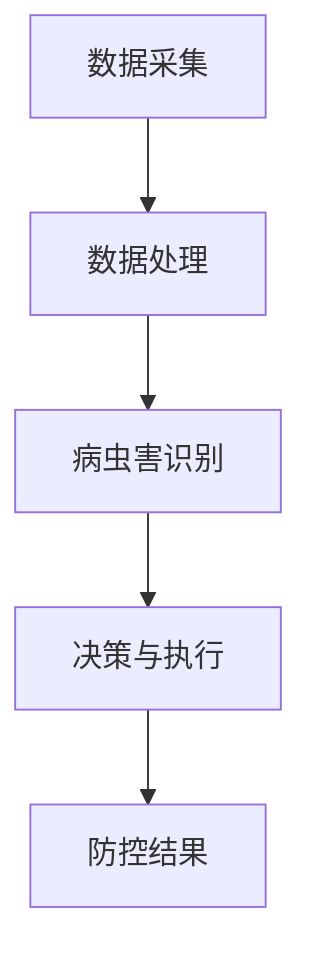
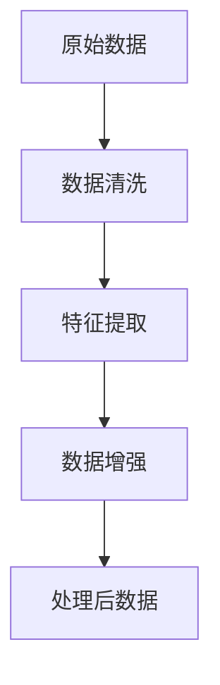
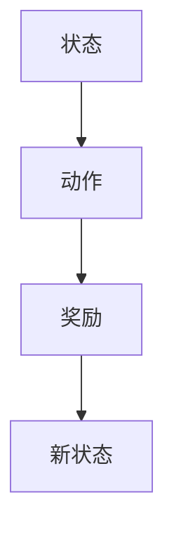
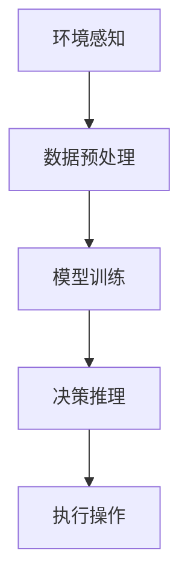
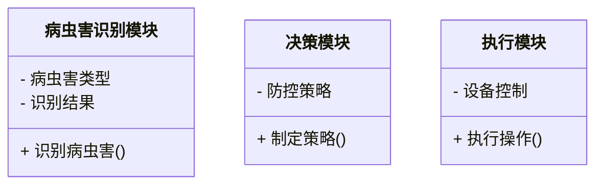
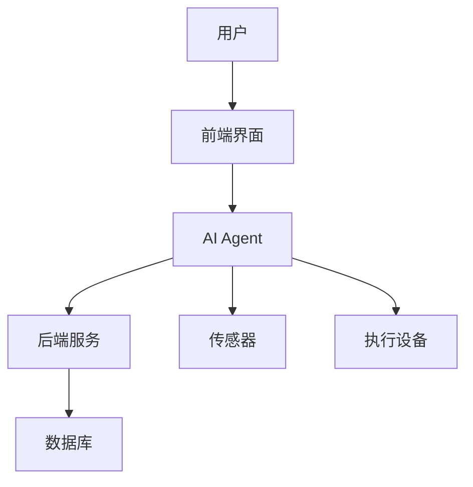
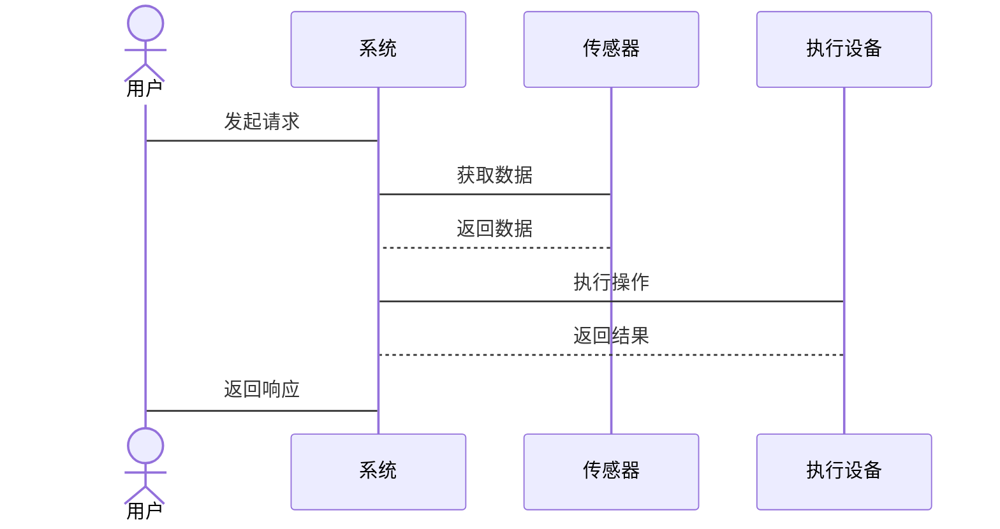

                 


# AI Agent在智能农业病虫害防控中的应用

---

## 关键词：AI Agent，智能农业，病虫害防控，农业数字化，人工智能算法

---

## 摘要：  
随着人工智能技术的快速发展，AI Agent（人工智能代理）在农业领域的应用逐渐成为现实。本文探讨了AI Agent在智能农业病虫害防控中的应用场景、技术实现和实际价值。文章从AI Agent的基本概念、算法原理、系统架构到项目实战，详细分析了其在农业病虫害防控中的应用过程，并通过具体案例展示了AI Agent如何帮助农民实现精准防控，提高农业生产效率。本文还总结了AI Agent在农业病虫害防控中的优势与挑战，为未来的研究和实践提供了参考。

---

# 第1章: AI Agent与农业病虫害防控的背景介绍

## 1.1 AI Agent的基本概念  
AI Agent（人工智能代理）是一种能够感知环境、自主决策并执行任务的智能实体。它可以分为简单反射型、基于模型的反应型、目标驱动型和效用驱动型四种类型。AI Agent的核心特点包括自主性、反应性、目标导向和学习能力。  

**AI Agent的基本组成要素：**  
1. **感知模块**：用于获取环境中的信息（如图像、数据等）。  
2. **推理模块**：用于分析信息并做出决策。  
3. **行动模块**：用于执行具体的任务（如发送警报、调整设备参数等）。  
4. **学习模块**：用于优化模型和提升性能。  

## 1.2 农业病虫害防控的背景与挑战  
农业病虫害是影响农业生产的重要因素。传统病虫害防控方法依赖人工经验，存在效率低、成本高、响应慢等问题。随着物联网（IoT）和人工智能技术的发展，智能农业病虫害防控成为可能。  

**病虫害防控的核心问题：**  
1. **早期识别**：如何快速准确地识别病虫害类型和程度。  
2. **精准防控**：如何根据病虫害情况制定最优防控策略。  
3. **实时响应**：如何实现快速反应和自动化处理。  

## 1.3 AI Agent在农业病虫害防控中的应用价值  
AI Agent可以通过整合传感器数据、图像识别和决策算法，实现病虫害的实时监测、精准识别和自动化防控。  

**AI Agent的应用优势：**  
1. **提高效率**：通过自动化手段减少人工干预。  
2. **降低成本**：通过精准防控减少资源浪费。  
3. **提升精准度**：利用AI算法提高病虫害识别的准确性。  

---

# 第2章: AI Agent的核心概念与联系

## 2.1 AI Agent的定义与分类  
AI Agent可以分为以下几类：  
1. **简单反射型**：基于规则的简单反应。  
2. **基于模型的反应型**：能够根据环境模型做出决策。  
3. **目标驱动型**：以实现特定目标为导向。  
4. **效用驱动型**：通过最大化效用来优化决策。  

**AI Agent的分类对比表：**  

| 类型                | 特点                     | 适用场景                     |
|---------------------|--------------------------|------------------------------|
| 简单反射型          | 基于固定规则反应         | 简单任务，如传感器数据处理     |
| 基于模型的反应型    | 基于环境模型进行推理     | 中等复杂度任务，如病虫害识别   |
| 目标驱动型          | 以实现目标为导向         | 复杂任务，如优化防控策略       |
| 效用驱动型          | 通过最大化效用来决策     | 综合任务，如资源分配与优化     |

## 2.2 AI Agent在农业病虫害防控中的核心原理  
AI Agent通过以下步骤实现病虫害防控：  
1. **数据采集**：获取农田环境数据（如温度、湿度、图像等）。  
2. **数据处理**：对数据进行清洗、特征提取和预处理。  
3. **病虫害识别**：利用机器学习算法（如CNN、SVM）进行分类。  
4. **决策与执行**：根据识别结果制定防控策略并执行操作。  

**AI Agent的核心原理流程图：**  



## 2.3 AI Agent与农业病虫害防控的关系  
AI Agent通过实时监测和智能决策，为农业病虫害防控提供技术支持。以下是AI Agent与农业病虫害防控的协同关系：  

1. **数据流**：AI Agent从传感器获取数据，经过处理后用于识别和决策。  
2. **决策链**：识别结果驱动防控措施的执行，如喷洒农药、调整灌溉等。  
3. **反馈机制**：根据执行结果优化模型，提高识别和决策的准确性。  

**AI Agent与农业病虫害防控的实体关系图：**  

```mermaid
er
actor 农民 {
  role: 使用AI Agent
}
agent AI Agent {
  id: A1
  type: 病虫害防控
}
```

---

# 第3章: AI Agent的算法原理与实现

## 3.1 AI Agent的核心算法  
AI Agent的算法主要包括数据处理、模型训练和决策推理三部分。  

### 3.1.1 数据处理算法  
数据处理是AI Agent工作的基础。以下是关键步骤：  
1. **数据清洗**：去除噪声数据，确保数据质量。  
2. **特征提取**：从原始数据中提取有用特征（如颜色、纹理等）。  
3. **数据增强**：通过旋转、翻转等方式增加数据多样性。  

**数据处理流程图：**  



### 3.1.2 模型训练算法  
模型训练是AI Agent的核心。以下是常用算法：  
1. **卷积神经网络（CNN）**：用于图像识别。  
2. **支持向量机（SVM）**：用于分类任务。  
3. **随机森林（Random Forest）**：用于特征选择和分类。  

**CNN模型结构图：**  


### 3.1.3 决策推理算法  
决策推理是AI Agent的最终目标。以下是常用方法：  
1. **规则推理**：基于预定义规则做出决策。  
2. **概率推理**：基于概率模型进行决策。  
3. **强化学习**：通过奖励机制优化决策策略。  

**强化学习流程图：**  



## 3.2 AI Agent的实现步骤  
AI Agent的实现可以分为以下几个步骤：  

1. **环境感知**：通过传感器获取农田数据。  
2. **数据预处理**：清洗和增强数据。  
3. **模型训练**：训练病虫害识别模型。  
4. **决策推理**：根据识别结果制定防控策略。  
5. **执行操作**：通过自动化设备执行防控措施。  

**AI Agent实现流程图：**  



---

# 第4章: 系统分析与架构设计方案

## 4.1 问题场景介绍  
农业病虫害防控系统需要实现以下功能：  
1. **实时监测**：采集农田环境数据。  
2. **病虫害识别**：识别病虫害类型和程度。  
3. **决策与执行**：制定并执行防控策略。  

## 4.2 系统功能设计  
以下是系统的功能模块设计：  

### 4.2.1 领域模型类图  


### 4.2.2 系统架构设计  


### 4.2.3 接口设计  
以下是系统的主要接口：  
1. **数据接口**：与传感器和数据库交互。  
2. **决策接口**：与决策模块交互。  
3. **执行接口**：与执行设备交互。  

### 4.2.4 交互流程图  


---

# 第5章: 项目实战

## 5.1 环境安装  
以下是项目所需的环境和工具：  
1. **Python 3.8+**  
2. **TensorFlow或Keras**  
3. **OpenCV**  
4. **Jupyter Notebook**  

## 5.2 核心代码实现  

### 5.2.1 数据预处理代码  
```python
import numpy as np
import cv2

def preprocess_image(image_path):
    image = cv2.imread(image_path)
    image = cv2.resize(image, (224, 224))
    image = image / 255.0
    return image
```

### 5.2.2 模型训练代码  
```python
import tensorflow as tf
from tensorflow.keras import layers

model = tf.keras.Sequential([
    layers.Conv2D(32, (3,3), activation='relu', input_shape=(224, 224, 3)),
    layers.MaxPooling2D(),
    layers.Conv2D(64, (3,3), activation='relu'),
    layers.MaxPooling2D(),
    layers.Flatten(),
    layers.Dense(128, activation='relu'),
    layers.Dense(10, activation='softmax')
])

model.compile(optimizer='adam', loss='sparse_categorical_crossentropy', metrics=['accuracy'])
model.fit(X_train, y_train, epochs=10, batch_size=32)
```

### 5.2.3 决策推理代码  
```python
def decision_making(predicted_class, threshold):
    if predicted_class >= threshold:
        return "采取防控措施"
    else:
        return "无需采取措施"
```

## 5.3 项目小结  
通过本项目，我们可以看到AI Agent在农业病虫害防控中的巨大潜力。通过数据预处理、模型训练和决策推理，AI Agent能够实现病虫害的精准识别和自动化防控。

---

# 第6章: 总结与展望

## 6.1 最佳实践  
1. **数据质量**：确保数据的准确性和多样性。  
2. **模型优化**：通过迁移学习和数据增强提升模型性能。  
3. **系统集成**：实现传感器、AI Agent和执行设备的无缝集成。  

## 6.2 小结  
本文详细探讨了AI Agent在智能农业病虫害防控中的应用，从理论到实践，全面分析了其技术实现和实际价值。AI Agent通过自动化和智能化手段，为农业病虫害防控提供了新的解决方案。  

## 6.3 注意事项  
1. **数据隐私**：确保农田数据的安全性。  
2. **设备可靠性**：确保执行设备的稳定性和可靠性。  
3. **环境适应性**：考虑不同环境下的适应性问题。  

## 6.4 拓展阅读  
1. 《深度学习入门：基于Python的CNN实现》  
2. 《人工智能在农业中的应用：从理论到实践》  
3. 《智能系统设计与实现》  

---

# 作者：AI天才研究院 & 禅与计算机程序设计艺术

