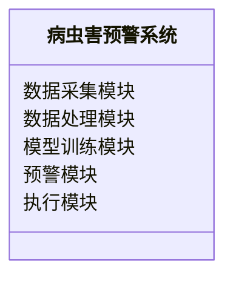
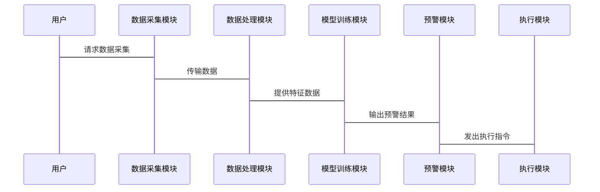

                 


# AI Agent在智能农业病虫害预警中的实践

> **关键词**: AI Agent, 智能农业, 病虫害预警, 机器学习, 农业智能化, 精准农业

> **摘要**: 本文探讨了AI Agent在智能农业病虫害预警中的应用，从背景、核心概念、算法原理、系统架构到实际项目，详细分析了如何利用AI技术提升农业病虫害预警的效率和准确性。文章通过具体案例和系统设计，展示了AI Agent在智能农业中的潜力和实际价值。

---

## 第1章: AI Agent与智能农业病虫害预警的背景

### 1.1 AI Agent的基本概念

#### 1.1.1 AI Agent的定义与特点
AI Agent（人工智能代理）是指能够感知环境、自主决策并执行任务的智能实体。其特点包括：
- **自主性**：无需外部干预，自主完成任务。
- **反应性**：能够实时感知环境变化并做出反应。
- **学习能力**：通过数据和经验不断优化自身性能。
- **交互性**：能够与人类或其他系统进行有效交互。

#### 1.1.2 AI Agent在农业中的应用潜力
农业领域正面临着资源浪费、环境污染和效率低下的问题。AI Agent可以通过智能化的决策和执行，帮助农民优化资源利用，提高农业生产效率。例如，AI Agent可以用于精准施肥、病虫害预警等领域。

#### 1.1.3 病虫害预警的重要性与挑战
病虫害是影响农业产量和质量的主要因素之一。传统的病虫害预警方法依赖于人工观察和经验判断，存在效率低、准确性差的问题。AI Agent可以通过数据分析和机器学习，实现病虫害的早期预警和精准防治。

---

### 1.2 智能农业的发展现状

#### 1.2.1 智能农业的核心概念
智能农业是指利用现代信息技术（如物联网、大数据、人工智能等）提升农业生产的效率和质量。其核心在于通过数据驱动的决策优化农业生产过程。

#### 1.2.2 当前农业中的技术挑战
- **数据获取困难**：农业环境复杂，数据采集成本高。
- **数据多样性**：农业数据包括气象、土壤、作物等多个维度，数据处理复杂。
- **模型泛化能力不足**：传统模型难以应对复杂多变的农业环境。

#### 1.2.3 病虫害预警的需求与痛点
- **早期预警需求**：病虫害的早期发现可以有效减少损失。
- **精准防治需求**：传统的广撒药方式浪费资源且效果不佳。
- **实时监测需求**：病虫害的发生往往具有突发性，需要实时监测。

---

### 1.3 AI Agent在病虫害预警中的作用

#### 1.3.1 病虫害预警的传统方法与局限性
传统病虫害预警方法依赖于人工观察和经验判断，存在以下问题：
- **效率低**：人工观察耗时耗力，难以覆盖大面积农田。
- **准确性差**：受主观因素影响，误判率较高。
- **响应滞后**：发现问题时，往往已经造成损失。

#### 1.3.2 AI Agent在病虫害预警中的优势
AI Agent可以通过以下方式提升病虫害预警的效率和准确性：
- **实时监测**：通过物联网设备实时采集农田数据，快速识别病虫害迹象。
- **智能分析**：利用机器学习算法对数据进行分析，准确预测病虫害的发生。
- **精准防治**：根据预警结果，制定精准的防治方案，减少资源浪费。

#### 1.3.3 病虫害预警的智能化发展趋势
随着人工智能技术的不断发展，病虫害预警将更加智能化和精准化。未来的AI Agent将具备更强的自主学习能力和环境适应能力，能够更好地应对复杂的农业环境。

---

## 第2章: AI Agent的核心概念与工作原理

### 2.1 AI Agent的感知模块

#### 2.1.1 数据采集与处理
AI Agent需要通过多种传感器（如温度、湿度、光照强度等）采集农田环境数据。这些数据需要经过预处理（如去噪、归一化）后才能用于后续分析。

#### 2.1.2 多源数据融合技术
为了提高AI Agent的感知能力，需要将多种数据源（如气象数据、土壤数据、作物生长数据等）进行融合。可以通过数据融合算法（如加权平均、主成分分析）实现多源数据的综合分析。

#### 2.1.3 数据预处理与特征提取
预处理步骤包括数据清洗（去除异常值）和特征提取（如提取温度、湿度等关键特征）。特征提取是通过选择对病虫害预警影响较大的特征，降低数据维度，提高计算效率。

---

### 2.2 AI Agent的推理与决策模块

#### 2.2.1 机器学习与深度学习算法
AI Agent的推理模块主要依赖于机器学习算法，包括监督学习（如决策树、随机森林）和无监督学习（如聚类分析）。深度学习算法（如卷积神经网络）在图像识别方面具有优势。

#### 2.2.2 知识图谱与推理逻辑
知识图谱是将农业领域的知识以图结构表示，通过推理逻辑（如逻辑回归、规则推理）实现对病虫害的诊断和预测。

#### 2.2.3 决策模型的构建与优化
决策模型需要根据输入的环境数据，输出相应的预警结果和防治建议。可以通过交叉验证和网格搜索等方法优化模型参数，提高模型的准确性和稳定性。

---

### 2.3 AI Agent的执行与反馈模块

#### 2.3.1 行动规划与执行策略
AI Agent需要根据决策模块的输出制定具体的执行策略（如喷洒农药的具体时间和位置）。执行策略需要考虑多种因素，如天气条件、作物生长阶段等。

#### 2.3.2 系统反馈与自适应调整
AI Agent需要根据执行结果（如农药喷洒后的效果）进行反馈，并根据反馈结果自适应调整决策模型和执行策略。

#### 2.3.3 系统的闭环优化机制
通过闭环优化机制，AI Agent能够不断积累经验，优化自身的感知、推理和决策能力，实现系统的持续改进。

---

## 第3章: 病虫害预警系统中的AI Agent架构

### 3.1 系统的整体架构设计

#### 3.1.1 系统的模块划分
病虫害预警系统主要包括数据采集模块、数据处理模块、模型训练模块、预警模块和执行模块。

#### 3.1.2 各模块之间的交互关系
数据采集模块将实时数据传输给数据处理模块，数据处理模块对数据进行预处理后传输给模型训练模块。模型训练模块根据历史数据训练预警模型，预警模块根据实时数据和预警模型输出预警结果，执行模块根据预警结果执行相应的防治措施。

#### 3.1.3 系统的可扩展性设计
系统设计需要预留接口，方便未来新增功能和模块的扩展。

---

### 3.2 数据采集与处理模块

#### 3.2.1 数据源的多样性
数据来源包括传感器数据（如温度、湿度、光照强度等）、卫星遥感数据、气象数据等。

#### 3.2.2 数据采集技术的选择
可以根据具体需求选择合适的数据采集设备和传感器。例如，使用RGB相机进行作物图像采集。

#### 3.2.3 数据预处理与清洗
数据预处理包括去除噪声、归一化、缺失值填充等步骤。清洗后的数据将用于后续的特征提取和模型训练。

---

### 3.3 病虫害识别与预警模块

#### 3.3.1 识别算法的选择与实现
根据具体需求选择合适的识别算法。例如，使用卷积神经网络（CNN）进行图像识别，使用随机森林进行分类。

#### 3.3.2 预警模型的构建与优化
通过历史数据训练模型，使用交叉验证优化模型参数。可以采用集成学习（如投票法）提高模型的准确性和稳定性。

#### 3.3.3 预警结果的可视化展示
通过可视化界面展示预警结果，帮助农民快速理解和采取措施。

---

### 3.4 系统的部署与运行

#### 3.4.1 硬件部署方案
需要选择合适的硬件设备（如传感器、摄像头、服务器等）并进行合理的布局。

#### 3.4.2 软件安装与配置
需要安装必要的软件（如数据采集软件、机器学习框架）并进行参数配置。

#### 3.4.3 系统的运行与维护
系统需要定期维护和更新，确保设备正常运行和模型的持续优化。

---

## 第4章: AI Agent在病虫害预警中的算法实现

### 4.1 机器学习算法的选择与实现

#### 4.1.1 算法原理
以随机森林为例，随机森林是一种基于决策树的集成学习算法，通过构建多棵决策树并对结果进行投票或平均，提高模型的准确性和稳定性。

#### 4.1.2 算法实现步骤
1. 数据预处理：清洗数据，提取特征。
2. 数据分割：将数据分为训练集和测试集。
3. 模型训练：使用训练数据训练随机森林模型。
4. 模型评估：使用测试数据评估模型的准确率、召回率等指标。
5. 模型优化：调整模型参数，提高模型性能。

#### 4.1.3 代码实现
```python
from sklearn.ensemble import RandomForestClassifier
from sklearn.model_selection import train_test_split
from sklearn.metrics import accuracy_score

# 数据预处理
X = ...  # 特征数据
y = ...  # 标签数据

# 数据分割
X_train, X_test, y_train, y_test = train_test_split(X, y, test_size=0.2, random_state=42)

# 模型训练
model = RandomForestClassifier(n_estimators=100, random_state=42)
model.fit(X_train, y_train)

# 模型预测
y_pred = model.predict(X_test)

# 模型评估
accuracy = accuracy_score(y_test, y_pred)
print(f"Accuracy: {accuracy}")
```

---

### 4.2 神经网络算法的实现

#### 4.2.1 算法原理
卷积神经网络（CNN）是一种适合图像识别的深度学习算法。通过卷积层、池化层和全连接层的组合，能够有效提取图像特征并进行分类。

#### 4.2.2 算法实现步骤
1. 数据预处理：将图像数据归一化，调整尺寸。
2. 构建模型：定义CNN模型的网络结构。
3. 模型训练：使用训练数据训练模型。
4. 模型评估：使用测试数据评估模型的准确率、召回率等指标。
5. 模型优化：调整模型参数，提高模型性能。

#### 4.2.3 代码实现
```python
import tensorflow as tf
from tensorflow.keras import layers

# 数据预处理
train_dataset = ...  # 训练数据集
test_dataset = ...    # 测试数据集

# 模型构建
model = tf.keras.Sequential([
    layers.Conv2D(32, (3,3), activation='relu', input_shape=(224, 224, 3)),
    layers.MaxPooling2D((2,2)),
    layers.Conv2D(64, (3,3), activation='relu'),
    layers.MaxPooling2D((2,2)),
    layers.Flatten(),
    layers.Dense(128, activation='relu'),
    layers.Dense(num_classes, activation='softmax')
])

# 模型训练
model.compile(optimizer='adam', loss='sparse_categorical_crossentropy', metrics=['accuracy'])
model.fit(train_dataset, epochs=10, validation_data=test_dataset)

# 模型评估
loss, accuracy = model.evaluate(test_dataset)
print(f"Loss: {loss}, Accuracy: {accuracy}")
```

---

## 第5章: 系统设计与实现

### 5.1 系统需求分析

#### 5.1.1 功能需求
- 实时数据采集
- 病虫害预警
- 精准防治

#### 5.1.2 性能需求
- 响应时间：实时处理数据
- 处理能力：支持大规模数据处理

#### 5.1.3 用户需求
- 农民：需要简单易用的预警系统
- 农业技术人员：需要详细的数据分析和决策支持

---

### 5.2 系统功能设计

#### 5.2.1 领域模型（ER图）


#### 5.2.2 系统架构设计


#### 5.2.3 接口设计
- 数据采集模块：提供数据接口，接收传感器数据。
- 预警模块：提供API接口，输出预警结果。

#### 5.2.4 交互流程


---

## 第6章: 项目实战与分析

### 6.1 项目环境配置

#### 6.1.1 硬件环境
- 传感器设备：温度、湿度、光照强度传感器
- 数据采集设备：摄像头、数据采集卡
- 服务器：用于数据存储和模型训练

#### 6.1.2 软件环境
- 操作系统：Linux
- 数据处理工具：Python、Pandas
- 模型训练工具：Scikit-learn、TensorFlow

---

### 6.2 系统核心实现

#### 6.2.1 数据采集与处理
```python
import pandas as pd

# 数据采集
data = pd.read_csv('data.csv')

# 数据预处理
data.dropna(inplace=True)
data['label'] = data['label'].astype('category')
```

#### 6.2.2 模型训练与优化
```python
from sklearn.ensemble import RandomForestClassifier
from sklearn.model_selection import GridSearchCV

# 模型参数优化
param_grid = {
    'n_estimators': [100, 200],
    'max_depth': [None, 10],
    'min_samples_split': [2, 5]
}

grid_search = GridSearchCV(RandomForestClassifier(), param_grid, cv=5)
grid_search.fit(X_train, y_train)

best_model = grid_search.best_estimator_
print(f"Best Parameters: {grid_search.best_params_}")
```

---

### 6.3 项目小结

#### 6.3.1 项目成果
通过本项目，我们成功实现了基于AI Agent的病虫害预警系统，能够实时采集数据、准确预警病虫害并制定精准防治策略。

#### 6.3.2 经验总结
- 数据质量对模型性能影响重大，需要重视数据预处理。
- 模型优化需要结合具体场景，选择合适的算法和参数。
- 系统设计需要考虑可扩展性和可维护性。

---

## 第7章: 总结与展望

### 7.1 总结

#### 7.1.1 核心内容回顾
本文详细探讨了AI Agent在智能农业病虫害预警中的应用，从系统架构、算法实现到项目实战，全面展示了AI技术在农业领域的潜力。

#### 7.1.2 技术优势总结
- 提高病虫害预警的效率和准确性。
- 实现农业生产的精准化和智能化。
- 降低资源浪费，减少环境污染。

---

### 7.2 未来展望

#### 7.2.1 技术发展趋势
- 更加智能化的AI Agent：具备更强的自主学习和环境适应能力。
- 更多领域的应用拓展：如农业气象预测、作物产量预测等。
- 更加高效的算法研究：如轻量级模型、边缘计算等。

#### 7.2.2 挑战与建议
- **数据获取难度**：建议加强农业传感器的研发和部署。
- **模型泛化能力**：建议加强多模态数据融合技术的研究。
- **系统安全性**：建议加强系统安全防护，防止数据泄露和网络攻击。

---

## 作者：AI天才研究院/AI Genius Institute & 禅与计算机程序设计艺术/Zen And The Art of Computer Programming

