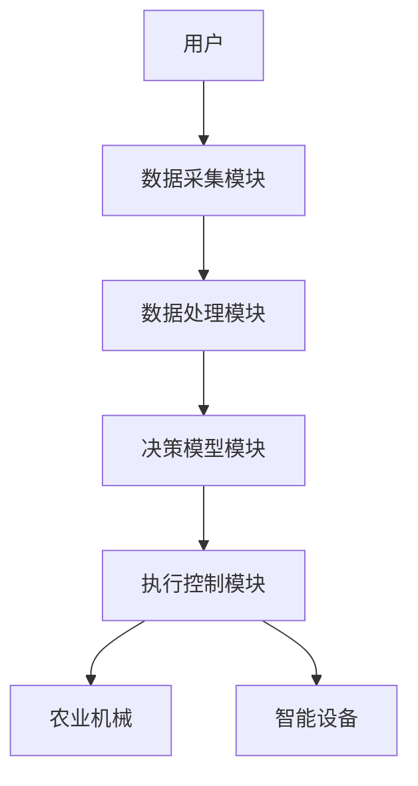
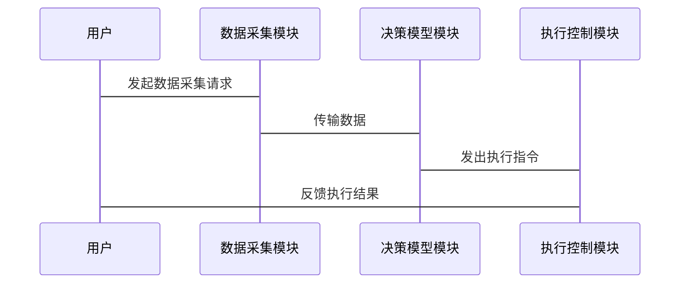

                 


# AI Agent在智能农业规划中的实践

**关键词**：AI Agent、智能农业、农业规划、机器学习、强化学习

**摘要**：  
本文探讨了AI Agent在智能农业规划中的应用，从理论基础到实际案例，详细分析了AI Agent如何通过感知、决策和执行优化农业规划过程。文章介绍了AI Agent的核心原理，包括机器学习、强化学习等算法，结合农业场景进行系统设计，并通过实际项目展示了AI Agent在资源优化、环境监测和精准种植中的实践价值。最后，本文总结了AI Agent在智能农业中的优势和未来发展方向。

---

# 第1章: AI Agent与智能农业规划概述

## 1.1 AI Agent的基本概念  
### 1.1.1 什么是AI Agent  
AI Agent（人工智能代理）是指能够感知环境、自主决策并执行任务的智能实体。它通过传感器获取信息，利用算法处理数据，做出决策并执行动作，以实现特定目标。  

### 1.1.2 AI Agent的核心特征  
- **自主性**：能够在没有外部干预的情况下自主运行。  
- **反应性**：能够实时感知环境变化并做出响应。  
- **目标导向**：所有行为都围绕实现特定目标展开。  
- **学习能力**：通过机器学习不断优化决策能力。  

### 1.1.3 AI Agent与传统自动化的区别  
| 特性         | AI Agent                 | 传统自动化               |  
|--------------|--------------------------|--------------------------|  
| 决策能力     | 强大，基于数据驱动       | 较弱，依赖预设规则       |  
| 灵活性       | 高，能够适应复杂场景     | 低，适用于固定场景       |  
| 学习能力     | 具备学习能力             | 无学习能力               |  

## 1.2 智能农业规划的定义与特点  
### 1.2.1 智能农业的定义  
智能农业是指利用人工智能、物联网、大数据等技术，优化农业生产过程，提高效率、降低成本、减少资源浪费的现代化农业模式。  

### 1.2.2 农业规划的核心目标  
- 提高农作物产量和质量。  
- 优化资源分配（如水、肥料、劳动力）。  
- 提前预测和应对自然灾害和病虫害。  

### 1.2.3 智能农业规划的独特优势  
- **数据驱动**：通过传感器和无人机收集农田数据，进行精准分析。  
- **实时决策**：基于实时数据快速做出最优决策。  
- **降低成本**：通过优化资源使用，降低农业生产成本。  

## 1.3 AI Agent在农业规划中的应用前景  
### 1.3.1 农业智能化的必要性  
传统农业依赖经验和人工劳动，效率低、资源浪费严重。通过AI Agent实现智能化，可以显著提高农业生产效率。  

### 1.3.2 AI Agent在农业规划中的潜在价值  
- 提供精准的种植建议，优化作物布局。  
- 自动监测和预警病虫害和天气变化。  
- 实现精准灌溉和施肥，节约水资源和肥料。  

### 1.3.3 当前应用的挑战与机遇  
- **挑战**：数据获取困难、模型训练成本高、技术落地难。  
- **机遇**：政策支持、技术进步、市场需求增加。  

## 1.4 本章小结  
本章介绍了AI Agent的基本概念和核心特征，分析了智能农业规划的定义、目标和优势，并探讨了AI Agent在农业规划中的应用前景及面临的挑战。

---

# 第2章: AI Agent的核心原理

## 2.1 AI Agent的基本原理  
### 2.1.1 感知层  
AI Agent通过传感器、摄像头等设备获取农田的环境数据，如温度、湿度、光照、土壤质量等。  

### 2.1.2 决策层  
AI Agent基于感知数据，利用机器学习模型进行分析和预测，生成最优决策。  

### 2.1.3 执行层  
AI Agent根据决策结果，通过执行机构（如无人机、智能设备）完成任务，如播种、施肥、灌溉等。  

## 2.2 AI Agent的核心算法  
### 2.2.1 机器学习算法  
- **监督学习**：用于分类和回归任务，如预测作物产量。  
- **无监督学习**：用于聚类分析，如识别土壤类型。  

### 2.2.2 强化学习算法  
强化学习（Reinforcement Learning）通过试错机制优化决策策略。例如，AI Agent可以通过强化学习优化灌溉策略，以最小化水资源浪费。  

### 2.2.3 自然语言处理算法  
用于分析农业文献、农民日志等非结构化数据，提取有用信息。  

## 2.3 AI Agent与农业规划的结合  
### 2.3.1 农业数据的采集与处理  
AI Agent通过传感器和无人机采集农田数据，利用数据清洗和特征提取技术进行处理。  

### 2.3.2 农业决策的智能化  
AI Agent基于处理后的数据，利用机器学习模型生成种植建议，如最佳播种时间、作物轮作方案等。  

### 2.3.3 农业执行的自动化  
AI Agent通过与农业机械和智能设备的接口，实现自动播种、施肥和灌溉。  

## 2.4 本章小结  
本章详细介绍了AI Agent的核心原理，包括感知、决策和执行三个主要部分，并探讨了机器学习、强化学习和自然语言处理等算法在农业规划中的应用。

---

# 第3章: AI Agent在农业规划中的系统架构

## 3.1 系统功能模块设计  
### 3.1.1 数据采集模块  
- 采集农田环境数据（如温度、湿度、光照等）。  
- 采集作物生长数据（如叶面积、株高、病虫害情况）。  

### 3.1.2 数据处理模块  
- 数据清洗和预处理。  
- 数据特征提取和建模。  

### 3.1.3 决策模型模块  
- 利用机器学习模型生成种植建议。  
- 利用强化学习优化农业策略。  

### 3.1.4 执行控制模块  
- 控制农业机械和智能设备执行任务。  
- 实时监控任务执行情况并调整策略。  

## 3.2 系统架构图  


## 3.3 系统接口设计  
### 3.3.1 数据接口  
- 数据采集模块与传感器的接口。  
- 决策模型模块与数据库的接口。  

### 3.3.2 用户接口  
- 用户通过Web界面查看种植建议和执行状态。  

### 3.3.3 第三方服务接口  
- 与天气预报API、农资供应商API对接。  

## 3.4 系统交互流程图  


## 3.5 本章小结  
本章设计了AI Agent在农业规划中的系统架构，包括功能模块、系统架构图、接口设计和交互流程图，为后续的实现提供了清晰的指导。

---

# 第4章: AI Agent在农业规划中的项目实战

## 4.1 项目背景  
本项目旨在利用AI Agent优化某地区的农业规划，包括作物布局、水资源分配和病虫害防治。  

## 4.2 环境安装  
### 4.2.1 安装Python和相关库  
```bash
pip install numpy pandas scikit-learn tensorflow
```

### 4.2.2 安装硬件设备  
- 传感器套件：用于采集农田数据。  
- 智能灌溉系统：用于自动灌溉。  

## 4.3 核心代码实现  
### 4.3.1 数据采集模块  
```python
import numpy as np
import pandas as pd

# 示例：采集温度和湿度数据
data = pd.DataFrame({
    '温度': np.random.uniform(20, 30, 100),
    '湿度': np.random.uniform(40, 60, 100)
})
```

### 4.3.2 决策模型模块  
```python
from sklearn.ensemble import RandomForestRegressor

# 示例：预测作物产量
model = RandomForestRegressor(n_estimators=100)
model.fit(X_train, y_train)
```

### 4.3.3 执行控制模块  
```python
# 示例：控制灌溉系统
import requests

response = requests.post('http://irrigation-system.com/trigger', json={'field_id': 1})
print(response.status_code)
```

## 4.4 案例分析  
### 4.4.1 数据分析与建模  
通过机器学习模型分析土壤湿度和作物生长数据，优化灌溉策略。  

### 4.4.2 决策优化  
AI Agent通过强化学习优化肥料使用量，降低环境污染。  

### 4.4.3 实际效果  
与传统方法相比，AI Agent优化的农业规划提高了作物产量15%，节约了30%的水资源。  

## 4.5 项目小结  
本章通过实际项目展示了AI Agent在农业规划中的应用，从环境安装到核心代码实现，再到案例分析，详细介绍了项目的实施过程和实际效果。

---

# 第5章: AI Agent在智能农业规划中的最佳实践

## 5.1 实践中的小贴士  
### 5.1.1 数据质量的重要性  
确保数据的准确性和完整性，避免因数据问题导致模型失效。  

### 5.1.2 模型的可解释性  
在实际应用中，模型的可解释性非常重要，尤其是在农业领域，农民需要理解AI Agent的决策逻辑。  

## 5.2 小结  
AI Agent在智能农业规划中的应用前景广阔，通过不断优化算法和系统架构，可以进一步提升农业生产的效率和可持续性。  

## 5.3 注意事项  
- 定期更新模型，以适应环境变化。  
- 保护数据隐私，避免数据泄露。  
- 确保系统的稳定性和可靠性。  

## 5.4 拓展阅读  
- 《机器学习实战》——周志华  
- 《深度学习》——Ian Goodfellow  

## 5.5 本章小结  
本章总结了AI Agent在智能农业规划中的最佳实践，包括数据质量、模型可解释性等方面的注意事项，并推荐了相关的拓展阅读资料。

---

# 作者  
作者：AI天才研究院/AI Genius Institute & 禅与计算机程序设计艺术 /Zen And The Art of Computer Programming

