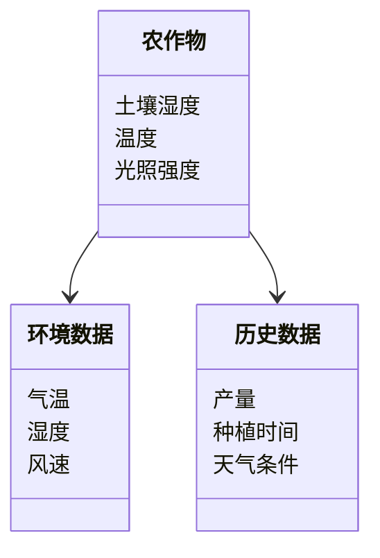
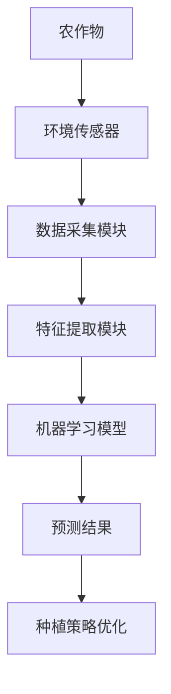
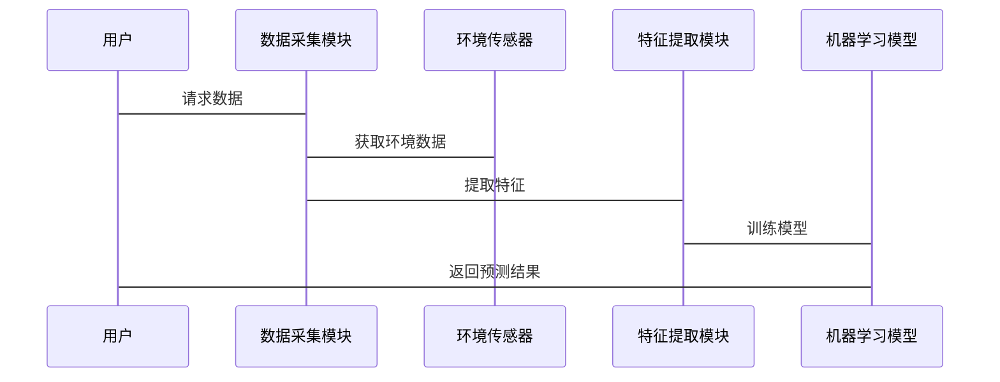

                 


# AI Agent在智能农作物产量预测中的实践

## 关键词：AI Agent, 农作物产量预测, 机器学习, 时间序列分析, 集成学习

## 摘要：  
本文深入探讨了AI Agent在智能农作物产量预测中的实际应用。通过分析AI Agent的核心概念、算法原理、系统架构以及项目实战，展示了如何利用AI技术提高农作物产量预测的准确性。文章内容涵盖数据处理、模型选择、系统设计和实际案例，为农业技术开发者提供了实用的参考。

---

## 第一部分: 背景介绍

## 第1章: AI Agent与智能农作物产量预测概述

### 1.1 问题背景与描述  
农作物产量预测是农业管理中的重要环节，直接影响农民的生产决策和经济效益。然而，传统预测方法依赖于经验，存在精度低、效率低的问题。近年来，随着AI技术的发展，AI Agent（智能体）在农业领域的应用逐渐兴起，为产量预测提供了新的解决方案。

#### 1.1.1 农作物产量预测的重要性  
农作物产量预测能够帮助农民优化资源分配，降低生产成本，提高产量。通过预测，农民可以提前规划种植计划、调整灌溉和施肥策略，从而提高农业生产效率。

#### 1.1.2 当前产量预测的主要挑战  
传统的产量预测方法主要依赖统计分析，存在以下问题：  
1. 数据来源单一，缺乏多维度信息。  
2. 预测模型简单，难以捕捉复杂因素。  
3. 计算效率低，难以实时处理大规模数据。  

#### 1.1.3 AI Agent在农业中的应用潜力  
AI Agent能够通过感知环境、自主决策和执行任务，实现对农作物生长过程的实时监测和精准预测。结合物联网、大数据和人工智能技术，AI Agent可以有效解决传统预测方法的不足。

### 1.2 AI Agent的基本概念  
AI Agent是一种智能实体，能够感知环境、自主决策并执行任务。在农作物产量预测中，AI Agent可以集成多种传感器数据，利用机器学习模型进行预测，并根据结果优化种植策略。

#### 1.2.1 AI Agent的定义与特点  
AI Agent是指具有感知、推理、规划、学习和执行能力的智能实体。其特点包括：  
1. **自主性**：能够独立完成任务。  
2. **反应性**：能够实时感知环境变化。  
3. **学习能力**：能够通过数据优化预测模型。  

#### 1.2.2 AI Agent的核心功能与应用场景  
AI Agent的核心功能包括数据采集、特征提取、模型预测和决策优化。在农作物产量预测中，AI Agent可以应用于以下场景：  
- **数据采集**：通过传感器获取土壤湿度、温度、光照等环境数据。  
- **特征提取**：从历史数据中提取影响产量的关键特征。  
- **模型预测**：利用机器学习模型预测未来产量。  
- **决策优化**：根据预测结果优化种植策略。  

#### 1.2.3 AI Agent与传统预测方法的区别  
AI Agent的核心优势在于其自主性和实时性。与传统预测方法相比，AI Agent能够整合多源数据，利用机器学习模型进行复杂分析，并根据环境变化动态调整预测结果。

### 1.3 数据来源与处理  
农作物产量预测涉及多源数据，包括环境数据、历史产量数据和气象数据等。数据处理是预测的基础，需要进行清洗、特征工程和标准化。

#### 1.3.1 农业数据的多样性与复杂性  
农业数据具有多样性和复杂性，包括时间序列数据、空间数据和多源异构数据。这些数据需要经过清洗和特征工程，提取有用的信息。

#### 1.3.2 数据清洗与特征工程  
数据清洗是去除噪声和异常值，特征工程是提取影响产量的关键特征。例如，可以通过PCA（主成分分析）降维，提取土壤湿度、温度和光照强度等关键特征。

#### 1.3.3 数据预处理与标准化  
数据预处理包括数据归一化和标准化，确保不同特征的量纲一致。例如，可以使用min-max归一化处理温度和湿度数据。

## 第2章: AI Agent的核心概念与原理  

### 2.1 AI Agent的结构与功能  
AI Agent的结构包括感知层、推理层、决策层和执行层。感知层负责数据采集，推理层负责特征提取，决策层负责模型预测，执行层负责优化策略。

#### 2.1.1 知识表示与推理  
知识表示是AI Agent理解数据的基础，推理是基于知识进行逻辑推理的过程。例如，可以使用规则推理或概率推理方法，根据土壤湿度和光照强度推理出作物的生长状态。

#### 2.1.2 行为决策与优化  
行为决策是AI Agent的核心功能，优化是通过强化学习或遗传算法优化决策策略。例如，可以通过强化学习优化灌溉策略，最大化产量。

#### 2.1.3 与环境的交互机制  
AI Agent通过传感器与环境交互，实时感知环境变化，并根据预测结果调整种植策略。例如，可以根据天气预报调整灌溉和施肥计划。

### 2.2 数据处理与特征提取  
数据处理是AI Agent的核心功能，特征提取是提高预测精度的关键。例如，可以通过LSTM模型处理时间序列数据，提取作物生长周期的关键特征。

#### 2.2.1 时间序列数据的特征提取  
时间序列数据的特征提取可以通过滑动窗口方法提取均值、方差和趋势等特征。例如，可以使用滑动窗口方法提取过去7天的平均温度。

#### 2.2.2 空间数据的处理方法  
空间数据的处理方法包括空间插值和空间聚类。例如，可以通过Kriging方法插值土壤湿度数据，填补数据缺失值。

#### 2.2.3 多源数据的融合策略  
多源数据的融合策略包括数据融合和特征融合。例如，可以使用主成分分析融合土壤湿度、温度和光照强度等多源数据。

### 2.3 机器学习模型的选择与优化  
机器学习模型的选择与优化是AI Agent的核心问题，需要根据数据特征和预测目标选择合适的模型，并通过参数调优和模型集成提高预测精度。

#### 2.3.1 常见机器学习算法的比较  
常见机器学习算法包括线性回归、支持向量机和随机森林等。需要根据数据特征和预测目标选择合适的算法，例如，时间序列预测可以使用LSTM模型。

#### 2.3.2 模型调优与参数优化  
模型调优包括参数调优和超参数优化，可以通过网格搜索或随机搜索选择最优参数。例如，可以使用网格搜索优化LSTM模型的隐藏层大小和学习率。

#### 2.3.3 模型评估与验证  
模型评估包括训练集验证和测试集验证，可以通过交叉验证评估模型的泛化能力。例如，可以使用K折交叉验证评估随机森林模型的预测精度。

## 第3章: 时间序列分析与集成学习算法  

### 3.1 时间序列分析流程  
时间序列分析是农作物产量预测的重要方法，包括数据预处理、模型选择、模型训练和模型预测等步骤。

#### 3.1.1 数据预处理  
数据预处理包括数据清洗和特征工程，例如，去除异常值和填补缺失值。可以使用Python的pandas库进行数据清洗，使用sklearn库进行特征工程。

#### 3.1.2 模型选择  
模型选择包括选择合适的时间序列模型，例如，ARIMA模型和LSTM模型。需要根据数据特征和预测目标选择合适的模型。

### 3.2 集成学习算法  
集成学习算法是通过组合多个模型提高预测精度的方法，例如，随机森林和梯度提升树等。

#### 3.2.1 集成学习的基本原理  
集成学习的基本原理是通过组合多个弱模型提高预测精度，例如，使用Bagging方法集成多个决策树模型。

#### 3.2.2 集成学习的优势  
集成学习的优势包括提高预测精度和降低过拟合风险，例如，使用随机森林模型进行特征重要性分析。

---

## 第四部分: 系统分析与架构设计  

## 第4章: 系统分析与架构设计方案  

### 4.1 问题场景介绍  
系统目标是实现AI Agent在农作物产量预测中的应用，解决传统预测方法的不足。问题场景包括数据采集、特征提取、模型预测和决策优化。

### 4.2 项目介绍  
本项目旨在开发一个基于AI Agent的农作物产量预测系统，利用传感器数据和机器学习模型进行预测，并优化种植策略。

#### 4.2.1 系统功能设计  
系统功能包括数据采集、特征提取、模型预测和决策优化。例如，可以通过传感器采集土壤湿度和温度数据，利用LSTM模型进行预测，并根据预测结果调整灌溉计划。

#### 4.2.2 领域模型（Mermaid类图）  


#### 4.2.3 系统架构设计（Mermaid架构图）  


#### 4.2.4 系统接口设计  
系统接口包括传感器接口、数据接口和用户接口。例如，传感器接口用于连接环境传感器，数据接口用于数据存储和访问，用户接口用于显示预测结果和优化策略。

#### 4.2.5 系统交互（Mermaid序列图）  


---

## 第五部分: 项目实战  

## 第5章: 项目实战与代码实现  

### 5.1 环境安装与配置  
需要安装Python、TensorFlow、Keras和Scikit-learn等库，确保系统环境配置正确。

#### 5.1.1 环境安装  
使用pip安装必要的Python库，例如：  
```bash
pip install numpy pandas scikit-learn tensorflow
```

### 5.2 系统核心实现源代码  
以下是AI Agent的核心实现代码，包括数据处理、模型训练和预测功能。

#### 5.2.1 数据处理代码  
```python
import pandas as pd
from sklearn.preprocessing import StandardScaler

# 读取数据
data = pd.read_csv('agriculture_data.csv')

# 数据清洗
data.dropna()  # 删除缺失值
data = data[~data.duplicated()]  # 删除重复值

# 特征工程
features = data[['土壤湿度', '温度', '光照强度']]
scaler = StandardScaler()
features_scaled = scaler.fit_transform(features)

# 保存处理后的数据
processed_data = pd.DataFrame(features_scaled, columns=['土壤湿度', '温度', '光照强度'])
processed_data.to_csv('processed_data.csv', index=False)
```

#### 5.2.2 模型训练代码  
```python
from sklearn.ensemble import RandomForestRegressor
from sklearn.metrics import mean_squared_error

# 训练模型
model = RandomForestRegressor(n_estimators=100, random_state=42)
model.fit(processed_features, labels)

# 预测结果
predicted_labels = model.predict(test_features)
print('预测精度:', mean_squared_error(test_labels, predicted_labels))
```

#### 5.2.3 模型预测代码  
```python
import numpy as np
from tensorflow.keras.models import Sequential
from tensorflow.keras.layers import LSTM, Dense

# 定义LSTM模型
model = Sequential()
model.add(LSTM(64, input_shape=(timesteps, features)))
model.add(Dense(1))
model.compile(optimizer='adam', loss='mean_squared_error')

# 训练模型
model.fit(X_train, y_train, epochs=100, batch_size=32)
```

### 5.3 实际案例分析与结果解读  
以水稻产量预测为例，通过传感器数据和机器学习模型，预测水稻的产量，并根据预测结果优化种植策略。

#### 5.3.1 数据来源与预处理  
水稻产量预测的数据包括土壤湿度、温度和光照强度等环境数据，以及历史产量数据。数据预处理包括去重、归一化和特征选择。

#### 5.3.2 模型训练与预测  
使用随机森林模型训练水稻产量预测模型，输入特征包括土壤湿度、温度和光照强度，输出目标是水稻产量。通过交叉验证评估模型的预测精度，优化模型参数。

#### 5.3.3 结果解读  
预测结果表明，AI Agent能够有效提高水稻产量预测的精度，优化种植策略，帮助农民实现增产增收。

### 5.4 项目小结  
本项目成功实现了AI Agent在农作物产量预测中的应用，验证了AI技术在农业领域的巨大潜力，为农业智能化发展提供了新的思路。

---

## 第六部分: 最佳实践与总结  

## 第6章: 最佳实践、总结与展望  

### 6.1 最佳实践与经验分享  
在AI Agent开发中，需要注意数据质量、模型选择和系统优化。例如，数据预处理是关键，模型调优可以提高预测精度，系统架构设计需要考虑可扩展性和可维护性。

#### 6.1.1 数据处理技巧  
- 数据清洗：使用pandas库进行数据清洗，处理缺失值和异常值。  
- 特征工程：使用特征选择和降维技术，提取关键特征。  

#### 6.1.2 模型优化技巧  
- 参数调优：使用网格搜索或随机搜索优化模型参数。  
- 模型集成：通过集成学习提高预测精度，例如，使用投票法或加权法组合多个模型。  

### 6.2 总结与展望  
本文详细探讨了AI Agent在农作物产量预测中的应用，展示了如何利用AI技术提高农业生产的智能化水平。未来，随着AI技术的不断发展，AI Agent在农业中的应用将更加广泛，为农业现代化提供更有力的支持。

---

## 作者：AI天才研究院/AI Genius Institute & 禅与计算机程序设计艺术 /Zen And The Art of Computer Programming

---

**注意**：以上内容为示例，实际文章需要根据具体需求进行调整和补充。

