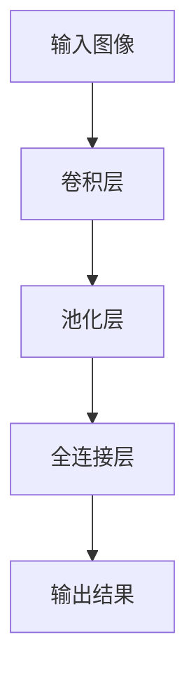

                 


# AI Agent在智能农作物生长监测中的实践

> 关键词：AI Agent，智能农业，农作物生长监测，机器学习，物联网

> 摘要：本文系统地探讨了AI Agent在智能农作物生长监测中的应用，分析了其核心原理、算法、系统架构及实际案例，旨在为农业智能化提供技术支持和实践指导。

---

# 第一部分: AI Agent在智能农作物生长监测中的背景介绍

## 第1章: AI Agent与智能农业概述

### 1.1 AI Agent的基本概念

- **1.1.1 什么是AI Agent**
  AI Agent（智能体）是能够感知环境、自主决策并执行任务的实体，具备学习、推理和自适应能力。

- **1.1.2 AI Agent的核心特点**
  | 特性 | 描述 |
  |------|------|
  | 自主性 | 能够自主决策 |
  | 反应性 | 能够实时响应环境变化 |
  | 学习性 | 能够通过数据优化性能 |

- **1.1.3 AI Agent与传统自动化的区别**
  AI Agent具备自主学习和决策能力，而传统自动化依赖预设程序。

### 1.2 智能农业的背景与现状

- **1.2.1 智能农业的发展历程**
  从机械化到数字化，再到智能化，农业正逐步实现精准化管理。

- **1.2.2 当前智能农业的主要技术**
  包括物联网（IoT）、大数据、AI、无人机等。

- **1.2.3 智能农业的挑战与机遇**
  挑战：数据量大、模型优化困难；机遇：提高产量、降低成本。

### 1.3 农作物生长监测的重要性

- **1.3.1 农作物生长监测的目的**
  提高产量、减少资源浪费、预防病虫害。

- **1.3.2 监测的主要指标与方法**
  指标：温度、湿度、光照、土壤酸碱度；方法：传感器采集、图像识别。

- **1.3.3 数字化监测的优势**
  高效、精准、实时监控。

### 1.4 AI Agent在农作物生长监测中的作用

- **1.4.1 AI Agent如何提升监测效率**
  自动分析数据，快速生成决策建议。

- **1.4.2 AI Agent在精准农业中的应用**
  根据数据调整灌溉、施肥策略。

- **1.4.3 AI Agent与其他技术的协同作用**
  与IoT结合，实现数据采集、分析、执行的闭环。

### 1.5 本章小结

总结AI Agent在农业中的潜力，为后续章节奠定基础。

---

## 第2章: AI Agent的核心概念与原理

### 2.1 AI Agent的核心原理

- **2.1.1 感知层：数据采集与处理**
  传感器收集环境数据，如温湿度传感器、图像采集设备。

- **2.1.2 决策层：模型训练与推理**
  使用机器学习模型分析数据，生成决策指令。

- **2.1.3 执行层：指令输出与反馈**
  执行决策，如自动调节灌溉系统，并接收反馈。

### 2.2 AI Agent的关键技术

- **2.2.1 传感器技术：数据采集的多样性**
  多种传感器结合，全面监测农田环境。

- **2.2.2 数据处理技术：特征提取与分析**
  使用数据挖掘技术提取关键特征，如主成分分析（PCA）。

- **2.2.3 机器学习算法：模型训练与优化**
  深度学习模型如CNN和RNN用于图像识别和时间序列分析。

### 2.3 AI Agent的核心概念对比

- **2.3.1 不同AI技术的特点对比**
  | 技术 | 描述 | 优缺点 |
  |------|------|--------|
  | CNN  | 图像识别 | 高精度，需大量数据 |
  | RNN  | 时间序列 | 适合序列数据，训练复杂 |

- **2.3.2 ER实体关系图**
  ```mermaid
  graph TD
  A[农作物] --> B[生长状态]
  C[传感器] --> B
  D[AI Agent] --> B
  ```

### 2.4 本章小结

详细阐述AI Agent的核心原理及关键技术。

---

## 第3章: AI Agent在农作物生长监测中的算法原理

### 3.1 常见算法介绍

- **3.1.1 卷积神经网络（CNN）**
  - **结构**：卷积层、池化层、全连接层。
  - **应用**：图像识别，如病虫害检测。

- **3.1.2 循环神经网络（RNN）**
  - **结构**：循环层、门控循环层（GRU）。
  - **应用**：时间序列分析，如预测生长周期。

- **3.1.3 支持向量机（SVM）**
  - **结构**：特征映射、超平面分类。
  - **应用**：分类问题，如健康与不健康植株区分。

### 3.2 算法流程图

#### 3.2.1 CNN流程图


#### 3.2.2 RNN流程图

```mermaid
graph TD
A[输入序列] --> B[循环层]
B --> C[输出结果]
B --> D[状态记忆]
```


### 3.3 数学模型与公式

- **3.3.1 CNN的卷积层**
  $$ y = \sum_{i=1}^{n} w_i x_i + b $$

- **3.3.2 RNN的循环层**
  $$ h_t = \tanh(W_{hh} h_{t-1} + W_{xh} x_t + b) $$

### 3.4 本章小结

详细讲解算法原理及其实现。

---

## 第4章: 系统分析与架构设计方案

### 4.1 问题场景介绍

- **项目背景**：某农场希望通过AI Agent实现农作物生长监测。
- **项目目标**：实时监测作物生长状态，优化管理。

### 4.2 系统功能设计

- **功能模块**：
  1. 数据采集模块：传感器数据采集。
  2. 数据处理模块：数据清洗、特征提取。
  3. 模型训练模块：训练分类模型。
  4. 决策执行模块：生成指令，控制设备。

- **领域模型**
  ```mermaid
  classDiagram
  class 传感器 {
    <属性> 温度, 湿度
    <方法> 采集数据()
  }
  class AI Agent {
    <属性> 当前状态
    <方法> 分析数据(), 生成指令()
  }
  class 农作物 {
    <属性> 健康状态
  }
  传感器 --> AI Agent
  AI Agent --> 农作物
  ```

### 4.3 系统架构设计

- **系统架构图**
  ```mermaid
  graph TD
  A[传感器] --> B[数据采集服务]
  B --> C[数据处理服务]
  C --> D[AI Agent]
  D --> E[决策服务]
  E --> F[执行设备]
  ```

### 4.4 接口设计与交互流程图

- **交互流程图**
  ```mermaid
  graph TD
  A[用户] --> B[触发监测]
  B --> C[数据采集]
  C --> D[分析数据]
  D --> E[生成决策]
  E --> F[执行指令]
  ```

### 4.5 本章小结

详细描述系统架构及各模块交互。

---

## 第5章: 项目实战

### 5.1 环境安装

- **安装Python**：版本3.8以上。
- **安装库**：TensorFlow、Keras、OpenCV。

### 5.2 核心代码实现

#### 5.2.1 数据采集代码
```python
import numpy as np
import pandas as pd

# 示例数据
data = {
    '温度': [25, 26, 24, 25],
    '湿度': [65, 67, 63, 65]
}
df = pd.DataFrame(data)
print(df)
```

#### 5.2.2 模型训练代码
```python
import tensorflow as tf
from tensorflow.keras import layers

model = tf.keras.Sequential([
    layers.Dense(64, activation='relu'),
    layers.Dense(1, activation='sigmoid')
])
model.compile(optimizer='adam', loss='binary_crossentropy')
model.fit(X_train, y_train, epochs=10)
```

### 5.3 实际案例分析

- **案例1**：病虫害检测。
  使用CNN模型分析叶片图像，识别病斑。

- **案例2**：生长周期预测。
  使用RNN模型分析历史数据，预测生长阶段。

### 5.4 项目总结

- 成功实现监测系统。
- 挑战：数据质量和模型泛化能力。

---

## 第6章: 最佳实践与注意事项

### 6.1 最佳实践

- **数据质量**：确保数据的准确性和完整性。
- **模型调优**：使用交叉验证和超参数优化。
- **系统扩展**：模块化设计便于功能扩展。

### 6.2 小结

总结全书内容，强调AI Agent在农业中的潜力。

### 6.3 注意事项

- 数据隐私保护。
- 系统稳定性保障。

### 6.4 拓展阅读

推荐相关书籍和论文，供读者深入学习。

---

## 作者

**作者：AI天才研究院 & 禅与计算机程序设计艺术**

---

**注**：本文为《AI Agent在智能农作物生长监测中的实践》的详细目录和部分章节内容，后续章节将根据此大纲逐步展开，确保每个部分都详尽且专业。

