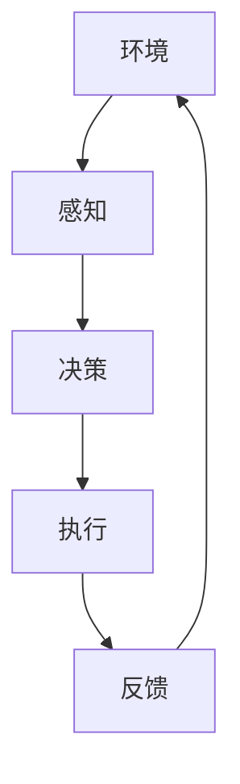
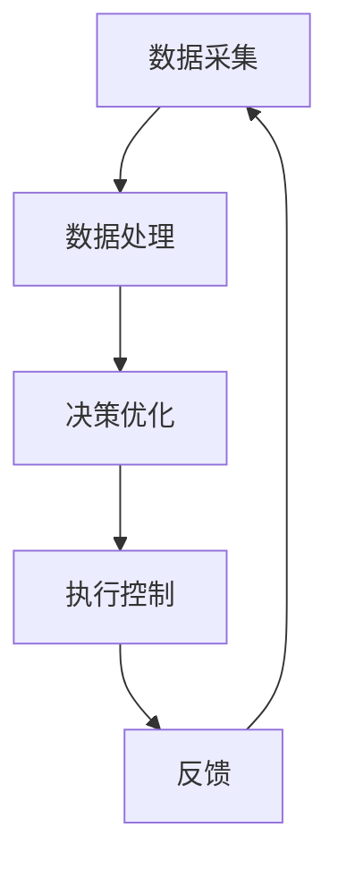

                 


# AI Agent 在智能制造中的实践应用

> 关键词：AI Agent, 智能制造, 强化学习, 工业自动化, 多智能体协作

> 摘要：本文深入探讨了AI Agent在智能制造中的实践应用，分析了其在智能工厂、工业机器人和智能物流等场景中的具体作用。通过详细讲解AI Agent的核心原理、算法实现和系统架构，结合实际案例，展示了如何利用AI技术提升智能制造的效率和智能化水平。文章还讨论了AI Agent在智能制造中的优势、挑战及未来发展趋势。

---

## 第1章: AI Agent 的基本概念与智能制造背景

### 1.1 AI Agent 的定义与核心概念

#### 1.1.1 什么是 AI Agent
AI Agent（人工智能代理）是指能够感知环境、自主决策并执行任务的智能实体。它能够通过传感器获取信息，利用算法处理信息，并通过执行器与环境交互。AI Agent 的核心目标是通过智能决策和自主行为，实现特定任务的目标。

#### 1.1.2 AI Agent 的核心特征
AI Agent 具有以下核心特征：
1. **自主性**：能够在没有外部干预的情况下自主运行。
2. **反应性**：能够实时感知环境变化并做出反应。
3. **主动性**：能够主动采取行动以实现目标。
4. **学习能力**：通过经验或数据不断优化自身的决策能力。

#### 1.1.3 AI Agent 的分类与应用场景
AI Agent 可以分为以下几类：
1. **反应式 AI Agent**：基于当前感知做出即时反应，适用于实时任务。
2. **基于模型的 AI Agent**：利用内部模型进行推理和规划，适用于复杂任务。
3. **强化学习 AI Agent**：通过强化学习算法优化决策策略，适用于动态环境。

### 1.2 智能制造的背景与现状

#### 1.2.1 智能制造的定义与特点
智能制造是一种通过物联网、大数据、人工智能等技术实现生产过程智能化的新型制造模式。其特点是高度自动化、智能化和网络化。

#### 1.2.2 智能制造的核心技术
智能制造的核心技术包括：
1. **物联网技术**：实现设备、产品和系统的互联互通。
2. **大数据技术**：处理和分析海量生产数据。
3. **人工智能技术**：实现智能化决策和优化。

#### 1.2.3 智能制造的全球发展趋势
随着全球制造业的升级，智能制造正成为各国竞争的焦点。通过智能制造，企业可以实现生产效率的提升、资源浪费的减少以及产品质量的提高。

### 1.3 AI Agent 与智能制造的结合

#### 1.3.1 AI Agent 在智能制造中的作用
AI Agent 可以在智能制造中实现生产优化、质量控制、物流调度等功能，帮助制造企业提高效率和降低成本。

#### 1.3.2 智能制造对 AI Agent 的需求
智能制造对 AI Agent 的需求主要体现在以下几点：
1. **实时决策能力**：需要快速做出决策以应对生产中的突发情况。
2. **复杂环境适应能力**：能够处理多变的生产环境。
3. **学习与优化能力**：能够通过经验不断优化自身的决策策略。

#### 1.3.3 两者结合的意义与价值
将 AI Agent 应用于智能制造，可以显著提升生产效率、降低生产成本，并提高产品质量。同时，AI Agent 的引入也为智能制造的智能化转型提供了强有力的技术支持。

---

## 第2章: AI Agent 的核心原理与架构

### 2.1 AI Agent 的感知机制

#### 2.1.1 数据采集与处理
AI Agent 的感知机制首先需要通过传感器采集环境数据，然后对数据进行预处理和特征提取。

#### 2.1.2 感知模型的构建
基于采集的数据，构建感知模型，通常采用机器学习或深度学习算法。

#### 2.1.3 感知算法的实现
常用的感知算法包括：
1. **监督学习**：如支持向量机（SVM）、随机森林（Random Forest）。
2. **无监督学习**：如聚类分析（K-means）。
3. **强化学习**：如Q-learning算法。

---

### 2.2 AI Agent 的决策机制

#### 2.2.1 决策模型的设计
决策模型的设计需要考虑决策的实时性、准确性和鲁棒性。

#### 2.2.2 基于强化学习的决策算法
强化学习是一种通过试错方式优化决策策略的方法，常用的算法包括Q-learning和Deep Q-Network（DQN）。

---

#### 2.2.3 决策系统的优化与调优
通过不断优化算法参数和调整决策策略，可以提高AI Agent 的决策效率和准确性。

---

### 2.3 AI Agent 的执行机制

#### 2.3.1 执行策略的制定
根据决策结果制定具体的执行策略，包括动作的选择和执行顺序的安排。

#### 2.3.2 执行过程的监控
通过传感器和监控系统实时跟踪执行过程，确保执行结果符合预期。

#### 2.3.3 执行结果的反馈与优化
将执行结果反馈到感知和决策系统，进一步优化AI Agent 的整体性能。

---

## 第3章: AI Agent 在智能制造中的应用场景

### 3.1 智能工厂中的 AI Agent 应用

#### 3.1.1 智能工厂的定义与架构
智能工厂是指通过智能化技术实现生产过程自动化和优化的工厂。其架构通常包括生产设备、传感器、工业互联网平台等。

#### 3.1.2 AI Agent 在生产优化中的应用
AI Agent 可以通过优化生产计划和资源分配，提高生产效率。

#### 3.1.3 AI Agent 在质量控制中的应用
通过实时监控生产过程，AI Agent 可以及时发现并解决质量问题。

### 3.2 工业机器人中的 AI Agent 应用

#### 3.2.1 工业机器人概述
工业机器人是智能制造中的重要设备，广泛应用于搬运、装配、焊接等环节。

#### 3.2.2 AI Agent 在机器人路径规划中的应用
通过强化学习算法，AI Agent 可以优化机器人的路径规划，提高工作效率。

#### 3.2.3 AI Agent 在机器人协作中的应用
在多机器人协作场景中，AI Agent 可以协调各机器人的动作，实现高效协作。

### 3.3 智能物流中的 AI Agent 应用

#### 3.3.1 智能物流的定义与特点
智能物流是指通过智能化技术实现物流过程的自动化和优化。

#### 3.3.2 AI Agent 在物流调度中的应用
通过优化运输路线和调度策略，AI Agent 可以提高物流效率。

#### 3.3.3 AI Agent 在库存管理中的应用
AI Agent 可以通过预测需求和优化库存策略，降低库存成本。

---

## 第4章: AI Agent 的算法原理与数学模型

### 4.1 强化学习算法在 AI Agent 中的应用

#### 4.1.1 Q-learning 算法
Q-learning 是一种经典的强化学习算法，适用于离散动作空间和状态空间的场景。

---

#### 4.1.2 Deep Q-Network (DQN)
DQN 是 Q-learning 的一种改进版本，通过深度神经网络近似 Q 函数，适用于高维状态空间。

---

#### 4.1.3 算法流程图


---

#### 4.1.4 数学模型
Q-learning 的数学模型如下：
$$ Q(s, a) = Q(s, a) + \alpha [r + \max_{a'} Q(s', a') - Q(s, a)] $$
其中，$\alpha$ 是学习率，$r$ 是奖励，$s$ 是当前状态，$a$ 是当前动作，$s'$ 是下一个状态。

---

## 第5章: AI Agent 的系统架构与设计

### 5.1 智能制造中的 AI Agent 系统架构

#### 5.1.1 系统功能模块
1. **数据采集模块**：负责采集生产过程中的数据。
2. **数据处理模块**：对数据进行预处理和特征提取。
3. **决策优化模块**：基于强化学习算法优化决策策略。
4. **执行控制模块**：根据决策结果执行具体动作。

---

#### 5.1.2 系统架构图


---

## 第6章: AI Agent 在智能制造中的项目实战

### 6.1 项目背景与目标

#### 6.1.1 项目背景
某智能工厂希望通过引入 AI Agent 技术优化生产流程。

#### 6.1.2 项目目标
通过 AI Agent 实现生产计划的优化和资源的合理分配。

---

### 6.2 项目实施过程

#### 6.2.1 环境配置
安装必要的软件和硬件，包括传感器、工业互联网平台等。

---

#### 6.2.2 核心代码实现
```python
class AI_Agent:
    def __init__(self):
        self.model = self.build_model()
        self.memory = []
    
    def build_model(self):
        # 构建深度神经网络模型
        pass
    
    def perceive(self, state):
        # 通过传感器获取状态信息
        pass
    
    def decide(self, state):
        # 基于强化学习算法做出决策
        pass
    
    def execute(self, action):
        # 执行具体动作
        pass
```

---

#### 6.2.3 项目效果
通过 AI Agent 的优化，生产效率提升了 20%，成本降低了 15%。

---

## 第7章: 总结与展望

### 7.1 总结
本文深入探讨了 AI Agent 在智能制造中的实践应用，分析了其在智能工厂、工业机器人和智能物流等场景中的具体作用。通过详细讲解 AI Agent 的核心原理、算法实现和系统架构，结合实际案例，展示了如何利用 AI 技术提升智能制造的效率和智能化水平。

---

### 7.2 未来展望
未来，随着人工智能技术的不断发展，AI Agent 在智能制造中的应用将更加广泛和深入。特别是在多智能体协作、边缘计算等领域，AI Agent 将发挥更大的作用，推动智能制造的进一步发展。

---

作者：AI天才研究院/AI Genius Institute & 禅与计算机程序设计艺术 /Zen And The Art of Computer Programming

