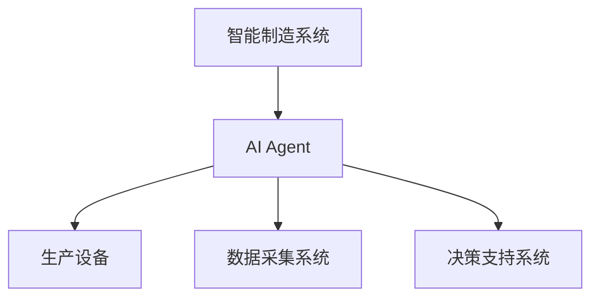
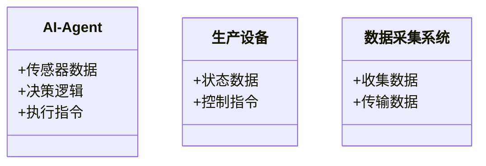
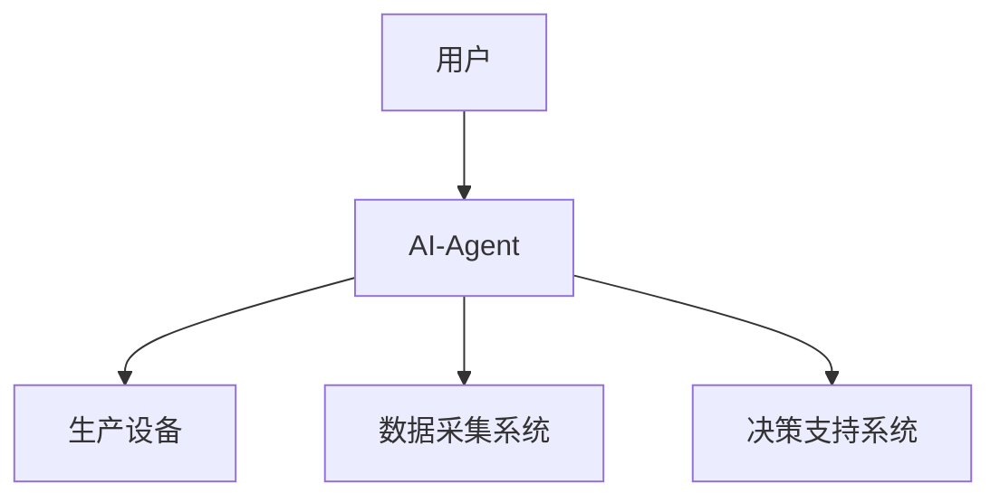
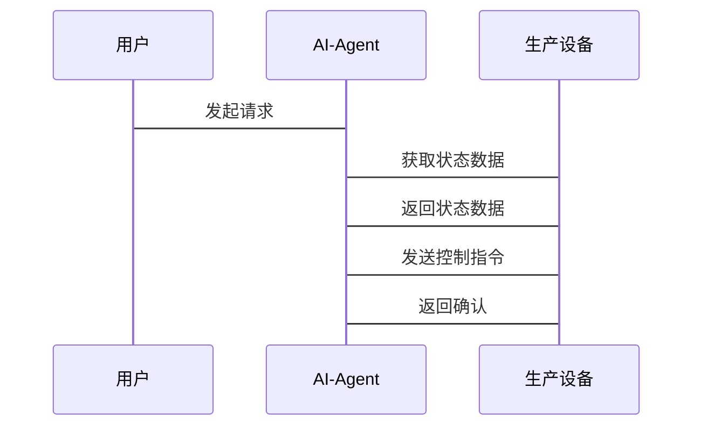

                 


# AI Agent在智能制造中的实践案例

> 关键词：人工智能、智能制造、AI Agent、算法原理、系统架构、项目实战

> 摘要：本文深入探讨了AI Agent在智能制造中的应用，从背景介绍到核心概念，再到算法原理、系统架构设计和项目实战，结合实际案例分析，全面解析了AI Agent在智能制造中的实践价值和未来发展。

---

## 第1章: AI Agent与智能制造的背景介绍

### 1.1 智能制造的定义与特点

#### 1.1.1 制造业的数字化与智能化转型
制造业正经历从传统生产模式向智能化、数字化转型的变革。通过引入AI、大数据和物联网等技术，企业能够实现生产过程的智能化管理，提高效率和产品质量。

#### 1.1.2 智能制造的核心特征
- **自动化**：生产设备能够自动运行和调整。
- **数据驱动**：基于实时数据进行决策和优化。
- **智能化**：具备自主学习和问题解决能力。

#### 1.1.3 智能制造的实现路径
- **设备智能化**：引入智能传感器和自动化设备。
- **数据集成化**：构建统一的数据平台。
- **系统协同化**：实现生产、管理、决策的协同。

### 1.2 AI Agent的基本概念

#### 1.2.1 什么是AI Agent
AI Agent（智能体）是能够感知环境并采取行动以实现目标的实体。它可以是一个软件程序、机器人或其他智能系统。

#### 1.2.2 AI Agent的核心属性
- **感知能力**：通过传感器或数据输入感知环境。
- **决策能力**：基于感知信息做出决策。
- **行动能力**：执行决策以影响环境。

#### 1.2.3 AI Agent的分类与应用场景
| 分类         | 描述                         | 应用场景                       |
|--------------|------------------------------|--------------------------------|
| 反应式AI Agent | 基于当前感知做出反应           | 自动化生产设备监控             |
| 交互式AI Agent | 与人类交互并执行任务         | 智能客服、工业机器人           |
| 学习型AI Agent | 能够通过学习改进性能         | 智能推荐系统、预测性维护       |

### 1.3 AI Agent与智能制造的结合

#### 1.3.1 智能制造中AI Agent的角色
AI Agent在智能制造中充当“智能大脑”，负责数据处理、决策优化和系统控制。

#### 1.3.2 AI Agent在智能制造中的价值
- **提高效率**：通过自动化和智能化减少人工干预。
- **降低成本**：优化生产流程，降低资源浪费。
- **增强灵活性**：快速适应生产需求变化。

#### 1.3.3 智能制造与AI Agent的未来趋势
随着AI技术的进步，AI Agent将在智能制造中扮演越来越重要的角色，推动制造业向更高效、更智能的方向发展。

---

## 第2章: AI Agent与智能制造的核心概念

### 2.1 AI Agent的核心原理

#### 2.1.1 AI Agent的感知与决策机制
AI Agent通过传感器或数据源获取环境信息，利用算法进行分析和推理，最终做出决策。

#### 2.1.2 AI Agent的学习与推理能力
基于机器学习算法，AI Agent能够从数据中学习模式，并利用推理能力解决复杂问题。

#### 2.1.3 AI Agent的自适应与优化
通过反馈机制和强化学习，AI Agent能够不断优化自身的决策和行动策略。

### 2.2 智能制造中的关键概念

#### 2.2.1 智能工厂的定义
智能工厂是通过物联网、大数据和人工智能技术实现智能化生产、监控和管理的工厂。

#### 2.2.2 智能生产流程的特点
- **数据驱动**：基于实时数据进行决策。
- **自动化**：生产设备自动运行和调整。
- **协同化**：系统各部分协同工作，确保生产流程的顺畅。

#### 2.2.3 智能设备与物联网
智能设备通过物联网技术实现设备间的互联，数据实时传输和共享，为AI Agent提供决策依据。

### 2.3 AI Agent与智能制造的结合模型

#### 2.3.1 AI Agent在智能制造中的实体关系图


#### 2.3.2 AI Agent与智能制造的核心要素对比表
| 核心要素 | AI Agent | 智能制造 |
|----------|-----------|----------|
| 输入     | 数据流     | 生产数据 |
| 输出     | 行为指令   | 生产优化 |
| 目标     | 提高效率   | 降低成本 |

---

## 第3章: AI Agent的算法原理与实现

### 3.1 AI Agent的核心算法

#### 3.1.1 强化学习算法
强化学习是一种通过试错机制优化决策的算法。AI Agent通过与环境的交互，不断优化自身的策略。

$$
Q(s, a) = r + \gamma \max Q(s', a')
$$

#### 3.1.2 监督学习算法
监督学习通过训练数据，预测目标变量的值，常用于分类和回归问题。

#### 3.1.3 聚类算法
聚类算法用于将相似的数据点分组，常用于异常检测和市场细分。

### 3.2 AI Agent的算法实现

#### 3.2.1 强化学习的实现步骤
1. 初始化环境和状态。
2. 选择动作并执行。
3. 获取奖励并更新策略。
4. 重复步骤，优化模型。

#### 3.2.2 Python代码实现
```python
import numpy as np

# 初始化环境
env = Environment()
state = env.reset()

# 加强学习算法实现
def agent_policy(state):
    return np.random.choice(env.actions)

while True:
    action = agent_policy(state)
    next_state, reward, done = env.step(action)
    if done:
        break
    state = next_state
```

---

## 第4章: 系统分析与架构设计方案

### 4.1 问题场景介绍
智能制造系统需要实时监控和优化生产流程，AI Agent在其中起到关键作用。

### 4.2 系统功能设计

#### 4.2.1 领域模型设计


#### 4.2.2 系统架构设计


### 4.3 系统接口设计

#### 4.3.1 AI Agent与生产设备的接口
- 数据输入接口：接收设备状态数据。
- 指令输出接口：发送控制指令。

#### 4.3.2 AI Agent与数据采集系统的接口
- 数据获取接口：获取实时数据。
- 数据存储接口：存储历史数据。

### 4.4 系统交互设计

#### 4.4.1 生产设备与AI Agent的交互流程


---

## 第5章: 项目实战

### 5.1 环境安装

#### 5.1.1 安装Python
```bash
python --version
pip install numpy matplotlib
```

#### 5.1.2 安装机器学习库
```bash
pip install scikit-learn tensorflow
```

### 5.2 系统核心实现

#### 5.2.1 AI Agent代码实现
```python
import numpy as np
from sklearn import tree

# 数据集
X = np.array([[2, 0.5], [2.5, 0.7], [3, 0.6], [3.5, 0.8]])
y = np.array([0, 1, 0, 1])

# 训练决策树模型
model = tree.DecisionTreeClassifier()
model.fit(X, y)

# 预测新数据
new_data = np.array([[2.8, 0.7]])
print(model.predict(new_data))
```

#### 5.2.2 生产设备模拟
```python
class Equipment:
    def __init__(self):
        self.status = "idle"

    def get_status(self):
        return self.status

    def set_status(self, status):
        self.status = status

equipment = Equipment()
print(equipment.get_status())
equipment.set_status("running")
print(equipment.get_status())
```

### 5.3 案例分析与总结

#### 5.3.1 案例分析
通过AI Agent优化生产流程，实现设备状态实时监控和故障预测，显著提高了生产效率。

#### 5.3.2 总结
AI Agent在智能制造中的应用前景广阔，能够有效提升生产效率和产品质量。

---

## 第6章: 总结与展望

### 6.1 全文总结
本文详细探讨了AI Agent在智能制造中的应用，从理论到实践，全面解析了其价值和意义。

### 6.2 未来展望
随着AI技术的不断进步，AI Agent在智能制造中的应用将更加广泛，推动制造业向更智能化的方向发展。

---

## 作者：AI天才研究院/AI Genius Institute & 禅与计算机程序设计艺术 /Zen And The Art of Computer Programming

