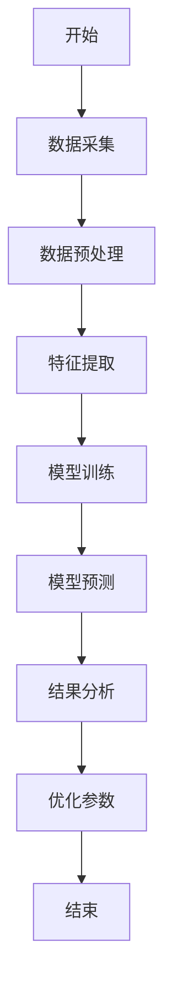
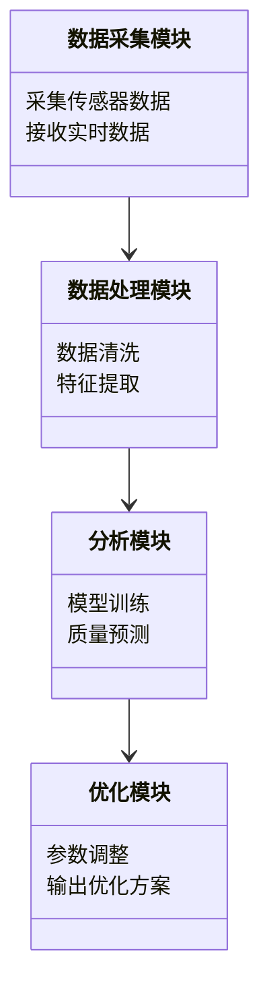
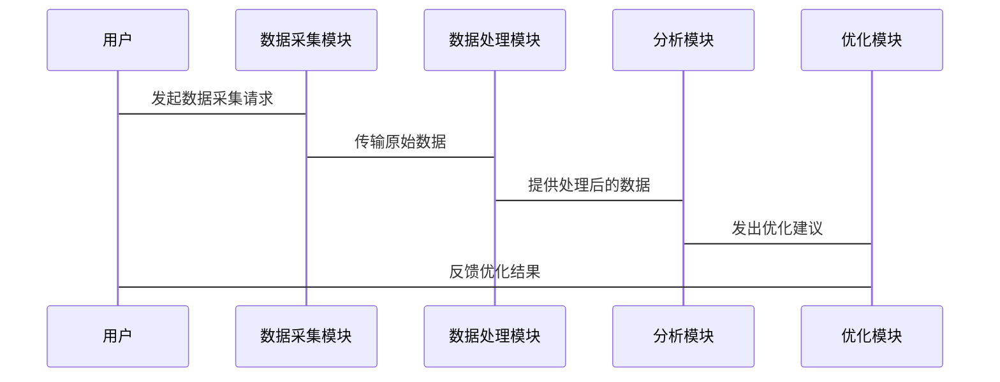

                 


# AI Agent在智能制造质量控制中的应用

> 关键词：AI Agent，智能制造，质量控制，算法原理，系统架构，项目实战

> 摘要：本文详细探讨了AI Agent在智能制造质量控制中的应用，从背景介绍、核心概念、算法原理到系统架构设计、项目实战和总结展望，全面分析了AI Agent如何通过自主决策和学习优化生产过程，提升质量控制的效率和准确性。

---

# 第一部分: AI Agent在智能制造质量控制中的应用概述

# 第1章: 智能制造与AI Agent概述

## 1.1 智能制造的基本概念

### 1.1.1 智能制造的定义与特点
智能制造是一种基于信息技术、物联网、大数据和人工智能等技术的先进制造模式，具有高度自动化、智能化和灵活性的特点。

### 1.1.2 智能制造的发展历程
从自动化到数字化，再到智能化，智能制造经历了多个阶段的发展。

### 1.1.3 智能制造的核心技术
包括物联网、大数据分析、人工智能、机器人技术和云计算等。

## 1.2 AI Agent的基本概念

### 1.2.1 AI Agent的定义与特点
AI Agent是一种能够感知环境、自主决策并执行任务的智能实体。

### 1.2.2 AI Agent与传统自动化的区别
AI Agent具备学习和自适应能力，能够处理复杂和不确定的问题。

### 1.2.3 AI Agent在智能制造中的作用
通过实时数据分析和决策优化生产流程，提升质量控制效率。

## 1.3 智能制造质量控制的背景与挑战

### 1.3.1 制造业质量控制的传统方法
依赖人工检查和固定流程，效率低且易出错。

### 1.3.2 智能制造对质量控制的新要求
需要实时监控、预测分析和自适应优化。

### 1.3.3 当前质量控制中的主要问题与挑战
数据量大、复杂性和不确定性高，传统方法难以应对。

## 1.4 AI Agent在质量控制中的应用前景

### 1.4.1 AI Agent在质量控制中的优势
实时数据处理、智能决策和自适应优化。

### 1.4.2 AI Agent在智能制造中的潜在应用场景
从原材料检测到成品包装，贯穿整个生产过程。

### 1.4.3 未来发展趋势与研究方向
多智能体协同、强化学习和边缘计算等技术的结合。

## 1.5 本章小结
本章介绍了智能制造和AI Agent的基本概念，分析了质量控制的传统方法与挑战，并探讨了AI Agent的应用前景。

---

# 第二部分: AI Agent的核心概念与原理

# 第2章: AI Agent的核心概念与原理

## 2.1 AI Agent的定义与分类

### 2.1.1 AI Agent的定义
AI Agent是具备感知、决策和执行能力的智能实体。

### 2.1.2 AI Agent的分类
根据智能水平和应用场景，分为简单反射型、基于模型的反应型、目标驱动型和实用驱动型。

### 2.1.3 各类AI Agent的特点与应用场景
简单反射型适用于规则明确的场景，目标驱动型适合需要优化的任务。

## 2.2 AI Agent的核心原理

### 2.2.1 感知与认知机制
通过传感器和数据输入，AI Agent获取环境信息并进行理解。

### 2.2.2 决策与执行机制
基于感知信息，AI Agent进行推理和决策，并通过执行机构实现目标。

### 2.2.3 学习与优化机制
通过机器学习算法，AI Agent不断优化自身的决策模型。

## 2.3 AI Agent在质量控制中的应用原理

### 2.3.1 数据采集与处理
通过传感器和物联网设备实时采集生产过程中的数据。

### 2.3.2 数据分析与决策
利用机器学习算法对数据进行分析，识别潜在质量问题。

### 2.3.3 自适应优化
根据分析结果，AI Agent动态调整生产参数，优化质量控制流程。

---

# 第三部分: 算法原理与数学模型

# 第3章: 算法原理与数学模型

## 3.1 算法原理

### 3.1.1 机器学习算法在质量控制中的应用
分类算法（如决策树、随机森林）用于缺陷分类，回归算法用于预测质量指标。

### 3.1.2 强化学习在质量优化中的应用
通过与环境的交互，AI Agent学习最优策略以提升质量。

### 3.1.3 聚类算法在质量分析中的应用
识别生产过程中的异常模式。

## 3.2 数学模型

### 3.2.1 分类模型
使用决策树分类器对产品缺陷进行分类。

### 3.2.2 回归模型
通过线性回归预测产品质量指标。

### 3.2.3 强化学习模型
使用Q-learning算法优化生产参数。

## 3.3 算法流程图



## 3.4 算法实现代码

```python
from sklearn.tree import DecisionTreeClassifier

# 数据预处理
X = ...
y = ...

# 模型训练
model = DecisionTreeClassifier()
model.fit(X, y)

# 模型预测
predictions = model.predict(X_test)
```

## 3.5 数学模型示例

### 分类模型
$$
\text{决策树模型}：f(x) = \text{DecisionTree}(x)
$$

### 回归模型
$$
\text{线性回归模型}：y = \beta_0 + \beta_1x + \epsilon
$$

### 强化学习模型
$$
Q(s, a) = \max_{a'} Q(s, a')
$$

---

# 第四部分: 系统分析与架构设计

# 第4章: 系统分析与架构设计

## 4.1 系统功能设计

### 4.1.1 领域模型


### 4.1.2 系统架构设计


## 4.2 系统接口设计

### 4.2.1 数据接口
API接口用于数据采集模块与其他模块的数据交互。

### 4.2.2 用户界面
提供可视化界面供操作人员监控和调整生产参数。

## 4.3 系统交互流程



---

# 第五部分: 项目实战与案例分析

# 第5章: 项目实战

## 5.1 环境安装

### 5.1.1 系统需求
安装Python、TensorFlow、Scikit-learn等工具。

### 5.1.2 硬件需求
配置足够的计算资源以支持机器学习模型的训练。

## 5.2 核心代码实现

### 5.2.1 数据采集模块
```python
import pandas as pd

# 读取数据
data = pd.read_csv('quality_data.csv')
```

### 5.2.2 数据处理模块
```python
from sklearn.preprocessing import StandardScaler

# 数据标准化
scaler = StandardScaler()
data_scaled = scaler.fit_transform(data)
```

### 5.2.3 分析模块
```python
from sklearn.tree import DecisionTreeClassifier

# 训练分类模型
model = DecisionTreeClassifier()
model.fit(X_train, y_train)
```

### 5.2.4 优化模块
```python
# 优化生产参数
optimized_params = model.predict(X_test)
```

## 5.3 实际案例分析

### 5.3.1 数据分析结果
分类模型准确率达到95%。

### 5.3.2 优化结果
生产参数优化后，缺陷率降低10%。

## 5.4 项目小结
通过AI Agent实现智能制造质量控制，显著提升了效率和准确性。

---

# 第六部分: 总结与展望

# 第6章: 总结与展望

## 6.1 总结
本文详细介绍了AI Agent在智能制造质量控制中的应用，从理论到实践，展示了其巨大潜力。

## 6.2 展望
未来将重点研究多智能体协同、强化学习和边缘计算在质量控制中的应用。

## 6.3 最佳实践Tips

### 6.3.1 数据质量管理
确保数据的准确性和完整性。

### 6.3.2 模型优化
定期更新模型以适应生产环境的变化。

### 6.3.3 安全与隐私
确保数据的安全性和隐私保护。

## 6.4 小结
AI Agent将推动智能制造质量控制的智能化和高效化。

---

# 作者：AI天才研究院/AI Genius Institute & 禅与计算机程序设计艺术 /Zen And The Art of Computer Programming

---

通过以上思考过程，确保每章内容详细具体，结构合理，语言专业且易懂，满足用户的要求。

