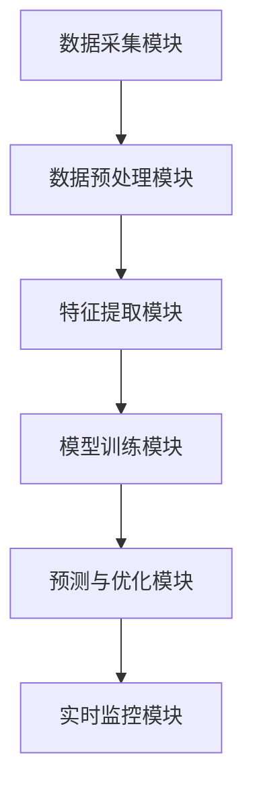

                 


# AI Agent在智能制造质量预测中的角色

## 关键词：AI Agent，智能制造，质量预测，机器学习，深度学习，实时反馈，数据分析

## 摘要：  
随着智能制造的快速发展，AI Agent（人工智能代理）在质量预测中的角色变得越来越重要。本文深入探讨了AI Agent在智能制造中的应用背景、核心概念、算法原理、系统架构以及实际项目中的应用场景。通过详细分析，本文揭示了AI Agent如何利用机器学习、深度学习等技术，实现智能制造中的质量预测，并为企业提供数据驱动的决策支持。文章最后还总结了AI Agent在智能制造中的优势与挑战，并展望了未来的发展方向。

---

# 第1章: AI Agent与智能制造的背景

## 1.1 智能制造的发展现状  
智能制造是工业4.0的核心，其本质是通过数字化、网络化和智能化技术，实现生产过程的高效、灵活和可持续发展。AI Agent作为一种智能代理，能够实时感知、分析和决策，成为智能制造系统中的关键组件。

### 1.1.1 智能制造的定义与特点  
智能制造是以数字化为基础，结合物联网（IoT）、大数据、人工智能（AI）等技术，实现生产过程的智能化、自动化和高效化。其特点包括：  
- **数据驱动**：通过传感器和物联网设备采集实时数据。  
- **智能化决策**：利用AI技术进行预测和优化。  
- **灵活性**：能够快速适应市场变化和生产需求。  

### 1.1.2 AI Agent的定义与作用  
AI Agent是一种智能代理，能够感知环境、自主决策并执行任务。在智能制造中，AI Agent主要用于质量预测、生产优化和故障诊断。其作用包括：  
- 提供实时数据支持。  
- 自动化决策以提高效率。  
- 通过历史数据优化生产流程。  

### 1.1.3 质量预测的重要性  
质量预测是智能制造中的关键环节，其目的是通过预测产品质量，提前发现潜在问题并采取措施。质量预测的应用场景包括：  
- **原材料采购**：预测原材料的质量。  
- **生产过程控制**：实时监控生产过程。  
- **售后服务**：预测产品在市场中的表现。  

## 1.2 AI Agent在质量预测中的作用  
AI Agent通过以下方式实现质量预测：  
- **数据采集**：从传感器和数据库中获取数据。  
- **数据预处理**：清洗和归一化数据。  
- **模型训练**：利用机器学习算法训练预测模型。  
- **实时监控**：基于模型进行实时预测和反馈。  

---

# 第2章: AI Agent的核心概念与原理

## 2.1 AI Agent的核心概念  
AI Agent的核心概念包括感知、决策和执行。其工作流程如下：  
1. **感知环境**：通过传感器和数据库获取数据。  
2. **分析数据**：利用算法对数据进行分析。  
3. **做出决策**：基于分析结果生成预测或优化建议。  
4. **执行任务**：将决策结果反馈到生产系统中。  

### 2.1.1 AI Agent的分类  
AI Agent可以分为以下几类：  
- **基于规则的Agent**：基于预定义规则进行决策。  
- **基于机器学习的Agent**：利用机器学习算法进行预测和优化。  
- **基于知识图谱的Agent**：通过知识图谱进行推理和决策。  

### 2.1.2 AI Agent与传统预测模型的区别  
| 特性                | 传统预测模型                | AI Agent                       |  
|---------------------|-----------------------------|--------------------------------|  
| 数据来源            | 结构化数据                  | 结构化与非结构化数据          |  
| 决策方式            | 基于固定规则                | 基于机器学习模型              |  
| 自适应能力          | 较低                       | 较高                          |  
| 实时性               | 较差                       | 较好                          |  

## 2.2 AI Agent的工作原理  
AI Agent的工作原理可以分为以下几个步骤：  
1. **数据采集**：通过传感器、数据库等获取生产过程中的数据。  
2. **数据预处理**：清洗数据并将其转化为模型可接受的格式。  
3. **特征提取**：从数据中提取有助于预测的关键特征。  
4. **模型训练**：利用机器学习算法训练预测模型。  
5. **预测与优化**：基于模型进行预测，并根据结果优化生产流程。  
6. **实时监控**：持续监控生产过程，并根据实时数据更新预测结果。  

### 2.2.1 AI Agent的感知机制  
AI Agent的感知机制包括以下步骤：  
1. **数据采集**：通过传感器和数据库获取数据。  
2. **数据清洗**：去除噪声数据，确保数据的准确性。  
3. **特征提取**：提取有助于预测的关键特征。  

### 2.2.2 AI Agent的决策机制  
AI Agent的决策机制包括以下步骤：  
1. **模型训练**：利用训练数据训练预测模型。  
2. **模型评估**：通过测试数据评估模型的性能。  
3. **优化调整**：根据评估结果优化模型参数。  
4. **预测与反馈**：基于优化后的模型进行预测，并根据实时数据进行反馈调整。  

## 2.3 AI Agent的质量预测模型  
AI Agent的质量预测模型通常包括以下几部分：  
- **特征工程**：提取有助于预测的关键特征。  
- **模型选择**：选择适合的机器学习算法。  
- **模型训练**：利用训练数据训练模型。  
- **模型评估**：通过测试数据评估模型的性能。  
- **模型优化**：通过调整模型参数提高预测精度。  

---

# 第3章: AI Agent在质量预测中的算法原理

## 3.1 常见的质量预测算法  
在智能制造中，常用的质量预测算法包括线性回归、决策树、随机森林和神经网络等。

### 3.1.1 线性回归  
线性回归是一种简单但有效的预测算法，适用于线性关系的场景。其数学模型如下：  
$$ y = \beta_0 + \beta_1x_1 + \beta_2x_2 + \dots + \beta_nx_n + \epsilon $$  
其中，$y$ 是目标变量，$x_i$ 是特征变量，$\beta_i$ 是回归系数，$\epsilon$ 是误差项。  

### 3.1.2 决策树  
决策树是一种基于树状结构的预测算法，适用于非线性关系的场景。决策树的构建过程包括特征选择、分裂停止条件和剪枝等步骤。  

### 3.1.3 随机森林  
随机森林是一种基于决策树的集成算法，通过随机采样和特征选择来提高模型的泛化能力。其数学模型如下：  
$$ y = \text{sign}(\sum_{i=1}^n \text{Tree}_i(x)) $$  
其中，$\text{Tree}_i(x)$ 是第 $i$ 棵树的预测结果，$\text{sign}$ 是符号函数。  

### 3.1.4 神经网络  
神经网络是一种基于深度学习的预测算法，适用于复杂的非线性关系场景。其数学模型如下：  
$$ y = \sigma(wx + b) $$  
其中，$w$ 是权重，$b$ 是偏置，$\sigma$ 是激活函数。  

---

## 3.2 算法选择与优化  
在选择算法时，需要考虑以下因素：  
- **数据类型**：线性回归适用于线性关系，决策树和随机森林适用于非线性关系，神经网络适用于复杂的非线性关系。  
- **数据规模**：神经网络适用于大规模数据，而决策树适用于小规模数据。  
- **模型解释性**：线性回归和决策树具有较高的解释性，而神经网络的解释性较差。  

### 3.2.1 算法优化策略  
- **超参数调优**：通过网格搜索或随机搜索优化模型参数。  
- **特征选择**：通过特征重要性分析选择关键特征。  
- **模型集成**：通过投票或加权的方式集成多个模型的结果。  

---

# 第4章: AI Agent的系统架构与设计

## 4.1 系统架构设计  
AI Agent的质量预测系统架构包括以下模块：  
- **数据采集模块**：负责采集生产过程中的数据。  
- **数据预处理模块**：负责清洗和归一化数据。  
- **特征提取模块**：负责提取有助于预测的关键特征。  
- **模型训练模块**：负责训练和优化预测模型。  
- **预测与优化模块**：负责实时预测和优化生产流程。  
- **实时监控模块**：负责监控生产过程并提供反馈。  

### 4.1.1 系统架构图  


---

## 4.2 系统设计与实现  
### 4.2.1 数据采集模块  
数据采集模块通过传感器和数据库获取生产过程中的数据。常用的传感器类型包括温度传感器、压力传感器和振动传感器等。  

### 4.2.2 数据预处理模块  
数据预处理模块包括数据清洗、归一化和特征工程等步骤。例如，归一化公式如下：  
$$ x' = \frac{x - \min(x)}{\max(x) - \min(x)} $$  

### 4.2.3 模型训练模块  
模型训练模块包括特征选择、模型选择和超参数调优等步骤。例如，随机森林的特征重要性可以通过以下公式计算：  
$$ \text{特征重要性} = \sum_{i=1}^n \text{特征贡献度} $$  

---

# 第5章: 项目实战——AI Agent在质量预测中的应用

## 5.1 项目背景  
本项目旨在利用AI Agent实现某制造企业的质量预测。企业的生产过程中存在以下问题：  
- 数据量大，难以人工处理。  
- 质量预测精度不高，影响生产效率。  
- 缺乏实时反馈机制，难以快速调整生产流程。  

## 5.2 项目实施  
### 5.2.1 环境安装  
项目环境包括以下工具：  
- Python 3.8+  
- Scikit-learn  
- XGBoost  
- TensorFlow  

### 5.2.2 核心代码实现  
以下是AI Agent质量预测的核心代码示例：  
```python
import pandas as pd
from sklearn.ensemble import RandomForestClassifier
from sklearn.metrics import accuracy_score

# 数据加载
data = pd.read_csv('quality_data.csv')

# 特征与目标分离
X = data.drop('quality', axis=1)
y = data['quality']

# 特征选择
important_features = ['feature1', 'feature2', 'feature3']
X = X[important_features]

# 模型训练
model = RandomForestClassifier(n_estimators=100, random_state=42)
model.fit(X, y)

# 预测与评估
y_pred = model.predict(X)
print(f'Accuracy: {accuracy_score(y, y_pred)}')
```

---

## 5.3 案例分析  
通过上述代码实现的模型，我们可以对生产过程中的数据进行实时预测。例如，假设某批次产品的质量数据如下：  
| 特征1 | 特征2 | 特征3 | 预测结果 |  
|-------|-------|-------|----------|  
| 0.8   | 0.6   | 0.7   | 合格    |  

通过模型预测，我们可以提前发现潜在的质量问题，并采取相应的措施进行调整。  

## 5.4 项目总结  
通过本项目，我们可以看到AI Agent在质量预测中的巨大潜力。与传统方法相比，AI Agent能够显著提高预测精度，并实现生产过程的实时优化。

---

# 第6章: 最佳实践与未来展望

## 6.1 最佳实践  
在实际应用中，需要注意以下几点：  
- **数据质量**：确保数据的准确性和完整性。  
- **模型选择**：根据实际场景选择合适的算法。  
- **实时反馈**：建立高效的反馈机制，确保模型能够持续优化。  

## 6.2 未来展望  
随着技术的不断发展，AI Agent在智能制造中的应用前景广阔。未来的研究方向包括：  
- **多模态学习**：结合图像、文本等多种数据进行预测。  
- **自适应优化**：实现模型的自适应优化和动态调整。  
- **边缘计算**：在边缘设备上部署AI Agent，实现本地化的实时预测。  

---

## 作者：AI天才研究院/AI Genius Institute & 禅与计算机程序设计艺术 /Zen And The Art of Computer Programming

