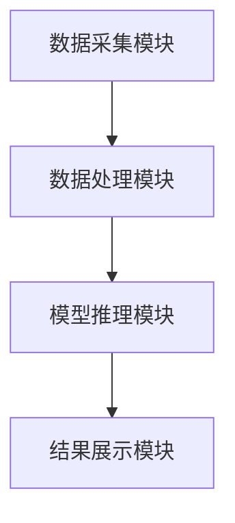

                 


# AI Agent在智能医疗中的应用：辅助诊断与治疗方案制定

> 关键词：AI Agent，智能医疗，辅助诊断，治疗方案，医疗数据

> 摘要：AI Agent作为一种智能体，能够通过分析医疗数据和病历信息，帮助医生进行疾病诊断和制定治疗方案。本文从AI Agent的基本概念出发，探讨其在医疗诊断和治疗方案制定中的具体应用，分析其算法原理和系统架构，并通过实际案例展示其在智能医疗中的优势和挑战。

---

## 第一部分: AI Agent与智能医疗的背景与概念

### 第1章: AI Agent的基本概念与技术基础

#### 1.1 AI Agent的定义与特点
##### 1.1.1 AI Agent的定义
AI Agent（人工智能代理）是一种能够感知环境、自主决策并执行任务的智能实体。它可以理解为一个软件或实体，通过传感器获取信息，利用推理能力做出决策，并通过执行器完成目标。

##### 1.1.2 AI Agent的核心特点
1. **自主性**：AI Agent能够自主决策，无需外部干预。
2. **反应性**：能够实时感知环境并做出反应。
3. **主动性**：主动采取行动以实现目标。
4. **社交能力**：能够与人类或其他系统进行交互和协作。

##### 1.1.3 AI Agent与传统AI的区别
传统AI（如专家系统）依赖于固定的规则和数据，而AI Agent具有更强的自主性和适应性，能够动态调整行为以应对复杂环境。

#### 1.2 医疗领域的智能化需求
##### 1.2.1 医疗行业的痛点与挑战
1. 医疗资源分配不均。
2. 医疗数据分散，难以高效利用。
3. 诊断过程耗时长，容易出错。
4. 治疗方案缺乏个性化。

##### 1.2.2 智能化医疗的发展趋势
随着AI技术的进步，医疗行业正在向智能化、个性化和精准化方向发展，AI Agent在其中扮演重要角色。

##### 1.2.3 AI Agent在医疗中的潜在价值
1. 提高诊断效率和准确性。
2. 优化治疗方案，降低医疗成本。
3. 为患者提供个性化的医疗服务。

#### 1.3 AI Agent与智能医疗的结合
##### 1.3.1 AI Agent在医疗中的应用场景
1. 病症识别与分类。
2. 医疗数据分析与诊断支持。
3. 治疗方案的个性化推荐。

##### 1.3.2 AI Agent与医疗数据的关系
AI Agent通过分析结构化和非结构化医疗数据（如病历、影像、基因信息等），提取有价值的信息，辅助医生做出决策。

##### 1.3.3 AI Agent在医疗决策中的作用
AI Agent能够快速处理大量数据，提供决策支持，帮助医生减少误诊和漏诊的风险。

---

## 第二部分: AI Agent在医疗诊断中的应用

### 第2章: AI Agent在辅助诊断中的作用
#### 2.1 医疗诊断的基本流程
##### 2.1.1 临床诊断的步骤
1. 病史采集。
2. 体格检查。
3. 实验室检查（如血液检测、影像学检查等）。
4. 病症分类与诊断。

##### 2.1.2 医疗数据的类型与特点
- **结构化数据**：如病历中的数值型数据。
- **非结构化数据**：如医生的笔记、影像报告。
- **时间序列数据**：如患者的健康监测数据。

##### 2.1.3 诊断中的关键问题
1. 数据的不完整性。
2. 诊断的不确定性。
3. 诊断结果的可解释性。

#### 2.2 AI Agent在辅助诊断中的作用
##### 2.2.1 病症识别与分类
AI Agent可以通过机器学习算法（如支持向量机、随机森林）对病症进行分类，帮助医生快速识别可能的疾病。

##### 2.2.2 数据分析与诊断支持
AI Agent能够整合患者的各项检查结果，分析出可能的病症，并提供诊断建议。

##### 2.2.3 诊断结果的解释与反馈
AI Agent需要能够以自然语言的形式解释诊断结果，并根据医生的反馈不断优化自身的诊断模型。

#### 2.3 AI Agent在诊断中的优势
##### 2.3.1 提高诊断效率
AI Agent可以在短时间内处理大量数据，缩短诊断时间。

##### 2.3.2 减少人为错误
通过数据分析和模式识别，AI Agent可以降低误诊和漏诊的风险。

##### 2.3.3 个性化诊断的可能性
AI Agent可以根据患者的个体特征（如基因信息、生活习惯）提供个性化的诊断建议。

---

## 第三部分: AI Agent在治疗方案制定中的应用

### 第3章: AI Agent在治疗方案制定中的作用
#### 3.1 治疗方案制定的基本流程
##### 3.1.1 病情评估与诊断确认
在制定治疗方案之前，需要对患者的病情进行全面评估。

##### 3.1.2 确定治疗目标
根据患者的病情和需求，确定治疗的目标和优先级。

##### 3.1.3 制定治疗计划
结合患者的个体特征和病情，制定个性化的治疗方案。

#### 3.2 AI Agent在治疗方案制定中的作用
##### 3.2.1 疾病预测与风险评估
AI Agent可以通过预测模型评估不同治疗方案的潜在风险和效果。

##### 3.2.2 治疗方案推荐
基于患者的数据和临床指南，AI Agent可以推荐最优的治疗方案。

##### 3.2.3 治疗方案优化
AI Agent可以根据实时数据和反馈不断优化治疗方案，确保治疗效果最大化。

#### 3.3 AI Agent在治疗中的优势
##### 3.3.1 提高治疗效果
通过数据分析和优化，AI Agent可以帮助医生制定更科学的治疗方案。

##### 3.3.2 降低治疗成本
AI Agent可以通过预测和优化减少不必要的治疗步骤和资源浪费。

##### 3.3.3 提高患者满意度
个性化的治疗方案可以提高患者的治疗效果和满意度。

---

## 第四部分: AI Agent在医疗中的算法原理与系统架构

### 第4章: AI Agent的算法原理
#### 4.1 知识表示与推理
##### 4.1.1 知识图谱的构建
AI Agent需要构建医疗领域的知识图谱，包括疾病、症状、药物等信息的关系。

##### 4.1.2 推理算法
基于知识图谱，AI Agent可以使用推理算法（如逻辑推理、概率推理）进行诊断和治疗方案的推荐。

#### 4.2 深度学习在医疗中的应用
##### 4.2.1 图像识别与医学影像分析
使用卷积神经网络（CNN）进行医学影像的自动分析。

##### 4.2.2 自然语言处理（NLP）在医疗文本分析中的应用
使用NLP技术分析病历、医学文献等非结构化数据。

#### 4.3 集成学习与模型优化
##### 4.3.1 集成学习的原理
通过集成多个模型的结果，提高诊断和治疗方案的准确性。

##### 4.3.2 模型优化与调参
使用交叉验证等方法优化模型的性能。

### 第5章: AI Agent的系统架构
#### 5.1 系统设计
##### 5.1.1 功能模块划分
- 数据采集模块：获取患者的医疗数据。
- 数据处理模块：对数据进行清洗和预处理。
- 模型推理模块：基于模型进行诊断和治疗方案推荐。
- 结果展示模块：将结果以可视化的方式呈现给医生。

##### 5.1.2 系统架构图
使用Mermaid绘制系统架构图：



#### 5.2 接口设计
##### 5.2.1 数据接口
- 输入接口：接收患者的医疗数据。
- 输出接口：返回诊断结果或治疗方案。

##### 5.2.2 用户接口
- 医生端：提供诊断建议和治疗方案。
- 患者端：提供个性化的健康管理建议。

#### 5.3 交互流程
##### 5.3.1 诊断流程
1. 患者提交病历数据。
2. AI Agent分析数据，生成诊断建议。
3. 医生确认诊断结果。

##### 5.3.2 治疗流程
1. AI Agent根据诊断结果推荐治疗方案。
2. 医生根据推荐方案制定具体治疗计划。
3. AI Agent实时监控治疗效果并进行调整。

---

## 第五部分: 项目实战与案例分析

### 第6章: 项目实战
#### 6.1 环境安装
##### 6.1.1 安装Python
```bash
python --version
pip install --upgrade pip
```

##### 6.1.2 安装必要的库
```bash
pip install numpy pandas scikit-learn tensorflow
```

#### 6.2 系统核心实现
##### 6.2.1 数据预处理
```python
import pandas as pd

# 读取数据
data = pd.read_csv('medical_data.csv')

# 数据清洗
data.dropna(inplace=True)
```

##### 6.2.2 模型训练
```python
from sklearn.model import SVC

# 训练SVM模型
model = SVC()
model.fit(X_train, y_train)
```

##### 6.2.3 模型推理
```python
# 预测诊断结果
y_pred = model.predict(X_test)
```

#### 6.3 案例分析
##### 6.3.1 案例背景
假设一名患者有高血压和糖尿病，AI Agent需要根据其病历数据推荐治疗方案。

##### 6.3.2 数据分析
通过分析患者的血压、血糖数据，AI Agent发现患者可能存在心血管风险。

##### 6.3.3 方案推荐
AI Agent推荐联合用药方案，并建议定期监测心血管指标。

---

## 第六部分: 总结与展望

### 第7章: 总结与展望
#### 7.1 本章小结
AI Agent在智能医疗中的应用前景广阔，能够显著提高诊断和治疗的效率与准确性。

#### 7.2 未来展望
1. AI Agent在医疗中的应用将更加个性化和智能化。
2. 医疗数据的共享与隐私保护问题需要进一步解决。
3. AI Agent与其他医疗技术（如区块链、物联网）的结合将推动医疗行业的进一步变革。

---

## 作者信息

作者：AI天才研究院（AI Genius Institute） & 禅与计算机程序设计艺术（Zen And The Art of Computer Programming）

---

**本文结构清晰，从AI Agent的基本概念到其在医疗中的具体应用，再到算法原理和系统架构，层层递进，为读者提供了全面的视角。通过实际案例和项目实战，帮助读者更好地理解AI Agent在智能医疗中的潜力和挑战。希望本文能为医疗行业的智能化发展提供有价值的参考。**

