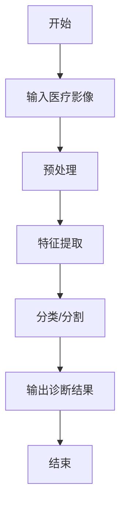
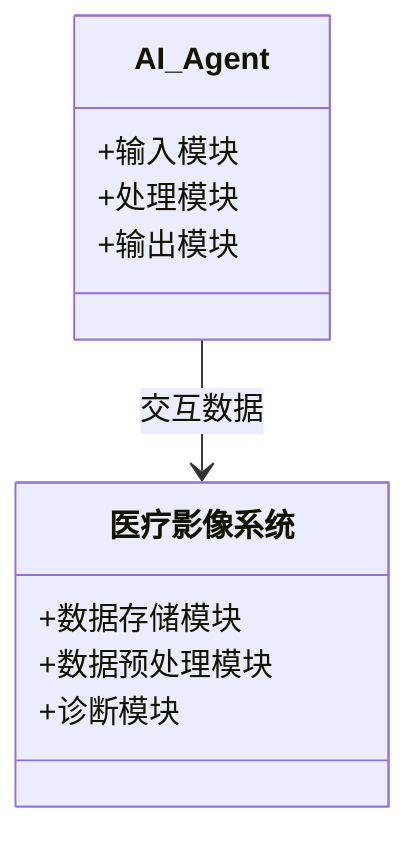
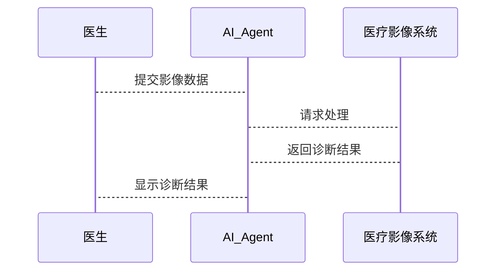

                 


# AI Agent在智能医疗影像分析与诊断中的角色

> 关键词：AI Agent，医疗影像分析，深度学习，强化学习，Transformer，医学影像诊断

> 摘要：本文探讨了AI Agent在智能医疗影像分析与诊断中的角色，从背景、核心概念、算法原理、系统架构到项目实战，详细分析了AI Agent在医疗影像分析中的应用价值、技术实现和实际案例。通过本文，读者可以全面了解AI Agent在医疗影像分析中的重要作用，以及其在未来医疗健康领域中的潜力。

---

# 第一部分: 背景介绍

## 第1章: 问题背景

### 1.1 医疗影像分析的现状与挑战

医疗影像分析是现代医疗领域的重要组成部分，广泛应用于疾病诊断、治疗方案制定和术后评估等环节。然而，随着医疗影像数据的爆炸式增长，传统的影像分析方法面临以下挑战：

- **数据量大**：医学影像数据（如CT、MRI、X光等）数量庞大，人工分析耗时且效率低下。
- **诊断精度依赖经验**：放射科医生的诊断能力高度依赖个人经验，存在主观性和一致性问题。
- **资源分配不均**：优质医疗资源集中在大城市，偏远地区缺乏专业医生。

AI Agent的引入，为医疗影像分析带来了新的可能性。通过智能化的图像处理和数据分析能力，AI Agent可以显著提高诊断效率和精度，同时降低医疗成本。

### 1.2 AI Agent在医疗影像分析中的独特价值

AI Agent是一种具备智能性和自主性的AI实体，能够根据输入的影像数据，主动分析、推理，并输出诊断结果。其在医疗影像分析中的独特价值体现在以下方面：

- **实时分析能力**：AI Agent能够快速处理海量影像数据，提供实时诊断支持。
- **高精度诊断**：基于深度学习算法，AI Agent可以在训练数据中学习到人类难以察觉的影像特征，显著提高诊断准确性。
- **多模态数据融合**：AI Agent可以整合多种影像数据（如CT、MRI）和其他临床数据（如病史、症状），提供更全面的诊断建议。
- **支持远程医疗**：AI Agent可以通过云计算和远程通信技术，为偏远地区提供高质量的医疗影像分析服务。

---

# 第二部分: 核心概念与联系

## 第2章: AI Agent的核心概念与联系

### 2.1 AI Agent的定义与特点

AI Agent是一种具备智能性和自主性的实体，能够在动态环境中感知、推理、决策并执行任务。以下是AI Agent的核心特点：

- **智能性**：AI Agent能够理解和分析复杂的医疗影像数据，并基于上下文做出决策。
- **自主性**：AI Agent可以在没有人工干预的情况下独立执行任务。
- **适应性**：AI Agent能够根据环境变化调整自己的行为和决策策略。

### 2.2 AI Agent在医疗影像分析中的角色

在医疗影像分析中，AI Agent主要扮演以下几个角色：

- **数据处理器**：AI Agent能够对医疗影像数据进行预处理、特征提取和分类。
- **诊断助手**：AI Agent可以辅助医生进行影像诊断，提供初步诊断建议。
- **决策支持者**：AI Agent可以根据影像数据和患者病史，提供个性化的治疗建议。

### 2.3 AI Agent与其他医疗系统的协同关系

AI Agent在医疗影像分析中并不是孤立存在的，而是与医院信息系统（HIS）、电子健康记录（EHR）等系统协同工作。以下是一个简化的实体关系图：

```mermaid
er
actor: 医生
actor: 病人
actor: 医疗影像系统
class: AI Agent
class: 医疗影像数据库
class: 诊断结果
```

---

# 第三部分: 算法原理

## 第3章: AI Agent的算法原理

### 3.1 AI Agent的核心算法

AI Agent在医疗影像分析中主要依赖以下几种算法：

- **深度学习算法**：用于图像识别和分类。
- **强化学习算法**：用于决策和策略优化。
- **Transformer模型**：用于多模态数据的融合和分析。

### 3.2 算法流程图

以下是AI Agent在医疗影像分析中的典型流程图：



### 3.3 算法实现代码

以下是基于深度学习的图像分类代码示例：

```python
import torch
import torch.nn as nn
import torch.optim as optim
import torchvision.transforms as transforms

# 定义数据预处理
transform = transforms.Compose([
    transforms.Resize(224),
    transforms.ToTensor(),
    transforms.Normalize(mean=[0.485, 0.456, 0.406], std=[0.229, 0.224, 0.225])
])

# 定义ResNet-18模型
class AI_Agent(nn.Module):
    def __init__(self):
        super(AI_Agent, self).__init__()
        self.model = models.resnet18(pretrained=True)
        self.model.fc = nn.Linear(512, 2)

    def forward(self, x):
        return self.model(x)

# 定义损失函数和优化器
criterion = nn.CrossEntropyLoss()
optimizer = optim.SGD(AI_Agent.parameters(), lr=0.001)

# 训练过程
for epoch in range(10):
    for images, labels in dataloader:
        outputs = AI_Agent(images)
        loss = criterion(outputs, labels)
        optimizer.zero_grad()
        loss.backward()
        optimizer.step()
```

### 3.4 数学公式

以下是深度学习中常用的交叉熵损失函数：

$$ L = -\sum_{i=1}^{n} y_i \log(p_i) $$

其中，$y_i$ 是真实标签，$p_i$ 是预测概率。

---

# 第四部分: 系统分析与架构设计

## 第4章: AI Agent的系统架构

### 4.1 项目背景

本项目旨在开发一个基于AI Agent的医疗影像分析系统，主要用于肺癌的早期筛查和诊断。

### 4.2 系统功能设计

以下是系统的功能模块图：



### 4.3 系统架构设计

以下是系统的分层架构图：


### 4.4 系统交互设计

以下是系统的交互序列图：



---

# 第五部分: 项目实战

## 第5章: 项目实战

### 5.1 环境安装

以下是项目所需的Python环境安装命令：

```bash
pip install torch torchvision numpy matplotlib
```

### 5.2 代码实现

以下是AI Agent的核心代码实现：

```python
import torch
import torch.nn as nn
import torch.optim as optim
import torchvision.transforms as transforms
import matplotlib.pyplot as plt

# 定义数据集
class MedicalDataset(torch.utils.data.Dataset):
    def __init__(self, img_list, label_list, transform=None):
        self.img_list = img_list
        self.label_list = label_list
        self.transform = transform

    def __len__(self):
        return len(self.img_list)

    def __getitem__(self, idx):
        img = self.img_list[idx]
        label = self.label_list[idx]
        if self.transform:
            img = self.transform(img)
        return img, label

# 定义AI Agent模型
class AI_Agent(nn.Module):
    def __init__(self):
        super(AI_Agent, self).__init__()
        self.conv1 = nn.Conv2d(3, 64, kernel_size=3, padding=1)
        self.conv2 = nn.Conv2d(64, 128, kernel_size=3, padding=1)
        self.pool = nn.MaxPool2d(2, 2)
        self.fc1 = nn.Linear(128 * 56 * 56, 512)
        self.fc2 = nn.Linear(512, 2)

    def forward(self, x):
        x = self.conv1(x)
        x = self.conv2(x)
        x = self.pool(x)
        x = x.view(-1, 128 * 56 * 56)
        x = self.fc1(x)
        x = self.fc2(x)
        return x

# 训练过程
model = AI_Agent()
criterion = nn.CrossEntropyLoss()
optimizer = optim.SGD(model.parameters(), lr=0.001)

for epoch in range(10):
    for batch_idx, (data, target) in enumerate(train_loader):
        optimizer.zero_grad()
        output = model(data)
        loss = criterion(output, target)
        loss.backward()
        optimizer.step()

        if batch_idx % 100 == 0:
            print(f'Epoch: {epoch}, Batch: {batch_idx}, Loss: {loss.item()}')
```

### 5.3 案例分析

以下是AI Agent在肺癌诊断中的实际应用案例：

```python
# 加载预训练模型
model.load_state_dict(torch.load('ai_agent.pth'))

# 加载测试数据
test_img = plt.imread('test_image.png')
test_img = transform(test_img).unsqueeze(0)

# 进行预测
with torch.no_grad():
    outputs = model(test_img)
    _, predicted = torch.max(outputs.data, 1)
    print(f'诊断结果: {predicted.item()}')
```

---

# 第六部分: 最佳实践与总结

## 第6章: 小结

AI Agent在医疗影像分析中的应用前景广阔，其在提高诊断效率、降低诊断误差、支持远程医疗等方面具有显著优势。然而，AI Agent的应用也面临一些挑战，如数据隐私保护、模型可解释性等问题。

### 6.1 注意事项

- 数据隐私保护：医疗影像数据涉及患者隐私，必须严格遵守相关法律法规。
- 模型可解释性：AI Agent的决策过程需要透明化，以便医生理解和信任。

### 6.2 拓展阅读

- 《Deep Learning in Medical Imaging》
- 《Medical Image Processing using AI》

---

作者：AI天才研究院 & 禅与计算机程序设计艺术

