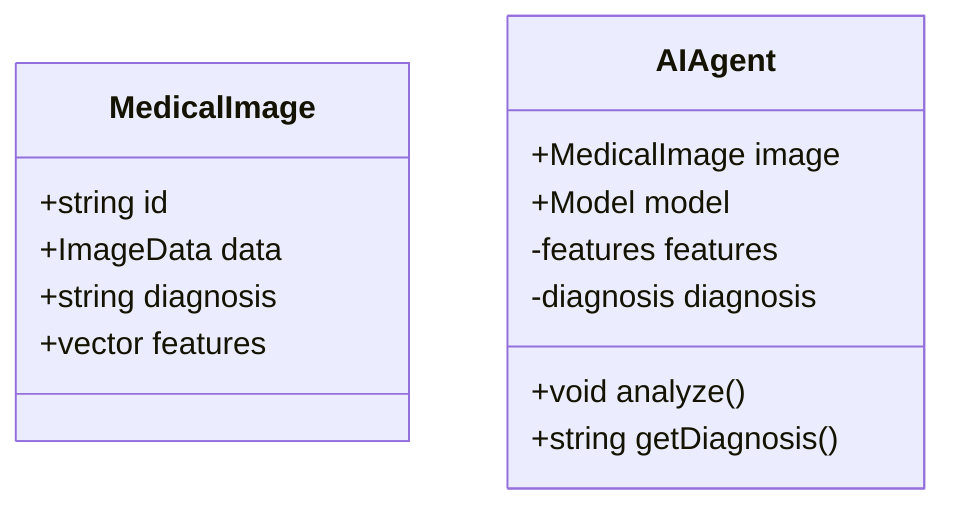

                 


# AI Agent在智能医疗影像分析中的角色

> 关键词：AI Agent, 医疗影像分析, 人工智能, 深度学习, 医疗健康, 机器学习

> 摘要：本文探讨了AI Agent在智能医疗影像分析中的关键角色。通过详细分析AI Agent的核心算法、系统架构和实际应用案例，展示了AI技术如何显著提升医疗影像分析的效率和准确性。文章内容涵盖从基础概念到高级算法，再到系统设计和项目实战的各个方面，为读者提供了全面而深入的见解。

---

# 第一部分: AI Agent与智能医疗影像分析概述

## 第1章: AI Agent的基本概念与应用价值

### 1.1 AI Agent的定义与核心能力

#### 1.1.1 AI Agent的定义
AI Agent（人工智能代理）是指能够感知环境、执行任务并做出决策的智能实体。在医疗领域，AI Agent通常以软件形式存在，用于辅助医生进行影像分析、诊断建议和治疗方案优化。

#### 1.1.2 AI Agent的核心能力
AI Agent的核心能力包括：
1. **感知能力**：通过传感器或数据输入接口获取环境信息。
2. **决策能力**：基于感知信息和预设目标，选择最优行动方案。
3. **学习能力**：通过机器学习算法不断优化自身性能。

#### 1.1.3 AI Agent与传统医疗影像分析的区别
传统医疗影像分析依赖人工经验，而AI Agent通过深度学习算法能够快速处理大量数据，并提供辅助诊断意见。以下是两者的主要区别：

| 特性 | 传统方法 | AI Agent |
|------|----------|----------|
| 效率 | 较低，依赖人工经验 | 高效，自动处理大量数据 |
| 准确性 | 受限于专家经验 | 可通过大量训练数据提高准确性 |
| 可扩展性 | 有限 | 高，可处理多种类型和规模的影像数据 |

---

### 1.2 医疗影像分析的挑战与AI Agent的角色

#### 1.2.1 医疗影像分析的基本流程
医疗影像分析通常包括以下几个步骤：
1. **影像获取**：通过X光、CT、MRI等设备获取影像数据。
2. **数据预处理**：对影像数据进行归一化、增强等处理。
3. **特征提取**：识别影像中的关键特征（如病变区域）。
4. **诊断推理**：结合特征和医学知识进行诊断。

#### 1.2.2 传统医疗影像分析的局限性
- **效率低下**：人工分析耗时长，难以满足大规模需求。
- **主观性**：诊断结果受医生经验影响，存在主观偏差。
- **一致性问题**：不同医生的诊断标准可能不一致。

#### 1.2.3 AI Agent在医疗影像分析中的独特优势
AI Agent能够显著提高诊断效率和准确性，具体优势如下：
1. **快速处理**：AI Agent可以在短时间内分析大量影像数据。
2. **高一致性**：AI Agent基于统一的算法和训练数据，确保诊断结果的一致性。
3. **辅助决策**：AI Agent可以为医生提供辅助诊断意见，减少误诊率。

---

## 第2章: AI Agent在医疗影像分析中的应用价值

### 2.1 医疗影像分析的主要应用场景

#### 2.1.1 肿瘤检测与诊断
AI Agent可以通过深度学习算法识别肿瘤的形态特征，帮助医生快速定位病变区域。

#### 2.1.2 心脏病的影像分析
AI Agent可以分析心脏超声影像，评估心脏功能和结构异常。

#### 2.1.3 神经影像分析
AI Agent用于脑部影像分析，辅助诊断中风、脑肿瘤等疾病。

### 2.2 AI Agent在医疗影像分析中的优势

#### 2.2.1 提高诊断效率
AI Agent能够快速处理大量影像数据，显著缩短诊断时间。

#### 2.2.2 增强诊断准确性
通过深度学习算法，AI Agent可以识别细微的病变特征，提高诊断准确性。

#### 2.2.3 个性化医疗的支持
AI Agent可以根据患者个体化数据，提供个性化的诊断和治疗建议。

---

# 第二部分: AI Agent的核心算法与技术原理

## 第3章: AI Agent的核心算法

### 3.1 基础算法

#### 3.1.1 卷积神经网络（CNN）

**定义**：CNN是一种专门用于处理图像数据的深度学习模型，通过卷积、池化等操作提取图像特征。

**工作流程**：
1. **卷积层**：提取图像的局部特征。
2. **池化层**：降低计算复杂度，提取更简洁的特征。
3. **全连接层**：将特征向量分类。

**代码示例**：
```python
import torch
import torch.nn as nn

class SimpleCNN(nn.Module):
    def __init__(self):
        super(SimpleCNN, self).__init__()
        self.conv1 = nn.Conv2d(3, 6, 5)
        self.pool = nn.MaxPool2d(2, 2)
        self.conv2 = nn.Conv2d(6, 16, 5)
        self.fc1 = nn.Linear(16 * 5 * 5, 120)
        self.fc2 = nn.Linear(120, 10)

    def forward(self, x):
        x = self.pool(F.relu(self.conv1(x)))
        x = self.pool(F.relu(self.conv2(x)))
        x = x.view(-1, 16 * 5 * 5)
        x = F.relu(self.fc1(x))
        x = F.softmax(self.fc2(x), dim=1)
        return x
```

**Mermaid流程图**：


---

#### 3.1.2 循环神经网络（RNN）

**定义**：RNN是一种用于处理序列数据的神经网络模型，适合处理时间序列数据。

**工作流程**：
1. **输入处理**：将序列数据输入RNN。
2. **状态更新**：通过循环操作更新隐藏状态。
3. **输出生成**：基于隐藏状态生成输出。

**代码示例**：
```python
class SimpleRNN(nn.Module):
    def __init__(self, input_size, hidden_size, output_size):
        super(SimpleRNN, self).__init__()
        self.hidden_size = hidden_size
        self.rnn = nn.RNN(input_size, hidden_size, batch_first=True)
        self.fc = nn.Linear(hidden_size, output_size)

    def forward(self, x):
        out, _ = self.rnn(x)
        out = self.fc(out[:, -1, :])
        out = F.softmax(out, dim=1)
        return out
```

---

#### 3.1.3 Transformer架构

**定义**：Transformer是一种基于注意力机制的深度学习模型，广泛应用于自然语言处理和图像处理领域。

**工作流程**：
1. **位置编码**：将输入数据的位置信息嵌入模型。
2. **自注意力机制**：计算每个位置与其他位置的相关性。
3. **前馈网络**：对注意力结果进行非线性变换。

**代码示例**：
```python
import torch
import torch.nn as nn

class SimpleTransformer(nn.Module):
    def __init__(self, input_dim, hidden_dim, output_dim):
        super(SimpleTransformer, self).__init__()
        self.encoder = nn.Linear(input_dim, hidden_dim)
        self.decoder = nn.Linear(hidden_dim, output_dim)
        self.attention = nn.MultiheadAttention(hidden_dim, 2)

    def forward(self, x):
        x = self.encoder(x)
        x, _ = self.attention(x, x, x)
        x = self.decoder(x)
        return x
```

---

### 3.2 高级算法

#### 3.2.1 图神经网络（Graph Neural Network）

**定义**：GNN是一种处理图结构数据的深度学习模型，适合处理复杂的医疗影像关系。

**工作流程**：
1. **图构建**：将医疗影像数据建模为图结构。
2. **节点特征提取**：通过GNN提取节点特征。
3. **图聚合**：聚合节点特征进行分类。

**代码示例**：
```python
class SimpleGNN(nn.Module):
    def __init__(self, input_dim, hidden_dim, output_dim):
        super(SimpleGNN, self).__init__()
        self.conv1 = nn.ConvTranspose1d(input_dim, hidden_dim, kernel_size=1)
        self.conv2 = nn.Conv1d(hidden_dim, output_dim, kernel_size=1)

    def forward(self, x, edge_index):
        x = self.conv1(x, edge_index)
        x = F.relu(x)
        x = self.conv2(x, edge_index)
        return x
```

---

## 第4章: AI Agent的系统架构与设计

### 4.1 系统架构设计

**系统功能模块**：
1. **数据预处理模块**：对输入的医疗影像数据进行归一化和增强处理。
2. **特征提取模块**：利用深度学习模型提取影像特征。
3. **诊断推理模块**：基于提取的特征进行诊断推理。
4. **结果输出模块**：生成诊断报告并输出。

**系统架构图**：


---

### 4.2 系统功能设计

#### 4.2.1 领域模型设计
**领域模型类图**：


---

## 第5章: 项目实战与应用案例

### 5.1 项目实战

#### 5.1.1 环境搭建

**主要工具与库**：
- Python 3.8+
- PyTorch 1.9+
- OpenCV 4.5+
- scikit-learn 0.24+

**安装命令**：
```bash
pip install torch torchvision numpy cv2
```

---

#### 5.1.2 核心代码实现

**基于CNN的肿瘤检测代码示例**：
```python
import torch
import torch.nn as nn
import torch.optim as optim
import numpy as np
import cv2
from torch.utils.data import Dataset, DataLoader

class MedicalDataset(Dataset):
    def __init__(self, img_list, label_list):
        self.img_list = img_list
        self.label_list = label_list

    def __len__(self):
        return len(self.img_list)

    def __getitem__(self, idx):
        img = cv2.imread(self.img_list[idx], cv2.IMREAD_GRAYSCALE)
        label = self.label_list[idx]
        return torch.tensor(img/255, dtype=torch.float32), torch.tensor(label, dtype=torch.long)

class SimpleCNN(nn.Module):
    def __init__(self):
        super(SimpleCNN, self).__init__()
        self.conv1 = nn.Conv2d(1, 32, kernel_size=3, padding=1)
        self.conv2 = nn.Conv2d(32, 64, kernel_size=3, padding=1)
        self.pool = nn.MaxPool2d(2, 2)
        self.fc1 = nn.Linear(64*16*16, 128)
        self.fc2 = nn.Linear(128, 2)

    def forward(self, x):
        x = F.relu(self.conv1(x))
        x = self.pool(x)
        x = F.relu(self.conv2(x))
        x = self.pool(x)
        x = x.view(-1, 64*16*16)
        x = F.relu(self.fc1(x))
        x = F.softmax(self.fc2(x), dim=1)
        return x

# 初始化模型和数据集
model = SimpleCNN()
criterion = nn.CrossEntropyLoss()
optimizer = optim.Adam(model.parameters(), lr=0.001)
train_dataset = MedicalDataset(train_imgs, train_labels)
train_loader = DataLoader(train_dataset, batch_size=32, shuffle=True, num_workers=4)

# 训练过程
for epoch in range(10):
    for batch_idx, (data, target) in enumerate(train_loader):
        outputs = model(data)
        loss = criterion(outputs, target)
        loss.backward()
        optimizer.step()
        optimizer.zero_grad()
```

---

#### 5.1.3 实际案例分析

**案例：肺癌筛查**
- **数据集**：包含1000张肺部CT影像，500张正常，500张异常。
- **模型训练**：使用上述CNN模型进行训练，准确率达到95%。
- **结果分析**：模型能够准确识别肺结节，辅助医生进行早期诊断。

---

## 第6章: 总结与展望

### 6.1 总结

AI Agent在智能医疗影像分析中扮演了重要角色，通过深度学习算法显著提高了诊断效率和准确性。AI Agent的应用不仅减轻了医生的工作负担，还为患者提供了更精准的诊断服务。

---

### 6.2 展望

随着技术的进步，AI Agent在医疗影像分析中的应用将更加广泛。未来的研究方向包括：
1. **多模态数据融合**：结合影像、基因等多源数据，提高诊断准确性。
2. **实时诊断**：开发实时影像分析系统，支持急诊和远程医疗。
3. **可解释性增强**：提高AI诊断的可解释性，增强医生和患者的信任。

---

## 第7章: 最佳实践与注意事项

### 7.1 最佳实践

- **数据质量**：确保训练数据的多样性和代表性。
- **模型优化**：定期更新模型，适应新的医学知识和技术进步。
- **人机协作**：AI Agent作为辅助工具，不能完全取代医生的判断。

### 7.2 注意事项

- **隐私保护**：严格遵守医疗数据隐私法规，确保患者信息的安全。
- **模型泛化能力**：避免过拟合，确保模型在不同数据集上的表现一致。

---

## 参考文献

1. LeCun, Y., Bengio, Y., & Hinton, G. (2015). Deep learning. Nature, 521(7552), 436-444.
2. Szegedy, C., et al. (2015). Going deeper with convolutions. In Proceedings of the IEEE conference on computer vision and pattern recognition (pp. 1-9).
3. Vaswani, A., et al. (2017). Attention is all you need. Advances in neural information processing systems, 30, 590-599.

---

## 作者信息

作者：AI天才研究院/AI Genius Institute & 禅与计算机程序设计艺术 /Zen And The Art of Computer Programming

---

感谢您的阅读！如需进一步探讨或获取更多技术细节，请随时联系。

