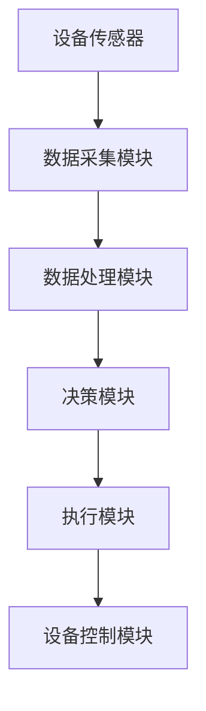
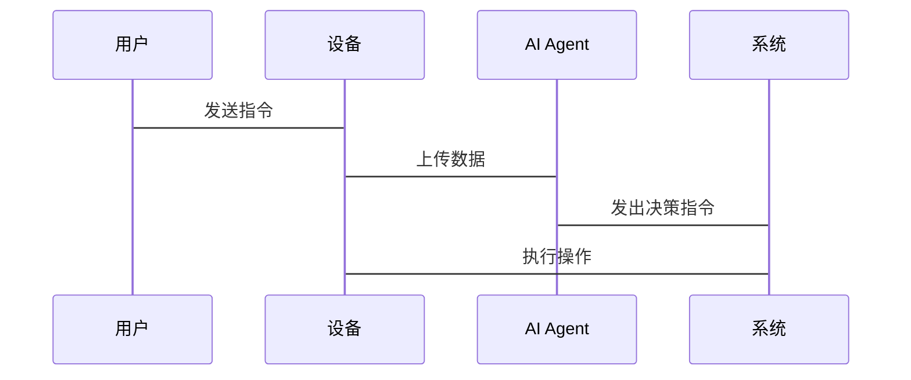

                 


# AI Agent在智能医疗设备管理中的角色

## 关键词：AI Agent，智能医疗设备，医疗设备管理，人工智能，智能系统

## 摘要：  
AI Agent（人工智能代理）在智能医疗设备管理中扮演着越来越重要的角色。随着医疗设备的智能化和复杂化，传统的设备管理方式已难以应对日益增长的管理需求。本文将探讨AI Agent在医疗设备管理中的核心作用，分析其在设备监测、维护优化、患者管理等方面的应用，揭示其技术实现的细节，并通过实际案例展示其在智能医疗设备管理中的巨大潜力。

---

# 第一部分: AI Agent的基本概念与背景

## 第1章: AI Agent的定义与核心概念

### 1.1 AI Agent的基本定义

AI Agent（人工智能代理）是指具有感知环境、做出决策并执行操作的智能实体。它能够根据输入的信息（如数据、用户指令或传感器信号）采取相应行动，以实现特定目标。AI Agent的核心特征包括智能性、自主性、反应性和社会性。

- **智能性**：AI Agent能够理解和处理复杂信息，通过学习和推理做出决策。
- **自主性**：AI Agent能够在没有人工干预的情况下独立运行。
- **反应性**：AI Agent能够实时感知环境变化并做出反应。
- **社会性**：AI Agent能够与其他系统或用户进行交互和协作。

### 1.2 AI Agent在医疗设备管理中的作用

医疗设备管理涉及设备的采购、安装、使用、维护和报废等全生命周期。AI Agent在这一过程中可以提供以下功能：

- **设备监测**：实时监控设备的运行状态，预测潜在故障。
- **维护优化**：根据设备的使用情况制定维护计划，优化资源分配。
- **患者管理**：协助医护人员进行患者数据管理，提高诊疗效率。
- **数据管理**：整合医疗设备数据，支持医院的信息化管理。

### 1.3 AI Agent与传统AI的区别

AI Agent与传统AI的区别主要体现在以下几个方面：

- **目标导向性**：AI Agent具有明确的目标，能够主动采取行动以实现目标。
- **自主性**：AI Agent能够在动态环境中自主决策，而传统AI系统通常需要人工干预。
- **实时性**：AI Agent能够实时响应环境变化，而传统AI系统可能不具备这种实时性。

---

## 第2章: AI Agent的理论基础

### 2.1 AI Agent的理论框架

AI Agent的理论基础主要包括知识表示、逻辑推理和学习算法。

- **知识表示**：AI Agent需要通过某种形式表示知识，如符号逻辑、规则库或知识图谱。
- **逻辑推理**：AI Agent通过逻辑推理来推导新的结论，例如使用逻辑演绎或归纳推理。
- **学习算法**：AI Agent可以通过机器学习算法（如监督学习、无监督学习和强化学习）不断优化自身的决策能力。

### 2.2 AI Agent的感知与决策机制

AI Agent的感知与决策机制包括以下三个模块：

- **感知模块**：通过传感器或数据接口获取环境信息，如设备状态数据或患者数据。
- **决策模块**：基于感知到的信息，通过算法计算出最优决策。
- **执行模块**：根据决策结果执行相应的操作，如发出维护指令或调整设备参数。

---

# 第二部分: AI Agent在智能医疗设备管理中的应用场景

## 第3章: AI Agent在医疗设备监测中的应用

### 3.1 设备状态实时监测

AI Agent可以通过传感器实时采集医疗设备的运行数据，如温度、压力、振动等。通过分析这些数据，AI Agent可以判断设备的健康状态，并预测潜在故障。

- **故障预测**：AI Agent可以通过机器学习算法（如支持向量机或随机森林）分析历史故障数据，预测设备的故障概率。
- **数据可视化**：AI Agent可以将设备数据进行可视化展示，帮助医护人员快速了解设备状态。

### 3.2 设备故障诊断

AI Agent可以结合知识库和诊断算法，对设备的故障进行精确诊断。例如，AI Agent可以通过对比设备的运行参数与正常参数范围，识别异常情况并给出诊断建议。

### 3.3 数据分析与可视化

AI Agent可以对设备数据进行深度分析，并生成直观的可视化报告。例如，AI Agent可以通过时间序列分析，识别设备的使用趋势，并预测未来的设备需求。

---

## 第4章: AI Agent在医疗设备维护优化中的应用

### 4.1 维护计划优化

AI Agent可以根据设备的历史维护记录和当前状态，制定最优的维护计划。例如，AI Agent可以通过预测设备的故障概率，调整维护的频率和时间，以降低设备的 downtime。

### 4.2 维护资源分配

AI Agent可以优化维护资源的分配，如技术人员、备件和维护设备。例如，AI Agent可以根据设备故障的紧急程度和地理位置，分配最优的维护资源。

### 4.3 维护效果评估

AI Agent可以通过分析维护记录和设备状态数据，评估维护的效果。例如，AI Agent可以计算设备在维护后的运行效率提升情况，并生成维护效果报告。

---

## 第5章: AI Agent在患者管理中的应用

### 5.1 患者信息管理

AI Agent可以通过医院信息系统的数据接口，整合患者的电子健康记录（EHR），并提供个性化的患者管理方案。例如，AI Agent可以根据患者的病史和当前症状，推荐合适的治疗方案。

### 5.2 患者监测与预警

AI Agent可以通过实时监测患者的生理指标（如心率、血压），预测潜在的健康风险，并发出预警。例如，AI Agent可以通过机器学习算法，预测患者的病情变化趋势。

### 5.3 医疗资源优化

AI Agent可以优化医院的资源配置，如病房分配、手术安排和药品管理。例如，AI Agent可以根据患者的病情和手术优先级，优化手术安排。

---

# 第三部分: AI Agent的技术实现

## 第6章: AI Agent的算法原理

### 6.1 AI Agent的感知算法

AI Agent的感知算法主要包括数据采集、特征提取和异常检测。例如，AI Agent可以通过卷积神经网络（CNN）对医学图像进行特征提取，识别病变区域。

### 6.2 AI Agent的决策算法

AI Agent的决策算法主要包括分类、回归和强化学习。例如，AI Agent可以通过随机森林算法对设备故障进行分类，预测故障类型。

### 6.3 AI Agent的执行算法

AI Agent的执行算法主要包括动作规划和任务调度。例如，AI Agent可以通过遗传算法优化任务调度，提高设备的使用效率。

---

## 第7章: AI Agent的系统架构设计

### 7.1 系统功能设计

AI Agent的系统功能设计包括数据采集、数据处理、决策支持和执行控制。例如，AI Agent可以通过物联网（IoT）技术采集设备数据，经过数据清洗和特征提取后，进行故障预测和维护决策。

### 7.2 系统架构图

以下是AI Agent系统的架构图：



### 7.3 系统交互序列图

以下是AI Agent系统的交互序列图：



---

# 第四部分: 项目实战

## 第8章: AI Agent在医疗设备管理中的项目实战

### 8.1 环境安装

要实现AI Agent在医疗设备管理中的应用，首先需要安装以下环境：

- **Python**：用于开发AI Agent。
- **TensorFlow** 或 **Keras**：用于实现机器学习模型。
- **MongoDB**：用于存储设备数据。
- **Flask** 或 **Django**：用于开发Web界面。

### 8.2 核心功能实现

以下是AI Agent的核心功能实现代码示例：

```python
import numpy as np
from sklearn.ensemble import RandomForestClassifier

# 示例：设备故障预测
data = np.array([[85, 0.2, 0.1],
                 [90, 0.3, 0],
                 [80, 0.4, 1]])
labels = np.array([0, 1, 2])

model = RandomForestClassifier(n_estimators=100, random_state=42)
model.fit(data, labels)

# 预测新设备的状态
new_data = np.array([[88, 0.25, 0]])
prediction = model.predict(new_data)
print("预测结果：", prediction)
```

### 8.3 案例分析与解读

通过上述代码示例，我们可以实现设备故障预测功能。AI Agent可以根据设备的运行数据，预测设备的故障类型，并发出维护指令。例如，当预测设备故障类型为2时，AI Agent可以通知维护人员进行维修。

---

# 第五部分: 总结与展望

## 第9章: 总结与展望

### 9.1 全文总结

AI Agent在智能医疗设备管理中的应用前景广阔。通过实时监测、智能决策和优化管理，AI Agent可以显著提高医疗设备的使用效率和患者管理的精准度。

### 9.2 未来展望

未来，随着AI技术的不断进步，AI Agent在医疗设备管理中的应用将更加智能化和个性化。例如，AI Agent可以通过强化学习优化设备的运行策略，并通过区块链技术实现设备数据的安全共享。

### 9.3 小结

AI Agent作为智能医疗设备管理的核心技术，将继续推动医疗行业的数字化转型。通过不断的创新和实践，AI Agent将为医疗设备管理带来更多的可能性。

---

# 作者：AI天才研究院 & 禅与计算机程序设计艺术

---

**注意：** 如果需要更详细的代码实现或案例分析，请随时告诉我，我会进一步完善内容！

