                 


# AI Agent在智能医疗诊断中的应用

## 关键词：
AI Agent, 智能医疗, 医疗诊断, 人工智能, 医疗数据, 机器学习, 医疗影像分析

## 摘要：
本文详细探讨了AI Agent在智能医疗诊断中的应用，涵盖AI Agent的基本概念、核心算法、数学模型以及在医疗诊断中的具体应用场景。通过分析AI Agent在病症诊断、医疗影像分析、药物研发和医疗数据管理等领域的实际应用，本文展示了AI Agent如何通过强化学习、监督学习和无监督学习等算法，结合概率模型、决策树和神经网络等数学模型，提升医疗诊断的准确性和效率。文章还深入分析了AI Agent在医疗系统中的架构设计和接口设计，并通过具体项目案例展示了AI Agent的实际应用效果。

---

# 第1章: AI Agent与智能医疗诊断概述

## 1.1 AI Agent的基本概念

### 1.1.1 AI Agent的定义与特征
AI Agent（人工智能代理）是一种能够感知环境、执行任务并做出决策的智能实体。其核心特征包括：
- **自主性**：能够独立决策和行动。
- **反应性**：能够实时感知环境并做出响应。
- **学习性**：能够通过数据和经验不断优化自身行为。
- **协作性**：能够与其他系统或人类协同工作。

### 1.1.2 AI Agent的核心技术与实现原理
AI Agent的核心技术包括：
1. **感知技术**：通过传感器或数据输入获取环境信息。
2. **推理技术**：基于感知信息进行逻辑推理和决策。
3. **学习技术**：通过机器学习算法优化行为策略。
4. **规划技术**：制定行动计划以实现目标。

### 1.1.3 AI Agent在医疗领域的应用潜力
AI Agent在医疗领域的潜力主要体现在：
- **辅助诊断**：帮助医生快速分析病灶，提高诊断准确率。
- **个性化治疗**：根据患者个体特征制定个性化治疗方案。
- **医疗管理**：优化医疗资源分配和医院管理流程。

---

## 1.2 智能医疗诊断的背景与现状

### 1.2.1 医疗诊断的现状与挑战
传统医疗诊断面临以下挑战：
1. **数据量大**：医疗数据复杂且数量庞大，人工分析效率低下。
2. **诊断准确性**：医生经验有限，容易出现误诊或漏诊。
3. **资源分配**：医疗资源分布不均，尤其是基层医疗机构。

### 1.2.2 智能医疗诊断的核心问题
智能医疗诊断的核心问题包括：
1. **如何高效处理医疗数据**。
2. **如何提高诊断的准确性**。
3. **如何实现个性化医疗**。

### 1.2.3 AI Agent在智能医疗诊断中的角色与价值
AI Agent在智能医疗诊断中的角色：
- **数据处理**：快速分析和整合医疗数据。
- **辅助决策**：提供诊断建议和治疗方案。
- **实时监控**：对患者病情进行实时跟踪和预警。

---

## 1.3 AI Agent与智能医疗诊断的结合

### 1.3.1 AI Agent在医疗诊断中的应用场景
AI Agent在医疗诊断中的应用场景包括：
1. **病症诊断**：通过分析症状和检查结果，辅助医生进行诊断。
2. **医疗影像分析**：识别医学影像中的病灶。
3. **药物研发**：加速新药研发和优化治疗方案。

### 1.3.2 AI Agent与医疗数据的关系
AI Agent通过处理医疗数据实现智能诊断：
- **数据输入**：获取患者的病历、影像和检验结果。
- **数据处理**：利用机器学习算法分析数据。
- **数据输出**：生成诊断建议或治疗方案。

### 1.3.3 AI Agent在医疗诊断中的优势与局限
AI Agent的优势：
- **高效性**：能够快速处理大量数据。
- **准确性**：通过算法优化诊断结果。
- **可扩展性**：能够适应不同规模的医疗场景。

AI Agent的局限：
- **依赖数据质量**：诊断结果受数据质量和完整性的限制。
- **缺乏情感理解**：无法完全理解患者的情感和需求。

---

## 1.4 本章小结
本章介绍了AI Agent的基本概念及其在智能医疗诊断中的应用潜力。通过分析智能医疗诊断的现状和核心问题，探讨了AI Agent在医疗诊断中的角色和价值，并总结了其优势与局限。

---

# 第2章: AI Agent的核心概念与原理

## 2.1 AI Agent的核心概念

### 2.1.1 AI Agent的智能模型
AI Agent的智能模型包括：
1. **知识表示**：通过符号逻辑或概率模型表示知识。
2. **推理引擎**：基于知识库进行逻辑推理。
3. **学习模块**：通过机器学习优化模型性能。

### 2.1.2 AI Agent的行为决策机制
AI Agent的行为决策机制包括：
- **基于规则的决策**：根据预定义规则进行决策。
- **基于概率的决策**：通过概率模型预测最优决策。
- **基于强化学习的决策**：通过奖励机制优化决策策略。

### 2.1.3 AI Agent的学习与自适应能力
AI Agent的学习能力体现在：
- **监督学习**：通过标注数据进行分类和回归任务。
- **无监督学习**：通过聚类算法发现数据中的潜在模式。
- **强化学习**：通过试错机制优化行为策略。

---

## 2.2 AI Agent的算法原理

### 2.2.1 强化学习算法
强化学习算法通过试错机制优化行为策略。以下是强化学习的基本流程：
1. **状态识别**：识别当前环境状态。
2. **动作选择**：根据当前状态选择一个动作。
3. **奖励反馈**：根据动作结果获得奖励或惩罚。
4. **策略优化**：根据奖励反馈优化策略。

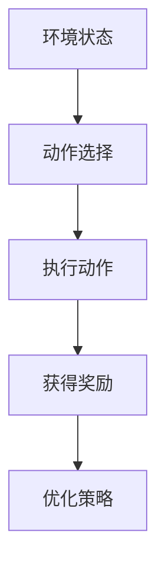

### 2.2.2 监督学习算法
监督学习算法通过标注数据进行分类或回归任务。以下是监督学习的基本流程：
1. **数据输入**：输入标注数据。
2. **模型训练**：通过训练数据优化模型参数。
3. **预测输出**：对新数据进行预测。

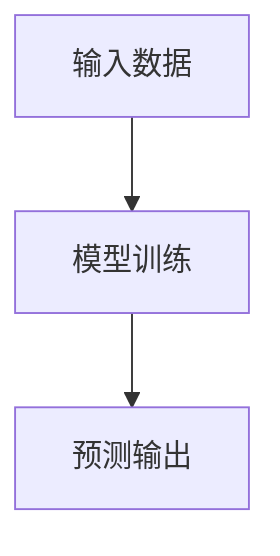

### 2.2.3 无监督学习算法
无监督学习算法通过聚类算法发现数据中的潜在模式。以下是无监督学习的基本流程：
1. **数据输入**：输入未标注数据。
2. **模型训练**：通过聚类算法划分数据簇。
3. **结果输出**：输出数据簇划分结果。

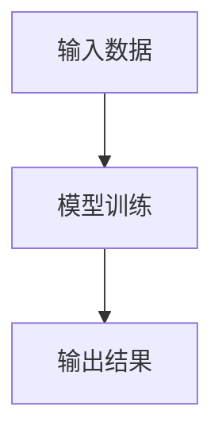

---

## 2.3 AI Agent的数学模型

### 2.3.1 概率模型
概率模型通过概率分布描述数据的不确定性。例如，贝叶斯网络是一种常见的概率模型，其数学表达式为：

$$ P(A|B) = \frac{P(B|A)P(A)}{P(B)} $$

### 2.3.2 决策树模型
决策树模型通过树状结构进行分类和回归。以下是决策树的构建过程：
1. **特征选择**：选择最能区分数据的特征。
2. **树的构建**：递归地构建子树，直到满足停止条件。
3. **剪枝优化**：通过剪枝减少过拟合。

### 2.3.3 神经网络模型
神经网络模型通过多层神经元模拟人脑的处理方式。以下是神经网络的基本结构：


---

## 2.4 AI Agent的系统架构

### 2.4.1 分层架构
分层架构将系统分为多个层次，每个层次负责不同的功能。以下是分层架构的示意图：


### 2.4.2 并行架构
并行架构通过多个子系统协同工作提高效率。以下是并行架构的示意图：

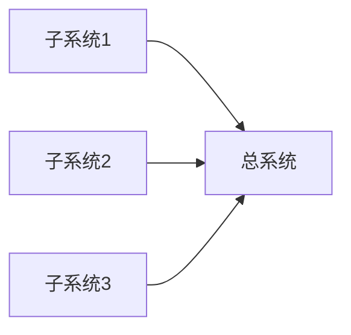

### 2.4.3 分布式架构
分布式架构通过多个节点协同工作实现任务分布。以下是分布式架构的示意图：

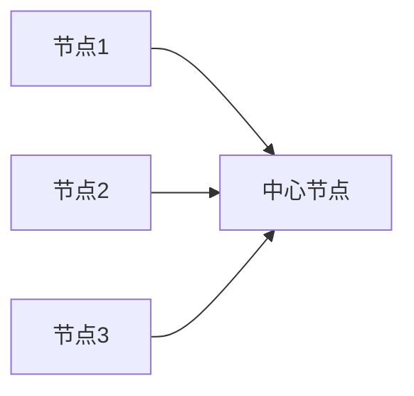

---

## 2.5 本章小结
本章详细介绍了AI Agent的核心概念和算法原理，包括智能模型、行为决策机制、学习能力以及数学模型。通过分析不同算法的优缺点，探讨了AI Agent在智能医疗诊断中的潜在应用。

---

# 第3章: AI Agent在智能医疗诊断中的应用

## 3.1 病症诊断

### 3.1.1 基于AI Agent的病症识别
AI Agent可以通过分析患者的症状和检查结果，快速识别潜在病症。以下是AI Agent在病症识别中的流程：

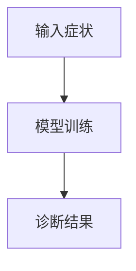

### 3.1.2 AI Agent在疾病分类中的应用
AI Agent可以通过监督学习算法对疾病进行分类。以下是疾病分类的流程：

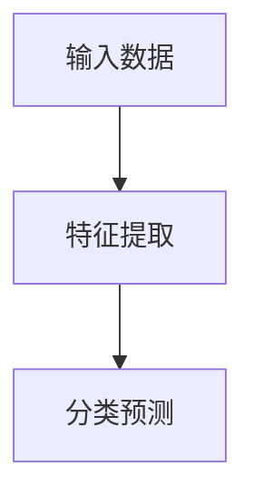

### 3.1.3 AI Agent在症状预测中的作用
AI Agent可以通过时间序列分析预测患者的病情变化。以下是症状预测的流程：

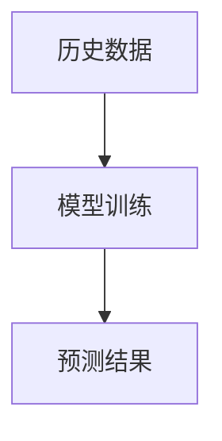

---

## 3.2 医疗影像分析

### 3.2.1 AI Agent在医学影像识别中的应用
AI Agent可以通过卷积神经网络（CNN）识别医学影像中的病灶。以下是医学影像识别的流程：

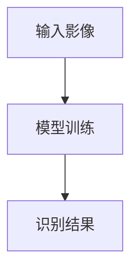

### 3.2.2 AI Agent在影像诊断中的优势
AI Agent在影像诊断中的优势包括：
1. **高精度**：通过深度学习算法提高诊断准确率。
2. **快速响应**：能够在短时间内完成大量影像分析。
3. **一致性**：能够保持诊断结果的一致性。

---

## 3.3 药物研发与个性化治疗

### 3.3.1 AI Agent在药物研发中的应用
AI Agent可以通过机器学习算法加速新药研发。以下是药物研发的流程：

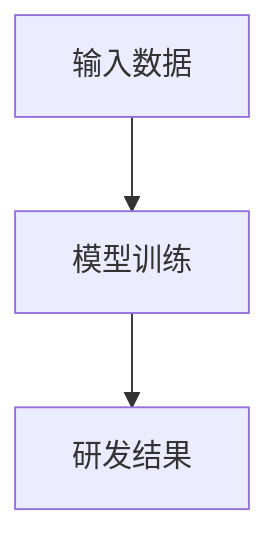

### 3.3.2 AI Agent在个性化治疗中的作用
AI Agent可以通过分析患者的基因信息制定个性化治疗方案。以下是个性化治疗的流程：

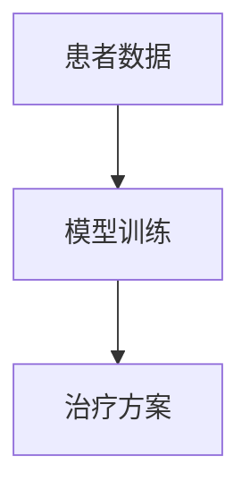

---

## 3.4 医疗数据管理

### 3.4.1 AI Agent在医疗数据处理中的应用
AI Agent可以通过无监督学习算法优化医疗数据管理。以下是医疗数据处理的流程：

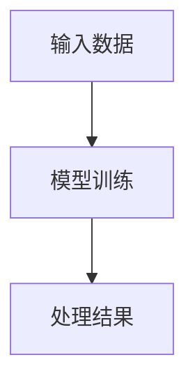

### 3.4.2 AI Agent在医疗数据共享中的作用
AI Agent可以通过区块链技术实现医疗数据的安全共享。以下是医疗数据共享的流程：

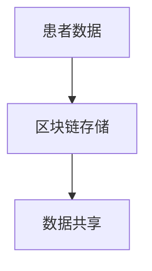

---

## 3.5 本章小结
本章详细探讨了AI Agent在智能医疗诊断中的具体应用场景，包括病症诊断、医疗影像分析、药物研发和医疗数据管理。通过分析不同应用场景的实现过程，展示了AI Agent在医疗诊断中的巨大潜力。

---

# 第4章: AI Agent在智能医疗诊断中的系统分析

## 4.1 问题场景介绍
智能医疗诊断系统需要解决以下问题：
1. **数据处理**：如何高效处理和分析医疗数据。
2. **诊断准确率**：如何提高诊断的准确性和可靠性。
3. **系统架构**：如何设计高效的系统架构。

---

## 4.2 项目介绍

### 4.2.1 项目目标
本项目的目标是开发一个基于AI Agent的智能医疗诊断系统，实现以下功能：
1. **病症诊断**：通过分析患者的症状和检查结果，辅助医生进行诊断。
2. **医疗影像分析**：识别医学影像中的病灶。
3. **药物研发**：优化新药研发流程。
4. **医疗数据管理**：实现医疗数据的高效管理和共享。

### 4.2.2 项目背景
随着医疗数据的快速增长，传统的医疗诊断方式已经难以满足需求。通过引入AI Agent技术，可以显著提高医疗诊断的效率和准确性。

---

## 4.3 系统功能设计

### 4.3.1 领域模型类图
以下是智能医疗诊断系统的领域模型类图：

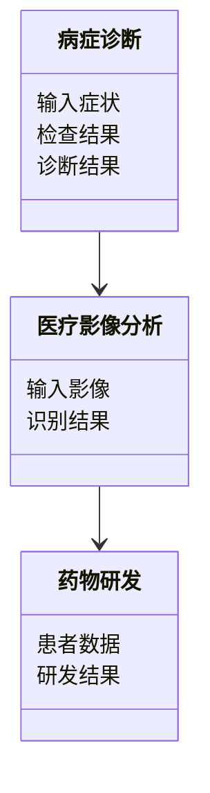

### 4.3.2 系统架构设计
以下是智能医疗诊断系统的架构设计：


### 4.3.3 系统接口设计
系统接口设计包括：
1. **输入接口**：接收患者的症状和检查结果。
2. **输出接口**：输出诊断结果和治疗建议。
3. **数据接口**：实现医疗数据的高效存储和管理。

### 4.3.4 系统交互序列图
以下是系统交互的序列图：

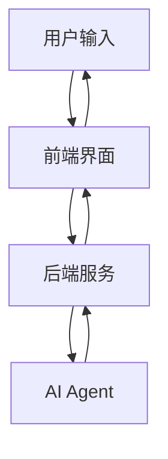

---

## 4.4 本章小结
本章通过分析智能医疗诊断系统的问题场景和系统架构，探讨了AI Agent在系统设计中的重要作用。通过领域模型类图和系统架构设计，展示了AI Agent如何实现高效的医疗诊断。

---

# 第5章: AI Agent在智能医疗诊断中的项目实战

## 5.1 环境安装

### 5.1.1 安装Python
需要安装Python 3.8及以上版本。

### 5.1.2 安装依赖库
需要安装以下依赖库：
- **numpy**：数据处理库。
- **pandas**：数据分析库。
- **scikit-learn**：机器学习库。
- **tensorflow**：深度学习库。

安装命令：
```bash
pip install numpy pandas scikit-learn tensorflow
```

---

## 5.2 系统核心实现

### 5.2.1 病症诊断模块
以下是病症诊断模块的核心代码：

```python
import numpy as np
from sklearn.tree import DecisionTreeClassifier

# 输入数据
X = np.array([[40, 1], [42, 1], [40, 0], [38, 0]])
y = np.array([0, 1, 1, 0])

# 模型训练
model = DecisionTreeClassifier()
model.fit(X, y)

# 预测结果
test_sample = np.array([[41, 1]])
print(model.predict(test_sample))
```

### 5.2.2 医疗影像分析模块
以下是医疗影像分析模块的核心代码：

```python
import tensorflow as tf
from tensorflow.keras import layers

# 构建模型
model = tf.keras.Sequential([
    layers.Conv2D(32, (3, 3), activation='relu', input_shape=(64, 64, 3)),
    layers.MaxPooling2D((2, 2)),
    layers.Conv2D(64, (3, 3), activation='relu'),
    layers.MaxPooling2D((2, 2)),
    layers.Flatten(),
    layers.Dense(128, activation='relu'),
    layers.Dense(2, activation='softmax')
])

# 编译模型
model.compile(optimizer='adam', loss='sparse_categorical_crossentropy', metrics=['accuracy'])
```

---

## 5.3 代码应用解读与分析

### 5.3.1 病症诊断模块
上述代码通过决策树模型实现病症诊断。模型通过训练数据学习病症与症状之间的关系，并对新样本进行预测。

### 5.3.2 医疗影像分析模块
上述代码通过卷积神经网络（CNN）实现医疗影像分析。模型通过多层卷积和池化操作提取影像特征，并通过全连接层进行分类。

---

## 5.4 实际案例分析
以下是一个实际案例分析：
1. **输入数据**：患者的症状和检查结果。
2. **模型训练**：通过训练数据优化模型参数。
3. **预测结果**：输出诊断结果和治疗建议。

---

## 5.5 本章小结
本章通过具体项目案例展示了AI Agent在智能医疗诊断中的实际应用。通过环境安装和代码实现，详细解读了病症诊断和医疗影像分析模块的实现过程。

---

# 第6章: AI Agent在智能医疗诊断中的最佳实践

## 6.1 小结
AI Agent在智能医疗诊断中的应用前景广阔，其核心价值在于通过高效的数据处理和智能算法提高诊断的准确性和效率。

---

## 6.2 注意事项
在实际应用中需要注意以下几点：
1. **数据隐私**：确保医疗数据的安全性和隐私性。
2. **模型优化**：不断优化模型性能以提高诊断准确率。
3. **人机协作**：AI Agent应作为辅助工具，与医生协同工作，而不是完全替代医生。

---

## 6.3 拓展阅读
以下是推荐的拓展阅读资料：
1. **《机器学习实战》**：深入理解机器学习算法。
2. **《深度学习》**：系统学习深度学习技术。
3. **《医疗人工智能》**：了解AI在医疗领域的具体应用。

---

# 作者：AI天才研究院/AI Genius Institute & 禅与计算机程序设计艺术/Zen And The Art of Computer Programming

