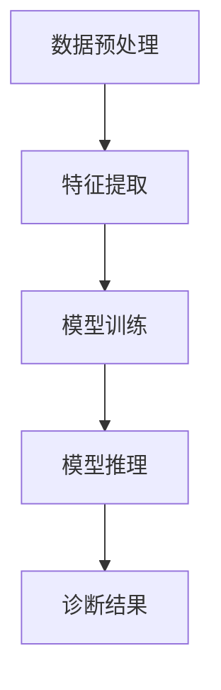

                 


# AI Agent在智能医疗诊断中的突破

> **关键词**：AI Agent，智能医疗诊断，算法原理，系统架构设计，项目实战，技术博客

> **摘要**：本文深入探讨AI Agent在智能医疗诊断中的应用，从核心概念、算法原理到系统架构设计，再到项目实战，全面解析AI Agent如何推动医疗诊断的智能化与精准化。文章结构清晰，内容详实，结合实际案例和详细代码实现，为读者呈现AI Agent在医疗诊断中的突破与应用。

---

## 第一部分：AI Agent在医疗诊断中的背景与基础

### 第1章：AI Agent的基本概念与技术基础

#### 1.1 AI Agent的定义与核心特征

- **1.1.1 AI Agent的基本概念**
  AI Agent（人工智能代理）是一种能够感知环境、自主决策并执行任务的智能体。在医疗诊断中，AI Agent可以作为辅助工具，帮助医生分析病灶、诊断疾病并制定治疗方案。

- **1.1.2 AI Agent的核心特征**
  - **自主性**：AI Agent能够在没有人工干预的情况下自主完成任务。
  - **反应性**：能够实时感知环境变化并做出相应的反应。
  - **学习能力**：通过机器学习算法不断优化自身的诊断能力。

- **1.1.3 AI Agent与传统医疗诊断工具的区别**
  传统的医疗诊断工具依赖于医生的经验和知识，而AI Agent则通过算法和大数据分析，提供更精准的诊断建议。

#### 1.2 AI Agent在医疗诊断中的应用背景

- **1.2.1 医疗诊断面临的挑战**
  - 医疗资源有限，尤其是基层医疗机构。
  - 医生的工作量大，诊断时间有限，容易出现误诊或漏诊。
  - 病症复杂多样，需要多学科协作。

- **1.2.2 AI Agent在医疗诊断中的优势**
  - 提高诊断效率，缩短诊断时间。
  - 增强诊断准确性，减少人为错误。
  - 实现医疗资源的优化配置，尤其是偏远地区的医疗服务。

- **1.2.3 当前AI Agent在医疗领域的应用现状**
  AI Agent已经在医学影像分析、疾病预测、个性化治疗方案制定等领域展现出巨大潜力，但仍需进一步完善技术与法规。

---

## 第二部分：AI Agent的核心概念与原理

### 第2章：AI Agent的核心概念与联系

#### 2.1 AI Agent的核心概念

- **2.1.1 AI Agent的定义与核心要素**
  AI Agent由感知模块、决策模块和执行模块组成，能够通过数据输入、分析处理和输出结果完成诊断任务。

- **2.1.2 AI Agent的实体关系图（ER图）**
  ```mermaid
  entity Relationship {
    entity 医疗数据：包含病人的病史、症状、检查结果等信息；
    entity AI Agent：通过分析医疗数据，生成诊断建议；
    entity 医生：根据AI Agent的建议进行最终诊断；
    relationship 医疗数据 -> AI Agent：数据输入；
    relationship AI Agent -> 医生：诊断建议输出；
  }
  ```

#### 2.2 AI Agent的核心原理

- **2.2.1 AI Agent的基本工作原理**
  AI Agent通过收集病人的医疗数据，利用机器学习模型进行分析，生成诊断建议，并通过人机交互的方式与医生进行沟通，辅助医生做出最终诊断。

- **2.2.2 AI Agent与医疗诊断的结合原理**
  通过自然语言处理技术，AI Agent能够理解医生的提问和病人的症状描述；通过计算机视觉技术，AI Agent能够分析医学影像，识别病灶特征；通过深度学习算法，AI Agent能够预测疾病的发生概率。

- **2.2.3 AI Agent的决策机制**
  AI Agent基于输入的医疗数据，结合预先训练好的模型，生成多个可能的诊断方案，并根据模型的置信度评分，推荐最优方案。

---

## 第三部分：AI Agent的算法原理与数学模型

### 第3章：AI Agent的算法原理

#### 3.1 AI Agent的核心算法

- **3.1.1 机器学习算法在AI Agent中的应用**
  - **监督学习**：用于分类任务，如疾病诊断。
  - **无监督学习**：用于聚类任务，如患者分群。
  - **强化学习**：用于动态决策任务，如治疗方案优化。

- **3.1.2 自然语言处理算法在AI Agent中的应用**
  - **文本分类**：用于识别病历中的关键信息。
  - **实体识别**：用于提取病历中的医学术语。
  - **问答系统**：用于与医生的自然对话。

- **3.1.3 图神经网络算法在AI Agent中的应用**
  - 用于复杂的医学关系建模，如疾病间的关联性分析。

#### 3.2 AI Agent的数学模型与公式

- **3.2.1 机器学习模型的数学表达**
  假设有一个分类问题，目标函数为：
  $$ f(x) = w^T x + b $$
  其中，$$ w $$ 是权重向量，$$ x $$ 是输入特征，$$ b $$ 是偏置项。

- **3.2.2 自然语言处理模型的数学表达**
  使用词嵌入模型（如Word2Vec）将文本转化为向量表示，例如：
  $$ v_{\text{word}} = v_{\text{context}} $$

- **3.2.3 图神经网络模型的数学表达**
  图神经网络通过聚合节点特征和邻居信息进行推理，例如：
  $$ h_i^{(l+1)} = \sigma(\sum_{j \in N(i)} W h_j^{(l)}) $$

#### 3.3 AI Agent的算法实现流程



---

## 第四部分：AI Agent的系统分析与架构设计

### 第4章：AI Agent的系统分析与架构设计

#### 4.1 AI Agent在医疗诊断中的问题场景

- **4.1.1 医疗诊断中的常见问题**
  - 数据量大且复杂，难以快速分析。
  - 病症相似，容易混淆诊断。
  - 需要多学科协作，信息传递不畅。

- **4.1.2 AI Agent在医疗诊断中的应用场景**
  - 影像诊断：如X光片、MRI的分析。
  - 病理诊断：如癌症细胞的识别。
  - 药物推荐：基于患者基因信息推荐个性化用药方案。

#### 4.2 AI Agent的系统功能设计

- **4.2.1 系统功能模块划分**
  - 数据采集模块：收集病人的医疗数据。
  - 数据处理模块：清洗和预处理数据。
  - 模型推理模块：运行AI模型进行诊断。
  - 结果展示模块：将诊断结果呈现给医生。

- **4.2.2 系统功能流程设计**
  ```mermaid
  flowchart TD
      A[医生输入病人信息] --> B[数据采集模块]
      B --> C[数据处理模块]
      C --> D[模型推理模块]
      D --> E[诊断结果展示模块]
      E --> F[医生确认诊断]
  ```

#### 4.3 AI Agent的系统架构设计

- **4.3.1 系统架构图**
  ```mermaid
  architecture
      前端层：负责用户交互，如医生输入病人的症状和检查结果；
      中间层：包含AI Agent的核心算法和模型；
      后端层：处理数据存储和计算资源分配；
  ```

- **4.3.2 系统组件之间的关系**
  ```mermaid
  graph TD
      Frontend --> Backend
      Backend --> AI-Agent
      AI-Agent --> Database
  ```

---

## 第五部分：AI Agent在医疗诊断中的项目实战

### 第5章：AI Agent的项目实战

#### 5.1 项目环境安装与配置

- **5.1.1 安装Python环境**
  ```bash
  python --version
  # 确保Python版本为3.6以上
  ```

- **5.1.2 安装必要的库**
  ```bash
  pip install numpy pandas scikit-learn transformers
  ```

#### 5.2 核心代码实现

- **5.2.1 数据预处理代码**
  ```python
  import pandas as pd
  df = pd.read_csv('medical_data.csv')
  df.dropna(inplace=True)
  ```

- **5.2.2 模型训练代码**
  ```python
  from sklearn.model import SVC
  model = SVC(kernel='rb

