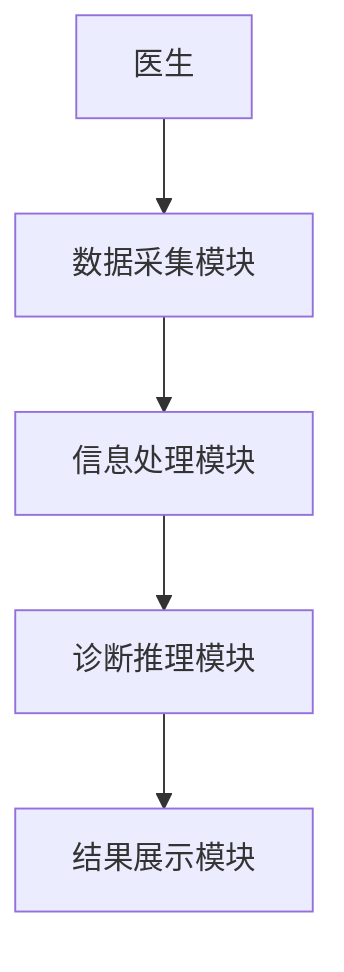
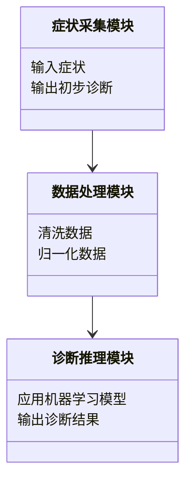

                 


# AI Agent在智能医疗诊断辅助中的角色

## 关键词：AI Agent，智能医疗，诊断辅助，机器学习，知识图谱，自然语言处理

## 摘要：本文深入探讨了AI Agent在智能医疗诊断中的角色，从其核心概念、算法原理到系统架构，再到实际应用案例，全面解析AI Agent如何通过知识表示、机器学习和自然语言处理等技术，辅助医生提高诊断效率和准确性。文章还结合项目实战，详细解读了AI Agent在医疗诊断中的实现过程，并展望了未来的发展方向。

---

# 第1章 AI Agent与智能医疗诊断的背景

## 1.1 AI Agent的基本概念

### 1.1.1 什么是AI Agent

AI Agent（人工智能代理）是指能够感知环境、自主决策并执行任务的智能实体。它可以是一个软件程序，也可以是一个物理设备，通过传感器和执行器与环境交互。AI Agent的核心目标是通过智能算法，帮助人类完成复杂任务或提供决策支持。

### 1.1.2 AI Agent的核心特征

| 特征 | 描述 |
|------|------|
| 自主性 | 能够自主决策，无需外部干预 |
| 反应性 | 能够实时感知环境并做出反应 |
| 学习能力 | 能够通过数据学习和优化自身行为 |
| 交互性 | 能够与人类或其他系统进行有效交互 |

### 1.1.3 AI Agent与传统医疗诊断的区别

传统医疗诊断主要依赖医生的经验和知识，而AI Agent可以通过整合海量医疗数据、知识库和机器学习模型，提供更快速、更准确的诊断建议。

---

## 1.2 智能医疗诊断的背景与需求

### 1.2.1 医疗诊断的现状与挑战

医疗诊断的准确性高度依赖医生的经验，而医疗资源的分布不均和医生数量的限制，使得许多患者无法获得及时、准确的诊断。

### 1.2.2 AI在医疗诊断中的潜力

AI技术可以通过图像识别、自然语言处理和机器学习，帮助医生快速分析病历、医学影像和实验室数据，提高诊断效率和准确性。

### 1.2.3 智能医疗诊断的定义与目标

智能医疗诊断是指利用AI技术，通过整合多模态数据（如影像、病历、基因数据等），辅助医生进行疾病诊断、治疗方案推荐和病情监测。

---

## 1.3 AI Agent在医疗诊断中的角色

### 1.3.1 AI Agent在医疗诊断中的功能定位

AI Agent在医疗诊断中的主要功能包括数据采集、信息处理、诊断推理和结果展示。

### 1.3.2 AI Agent与医生、患者的交互模式

- **医生与AI Agent的交互**：医生通过输入病历数据，AI Agent提供诊断建议和治疗方案推荐。
- **患者与AI Agent的交互**：患者可以通过移动设备或网页界面与AI Agent互动，获取初步诊断建议。

### 1.3.3 AI Agent在医疗诊断中的优势与局限性

**优势**：
- 高效性：AI Agent可以快速处理大量数据，提供实时诊断建议。
- 准确性：通过机器学习模型，AI Agent能够提高诊断的准确性。

**局限性**：
- 依赖数据质量：AI Agent的诊断结果依赖于输入数据的质量和完整性。
- 道德与法律问题：AI Agent的决策责任归属尚不明确。

---

## 1.4 本章小结

本章介绍了AI Agent的基本概念、核心特征以及在医疗诊断中的角色。通过对比传统医疗诊断和智能医疗诊断的差异，我们看到AI Agent在提高诊断效率和准确性方面具有巨大潜力。

---

# 第2章 AI Agent的核心原理

## 2.1 AI Agent的基本原理

### 2.1.1 知识表示与推理

知识表示是AI Agent的核心技术之一。常用的表示方法包括：

- **规则表示**：通过一系列if-then规则表示知识，例如“如果患者体温超过39℃，则可能是感冒”。
- **语义网络**：通过节点和边表示概念及其关系。
- **知识图谱**：通过结构化数据表示知识，例如疾病、症状、药物之间的关系。

### 2.1.2 多 Agent 系统的协作机制

在多 Agent 系统中，多个AI Agent协同工作，通过通信和协调完成复杂的任务。常见的协作机制包括：

- **分布式计算**：每个Agent负责一部分计算任务，最终整合结果。
- **协商机制**：通过协商确定每个Agent的任务分工。

### 2.1.3 动态环境下的决策与学习

AI Agent需要在动态环境中做出决策，这需要结合强化学习和在线学习等技术。

---

## 2.2 AI Agent的感知与行动能力

### 2.2.1 数据采集与处理

AI Agent通过传感器、数据库或API接口采集数据，并进行清洗、归一化等预处理。

### 2.2.2 信息分析与决策

AI Agent通过机器学习模型对数据进行分析，并生成决策结果。例如，利用卷积神经网络（CNN）分析医学影像。

### 2.2.3 行动执行与反馈

AI Agent根据决策结果执行行动，并通过反馈机制不断优化自身行为。

---

## 2.3 AI Agent的智能模型

### 2.3.1 基于规则的推理模型

基于规则的推理模型通过一系列if-then规则进行推理。例如：

$$
\text{如果患者咳嗽且发烧，那么可能是肺炎。}
$$

### 2.3.2 基于机器学习的模型

机器学习模型包括监督学习、无监督学习和半监督学习。例如，利用支持向量机（SVM）进行疾病分类。

### 2.3.3 基于知识图谱的模型

知识图谱通过结构化数据表示知识，例如疾病、症状、药物之间的关系。知识图谱可以帮助AI Agent更好地理解上下文。

---

## 2.4 本章小结

本章详细讲解了AI Agent的核心原理，包括知识表示与推理、多 Agent 协作机制以及动态环境下的决策与学习。这些原理为后续章节的实现奠定了基础。

---

# 第3章 AI Agent在医疗诊断中的核心算法

## 3.1 知识表示与推理算法

### 3.1.1 基于规则的推理算法

基于规则的推理算法通过一系列if-then规则进行推理。例如：

$$
\text{如果患者咳嗽且发烧，那么可能是肺炎。}
$$

### 3.1.2 基于逻辑的推理算法

基于逻辑的推理算法通过逻辑推理进行决策。例如，使用逻辑回归模型进行疾病分类。

### 3.1.3 基于概率的推理算法

基于概率的推理算法通过贝叶斯网络进行推理。例如：

$$
P(\text{疾病} | \text{症状}) = \frac{P(\text{症状} | \text{疾病}) \cdot P(\text{疾病})}{P(\text{症状})}
$$

---

## 3.2 机器学习在医疗诊断中的应用

### 3.2.1 常见机器学习算法在医疗诊断中的应用

- **支持向量机（SVM）**：用于疾病分类。
- **随机森林**：用于特征选择和分类。
- **深度学习**：用于医学影像分析。

### 3.2.2 深度学习在医疗图像诊断中的应用

深度学习在医学影像分析中表现尤为突出。例如，使用卷积神经网络（CNN）进行肺癌筛查。

### 3.2.3 强化学习在医疗诊断中的应用

强化学习可以用于治疗方案的选择和优化。

---

## 3.3 自然语言处理在医疗诊断中的应用

### 3.3.1 医疗文本的自然语言处理

自然语言处理（NLP）可以用于分析病历、医学文献和患者反馈。

### 3.3.2 基于NLP的医疗信息提取

例如，从病历中提取患者的症状、用药史和过敏史。

### 3.3.3 基于NLP的医疗对话系统

例如，开发智能问诊系统，帮助患者初步诊断疾病。

---

## 3.4 本章小结

本章详细讲解了AI Agent在医疗诊断中的核心算法，包括知识表示与推理算法、机器学习算法和自然语言处理算法。

---

# 第4章 智能医疗诊断系统的整体架构

## 4.1 系统架构设计

### 4.1.1 系统功能模块划分

- **数据采集模块**：采集患者数据。
- **信息处理模块**：对数据进行清洗和预处理。
- **诊断推理模块**：利用机器学习模型进行诊断。
- **结果展示模块**：将诊断结果展示给医生或患者。

### 4.1.2 系统组件之间的关系

使用Mermaid图表示系统组件之间的关系：



---

## 4.2 数据流与信息处理流程

### 4.2.1 数据采集流程

- 医生输入患者的症状和病史。
- 系统采集患者的实验室数据和影像数据。

### 4.2.2 数据处理流程

- 数据清洗：去除噪声数据。
- 数据归一化：将数据标准化。

---

## 4.3 本章小结

本章详细讲解了智能医疗诊断系统的整体架构，包括功能模块划分和数据流设计。

---

# 第5章 项目实战：基于AI Agent的医疗诊断系统

## 5.1 项目背景与目标

开发一个基于AI Agent的医疗诊断系统，帮助医生快速诊断疾病。

---

## 5.2 系统功能设计

### 5.2.1 领域模型设计

使用Mermaid类图表示系统功能模块：



---

## 5.3 系统架构设计

### 5.3.1 系统架构设计

使用Mermaid架构图表示系统架构：

```mermaid
archiitecture
    Client --> HTTP API
    HTTP API --> Database
    Database --> Model
    Model --> Result
    Result --> Client
```

---

## 5.4 系统实现

### 5.4.1 环境安装

安装Python、TensorFlow和Flask框架。

### 5.4.2 核心代码实现

以下是诊断推理模块的Python代码：

```python
import tensorflow as tf
from tensorflow.keras import layers

model = tf.keras.Sequential([
    layers.Dense(64, activation='relu'),
    layers.Dense(1, activation='sigmoid')
])

model.compile(optimizer='adam', loss='binary_crossentropy', metrics=['accuracy'])

# 训练模型
model.fit(x_train, y_train, epochs=10, batch_size=32)
```

---

## 5.5 实际案例分析

以肺癌筛查为例，分析AI Agent如何辅助医生诊断。

---

## 5.6 项目小结

通过本项目，我们实现了基于AI Agent的医疗诊断系统，验证了AI Agent在医疗诊断中的巨大潜力。

---

# 第6章 总结与展望

## 6.1 本章总结

本文深入探讨了AI Agent在智能医疗诊断中的角色，从核心概念到系统架构，再到实际应用，全面解析了AI Agent在医疗诊断中的潜力和实现方法。

## 6.2 未来展望

未来，随着AI技术的不断发展，AI Agent在医疗诊断中的应用将更加广泛。例如，通过结合边缘计算和雾计算，AI Agent可以在本地进行实时诊断，减少对云端的依赖。

---

# 作者：AI天才研究院/AI Genius Institute & 禅与计算机程序设计艺术 /Zen And The Art of Computer Programming

---

**总结：** 本文系统地探讨了AI Agent在智能医疗诊断中的角色，从理论到实践，全面解析了AI Agent在医疗诊断中的潜力和实现方法。希望本文能为读者提供有价值的见解，并为未来的研究提供参考。

