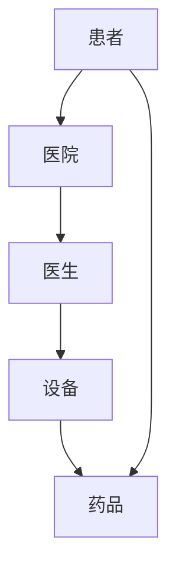
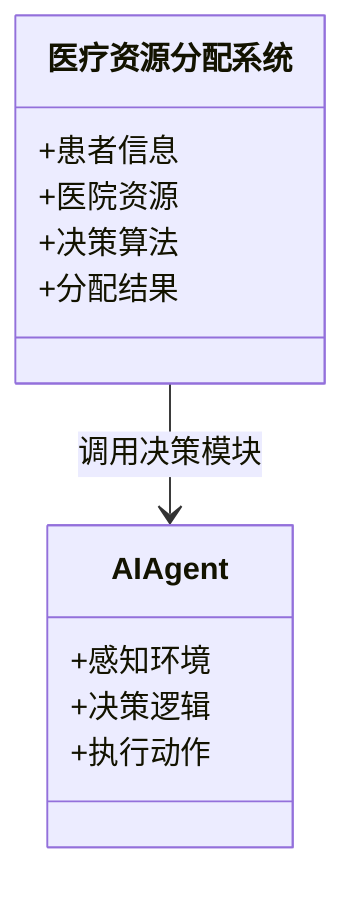
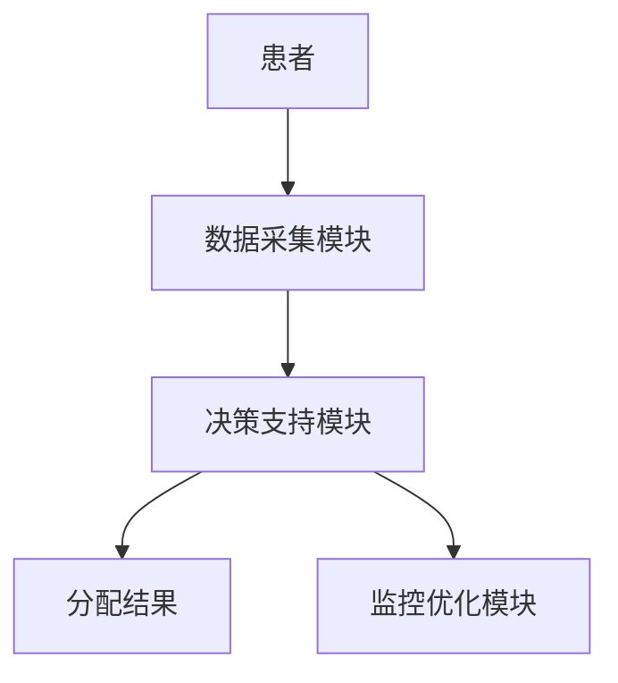

                 


# AI Agent在智能医疗资源分配中的角色

> 关键词：AI Agent, 智能医疗, 资源分配, 多智能体系统, 强化学习

> 摘要：本文深入探讨了AI Agent在智能医疗资源分配中的角色，从核心概念到算法原理，再到系统设计和实际应用，全面分析了AI Agent如何优化医疗资源分配，解决医疗资源分配中的复杂问题。通过多智能体系统、强化学习等技术手段，AI Agent能够有效提升医疗资源分配的效率和公平性，为智能医疗的发展提供了新的思路和解决方案。

---

# 第一部分: AI Agent在智能医疗资源分配中的背景与概念

## 第1章: AI Agent与智能医疗概述

### 1.1 AI Agent的基本概念

#### 1.1.1 什么是AI Agent
AI Agent（人工智能代理）是指能够感知环境、自主决策并采取行动的智能实体。它可以是一个软件程序，也可以是一个物理设备，通过传感器和执行器与环境交互。

#### 1.1.2 AI Agent的核心特征
- **自主性**：AI Agent能够在没有外部干预的情况下独立运行。
- **反应性**：能够实时感知环境并做出反应。
- **目标导向**：基于目标驱动行为。
- **学习能力**：通过数据和经验不断优化自身行为。

#### 1.1.3 AI Agent与传统医疗的区别
AI Agent能够通过数据驱动的方式进行决策，而传统医疗更多依赖于人工经验和判断。AI Agent的优势在于其高效性、精准性和可扩展性。

### 1.2 智能医疗资源分配的背景与挑战

#### 1.2.1 医疗资源分配的现状
医疗资源分配是一个复杂的系统工程，涉及医院、医生、患者、药品、设备等多个因素。传统分配方式存在效率低下、资源浪费、分配不均等问题。

#### 1.2.2 智能化分配的必要性
随着医疗需求的增加和医疗资源的有限性，传统的分配方式难以满足日益增长的需求。智能化分配能够提高资源利用效率，优化分配结果。

#### 1.2.3 当前医疗资源分配的主要问题
- **资源浪费**：部分医院设备闲置，而其他医院却需要排队。
- **分配不均**：优质资源集中在少数医院，基层医院资源不足。
- **决策复杂**：涉及多目标优化，决策难度大。

### 1.3 AI Agent在医疗资源分配中的角色

#### 1.3.1 AI Agent在医疗资源分配中的作用
AI Agent能够通过数据分析和智能决策，优化医疗资源的分配，提高资源利用效率。

#### 1.3.2 AI Agent的优势与局限性
- **优势**：高效性、精准性、可扩展性。
- **局限性**：依赖数据质量、算法复杂度高、伦理问题。

#### 1.3.3 AI Agent与人类专家的协同工作
AI Agent可以辅助人类专家进行决策，但不能完全替代人类专家。人类专家的经验和伦理判断是AI Agent无法替代的。

### 1.4 本章小结
本章介绍了AI Agent的基本概念及其在智能医疗资源分配中的作用，分析了当前医疗资源分配的主要问题，并指出了AI Agent的优势与局限性。

---

# 第二部分: AI Agent的核心概念与技术原理

## 第2章: AI Agent的核心概念与联系

### 2.1 AI Agent的核心概念

#### 2.1.1 多智能体系统
多智能体系统是指由多个智能体组成的协作系统，能够共同完成复杂任务。

#### 2.1.2 强化学习
强化学习是一种通过试错学习优化决策的算法，适用于动态环境下的资源分配问题。

#### 2.1.3 贝叶斯网络
贝叶斯网络是一种概率图模型，能够处理不确定性，适用于医疗资源分配中的风险评估。

### 2.2 AI Agent与医疗资源分配的核心要素

#### 2.2.1 医疗资源分配的实体关系图



#### 2.2.2 AI Agent与医疗资源的关系
AI Agent通过收集和分析患者、医院、医生、设备、药品等信息，优化资源分配。

#### 2.2.3 AI Agent与其他系统的交互
AI Agent需要与医院信息系统（HIS）、电子健康记录（EHR）等系统进行交互，获取和更新数据。

### 2.3 核心概念对比分析

#### 2.3.1 AI Agent与传统算法的对比

| 对比维度       | AI Agent             | 传统算法           |
|----------------|----------------------|--------------------|
| 数据依赖性     | 高                   | 低                 |
| 环境适应性     | 强                   | 弱                 |
| 决策复杂度     | 高                   | 中                 |

#### 2.3.2 不同AI Agent模型的特征对比

| 模型类型       | 强化学习             | 贝叶斯网络         |
|----------------|----------------------|--------------------|
| 适用场景       | 动态环境优化         | 风险评估与预测     |
| 决策方式       | 奖励驱动             | 概率推理           |

#### 2.3.3 医疗资源分配中的关键因素分析
关键因素包括患者需求、资源可用性、分配公平性、效率最大化等。

---

## 第3章: AI Agent的算法原理与实现

### 3.1 强化学习算法原理

#### 3.1.1 强化学习的基本概念
强化学习是一种通过试错学习优化决策的算法，适用于动态环境下的资源分配问题。

#### 3.1.2 强化学习的核心要素
- **状态（State）**：环境中的当前情况。
- **动作（Action）**：AI Agent采取的行为。
- **奖励（Reward）**：对动作的评价。
- **策略（Policy）**：决定动作选择的概率分布。

#### 3.1.3 强化学习的数学模型
$$ R(s, a) = \sum_{r \in R} P(r | s, a) r $$
其中，$R(s, a)$ 表示状态 $s$ 和动作 $a$ 下的期望奖励。

#### 3.1.4 强化学习的实现步骤
1. 初始化策略参数。
2. 与环境交互，收集状态、动作和奖励。
3. 更新策略参数，最大化期望奖励。

### 3.2 多智能体协作算法

#### 3.2.1 多智能体协作的基本概念
多智能体协作是指多个智能体协同工作，共同完成复杂任务。

#### 3.2.2 多智能体协作的实现方式
- **集中式控制**：所有智能体共享一个中心决策系统。
- **分布式控制**：每个智能体独立决策，通过通信协作。

#### 3.2.3 多智能体协作的数学模型
$$ V(s) = \max_{i} V_i(s) $$
其中，$V(s)$ 表示状态 $s$ 下的最优值，$V_i(s)$ 表示智能体 $i$ 在状态 $s$ 下的值函数。

### 3.3 实际案例分析

#### 3.3.1 病床分配案例
假设某医院有100张病床，每天需要分配给不同类型的患者。AI Agent可以通过强化学习算法，优化病床分配策略，提高患者满意度和医院资源利用率。

#### 3.3.2 医疗设备调度案例
AI Agent可以通过多智能体协作，优化医疗设备的调度，减少设备闲置和等待时间。

---

## 第4章: AI Agent在医疗资源分配中的系统设计

### 4.1 系统架构设计

#### 4.1.1 系统模块划分
- **数据采集模块**：收集患者、医院、设备等信息。
- **决策支持模块**：基于强化学习算法优化资源分配。
- **监控优化模块**：实时监控分配结果并优化调整。

#### 4.1.2 系统功能设计



#### 4.1.3 系统架构图



### 4.2 系统接口设计

#### 4.2.1 输入接口
- 患者需求数据
- 医院资源数据

#### 4.2.2 输出接口
- 分配方案
- 监控数据

#### 4.2.3 交互流程
1. 患者提交需求，数据采集模块收集信息。
2. 决策支持模块调用AI Agent进行优化分配。
3. 分配结果反馈给患者和医院。
4. 监控优化模块实时监控分配结果并调整。

### 4.3 项目实战

#### 4.3.1 环境安装
需要安装Python、TensorFlow、Keras等工具。

#### 4.3.2 核心代码实现

```python
import numpy as np
import tensorflow as tf

# 定义强化学习模型
class Agent:
    def __init__(self, state_space, action_space):
        self.state_space = state_space
        self.action_space = action_space
        self.model = self.build_model()
    
    def build_model(self):
        model = tf.keras.Sequential([
            tf.keras.layers.Dense(64, activation='relu'),
            tf.keras.layers.Dense(self.action_space, activation='softmax')
        ])
        return model
    
    def act(self, state):
        state = np.array([state])
        prediction = self.model.predict(state)
        action = np.argmax(prediction[0])
        return action

# 初始化环境
state_space = 10
action_space = 5
agent = Agent(state_space, action_space)

# 环境与智能体交互
for episode in range(100):
    state = env.reset()
    while True:
        action = agent.act(state)
        next_state, reward, done = env.step(action)
        if done:
            break
```

#### 4.3.3 案例分析与总结
通过实际案例分析，验证AI Agent在医疗资源分配中的有效性，并总结经验教训。

---

## 第5章: 优化与展望

### 5.1 现有方案的不足
- 数据依赖性高
- 算法复杂度高
- 伦理问题

### 5.2 优化方向
- 提高数据质量
- 简化算法复杂度
- 解决伦理问题

### 5.3 未来展望
随着AI技术的不断发展，AI Agent在医疗资源分配中的应用将更加广泛，优化算法和系统架构是未来研究的重点方向。

---

# 第六部分: 结语

AI Agent在智能医疗资源分配中的角色日益重要，通过多智能体系统、强化学习等技术手段，AI Agent能够有效优化资源分配，提高医疗效率和公平性。未来，随着技术的进步，AI Agent将在医疗领域发挥更大的作用。

---

# 作者：AI天才研究院 & 禅与计算机程序设计艺术

---

通过以上结构，我们可以清晰地看到AI Agent在智能医疗资源分配中的角色及其应用价值。希望本文能为读者提供有价值的参考和启发。

