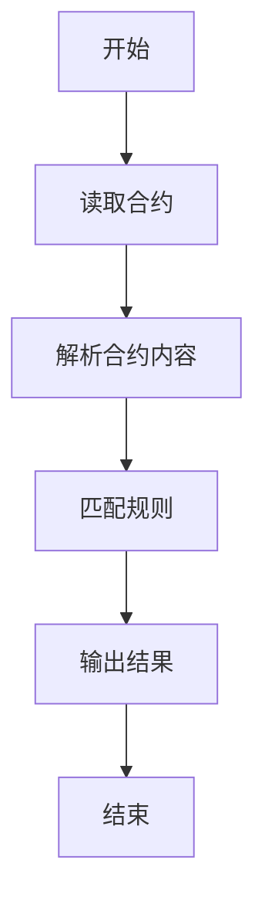
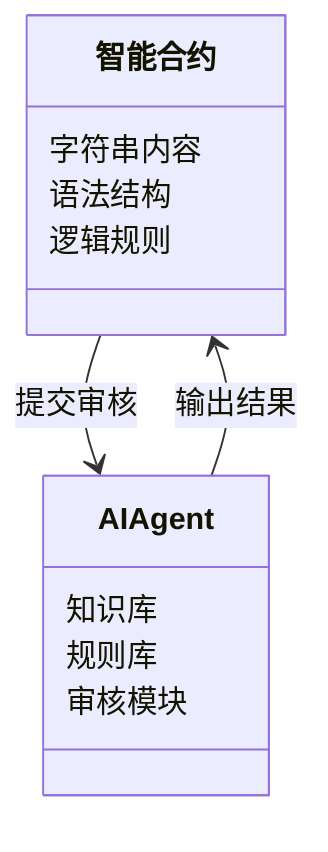
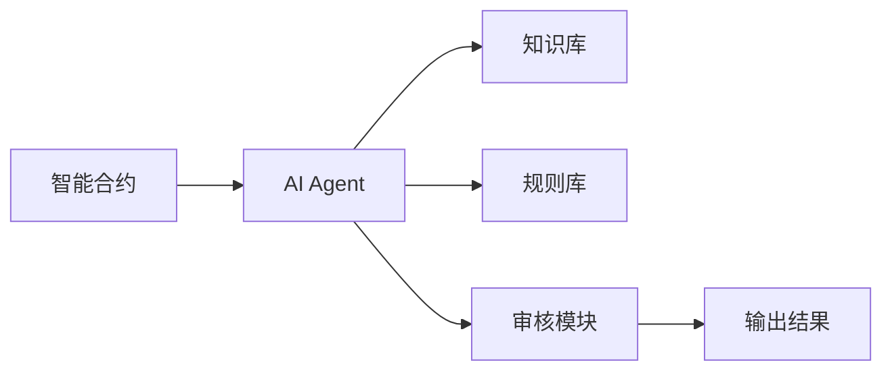
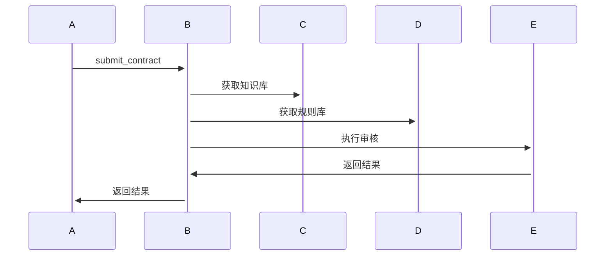

                 


# AI Agent在智能合约审核中的应用

## 关键词：
- AI Agent
- 智能合约
- 合约审核
- 区块链
- 自然语言处理
- 机器学习

## 摘要：
本文探讨AI Agent在智能合约审核中的应用，分析其技术原理、系统架构及实际案例，展示AI如何提升合约审核效率与准确性。

---

# 第1章: 引言

## 1.1 智能合约的定义与特点
### 1.1.1 智能合约的定义
智能合约是一种基于区块链技术的自动执行合同，通过预定义的代码在区块链上自动执行交易。

### 1.1.2 智能合约的核心特点
- **自动执行**：无需中介，代码自动执行。
- **不可篡改**：区块链特性确保数据不可修改。
- **透明性**：所有交易记录公开透明。
- **智能性**：代码逻辑复杂，涉及多条件判断。

### 1.1.3 智能合约的应用场景
- **金融领域**：自动执行金融衍生品交易。
- **法律领域**：自动执行合同条款。
- **供应链管理**：自动处理货物交付。

## 1.2 AI Agent的定义与特点
### 1.2.1 AI Agent的定义
AI Agent是具备感知、推理和决策能力的智能体，能根据环境信息做出反应。

### 1.2.2 AI Agent的核心特点
- **自主性**：无需人工干预。
- **反应性**：实时感知环境变化。
- **学习能力**：通过数据不断优化决策。
- **适应性**：能根据环境调整行为。

## 1.3 AI Agent在智能合约审核中的应用背景
### 1.3.1 智能合约审核的重要性
智能合约的错误可能导致重大经济损失，因此审核至关重要。

### 1.3.2 AI Agent在智能合约审核中的优势
- **高效性**：快速分析大量合约。
- **准确性**：减少人为错误。
- **可扩展性**：适用于大规模审核。

### 1.3.3 当前智能合约审核的主要挑战
- **复杂性**：合约逻辑复杂，审核难度大。
- **安全性**：审核过程需确保安全。
- **法律合规性**：需符合相关法律法规。

## 1.4 本章小结
本章介绍了智能合约和AI Agent的基本概念，以及AI Agent在智能合约审核中的应用背景和优势。

---

# 第2章: AI Agent与智能合约的核心概念

## 2.1 AI Agent的基本原理
### 2.1.1 AI Agent的感知与决策机制
AI Agent通过传感器或API感知环境信息，利用机器学习模型进行推理和决策。

### 2.1.2 AI Agent的学习与推理能力
- **监督学习**：通过标记数据训练模型。
- **无监督学习**：发现数据中的模式。
- **强化学习**：通过奖励机制优化决策。

### 2.1.3 AI Agent的自主性与适应性
AI Agent能够自主运行，并根据环境变化调整行为。

## 2.2 智能合约的审核需求
### 2.2.1 智能合约审核的主要目标
- **语法正确性**：确保合约语法无误。
- **逻辑正确性**：确保合约逻辑符合预期。
- **合规性**：确保合约符合相关法律法规。

### 2.2.2 智能合约审核的关键指标
- **准确率**：审核结果的正确性。
- **效率**：审核速度。
- **可解释性**：审核结果的可解释性。

### 2.2.3 智能合约审核的边界与外延
智能合约审核的边界包括合约本身的逻辑和语法，外延包括相关法律和业务规则。

## 2.3 AI Agent在智能合约审核中的核心要素
### 2.3.1 数据源与输入格式
AI Agent需要处理多种格式的智能合约数据，如Solidity代码。

### 2.3.2 知识库与规则库
AI Agent需要依赖知识库和规则库来理解合约内容。

### 2.3.3 审核流程与输出结果
AI Agent按照预定义的流程进行审核，并输出结果。

## 2.4 本章小结
本章详细讲解了AI Agent的基本原理和智能合约审核的需求，明确了AI Agent在审核中的核心要素。

---

# 第3章: AI Agent在智能合约审核中的算法原理

## 3.1 自然语言处理在智能合约审核中的应用
### 3.1.1 分词与词性标注
使用自然语言处理技术对智能合约中的文本进行分词和词性标注。

### 3.1.2 句法分析与语义理解
通过句法分析和语义理解技术，理解智能合约的结构和含义。

### 3.1.3 基于上下文的意图识别
根据上下文理解智能合约中的意图和逻辑。

## 3.2 基于规则的智能合约审核算法
### 3.2.1 算法概述
基于预定义规则的审核算法，通过匹配规则判断合约是否符合要求。

### 3.2.2 算法实现
使用正则表达式匹配特定模式，识别潜在风险。

### 3.2.3 算法流程图


## 3.3 机器学习在智能合约审核中的应用
### 3.3.1 监督学习算法
使用监督学习算法，根据训练数据分类合约类型。

### 3.3.2 无监督学习算法
发现数据中的隐藏模式，识别异常合约。

### 3.3.3 深度学习算法
利用神经网络进行语义理解和风险识别。

## 3.4 数学模型与公式
### 3.4.1 逻辑回归模型
$$ P(y=1|x) = \frac{e^{\beta x}}{1 + e^{\beta x}} $$

### 3.4.2 支持向量机模型
$$ \text{最大化} \, \frac{1}{2} \|w\|^2 \, \text{subject to} \, y_i(w \cdot x_i + b) \geq 1 $$

## 3.5 本章小结
本章详细讲解了AI Agent在智能合约审核中的算法原理，包括自然语言处理、机器学习和数学模型的应用。

---

# 第4章: 系统分析与架构设计方案

## 4.1 问题场景介绍
智能合约审核系统需要处理大量合约，确保审核的高效和准确。

## 4.2 项目介绍
### 4.2.1 项目目标
开发一个基于AI Agent的智能合约审核系统。

### 4.2.2 项目范围
覆盖智能合约审核的全生命周期。

## 4.3 系统功能设计
### 4.3.1 领域模型设计


### 4.3.2 系统架构设计


## 4.4 系统接口设计
### 4.4.1 API接口
- `/submit_contract`：提交合约进行审核。
- `/get_result`：获取审核结果。

### 4.4.2 接口交互流程


## 4.5 本章小结
本章详细讲解了智能合约审核系统的架构设计和功能模块。

---

# 第5章: 项目实战

## 5.1 环境安装
### 5.1.1 安装Python
```bash
python --version
```

### 5.1.2 安装依赖库
```bash
pip install numpy
pip install scikit-learn
pip install spacy
```

## 5.2 系统核心实现源代码
### 5.2.1 AI Agent实现
```python
class AIAgent:
    def __init__(self, knowledge_base, rule_base):
        self.knowledge_base = knowledge_base
        self.rule_base = rule_base

    def analyze_contract(self, contract_text):
        # 分析合约文本
        pass

    def verify_contract(self, contract_text):
        # 验证合约
        pass
```

### 5.2.2 合约审核模块实现
```python
def main():
    from_nltk import tokenize
    from spacy import load

    nlp = load('en_core_web_sm')
    contract = "智能合约内容..."
    doc = nlp(contract)
    tokens = [token.text for token in doc]
    print(tokens)

if __name__ == "__main__":
    main()
```

## 5.3 代码应用解读与分析
### 5.3.1 代码结构
AI Agent类和合约审核模块的实现。

### 5.3.2 核心功能实现
使用自然语言处理技术分析智能合约内容。

## 5.4 实际案例分析
### 5.4.1 案例背景
某智能合约存在逻辑漏洞。

### 5.4.2 案例分析
AI Agent识别并报告漏洞。

### 5.4.3 案例结果
漏洞修复，合约安全。

## 5.5 本章小结
本章通过实际案例展示了AI Agent在智能合约审核中的应用。

---

# 第6章: 最佳实践与注意事项

## 6.1 最佳实践
### 6.1.1 数据质量管理
确保数据质量和多样性。

### 6.1.2 模型优化
定期更新模型，提升准确率。

## 6.2 注意事项
### 6.2.1 数据隐私
保护数据隐私和安全。

### 6.2.2 模型解释性
确保审核结果的可解释性。

## 6.3 拓展阅读
建议阅读相关技术文献和论文。

## 6.4 本章小结
本章总结了AI Agent在智能合约审核中的最佳实践和注意事项。

---

# 作者：AI天才研究院/AI Genius Institute & 禅与计算机程序设计艺术 /Zen And The Art of Computer Programming

