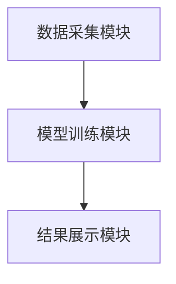
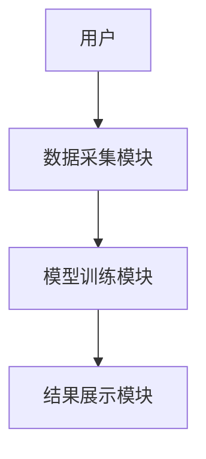
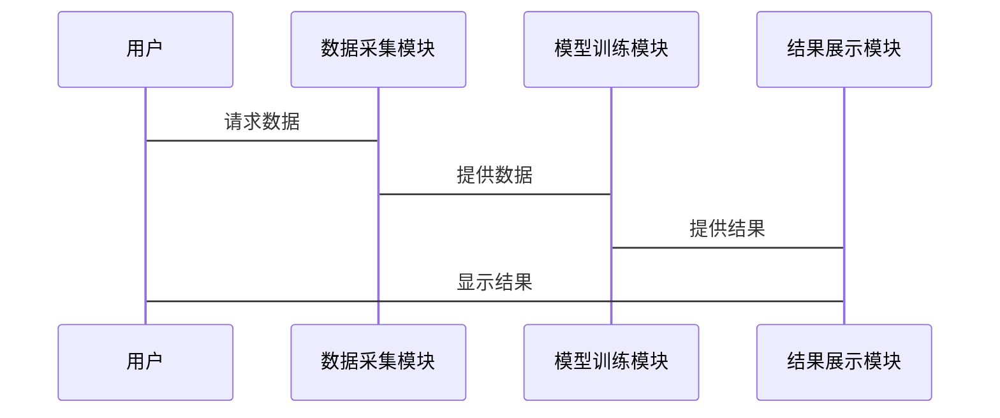

                 


# AI Agent在智能商业选址中的应用

## 关键词：AI Agent，智能商业选址，强化学习，遗传算法，商业决策

## 摘要：本文探讨了AI Agent在智能商业选址中的应用，分析了AI Agent的核心概念、算法原理及其在商业选址中的实际应用。通过数学建模和算法实现，结合具体案例，详细讲解了AI Agent如何帮助企业在复杂多变的市场环境中做出更高效的选址决策。

---

# 第一章: AI Agent与智能商业选址概述

## 1.1 AI Agent的基本概念

### 1.1.1 AI Agent的定义与核心特征

AI Agent（人工智能代理）是一种能够感知环境、自主决策并采取行动的智能实体。在商业选址中，AI Agent能够通过分析地理位置、市场需求、竞争环境等多种因素，为决策者提供最优的选址建议。

**AI Agent的核心特征：**

1. **自主性**：AI Agent能够在无需人工干预的情况下独立运行。
2. **反应性**：能够实时感知环境变化并做出相应反应。
3. **目标导向性**：基于预设目标进行决策和行动。
4. **学习能力**：通过数据和经验不断优化自身的决策能力。

### 1.1.2 AI Agent与传统选址方法的区别

传统商业选址方法主要依赖人工分析和经验判断，而AI Agent通过大数据分析和机器学习算法，能够更快速、更准确地进行选址优化。

**对比表格：**

| **特征**       | **传统选址方法**              | **AI Agent**                     |
|----------------|------------------------------|----------------------------------|
| 数据来源       | 主要依赖人工调研和经验          | 利用大数据和机器学习模型          |
| 决策速度       | 较慢，依赖人工分析             | 较快，基于算法自动计算            |
| 精确性         | 受限于经验的局限性             | 基于大量数据和算法，精确性高        |
| 可扩展性       | 较差，难以应对大规模数据       | 良好，能够处理海量数据             |

### 1.1.3 AI Agent在商业选址中的优势

1. **高效性**：AI Agent能够在短时间内处理大量数据，快速得出最优解。
2. **准确性**：通过机器学习算法，AI Agent能够发现数据中的潜在规律，提供更精准的选址建议。
3. **适应性**：AI Agent能够根据市场变化动态调整选址策略，提高企业应对市场变化的能力。

## 1.2 智能商业选址的背景与现状

### 1.2.1 商业选址的传统方法与局限性

传统商业选址方法主要包括重心法、因子评分法和层次分析法等。这些方法在一定程度上能够帮助企业进行选址决策，但存在以下局限性：

1. **数据依赖性**：传统方法依赖人工调研，数据收集成本高且耗时。
2. **主观性**：决策过程受调研人员经验的影响，结果可能存在主观偏差。
3. **动态适应性差**：市场环境变化时，传统方法难以快速调整选址策略。

### 1.2.2 智能化选址的兴起与发展趋势

随着大数据和人工智能技术的快速发展，智能化选址逐渐成为商业决策的重要趋势。AI Agent通过整合地理位置数据、消费者行为数据和市场趋势数据，能够为商业选址提供更高效、更精准的解决方案。

### 1.2.3 当前商业选址中的主要挑战

1. **数据质量问题**：数据的准确性和完整性直接影响选址决策的准确性。
2. **算法复杂性**：复杂的算法对企业的技术能力和计算资源提出更高要求。
3. **动态变化的市场环境**：市场环境的快速变化对选址决策的实时性和动态调整能力提出更高要求。

## 1.3 AI Agent在商业选址中的应用前景

### 1.3.1 AI Agent的核心应用场景

1. **零售业**：通过分析消费者行为数据，帮助企业在最优位置开设新门店。
2. **餐饮业**：基于地理位置和消费者偏好，优化餐厅选址。
3. **物流业**：通过AI Agent优化物流中心的选址，降低运营成本。

### 1.3.2 AI Agent对商业选址效率的提升

AI Agent能够快速处理海量数据，发现潜在的选址规律，显著提升选址决策的效率和准确性。

### 1.3.3 AI Agent在不同行业中的潜力

不同行业对选址的需求和侧重点有所不同，但AI Agent的核心优势在于其强大的数据处理能力和智能决策能力，能够为各个行业的选址提供优化解决方案。

---

# 第二章: AI Agent的核心概念与算法原理

## 2.1 AI Agent的分类与特征

### 2.1.1 基于规则的AI Agent

基于规则的AI Agent通过预设的规则和逻辑进行决策。虽然简单易懂，但其灵活性和适应性较差。

### 2.1.2 基于机器学习的AI Agent

基于机器学习的AI Agent能够通过学习历史数据和模式，自动调整和优化决策策略。

### 2.1.3 基于强化学习的AI Agent

基于强化学习的AI Agent通过与环境的交互，不断尝试和优化决策策略，最终找到最优解。

### 2.1.4 AI Agent的分类对比

| **分类**           | **基于规则的AI Agent** | **基于机器学习的AI Agent** | **基于强化学习的AI Agent** |
|--------------------|-------------------------|-----------------------------|-----------------------------|
| 决策方式           | 预设规则               | 学习数据模式               | 与环境交互，试错优化       |
| 灵活性             | 较低                   | 较高                       | 最高                       |
| 适应性             | 较差                   | 良好                       | 优秀                       |

## 2.2 AI Agent的决策机制

### 2.2.1 状态空间与动作空间的定义

- **状态空间**：AI Agent所处的环境状态，例如地理位置、市场需求等。
- **动作空间**：AI Agent可以采取的动作，例如选择某个地理位置作为候选点。

### 2.2.2 奖励函数的设计

奖励函数用于衡量AI Agent决策的好坏，通常以最大化奖励为目标。

$$ \text{奖励函数} = \text{收益} - \text{成本} $$

### 2.2.3 策略选择与优化

AI Agent通过不断选择和优化策略，以最大化奖励函数的值。

## 2.3 AI Agent的算法原理

### 2.3.1 强化学习算法（如Q-Learning）

Q-Learning是一种经典的强化学习算法，通过更新Q值表来优化决策策略。

**Q-Learning算法流程：**

1. **初始化**：设置Q值表为0。
2. **选择动作**：根据当前状态选择一个动作。
3. **执行动作**：执行动作并观察环境的反馈。
4. **更新Q值**：根据奖励函数更新Q值表。
5. **重复**：直到达到终止条件。

### 2.3.2 遗传算法（GA）与模拟退火（SA）

**遗传算法**通过模拟自然选择的过程，逐步优化解的质量。

**模拟退火**通过逐步降低温度，跳出局部最优，找到全局最优解。

### 2.3.3 其他相关算法（如DQN）

深度强化学习（DQN）通过深度神经网络和强化学习的结合，进一步提升AI Agent的决策能力。

---

# 第三章: AI Agent在商业选址中的数学模型与算法实现

## 3.1 商业选址的数学模型

### 3.1.1 商业选址问题的建模

商业选址问题可以建模为一个优化问题，目标是最小化成本或最大化收益。

$$ \text{目标函数} = \sum_{i=1}^{n} c_i x_i + \sum_{j=1}^{m} d_j y_j $$

其中，$c_i$表示第i个候选点的成本，$x_i$为0-1变量（0表示不选，1表示选），$d_j$表示第j个需求点的收益，$y_j$为0-1变量（0表示不满足，1表示满足）。

### 3.1.2 约束条件

1. **资源约束**：

$$ \sum_{i=1}^{n} x_i \leq k $$

其中，$k$表示可选的候选点数量。

2. **覆盖约束**：

$$ \sum_{j=1}^{m} y_j \geq t $$

其中，$t$表示需要满足的需求点数量。

### 3.1.3 数学模型的求解

通过优化算法（如遗传算法或强化学习算法）对数学模型进行求解，找到最优解。

## 3.2 算法实现的步骤

### 3.2.1 强化学习算法实现步骤

1. **初始化**：设置Q值表为0。
2. **选择动作**：根据当前状态选择一个动作。
3. **执行动作**：执行动作并观察环境的反馈。
4. **更新Q值**：根据奖励函数更新Q值表。
5. **重复**：直到达到终止条件。

### 3.2.2 遗传算法实现步骤

1. **编码**：将候选点编码为基因。
2. **选择**：选择适应度较高的个体。
3. **交叉**：进行基因交叉，生成新的个体。
4. **变异**：随机进行基因变异，增加多样性。
5. **适应度评估**：评估新个体的适应度。
6. **重复**：直到达到终止条件。

---

# 第四章: 系统分析与架构设计方案

## 4.1 系统功能设计

### 4.1.1 数据采集模块

负责采集地理位置数据、市场需求数据、竞争环境数据等。

### 4.1.2 模型训练模块

基于采集的数据，训练AI Agent的决策模型。

### 4.1.3 结果展示模块

将AI Agent的决策结果以可视化的方式展示给用户。

### 4.1.4 系统功能模块图



## 4.2 系统架构设计

### 4.2.1 系统架构图



### 4.2.2 系统接口设计

1. **数据接口**：与数据源进行数据交互。
2. **算法接口**：与AI Agent算法进行交互。
3. **用户接口**：与最终用户进行交互。

### 4.2.3 系统交互流程图



---

# 第五章: 项目实战

## 5.1 环境安装

### 5.1.1 安装Python

```bash
# 安装Python
sudo apt-get install python3
```

### 5.1.2 安装相关库

```bash
# 安装numpy和pandas
pip install numpy pandas
# 安装机器学习库
pip install scikit-learn
```

## 5.2 核心实现代码

### 5.2.1 强化学习代码

```python
import numpy as np

class AI_Agent:
    def __init__(self, state_space_size, action_space_size):
        self.q_table = np.zeros((state_space_size, action_space_size))
    
    def choose_action(self, state):
        return np.argmax(self.q_table[state])
    
    def update_q_table(self, state, action, reward):
        self.q_table[state][action] += reward

# 初始化AI Agent
agent = AI_Agent(state_space_size=10, action_space_size=5)

# 训练过程
for episode in range(100):
    state = 0
    action = agent.choose_action(state)
    reward = 1  # 假设奖励为1
    agent.update_q_table(state, action, reward)
```

### 5.2.2 遗传算法代码

```python
import numpy as np

def fitness(candidates):
    # 计算适应度
    return np.random.random()

def genetic_algorithm(population_size, generations):
    population = np.random.random((population_size, 2))
    for _ in range(generations):
        fitness = [fitness(individual) for individual in population]
        # 选择
        selected = population[np.argsort(-fitness)]
        # 交叉
        for i in range(0, population_size, 2):
            if np.random.random() < 0.5:
                p1, p2 = selected[i], selected[i+1]
                p1[0], p2[0] = p2[0], p1[0]
                population[i], population[i+1] = p1, p2
        # 变异
        for i in range(population_size):
            if np.random.random() < 0.1:
                population[i][1] += np.random.random() * 0.1
    return population

# 运行遗传算法
result = genetic_algorithm(population_size=10, generations=10)
```

## 5.3 实际案例分析

### 5.3.1 案例背景

假设我们为一家零售店选择最优的地理位置。

### 5.3.2 数据分析

通过分析周边地区的消费者行为数据、交通流量数据等，确定候选点。

### 5.3.3 算法实现

结合强化学习和遗传算法，优化候选点的排序，最终选择最优的地理位置。

### 5.3.4 结果展示

通过可视化工具展示AI Agent的决策结果，并与传统方法的结果进行对比。

---

# 第六章: 总结与展望

## 6.1 本章小结

AI Agent通过强大的数据处理能力和智能决策能力，显著提升了商业选址的效率和准确性。本文详细介绍了AI Agent的核心概念、算法原理及其在商业选址中的实际应用。

## 6.2 最佳实践 tips

1. **数据质量**：确保数据的准确性和完整性。
2. **算法选择**：根据具体问题选择合适的算法。
3. **模型优化**：通过不断优化模型参数，提高决策的准确性。
4. **动态调整**：根据市场变化动态调整选址策略。

## 6.3 注意事项

1. AI Agent的应用需要大量的数据支持，数据不足可能导致决策偏差。
2. 算法的复杂性可能对企业的技术能力和计算资源提出更高要求。
3. 市场环境的变化可能会影响AI Agent的决策效果。

## 6.4 拓展阅读

1. 《强化学习入门》
2. 《遗传算法与工程优化》
3. 《机器学习在商业中的应用》

---

# 作者：AI天才研究院/AI Genius Institute & 禅与计算机程序设计艺术 /Zen And The Art of Computer Programming

