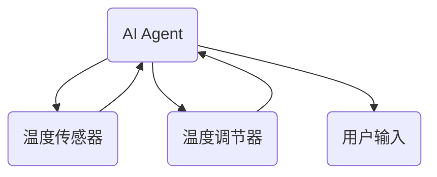

                 

# AI Agent在智能围巾中的温度调节

> 关键词：AI Agent, 智能围巾, 温度调节, 机器学习, 强化学习, 物联网, 边缘计算

> 摘要：本文探讨了AI Agent在智能围巾中的温度调节应用，从背景介绍到系统设计，详细分析了AI Agent的基本原理、算法实现、系统架构及实际案例。通过技术博客的形式，系统阐述了AI Agent如何帮助智能围巾实现智能化温度调节，为读者提供了全面的技术视角。

---

# 第1章: 背景介绍与问题定义

## 1.1 智能围巾与温度调节的背景

### 1.1.1 传统围巾的局限性
传统围巾仅提供基础的保暖功能，无法根据环境变化和用户需求进行智能调节，存在舒适度和效率上的不足。

### 1.1.2 智能化温度调节的需求
随着科技的发展，用户对智能设备的需求增加，智能温度调节成为提升生活质量的重要方向。

### 1.1.3 AI Agent在智能围巾中的作用
AI Agent通过实时感知和学习，优化温度调节策略，提供个性化的解决方案。

## 1.2 温度调节系统的核心问题

### 1.2.1 温度感知与反馈机制
智能围巾需要准确感知环境和用户的体温变化，建立有效的反馈机制。

### 1.2.2 个性化温度调节需求
不同用户对温度的敏感度不同，系统需具备个性化调节能力。

### 1.2.3 环境变化对温度调节的影响
外界环境如温度、湿度的变化要求系统能够动态调整。

## 1.3 AI Agent在温度调节中的应用前景

### 1.3.1 智能温度调节的优势
AI Agent能够实时学习和优化，提供精准的温度调节。

### 1.3.2 AI Agent在智能围巾中的创新点
结合AI技术，实现智能化、个性化的温度管理。

### 1.3.3 温度调节系统的边界与外延
明确系统的功能范围和扩展方向。

## 1.4 本章小结
本章介绍了智能围巾温度调节的背景、核心问题及AI Agent的应用前景，为后续章节奠定基础。

---

# 第2章: AI Agent与温度调节的核心概念

## 2.1 AI Agent的基本原理

### 2.1.1 AI Agent的定义与分类
AI Agent是能够感知环境并采取行动以实现目标的智能体，分为简单反射Agent和基于模型的Agent。

### 2.1.2 AI Agent的核心属性与特征
包括自主性、反应性、主动性、社会性和学习性。

### 2.1.3 AI Agent在智能围巾中的具体实现
通过传感器和执行机构实现温度调节。

## 2.2 温度调节系统的概念模型

### 2.2.1 温度调节系统的组成要素
包括传感器、AI Agent、执行器和用户界面。

### 2.2.2 系统功能与目标的关系
系统目标是提供舒适温度，功能包括感知、决策和执行。

### 2.2.3 系统核心概念的结构化分析
通过层级结构展示各部分的关系。

## 2.3 AI Agent与温度调节系统的实体关系

## 2.4 本章小结
本章详细介绍了AI Agent的基本原理和温度调节系统的概念模型，展示了各部分的实体关系。

---

# 第3章: AI Agent的算法原理与实现

## 3.1 AI Agent的核心算法

### 3.1.1 强化学习算法
通过奖励机制优化决策过程。

### 3.1.2 机器学习算法
利用历史数据训练模型，实现预测和分类。

### 3.1.3 简单比例积分微分（PID）控制算法
用于实时控制温度调节器。

## 3.2 算法实现的详细步骤

### 3.2.1 数据采集与预处理
收集环境和用户数据，进行清洗和特征提取。

### 3.2.2 算法模型的训练与优化
选择合适算法，调整参数，进行交叉验证。

### 3.2.3 算法的实时应用与反馈
在智能围巾中实时运行算法，根据反馈调整策略。

## 3.3

---

通过以上章节，我们系统地探讨了AI Agent在智能围巾温度调节中的应用，从背景到实现，逐步展开，为读者提供了全面的技术视角。

