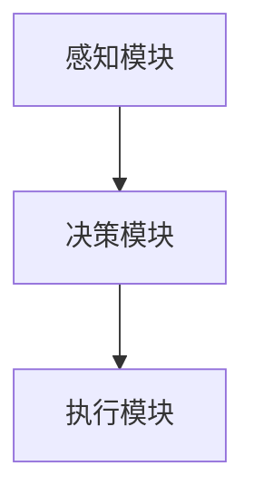
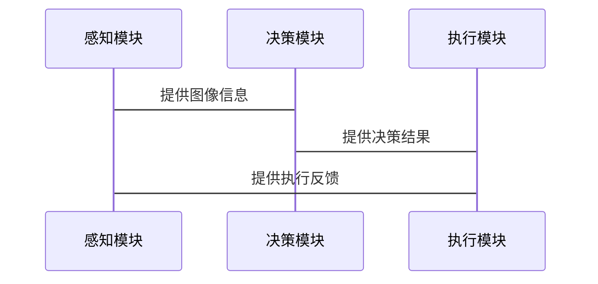

                 


# AI Agent在智能图像处理中的应用

> 关键词：AI Agent, 智能图像处理, 目标检测, 图像分割, 深度学习, 机器学习

> 摘要：本文深入探讨了AI Agent在智能图像处理中的应用，分析了其核心概念、算法原理、系统架构，并通过实际案例展示了其在不同场景下的应用效果。文章从背景介绍到系统设计，从算法实现到项目实战，全面阐述了AI Agent在智能图像处理中的技术细节和应用价值。

---

## 第1章: AI Agent与智能图像处理概述

### 1.1 AI Agent的基本概念
AI Agent，即人工智能代理，是指能够感知环境、自主决策并执行任务的智能体。其核心特点包括自主性、反应性、目标导向性和学习能力。

#### 1.1.1 AI Agent的定义与特点
- **定义**：AI Agent是一种智能系统，能够通过感知环境信息，自主决策并执行任务，以实现特定目标。
- **特点**：
  - **自主性**：能够在无外部干预的情况下独立运行。
  - **反应性**：能够实时感知环境变化并做出响应。
  - **目标导向性**：所有行为均以实现特定目标为导向。
  - **学习能力**：能够通过经验改进自身的决策和执行能力。

#### 1.1.2 AI Agent的核心功能与分类
- **核心功能**：
  - 感知：通过传感器或数据输入获取环境信息。
  - 决策：基于感知信息，选择最优行动方案。
  - 执行：根据决策结果执行具体操作。
- **分类**：
  - **反应式AI Agent**：基于当前感知做出即时反应。
  - **认知式AI Agent**：具备推理、规划和学习能力。
  - **协作式AI Agent**：能够与其他AI Agent或人类协同工作。

#### 1.1.3 AI Agent与传统图像处理的区别
- **传统图像处理**：主要依赖手动设定的规则和算法，处理方式固定，难以应对复杂场景。
- **AI Agent的图像处理**：结合感知、决策和执行能力，能够自适应地处理复杂场景，具有更强的灵活性和智能性。

### 1.2 智能图像处理的定义与应用
#### 1.2.1 智能图像处理的基本概念
智能图像处理是结合人工智能技术的图像处理方式，能够通过学习和自适应算法，实现更复杂的图像分析和处理任务。

#### 1.2.2 智能图像处理的主要技术
- **目标检测**：识别图像中的目标物体并确定其位置和大小。
- **图像分割**：将图像分割为多个区域，每个区域具有相似的特征。
- **图像识别**：识别图像中的物体或场景，并将其分类到预定义的类别中。
- **图像生成**：通过生成对抗网络等技术，生成逼真的图像。

#### 1.2.3 智能图像处理的典型应用领域
- **医疗影像分析**：辅助医生进行疾病诊断和治疗方案制定。
- **自动驾驶**：通过图像处理技术识别道路、车辆和行人。
- **安防监控**：实时监控视频流，识别异常行为和潜在威胁。
- **工业检测**：检测生产过程中的缺陷和质量问题。

### 1.3 AI Agent在智能图像处理中的作用
#### 1.3.1 AI Agent在图像处理中的优势
- **自主性**：能够在无外部干预的情况下独立完成图像处理任务。
- **适应性**：能够根据环境变化自适应地调整处理策略。
- **高效性**：通过学习和优化算法，提高图像处理的效率和准确性。

#### 1.3.2 AI Agent与图像处理技术的结合
- **感知层**：通过摄像头或其他传感器获取图像信息。
- **决策层**：基于图像信息进行分析和判断，制定处理策略。
- **执行层**：根据决策结果执行具体的图像处理操作。

#### 1.3.3 AI Agent在图像处理中的应用场景
- **实时监控**：在实时视频流中快速识别和跟踪目标。
- **智能编辑**：根据用户需求自动生成或修改图像内容。
- **自动化处理**：无需人工干预，自动完成图像的分析和处理任务。

---

## 第2章: AI Agent的核心概念与原理

### 2.1 AI Agent的感知层
#### 2.1.1 感知层的基本功能
感知层是AI Agent获取环境信息的关键部分，主要通过传感器或数据输入接口实现。

#### 2.1.2 常见的感知技术
- **计算机视觉技术**：如图像识别、目标检测等。
- **自然语言处理技术**：用于文本信息的感知与理解。
- **传感器数据融合技术**：将多种传感器数据进行融合，提高感知的准确性和可靠性。

#### 2.1.3 感知层的实现方式
- **基于深度学习的感知**：使用卷积神经网络（CNN）等深度学习模型进行图像识别和分析。
- **基于传统算法的感知**：如SIFT、Harris角点检测等传统图像处理算法。

### 2.2 AI Agent的决策层
#### 2.2.1 决策层的基本原理
决策层是AI Agent根据感知信息做出决策的核心部分，通常基于概率论、逻辑推理或强化学习等方法。

#### 2.2.2 常见的决策算法
- **基于规则的决策**：根据预定义的规则进行决策。
- **基于概率的决策**：通过计算概率分布进行决策。
- **基于强化学习的决策**：通过与环境的交互，学习最优决策策略。

#### 2.2.3 决策层的实现方式
- **决策树**：通过构建决策树进行分类和回归。
- **支持向量机（SVM）**：用于分类任务的决策。
- **神经网络**：使用深度神经网络进行复杂的决策任务。

### 2.3 AI Agent的执行层
#### 2.3.1 执行层的基本功能
执行层是AI Agent根据决策结果执行具体操作的部分，通常通过执行器或执行机构实现。

#### 2.3.2 常见的执行技术
- **机器人控制**：通过AI Agent控制机器人执行具体任务。
- **自动化系统控制**：如自动化的生产线控制。
- **智能设备控制**：如智能家居设备的控制。

#### 2.3.3 执行层的实现方式
- **基于规则的执行**：根据预定义的规则执行具体操作。
- **基于反馈的执行**：根据执行结果的反馈调整执行策略。
- **基于优化算法的执行**：通过优化算法选择最优的执行方案。

### 2.4 AI Agent的协同与通信
#### 2.4.1 AI Agent之间的协同机制
- **分布式协同**：多个AI Agent协同工作，各自负责一部分任务。
- **集中式协同**：所有AI Agent通过中央控制系统协同工作。
- **混合式协同**：结合分布式和集中式的特点，实现灵活的协同方式。

#### 2.4.2 AI Agent与外部系统的通信方式
- **基于消息队列的通信**：如Kafka、RabbitMQ等。
- **基于RPC的通信**：如gRPC、Thrift等。
- **基于HTTP的通信**：通过RESTful API进行通信。

#### 2.4.3 协同与通信的实现方式
- **消息传递机制**：通过消息队列实现AI Agent之间的信息传递。
- **服务调用机制**：通过RPC或HTTP API实现AI Agent之间的服务调用。
- **事件驱动机制**：通过事件触发机制实现AI Agent之间的协同。

### 2.5 本章小结
本章详细介绍了AI Agent的核心概念与原理，包括感知层、决策层和执行层的功能与实现方式，以及AI Agent之间的协同与通信机制。这些内容为后续章节的算法实现和系统设计奠定了基础。

---

## 第3章: 智能图像处理的核心算法与原理

### 3.1 常见的图像处理算法
#### 3.1.1 图像分割算法
图像分割是将图像分割为多个区域，每个区域具有相似的特征。

#### 3.1.2 目标检测算法
目标检测是识别图像中的目标物体并确定其位置和大小。

#### 3.1.3 图像识别算法
图像识别是识别图像中的物体或场景，并将其分类到预定义的类别中。

### 3.2 AI Agent在图像处理中的算法选择
#### 3.2.1 算法选择的依据
- **任务需求**：根据具体任务需求选择合适的算法。
- **数据规模**：根据数据规模选择适合的算法。
- **计算资源**：根据计算资源选择适合的算法。

#### 3.2.2 算法性能的评估指标
- **准确率**：算法正确识别目标的能力。
- **召回率**：算法正确识别目标的比例。
- **F1分数**：综合准确率和召回率的指标。

#### 3.2.3 算法优化的策略
- **模型优化**：通过剪枝、量化等技术优化模型。
- **训练优化**：通过学习率调整、批量归一化等技术优化训练过程。
- **推理优化**：通过并行计算、内存优化等技术优化推理过程。

### 3.3 基于深度学习的图像处理算法
#### 3.3.1 卷积神经网络（CNN）在图像处理中的应用
- **CNN的基本结构**：卷积层、池化层、全连接层等。
- **CNN的应用场景**：图像识别、目标检测、图像分割等。

#### 3.3.2 图像分割算法的实现原理
- **U-Net网络**：广泛应用于医学图像分割。
- **Mask R-CNN**：结合目标检测和分割的网络。

#### 3.3.3 目标检测算法的实现原理
- **YOLO算法**：实时目标检测算法，具有高效性和准确性。
- **Faster R-CNN**：基于区域建议的检测算法。

### 3.4 本章小结
本章详细介绍了常见的图像处理算法，包括图像分割、目标检测和图像识别等，并探讨了AI Agent在图像处理中的算法选择和优化策略。通过深度学习算法的实现原理和应用场景，为后续章节的系统设计和项目实战奠定了基础。

---

## 第4章: 系统分析与架构设计

### 4.1 问题场景介绍
一个典型的AI Agent图像处理系统需要具备感知、决策和执行能力，能够实时处理图像信息并做出相应的反应。

### 4.2 系统功能设计
#### 4.2.1 领域模型设计
- **功能模块**：感知模块、决策模块、执行模块。
- **模块关系**：感知模块负责获取图像信息，决策模块负责分析和判断，执行模块负责执行具体操作。

#### 4.2.2 系统功能流程
1. 感知模块获取图像信息。
2. 决策模块分析图像信息并做出决策。
3. 执行模块根据决策结果执行具体操作。

### 4.3 系统架构设计
#### 4.3.1 系统架构图


#### 4.3.2 模块交互流程
1. 感知模块通过摄像头获取图像信息。
2. 决策模块对图像信息进行分析和判断。
3. 执行模块根据决策结果执行具体操作。

### 4.4 系统接口设计
- **感知模块接口**：提供图像获取接口。
- **决策模块接口**：提供图像分析和决策接口。
- **执行模块接口**：提供操作执行接口。

### 4.5 系统交互流程


### 4.6 本章小结
本章详细介绍了AI Agent图像处理系统的架构设计和功能设计，通过模块化设计和接口设计，明确了各部分的功能和交互流程。

---

## 第5章: 项目实战

### 5.1 项目概述
本项目旨在实现一个基于AI Agent的图像处理系统，能够实时处理图像信息并做出相应的反应。

### 5.2 环境搭建
#### 5.2.1 系统需求
- **硬件需求**：高性能计算机、摄像头等。
- **软件需求**：安装Python、TensorFlow、OpenCV等库。

#### 5.2.2 环境配置
```bash
pip install tensorflow cv2
```

### 5.3 核心实现
#### 5.3.1 感知模块实现
```python
import cv2

def get_image():
    cap = cv2.VideoCapture(0)
    while True:
        ret, frame = cap.read()
        if not ret:
            break
        yield frame
```

#### 5.3.2 决策模块实现
```python
import tensorflow as tf

model = tf.keras.models.load_model('model.h5')

def make_decision(image):
    prediction = model.predict(image)
    return prediction
```

#### 5.3.3 执行模块实现
```python
def execute_action(action):
    print(f"执行操作：{action}")
```

### 5.4 代码应用解读与分析
- **感知模块**：通过摄像头获取图像信息。
- **决策模块**：使用预训练模型对图像进行分析和判断。
- **执行模块**：根据决策结果执行具体操作。

### 5.5 案例分析
#### 5.5.1 案例1：目标检测
```python
image = next(get_image())
prediction = make_decision(image)
execute_action(prediction)
```

#### 5.5.2 案例2：图像分割
```python
image = next(get_image())
segmentation = model.predict(image)
execute_action(segmentation)
```

### 5.6 项目总结
通过本项目，我们实现了基于AI Agent的图像处理系统，验证了AI Agent在图像处理中的应用价值。未来可以通过进一步优化算法和改进系统架构，提高系统的性能和效果。

---

## 第6章: 总结与展望

### 6.1 本章总结
本文深入探讨了AI Agent在智能图像处理中的应用，分析了其核心概念、算法原理、系统架构，并通过实际案例展示了其在不同场景下的应用效果。

### 6.2 未来研究方向
- **算法优化**：进一步优化深度学习算法，提高图像处理的准确性和效率。
- **系统架构改进**：探索更高效的系统架构设计，提升系统的可扩展性和可维护性。
- **应用场景拓展**：探索AI Agent在更多领域的应用，如医疗、教育、农业等。

### 6.3 注意事项
- **数据隐私**：在图像处理过程中，需要注意数据隐私和安全问题。
- **算法选择**：在选择算法时，需要根据具体任务需求和计算资源进行综合考虑。
- **系统稳定性**：在系统设计和实现过程中，需要注意系统的稳定性和可靠性。

---

## 作者

作者：AI天才研究院/AI Genius Institute & 禅与计算机程序设计艺术 /Zen And The Art of Computer Programming

---

这篇文章通过详细的章节结构和内容，全面介绍了AI Agent在智能图像处理中的应用，从理论到实践，为读者提供了丰富的知识和实用的指导。

