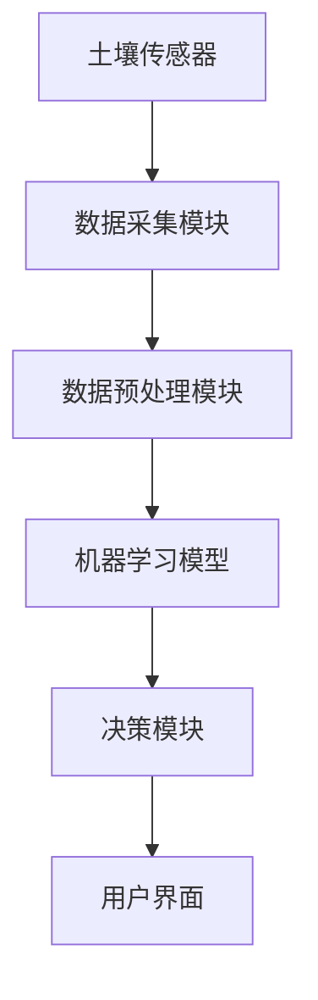

                 


# AI Agent在智能土壤分析中的实践

**关键词**：AI Agent、土壤分析、机器学习、数据分析、智能系统

**摘要**：本文探讨了AI Agent在智能土壤分析中的应用，详细分析了土壤分析的重要性、AI Agent的核心技术以及它们的结合方式。通过系统架构设计和实战案例，展示了如何利用AI Agent提升土壤分析的效率和准确性，为农业和环境保护提供有力支持。

---

## 第1章: AI Agent的基本概念与土壤分析的背景

### 1.1 AI Agent的定义与核心原理

#### 1.1.1 AI Agent的基本定义
AI Agent（人工智能代理）是一种能够感知环境、自主决策并执行任务的智能实体。它通过传感器获取信息，利用算法进行分析，并通过执行器与环境互动，以实现特定目标。

#### 1.1.2 AI Agent的核心特征与分类
AI Agent的核心特征包括自主性、反应性、目标导向和社交能力。根据智能水平，AI Agent可分为反应式和基于模型的代理；按应用领域，可分为专家型、学习型和实用型代理。

#### 1.1.3 AI Agent与传统自动化的区别
传统自动化依赖预定义规则，而AI Agent具备学习和适应能力，能够根据环境变化自主调整行为。AI Agent通过数据驱动决策，灵活性和适应性更强。

### 1.2 土壤分析的重要性与挑战

#### 1.2.1 土壤分析的基本概念
土壤分析是对土壤的物理、化学和生物特性进行测量和评估，以了解土壤健康状况和肥力水平。它为农业生产和环境保护提供科学依据。

#### 1.2.2 土壤分析在农业中的应用价值
土壤分析有助于优化作物种植、精准施肥、提高产量和质量，同时减少环境影响，实现可持续农业。

#### 1.2.3 土壤分析的主要挑战与技术需求
土壤分析面临数据多样性、实时性要求高、分析精度高等挑战，需要借助AI技术提升效率和准确性。

---

## 第2章: AI Agent在土壤分析中的应用价值

### 2.1 AI Agent在土壤数据处理中的优势

#### 2.1.1 数据采集与处理的效率提升
AI Agent能够快速处理大量土壤数据，提高数据处理效率，减少人工干预。

#### 2.1.2 数据分析的智能化增强
AI Agent通过机器学习算法，能够自动识别土壤特征，发现潜在问题，提供精准分析结果。

#### 2.1.3 AI Agent在土壤健康评估中的作用
AI Agent能够实时监测土壤状况，评估健康指数，预测土壤退化趋势，为农业管理提供决策支持。

### 2.2 智能土壤分析的场景与应用

#### 2.2.1 农业生产中的土壤监测
AI Agent实时监测土壤湿度、pH值和养分含量，帮助农民优化灌溉和施肥策略。

#### 2.2.2 环境保护中的土壤污染预警
通过AI Agent分析土壤数据，识别污染区域，及时预警，防止环境恶化。

#### 2.2.3 智能农业中的精准施肥与作物管理
AI Agent根据土壤数据和作物需求，制定精准施肥计划，优化作物管理，提高产量和质量。

### 2.3 AI Agent与土壤分析的结合前景

#### 2.3.1 技术融合的可能性
AI Agent与物联网、大数据等技术结合，构建智能土壤监测系统，推动农业数字化转型。

#### 2.3.2 应用领域的扩展潜力
AI Agent在土壤分析中的应用不仅限于农业，还可扩展到林业、生态修复等领域。

#### 2.3.3 未来发展趋势的展望
随着AI技术进步，土壤分析将更加智能化、自动化，推动农业和环境保护的可持续发展。

---

## 第3章: AI Agent的核心技术原理

### 3.1 AI Agent的感知与决策机制

#### 3.1.1 数据采集与特征提取
AI Agent通过传感器采集土壤数据，提取关键特征，如pH值、氮磷钾含量等。

#### 3.1.2 知识表示与推理
AI Agent利用知识表示法（如语义网络）构建土壤分析知识库，并通过推理算法（如逻辑推理）进行决策。

#### 3.1.3 行为决策与执行
AI Agent基于分析结果，制定行动方案，通过执行器（如施肥系统）执行决策，实现土壤优化。

### 3.2 AI Agent的通信与协作机制

#### 3.2.1 多智能体系统的基本概念
多智能体系统由多个AI Agent组成，通过协作完成复杂任务，如土壤监测网络中各节点的数据共享。

#### 3.2.2 智能体之间的通信协议
AI Agent之间通过特定协议（如MQTT）进行通信，确保数据高效传递和处理。

#### 3.2.3 协作任务的分配与协调
AI Agent通过任务分配算法（如分布式计算）协调工作，确保资源合理利用和任务高效完成。

---

## 第4章: 土壤分析的核心技术与实现

### 4.1 土壤数据的采集与预处理

#### 4.1.1 数据采集方法与设备
使用土壤传感器（如pH传感器、EC传感器）采集土壤数据，数据来源多样，包括物联网设备和实验室测试。

#### 4.1.2 数据清洗与特征提取
通过数据清洗去除异常值，提取关键特征，如土壤有机质含量、养分浓度等。

#### 4.1.3 数据标注与格式化
将数据标注为训练、验证和测试集，确保数据格式统一，便于模型训练。

### 4.2 土壤分析的机器学习模型

#### 4.2.1 常见的土壤分析算法
常用的算法包括线性回归、支持向量机（SVM）、随机森林和神经网络。

#### 4.2.2 深度学习模型的应用
使用卷积神经网络（CNN）处理土壤图像数据，识别土壤结构和病害。

#### 4.2.3 模型训练与优化
通过数据增强、超参数调优和交叉验证优化模型性能，提升预测精度。

### 4.3 土壤分析的可视化与结果解读

#### 4.3.1 数据可视化方法
使用Matplotlib和Seaborn绘制图表，直观展示土壤特征分布和变化趋势。

#### 4.3.2 结果解读与决策支持
通过可视化结果，识别土壤问题区域，为农业管理提供决策支持。

#### 4.3.3 可视化工具的选择与使用
选择合适的可视化工具，如Tableau和Power BI，制作动态图表，便于分析和展示。

---

## 第5章: 系统架构与项目实战

### 5.1 系统架构设计

#### 5.1.1 问题场景介绍
设计一个智能土壤监测系统，实现土壤数据实时采集、分析和决策支持。

#### 5.1.2 系统功能设计
系统包括数据采集模块、分析模块、决策模块和展示模块，各模块协同工作，完成土壤监测任务。

#### 5.1.3 系统架构图（Mermaid）


### 5.2 项目实战

#### 5.2.1 环境配置
安装Python、TensorFlow、Pandas等库，配置开发环境。

#### 5.2.2 核心实现

##### 数据预处理代码
```python
import pandas as pd

# 读取土壤数据
data = pd.read_csv('soil_data.csv')

# 删除缺失值
data.dropna(inplace=True)

# 标准化处理
from sklearn.preprocessing import StandardScaler
scaler = StandardScaler()
scaled_data = scaler.fit_transform(data)
```

##### 机器学习模型训练代码
```python
from sklearn.model_selection import train_test_split
from sklearn.ensemble import RandomForestRegressor

# 划分训练集和测试集
X_train, X_test, y_train, y_test = train_test_split(scaled_data, data['ph'], test_size=0.2)

# 训练随机森林模型
model = RandomForestRegressor(n_estimators=100)
model.fit(X_train, y_train)

# 预测并评估
y_pred = model.predict(X_test)
print('Accuracy:', model.score(X_test, y_test))
```

##### 结果可视化代码
```python
import matplotlib.pyplot as plt

plt.scatter(y_test, y_pred)
plt.xlabel('Actual pH')
plt.ylabel('Predicted pH')
plt.show()
```

#### 5.2.3 实际案例分析
通过案例分析，展示系统如何实时监测土壤状况，提供精准分析结果和决策支持。

#### 5.2.4 项目小结
总结项目实现的关键点，强调AI Agent在土壤分析中的优势和应用潜力。

---

## 第6章: 总结与展望

### 6.1 总结
本文详细探讨了AI Agent在智能土壤分析中的应用，从技术原理到系统实现，展示了其在提升土壤分析效率和准确性方面的巨大潜力。

### 6.2 未来展望
未来，随着AI技术进步，土壤分析将更加智能化和自动化，AI Agent将在农业和环境保护中发挥更大作用。

### 6.3 最佳实践 Tips
- 选择合适的AI算法和工具，确保系统性能和可扩展性。
- 注重数据质量，确保模型训练数据的准确性和完整性。
- 定期更新模型，适应土壤条件变化，保持系统性能。

---

**作者：AI天才研究院/AI Genius Institute & 禅与计算机程序设计艺术 /Zen And The Art of Computer Programming**

---

以上是《AI Agent在智能土壤分析中的实践》的完整目录和内容概要。接下来将按照上述结构撰写详细的技术博客文章，确保每个部分都详细展开，内容丰富具体。

