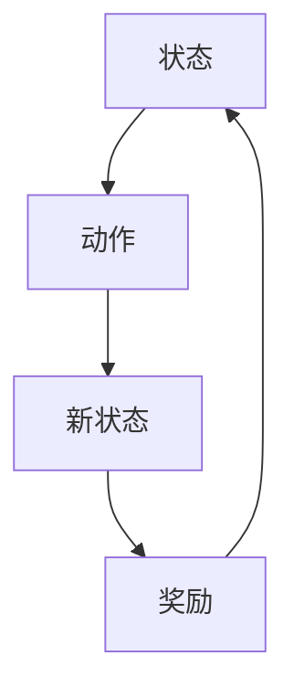
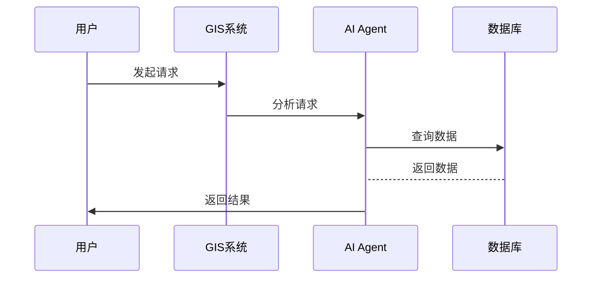

                 


# AI Agent在智能地理信息系统中的实践

> 关键词：AI Agent，智能地理信息系统，地理信息系统，人工智能，算法，系统架构

> 摘要：本文探讨了AI Agent在智能地理信息系统中的应用，分析了其核心概念、算法原理、系统架构设计以及实际项目中的实现。通过详细的背景介绍、数学模型分析和项目实战，展示了AI Agent如何提升地理信息系统的智能化水平。

---

# 第一部分: AI Agent与智能地理信息系统概述

## 第1章: AI Agent与地理信息系统基础

### 1.1 AI Agent的基本概念

#### 1.1.1 AI Agent的定义与特点
AI Agent（人工智能代理）是指在计算机系统中，能够感知环境、自主决策并执行任务的智能实体。其特点包括反应性、主动性、学习能力和适应性。

#### 1.1.2 地理信息系统的定义与功能
地理信息系统（GIS）是一种用于采集、存储、管理、分析和展示地理信息的系统。其功能包括空间数据的采集、处理、分析和可视化。

#### 1.1.3 AI Agent在地理信息系统中的作用
AI Agent可以增强GIS的智能化水平，例如通过实时数据分析提供决策支持、优化资源分配和提高系统的响应速度。

### 1.2 AI Agent与地理信息系统的结合背景

#### 1.2.1 地理信息系统的发展历程
GIS技术从简单的数据存储发展到支持空间分析和决策支持，近年来随着AI技术的兴起，智能化成为GIS发展的新方向。

#### 1.2.2 AI技术在GIS中的应用现状
目前，AI技术在GIS中的应用包括图像识别、预测建模和路径规划等，但AI Agent的应用还处于探索阶段。

#### 1.2.3 AI Agent在智能GIS中的潜力与挑战
AI Agent可以通过实时数据处理和自主决策，提升GIS的智能化水平，但其复杂性和数据处理能力也带来了技术挑战。

## 第2章: AI Agent的核心概念与原理

### 2.1 AI Agent的分类与特征

#### 2.1.1 分类：简单反射型、基于模型型、实用推理型、目标驱动型
- **简单反射型**：基于规则的反应式系统，适用于简单的决策场景。
- **基于模型型**：利用领域知识构建模型，适用于复杂问题。
- **实用推理型**：结合逻辑推理和效用评估，优化决策过程。
- **目标驱动型**：以特定目标为导向，动态调整策略。

#### 2.1.2 特征：反应性、主动性、学习能力、适应性
- **反应性**：能够实时感知环境变化并做出反应。
- **主动性**：无需外部指令，主动执行任务。
- **学习能力**：通过数据和经验提升性能。
- **适应性**：能够自适应环境变化。

### 2.2 AI Agent与GIS的实体关系分析

#### 2.2.1 实体关系图（ER图）
GIS中的实体包括：位置、属性、事件、用户、任务等。AI Agent作为系统的核心，与这些实体之间存在关联关系。

#### 2.2.2 实体间的关系分析
- **位置与属性**：位置是属性的空间载体。
- **事件与用户**：用户触发事件，AI Agent处理事件。
- **任务与属性**：任务基于属性进行优化。

### 2.3 AI Agent的算法原理

#### 2.3.1 基于规则的推理算法
规则驱动的AI Agent通过预定义的规则进行推理，适用于简单场景。

#### 2.3.2 基于机器学习的决策算法
机器学习算法（如SVM、神经网络）能够处理复杂数据，提升决策的准确性。

#### 2.3.3 基于强化学习的优化算法
强化学习通过试错优化策略，适用于动态环境下的任务优化。

### 2.4 本章小结
本章介绍了AI Agent的分类、特征及其在GIS中的实体关系，分析了不同算法的特点和应用场景。

---

# 第三部分: AI Agent在GIS中的数学模型与算法实现

## 第3章: AI Agent的数学模型与算法

### 3.1 基于概率的地理信息处理模型

#### 3.1.1 概率模型的数学表达式
$$ P(A|B) = \frac{P(B|A)P(A)}{P(B)} $$
此公式用于计算条件概率，广泛应用于地理信息分类中。

#### 3.1.2 案例分析：概率模型在GIS中的应用
例如，利用概率模型预测土地利用变化趋势。

### 3.2 基于机器学习的地理信息分析算法

#### 3.2.1 支持向量机（SVM）算法
SVM用于分类问题，适用于高维数据。

#### 3.2.2 线性回归模型
$$ y = \beta_0 + \beta_1x + \epsilon $$
线性回归用于预测连续变量，如气温对植物生长的影响。

#### 3.2.3 神经网络模型
神经网络能够处理非线性关系，适用于复杂地理信息分析。

### 3.3 基于强化学习的地理信息优化算法

#### 3.3.1 强化学习的基本原理
通过奖励机制优化策略。

#### 3.3.2 Q-learning算法
一种常用的强化学习算法，适用于离散动作空间。

#### 3.3.3 算法流程图（使用mermaid）


### 3.4 算法实现的Python代码示例

#### 3.4.1 支持向量机模型实现
```python
from sklearn import svm
X = [[0, 0], [1, 1], [0, 1], [1, 0]]
y = [0, 1, 1, 0]
model = svm.SVC()
model.fit(X, y)
print(model.predict(X))
```

#### 3.4.2 线性回归模型实现
```python
from sklearn.linear_model import LinearRegression
import numpy as np
X = np.array([[1], [2], [3], [4]])
y = np.array([2, 4, 6, 8])
model = LinearRegression()
model.fit(X, y)
print(model.coef_)
```

#### 3.4.3 强化学习算法实现
```python
import gym
env = gym.make('CartPole-v0')
policy = ...  # 定义策略函数
for episode in range(1000):
    state = env.reset()
    while True:
        action = policy(state)
        next_state, reward, done, _ = env.step(action)
        # 更新策略
        if done:
            break
```

### 3.5 本章小结
本章通过数学模型和算法实现，展示了AI Agent在GIS中的具体应用，包括概率模型、机器学习和强化学习。

---

# 第四部分: 系统分析与架构设计

## 第4章: 智能地理信息系统架构设计

### 4.1 系统功能需求分析

#### 4.1.1 用户需求分析
用户包括 GIS 专家、决策者和普通用户，需求包括数据处理、分析和可视化。

#### 4.1.2 功能需求列表
- 数据采集与存储
- 空间分析
- 决策支持
- 可视化展示

### 4.2 系统架构设计

#### 4.2.1 领域模型（mermaid 类图）


#### 4.2.2 系统架构图（mermaid 架构图）


#### 4.2.3 系统接口设计
- 数据接口：与数据库交互
- 用户接口：图形化界面
- 服务接口：与其他系统集成

### 4.3 系统交互设计（mermaid 序列图）


### 4.4 本章小结
本章通过系统架构设计，展示了AI Agent在智能GIS中的核心地位和系统整体结构。

---

# 第五部分: 项目实战

## 第5章: 项目实战与案例分析

### 5.1 项目环境安装

#### 5.1.1 安装Python和相关库
```bash
pip install numpy pandas sklearn matplotlib
```

#### 5.1.2 安装GIS相关工具
```bash
pip install geopandas
```

### 5.2 核心代码实现

#### 5.2.1 数据预处理
```python
import pandas as pd
data = pd.read_csv('data.csv')
```

#### 5.2.2 模型训练
```python
from sklearn.svm import SVC
model = SVC()
model.fit(X_train, y_train)
```

#### 5.2.3 结果可视化
```python
import matplotlib.pyplot as plt
plt.scatter(X, y)
plt.plot(X_test, y_pred)
plt.show()
```

### 5.3 案例分析与解读
以土地利用分类为例，展示了AI Agent如何优化GIS的分类精度和效率。

### 5.4 项目小结
通过具体项目，验证了AI Agent在GIS中的实际应用价值。

---

# 第六部分: 总结与展望

## 第6章: 总结与展望

### 6.1 总结
本文系统介绍了AI Agent在智能GIS中的应用，分析了其核心概念、算法原理和系统设计，并通过项目实战展示了其实际价值。

### 6.2 展望
未来，随着AI技术的进步，AI Agent在GIS中的应用将更加广泛，例如实时数据处理和自适应优化。

---

## 附录

### 附录A: 工具安装指南
列出GIS和AI相关工具的安装命令。

### 附录B: 扩展阅读资料
推荐相关领域的书籍和论文。

---

作者：AI天才研究院/AI Genius Institute & 禅与计算机程序设计艺术 /Zen And The Art of Computer Programming

---

本文通过详细分析AI Agent在智能地理信息系统中的应用，结合理论和实践，为读者提供了全面的视角。希望对从事相关领域的读者有所帮助。

