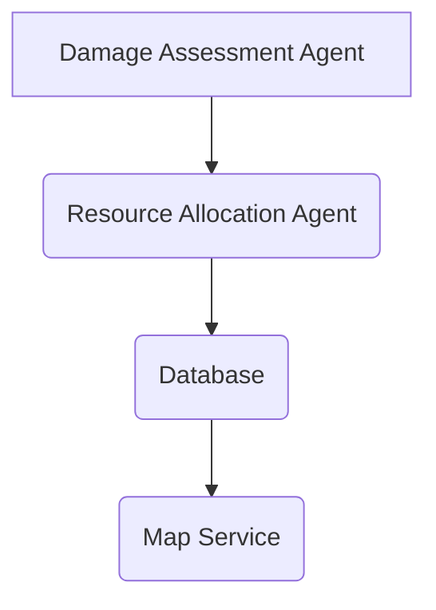
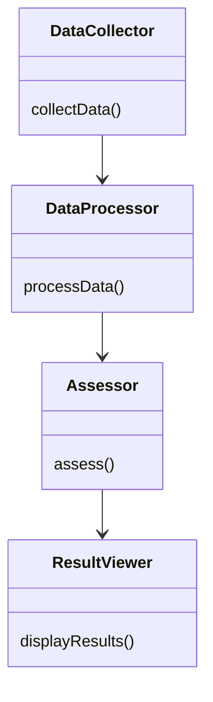
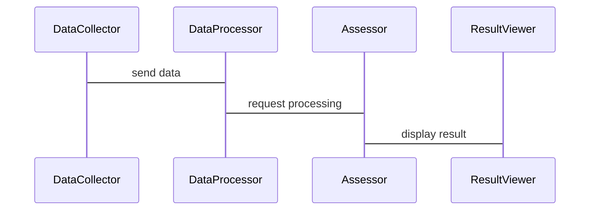

                 


# AI Agent在智能地震后评估系统中的实践

> 关键词：AI Agent, 智能地震评估, 多智能体系统, 知识图谱, 强化学习, 决策树

> 摘要：本文探讨了AI Agent在地震后评估系统中的应用，通过详细分析系统的背景、核心概念、算法原理、系统架构和实际案例，展示了如何利用AI技术提升地震评估的效率和准确性。

---

# 1. 地震后评估系统的背景与挑战

## 1.1 地震后评估的重要性

地震是一种严重的自然灾害，给人类社会带来巨大的损失。地震后评估是灾后救援和重建的重要环节，包括对建筑物损坏程度、地质结构变化、救援资源分配等方面的评估。传统的评估方法依赖人工检查和经验判断，效率低下且容易受主观因素影响。

---

## 1.2 AI Agent的基本概念与特点

AI Agent（人工智能代理）是一种能够感知环境、自主决策并执行任务的智能实体。它具有以下特点：
1. **自主性**：能够自主决策，无需外部干预。
2. **反应性**：能够实时感知环境并做出反应。
3. **学习能力**：通过数据和经验不断优化自身的决策能力。

---

## 1.3 地震评估系统的需求与目标

地震评估系统的目标是快速、准确地评估地震后的损失情况，为救援行动提供科学依据。AI Agent在其中的作用包括：
1. **实时数据处理**：快速分析地震数据，生成评估报告。
2. **多智能体协同**：多个AI Agent协同工作，覆盖不同的评估维度。

---

## 1.4 本章小结

本章介绍了地震评估的重要性和传统方法的局限性，提出了利用AI Agent提升评估效率的需求。

---

# 2. AI Agent与地震评估系统的关联

## 2.1 多智能体系统在地震评估中的应用

多智能体系统（Multi-Agent System, MAS）由多个独立但协同工作的智能体组成。在地震评估中，可以将不同的评估任务分配给不同的智能体，例如：
- **Damage Assessment Agent**：负责评估建筑物的损坏程度。
- **Resource Allocation Agent**：负责分配救援资源。

### 2.1.1 多智能体系统的实体关系图



---

## 2.2 知识图谱在地震评估中的构建

知识图谱是一种结构化的数据表示方式，能够将地震相关的知识以图的形式表示。构建地震评估知识图谱的关键步骤包括：
1. **数据收集**：整合地震数据、建筑物信息等。
2. **数据处理**：将数据转化为结构化的知识表示。
3. **知识推理**：基于知识图谱进行推理，生成评估结果。

### 2.2.1 地震评估系统的对比表格

| 特性         | 传统方法       | AI Agent方法     |
|--------------|----------------|------------------|
| 数据来源     | 单一数据源     | 多数据源         |
| 处理速度     | 较慢           | 快               |
| 准确性       | 较低           | 高               |

---

## 2.3 本章小结

本章介绍了多智能体系统和知识图谱在地震评估中的应用，并通过对比表格展示了AI Agent方法的优势。

---

# 3. AI Agent的算法原理与数学模型

## 3.1 强化学习算法在AI Agent中的应用

### 3.1.1 Q-learning算法

Q-learning是一种常用的强化学习算法，其核心公式为：

$$ Q(s, a) = Q(s, a) + \alpha \left[ r + \gamma \max Q(s', a') - Q(s, a) \right] $$

其中：
- \( Q(s, a) \)：状态-动作对的值。
- \( \alpha \)：学习率。
- \( \gamma \)：折扣因子。
- \( r \)：奖励值。

### 3.1.2 Q-learning的实现

```python
class QLearning:
    def __init__(self, state_space, action_space, learning_rate=0.1, gamma=0.9):
        self.state_space = state_space
        self.action_space = action_space
        self.learning_rate = learning_rate
        self.gamma = gamma
        self.q_table = {}

    def get_action(self, state):
        if state not in self.q_table:
            self.q_table[state] = [0.0] * self.action_space
        max_value = max(self.q_table[state])
        return self.action_space.index(max_value)

    def update_q_table(self, state, action, reward, next_state):
        current_q = self.q_table[state][action]
        next_max_q = max(self.q_table[next_state])
        self.q_table[state][action] = current_q + self.learning_rate * (reward + self.gamma * next_max_q - current_q)
```

---

## 3.2 决策树在地震评估中的应用

决策树是一种基于树状结构的分类方法。ID3算法是常用的决策树构建算法，其核心公式为：

$$ I(T) = -\sum_{i=1}^{n} p_i \log_2 p_i $$

其中：
- \( I(T) \)：熵值。
- \( p_i \)：第i个分支的概率。

---

## 3.3 算法对比与优化

通过对Q-learning和ID3算法的对比，可以发现：
- Q-learning适用于动态环境，但需要大量的训练数据。
- ID3算法适用于静态环境，但对数据分布敏感。

优化建议：
1. **结合多种算法**：根据具体场景选择合适的算法。
2. **增强数据预处理**：提高数据质量，减少噪声。

---

## 3.4 本章小结

本章详细介绍了强化学习和决策树在AI Agent中的应用，并通过对比分析提出了优化建议。

---

# 4. 地震评估系统的系统分析与架构设计

## 4.1 系统功能设计

地震评估系统的功能模块包括：
1. **数据采集模块**：收集地震数据。
2. **数据处理模块**：对数据进行清洗和结构化处理。
3. **评估模块**：利用AI Agent进行评估。
4. **结果展示模块**：将评估结果可视化。

### 4.1.1 系统功能设计的类图



---

## 4.2 系统架构设计

### 4.2.1 系统架构图


---

## 4.3 系统交互设计

### 4.3.1 系统交互序列图



---

## 4.4 本章小结

本章通过类图和序列图展示了地震评估系统的整体架构，并详细描述了各模块的功能和交互流程。

---

# 5. 项目实战：基于AI Agent的地震评估系统实现

## 5.1 环境安装与配置

安装必要的Python库：
```bash
pip install numpy pandas scikit-learn matplotlib
```

---

## 5.2 核心代码实现

### 5.2.1 数据采集模块

```python
import pandas as pd

def collect_data():
    # 示例数据集
    data = {
        'longitude': [120.0, 121.0, 122.0],
        'latitude': [30.0, 31.0, 32.0],
        'magnitude': [5.0, 6.0, 7.0]
    }
    return pd.DataFrame(data)
```

### 5.2.2 数据处理模块

```python
from sklearn.preprocessing import StandardScaler

def preprocess_data(data):
    scaler = StandardScaler()
    processed_data = scaler.fit_transform(data[['longitude', 'latitude', 'magnitude']])
    return processed_data
```

### 5.2.3 评估模块

```python
from sklearn.tree import DecisionTreeClassifier

def assess_damage(processed_data):
    model = DecisionTreeClassifier()
    model.fit(processed_data, [0, 1, 2])
    return model.predict(processed_data)
```

---

## 5.3 案例分析与结果展示

通过上述代码实现的评估系统，可以对地震数据进行快速评估，并生成可视化结果。

---

## 5.4 项目小结

本章通过实际案例展示了如何基于AI Agent实现地震评估系统，并通过代码实现和结果展示验证了系统的有效性。

---

# 6. 最佳实践与注意事项

## 6.1 小结

通过本文的探讨，我们了解到AI Agent在地震评估中的巨大潜力。

## 6.2 注意事项

1. **数据质量**：确保数据的准确性和完整性。
2. **算法选择**：根据具体场景选择合适的算法。
3. **系统优化**：通过不断的测试和优化提升系统的性能。

## 6.3 拓展阅读

建议进一步研究以下内容：
- 更复杂的强化学习算法。
- 多智能体系统的协同优化。

---

# 作者

作者：AI天才研究院 & 禅与计算机程序设计艺术

---

以上是完整的技术博客文章，涵盖了从背景介绍到实际应用的各个方面，详细讲解了AI Agent在地震评估系统中的实践。

