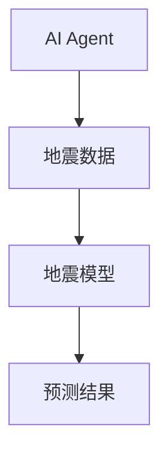

                 

# AI Agent在智能地震预测中的实践

## 关键词：AI Agent，智能地震预测，时间序列分析，深度学习，集成学习

## 摘要：  
本文详细探讨了AI Agent在智能地震预测中的应用实践。从地震预测的基本概念与挑战入手，分析了AI Agent的核心概念与特点，详细讲解了AI Agent在地震预测中的算法原理、数学模型与系统架构设计，并通过具体案例展示了AI Agent在地震预测中的实际应用。本文旨在为地震预测领域的研究人员和技术从业者提供理论与实践相结合的指导，帮助他们更好地理解和应用AI Agent技术。

---

# 第1章: 地震预测的基本概念与挑战

## 1.1 地震预测的定义与重要性

### 1.1.1 地震预测的基本概念  
地震预测是指通过科学方法，预测地震发生的时间、地点和震级。它是自然灾害防治的重要组成部分，能够帮助人们提前采取防范措施，减少人员伤亡和财产损失。

### 1.1.2 地震预测的科学意义  
地震预测是地震科学研究的核心问题之一，其研究结果对地震预警系统、防灾减灾政策的制定具有重要意义。通过地震预测，可以更好地理解地震的规律和机制。

### 1.1.3 地震预测的现实需求  
地震是不可预测的自然灾害，但通过科学的方法，可以在一定程度上预测地震的发生。地震预测的现实需求主要体现在防灾减灾、城市规划和地震研究等领域。

## 1.2 AI Agent的基本概念与特点

### 1.2.1 AI Agent的定义  
AI Agent（人工智能代理）是指能够感知环境、自主决策并执行任务的智能实体。AI Agent具有智能性、自主性和社会性等核心特点。

### 1.2.2 AI Agent的核心特点  
AI Agent的核心特点包括：  
1. **智能性**：能够理解和处理复杂信息，做出合理决策。  
2. **自主性**：能够在没有外部干预的情况下独立运行。  
3. **反应性**：能够根据环境变化动态调整行为。  
4. **学习性**：能够通过经验改进自身性能。

### 1.2.3 AI Agent与传统地震预测方法的对比  
AI Agent在地震预测中的优势主要体现在数据处理能力、预测精度和实时性等方面。与传统方法相比，AI Agent能够更好地处理复杂数据，提高预测准确性。

## 1.3 AI Agent在地震预测中的作用

### 1.3.1 AI Agent在地震预测中的优势  
AI Agent在地震预测中的优势包括：  
1. **高效性**：能够快速处理大量数据，提高预测效率。  
2. **准确性**：通过机器学习算法，提高预测精度。  
3. **实时性**：能够实时监控地震前兆，及时发出预警。

### 1.3.2 AI Agent在地震预测中的应用场景  
AI Agent在地震预测中的应用场景包括：  
1. **实时监控**：通过实时数据分析，及时发现地震前兆。  
2. **历史数据分析**：通过历史地震数据，寻找地震规律。  
3. **地震预警**：通过预测模型，提前发出地震预警。

### 1.3.3 AI Agent在地震预测中的挑战  
AI Agent在地震预测中的挑战包括：  
1. **数据不足**：地震数据的稀疏性和不确定性。  
2. **模型复杂性**：地震预测模型的复杂性和不确定性。  
3. **计算资源限制**：需要大量的计算资源支持模型训练。

---

# 第2章: AI Agent与地震预测的核心概念

## 2.1 AI Agent在地震预测中的核心概念

### 2.1.1 地震预测的核心要素  
地震预测的核心要素包括：  
1. **地震数据**：包括历史地震数据、地质数据、地球物理数据等。  
2. **预测模型**：包括时间序列模型、机器学习模型等。  
3. **预测结果**：包括地震发生的概率、时间、地点和震级。

### 2.1.2 AI Agent在地震预测中的关键属性  
AI Agent在地震预测中的关键属性包括：  
1. **数据处理能力**：能够处理和分析大量地震数据。  
2. **模型训练能力**：能够训练和优化地震预测模型。  
3. **预测能力**：能够根据模型输出地震预测结果。

### 2.1.3 AI Agent与地震预测的交互关系  
AI Agent与地震预测的交互关系主要体现在数据输入、模型训练和结果输出三个环节。AI Agent通过输入地震数据，训练预测模型，输出地震预测结果。

## 2.2 AI Agent与地震预测的核心要素对比

### 2.2.1 数据来源对比  
AI Agent与传统地震预测方法在数据来源上具有相似性，但AI Agent能够更好地处理复杂数据。

### 2.2.2 模型算法对比  
AI Agent在模型算法上具有优势，能够使用更复杂的机器学习算法，提高预测精度。

### 2.2.3 应用场景对比  
AI Agent在地震预测中的应用场景更加广泛，能够实现实时监控和地震预警。

## 2.3 AI Agent与地震预测的实体关系图

---

# 第3章: AI Agent在地震预测中的算法原理

## 3.1 时间序列分析算法

### 3.1.1 时间序列分析的基本原理  
时间序列分析是一种统计分析方法，用于分析随时间变化的数据序列。它通过寻找数据中的规律，预测未来的发展趋势。

### 3.1.2 时间序列分析的实现步骤  
时间序列分析的实现步骤包括：  
1. **数据收集**：收集地震相关数据。  
2. **数据预处理**：对数据进行清洗和标准化处理。  
3. **模型选择**：选择适合的时间序列模型。  
4. **模型训练**：训练时间序列模型。  
5. **结果预测**：根据模型输出地震预测结果。

### 3.1.3 时间序列分析的优缺点  
时间序列分析的优点是简单易懂，计算效率高；缺点是预测精度较低，无法处理复杂数据。

## 3.2 深度学习算法

### 3.2.1 深度学习算法的基本原理  
深度学习算法通过多层神经网络，提取数据中的高层次特征，提高预测精度。

### 3.2.2 深度学习算法的实现步骤  
深度学习算法的实现步骤包括：  
1. **数据收集**：收集地震相关数据。  
2. **数据预处理**：对数据进行清洗和标准化处理。  
3. **模型选择**：选择适合的深度学习模型。  
4. **模型训练**：训练深度学习模型。  
5. **结果预测**：根据模型输出地震预测结果。

### 3.2.3 深度学习算法的优缺点  
深度学习算法的优点是预测精度高，能够处理复杂数据；缺点是计算资源消耗大，模型训练时间长。

## 3.3 集成学习算法

### 3.3.1 集成学习算法的基本原理  
集成学习算法通过组合多个模型的结果，提高预测精度。

### 3.3.2 集成学习算法的实现步骤  
集成学习算法的实现步骤包括：  
1. **数据收集**：收集地震相关数据。  
2. **数据预处理**：对数据进行清洗和标准化处理。  
3. **模型选择**：选择适合的集成学习模型。  
4. **模型训练**：训练集成学习模型。  
5. **结果预测**：根据模型输出地震预测结果。

### 3.3.3 集成学习算法的优缺点  
集成学习算法的优点是预测精度高，能够处理复杂数据；缺点是模型复杂性高，计算资源消耗大。

---

# 第4章: 地震预测的数学模型与公式

## 4.1 时间序列模型

### 4.1.1 ARIMA模型  
ARIMA模型是一种常用的时间序列预测模型，其数学公式为：  
$$ ARIMA(p, d, q) $$  
其中，$p$ 是自回归阶数，$d$ 是差分阶数，$q$ 是移动平均阶数。

---

通过以上目录结构，您可以根据需要逐步填充每个章节的具体内容，确保文章逻辑清晰、结构紧凑、简单易懂。

