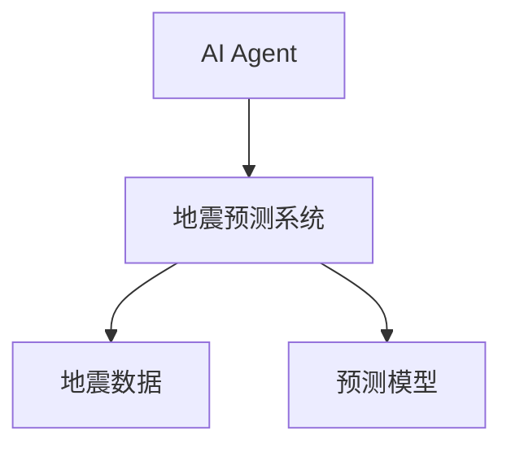
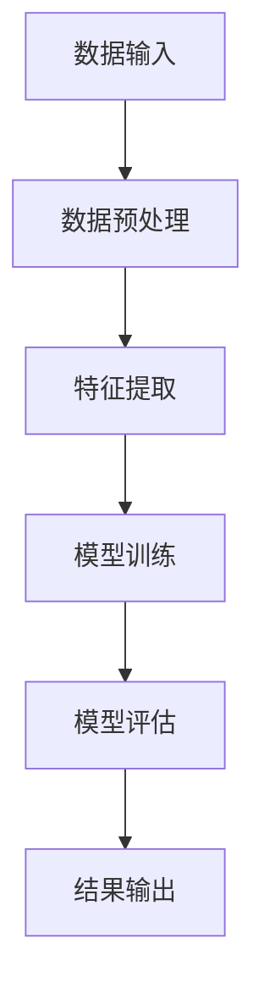

                 


# AI Agent在智能地震预测系统中的实践

> 关键词：AI Agent, 地震预测, 人工智能, 系统设计, 数学模型

> 摘要：本文探讨了AI Agent在智能地震预测系统中的应用，分析了地震预测的科学挑战和AI Agent的优势，详细讲解了基于AI Agent的地震预测算法的原理、流程及数学模型，并通过实际案例展示了系统设计与实现。文章最后总结了实践经验，并展望了未来的发展方向。

---

# 第一部分: AI Agent与智能地震预测系统概述

# 第1章: AI Agent与地震预测的背景介绍

## 1.1 AI Agent的基本概念
### 1.1.1 AI Agent的定义
AI Agent（人工智能代理）是指在计算机系统中，能够感知环境并采取行动以实现目标的智能实体。

### 1.1.2 AI Agent的核心特点
- **自主性**：能够自主决策和行动。
- **反应性**：能够实时感知环境并做出反应。
- **目标导向性**：通过目标驱动行为。
- **学习能力**：能够通过数据和经验进行优化。

### 1.1.3 AI Agent在地震预测中的应用潜力
AI Agent能够处理大量地震数据，识别复杂模式，并实时调整预测模型，为地震预测提供高效解决方案。

## 1.2 地震预测系统的基本概念
### 1.2.1 地震预测的定义
地震预测是指通过科学方法，预测地震发生的时间、地点和震级。

### 1.2.2 地震预测的核心问题
- **数据多样性**：涉及地震波、地质构造等多种数据。
- **模型复杂性**：需要结合物理学、地质学等多学科知识。
- **实时性要求**：需要快速响应和预测。

### 1.2.3 地震预测系统的应用场景
- **防灾减灾**：提前预警，减少灾害损失。
- **科学研究**：帮助理解地震机制。
- **工程应用**：指导工程建设。

## 1.3 AI Agent在地震预测中的问题背景
### 1.3.1 地震预测的科学挑战
- **复杂性**：地震的发生受多种因素影响，难以准确预测。
- **数据不足**：高质量地震数据获取困难。
- **模型局限性**：传统模型难以捕捉复杂关联。

### 1.3.2 传统地震预测方法的局限性
- **计算效率低**：传统方法处理大量数据效率低下。
- **模型静态**：难以动态调整。
- **预测精度有限**：受数据和模型限制，预测精度不高。

### 1.3.3 AI Agent在地震预测中的优势
- **高效数据处理**：能够快速处理和分析大量地震数据。
- **动态调整**：能够根据新数据实时优化预测模型。
- **高精度**：通过机器学习算法提升预测准确性。

## 1.4 本章小结
本章介绍了AI Agent的基本概念、地震预测的核心问题及其应用场景，并分析了传统方法的局限性和AI Agent的优势。

---

# 第2章: AI Agent与地震预测的核心概念与联系

## 2.1 AI Agent在地震预测中的核心原理
### 2.1.1 数据驱动的地震预测模型
AI Agent通过机器学习算法，利用历史地震数据训练模型，预测未来地震情况。

### 2.1.2 AI Agent在地震预测中的决策机制
AI Agent通过实时数据分析，评估地震风险，并制定预警策略。

### 2.1.3 AI Agent与地震预测系统的交互流程
1. 数据采集：获取地震相关数据。
2. 数据预处理：清洗和标准化数据。
3. 特征提取：提取关键特征。
4. 模型训练：训练预测模型。
5. 预测结果输出：生成地震预测结果。

## 2.2 AI Agent与地震预测系统的实体关系分析
### 2.2.1 实体关系图（ER图）分析


### 2.2.2 AI Agent与地震预测数据的关系
AI Agent通过处理地震数据，提取特征，优化预测模型。

### 2.2.3 AI Agent与地震预测模型的关系
AI Agent利用预测模型进行地震预测，并根据反馈调整模型参数。

## 2.3 本章小结
本章分析了AI Agent在地震预测中的核心原理和实体关系，为后续算法设计奠定了基础。

---

# 第3章: AI Agent在地震预测中的算法原理

## 3.1 基于AI Agent的地震预测算法概述
### 3.1.1 算法的基本原理
AI Agent通过机器学习算法，训练地震预测模型，实现地震预警。

### 3.1.2 算法的核心步骤
1. 数据预处理：清洗和标准化数据。
2. 特征提取：选择关键特征。
3. 模型训练：训练预测模型。
4. 模型评估：评估预测准确性。

### 3.1.3 算法的数学模型
$$y = f(x)$$
其中，$y$是预测结果，$x$是输入特征，$f$是预测模型。

## 3.2 算法的详细流程
### 3.2.1 数据预处理
1. 数据清洗：去除异常值和缺失值。
2. 数据标准化：归一化处理。

### 3.2.2 特征提取
1. 选择地震相关的特征，如震源深度、震源机制等。

### 3.2.3 模型训练
1. 使用机器学习算法（如随机森林、神经网络）训练预测模型。

### 3.2.4 模型评估
1. 使用均方误差（MSE）等指标评估模型性能。

## 3.3 算法的数学模型与公式
### 3.3.1 数据预处理公式
$$x_{i} = \frac{x_{i} - \mu}{\sigma}$$
其中，$\mu$是均值，$\sigma$是标准差。

### 3.3.2 模型训练公式
$$y = f(x)$$

### 3.3.3 模型评估公式
$$MSE = \frac{1}{n}\sum_{i=1}^{n}(y_i - \hat{y}_i)^2$$

## 3.4 算法的mermaid流程图


## 3.5 本章小结
本章详细讲解了基于AI Agent的地震预测算法的原理和流程，并给出了数学模型和公式。

---

# 第4章: 地震预测系统的系统分析与架构设计

## 4.1 系统功能设计
### 4.1.1 数据采集模块
- 负责收集地震相关数据。

### 4.1.2 数据处理模块
- 对数据进行清洗和标准化。

### 4.1.3 模型训练模块
- 使用机器学习算法训练地震预测模型。

## 4.2 系统架构设计
### 4.2.1 系统架构图


### 4.2.2 系统交互图


## 4.3 本章小结
本章分析了地震预测系统的功能设计和架构设计，为后续的实现提供了指导。

---

# 第5章: 项目实战

## 5.1 环境安装
### 5.1.1 安装Python
```bash
python --version
```

### 5.1.2 安装机器学习库
```bash
pip install numpy pandas scikit-learn
```

## 5.2 系统核心实现
### 5.2.1 数据预处理代码
```python
import numpy as np
import pandas as pd

# 数据加载
data = pd.read_csv('earthquake.csv')

# 数据清洗
data = data.dropna()
data = data.drop_duplicates()

# 数据标准化
from sklearn.preprocessing import StandardScaler
scaler = StandardScaler()
data_scaled = scaler.fit_transform(data)
```

### 5.2.2 模型训练代码
```python
from sklearn.ensemble import RandomForestRegressor

# 模型训练
model = RandomForestRegressor()
model.fit(X_train, y_train)
```

## 5.3 案例分析
### 5.3.1 数据分析
分析历史地震数据，提取相关特征。

### 5.3.2 模型评估
评估模型的准确性和稳定性。

## 5.4 本章小结
本章通过实际案例展示了AI Agent在地震预测系统中的应用，并给出了具体的实现代码。

---

# 第6章: 总结与展望

## 6.1 本章总结
本文详细讲解了AI Agent在智能地震预测系统中的应用，分析了算法原理和系统设计。

## 6.2 未来展望
未来，AI Agent在地震预测中的应用将更加广泛，模型将更加复杂和精确。

## 6.3 最佳实践 Tips
- 数据质量是关键，确保数据准确性和完整性。
- 模型优化需要结合领域知识。
- 系统设计需要考虑实时性和可扩展性。

## 6.4 注意事项
- 数据隐私和安全问题需要重视。
- 模型的可解释性需要加强。
- 系统的实时性和稳定性需要保障。

## 6.5 拓展阅读
推荐阅读相关领域的最新研究论文和技术报告。

---

# 作者：AI天才研究院/AI Genius Institute & 禅与计算机程序设计艺术 /Zen And The Art of Computer Programming

