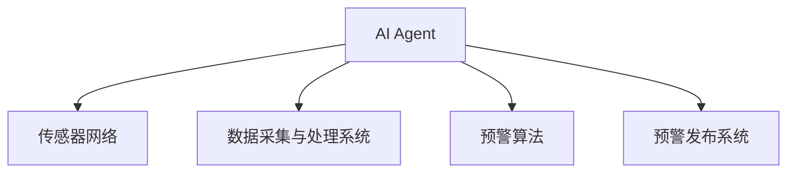
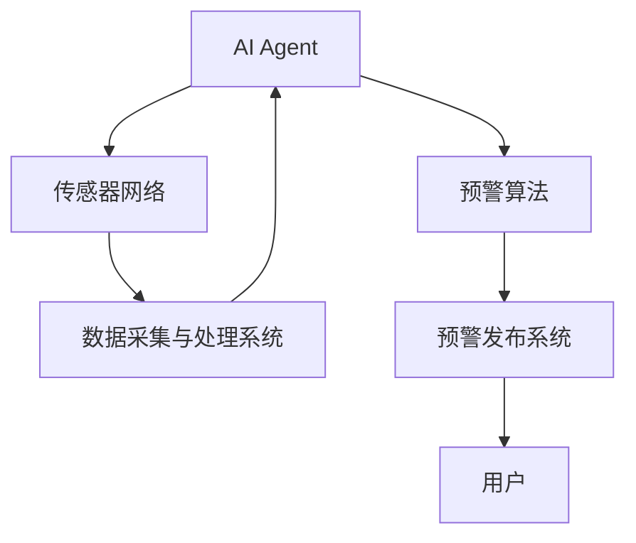
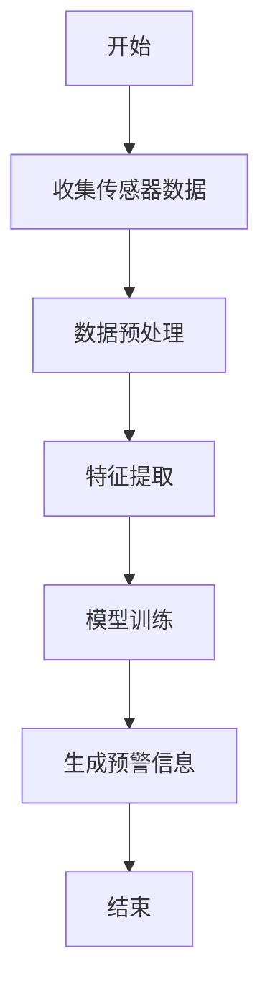
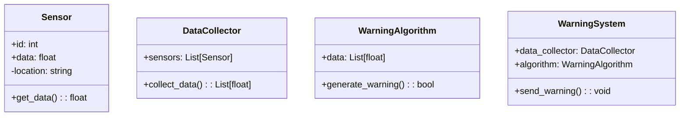
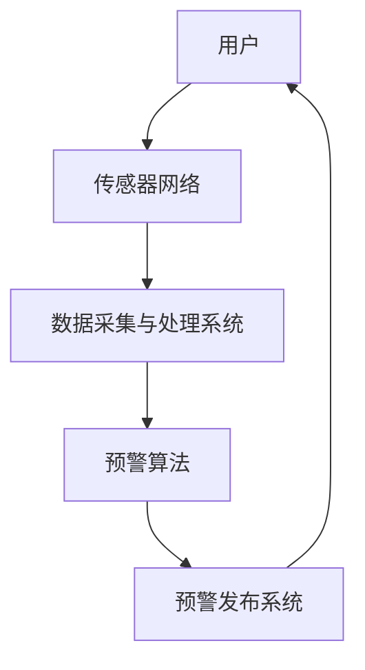

                 


# AI Agent在智能地震预警系统中的实践

## 关键词：AI Agent, 地震预警, 智能系统, 实时数据处理, 机器学习

## 摘要：  
本文探讨了AI Agent在地震预警系统中的应用，分析了地震预警系统的现状与挑战，详细讲解了AI Agent的核心概念、算法原理和系统架构。通过实际案例和项目实战，展示了如何利用AI Agent提升地震预警系统的效率与准确性。文章最后总结了最佳实践和未来发展方向。

---

# 第1章：地震预警系统概述

## 1.1 地震预警的基本概念

### 1.1.1 地震的基本原理  
地震是由地壳内部的板块运动引起的，释放出巨大的能量，通常以 seismic waves 的形式传播。地震预警系统的目标是在地震波到达之前发出警报，从而减少人员伤亡和财产损失。

### 1.1.2 地震预警的定义与作用  
地震预警是指在地震发生后，通过传感器检测到地震波后，快速计算出地震的强度和影响范围，并在地震波到达目标区域之前发出预警。地震预警的作用包括减少人员伤亡、降低财产损失、为应急响应争取时间。

### 1.1.3 地震预警系统的组成部分  
地震预警系统主要包括以下部分：  
1. **传感器网络**：用于检测地震波的传感器，如地震仪、加速度计等。  
2. **数据采集与处理系统**：用于收集和处理传感器数据。  
3. **预警算法**：用于分析数据并生成预警信号。  
4. **预警发布系统**：通过各种渠道向公众和应急机构发布预警信息。

## 1.2 AI Agent的基本概念

### 1.2.1 人工智能代理的定义  
AI Agent（人工智能代理）是指能够感知环境并采取行动以实现特定目标的智能实体。AI Agent可以是软件程序，也可以是物理设备，其核心特征包括自主性、反应性、目标导向性和社会性。

### 1.2.2 AI Agent的核心特征  
AI Agent的核心特征包括：  
1. **自主性**：AI Agent能够自主决策，无需外部干预。  
2. **反应性**：AI Agent能够根据环境变化实时调整行为。  
3. **目标导向性**：AI Agent的行为以实现特定目标为导向。  
4. **社会性**：AI Agent能够与其他Agent或人类进行交互和协作。

### 1.2.3 AI Agent在地震预警中的应用潜力  
AI Agent在地震预警中的潜力主要体现在以下几个方面：  
1. **实时数据分析**：AI Agent能够快速处理传感器数据，提高预警的及时性。  
2. **智能化决策**：AI Agent可以根据历史数据和实时信息，优化预警策略。  
3. **多系统协作**：AI Agent可以与其他系统协作，实现更高效的地震预警。

## 1.3 AI Agent与地震预警系统的结合

### 1.3.1 AI Agent在地震预警中的优势  
AI Agent在地震预警中的优势包括：  
1. **高效的数据处理能力**：AI Agent可以快速分析大量传感器数据，提高预警的准确性。  
2. **自适应能力**：AI Agent可以根据环境变化调整自身的行为，适应不同的地震情况。  
3. **多任务处理能力**：AI Agent可以同时处理多个任务，如数据采集、分析和预警发布。

### 1.3.2 当前地震预警系统的局限性  
当前地震预警系统存在以下局限性：  
1. **数据处理延迟**：传统地震预警系统在数据处理方面可能存在延迟，影响预警的及时性。  
2. **算法局限性**：传统算法在处理复杂地震数据时可能存在不足，导致预警的准确性降低。  
3. **系统鲁棒性不足**：传统地震预警系统在面对复杂地震情况时，可能存在误报或漏报的问题。

### 1.3.3 AI Agent如何提升地震预警的效率与准确性  
AI Agent可以通过以下方式提升地震预警的效率与准确性：  
1. **实时数据处理**：AI Agent可以实时分析传感器数据，快速生成预警信息。  
2. **智能决策支持**：AI Agent可以根据历史数据和实时信息，优化预警策略。  
3. **多系统协作**：AI Agent可以与其他系统协作，实现更高效的地震预警。

---

# 第2章：地震预警系统的现状与挑战

## 2.1 地震预警技术的发展现状

### 2.1.1 基于传统传感器的地震预警系统  
基于传统传感器的地震预警系统主要依赖地震仪和加速度计等设备，通过检测地震波来发出预警。这类系统在数据采集和初步分析方面表现良好，但存在数据处理延迟和算法局限性。

### 2.1.2 基于AI技术的地震预警系统  
基于AI技术的地震预警系统利用机器学习、深度学习等技术，对传感器数据进行分析和预测。这类系统在数据处理效率和准确性方面有显著提升，但仍然面临一些挑战。

### 2.1.3 各国地震预警系统的对比分析  
目前，全球多个国家和地区已经建立了地震预警系统，如美国的地震预警系统（ ShakeAlert）、日本的地震预警系统（EEW）等。这些系统的建设和运行经验为其他国家提供了宝贵的经验。

## 2.2 地震预警系统的主要挑战

### 2.2.1 数据采集的实时性与准确性问题  
地震预警系统的核心是数据采集，但传感器网络的覆盖范围和数据传输速度可能影响预警的实时性和准确性。

### 2.2.2 系统的计算能力与响应速度  
地震预警系统需要处理大量传感器数据，对计算能力有较高要求。如果系统计算能力不足，可能导致预警延迟或误报。

### 2.2.3 系统的鲁棒性与容错能力  
地震预警系统需要在复杂环境下稳定运行，系统的鲁棒性和容错能力直接影响预警的可靠性。

## 2.3 AI Agent在地震预警中的应用前景

### 2.3.1 AI Agent在地震预警中的核心作用  
AI Agent在地震预警中的核心作用包括：  
1. **实时数据处理**：AI Agent可以快速分析传感器数据，生成预警信息。  
2. **智能决策支持**：AI Agent可以根据历史数据和实时信息，优化预警策略。  
3. **多系统协作**：AI Agent可以与其他系统协作，实现更高效的地震预警。

### 2.3.2 AI Agent如何解决地震预警系统的主要挑战  
AI Agent可以通过以下方式解决地震预警系统的主要挑战：  
1. **提升数据处理效率**：AI Agent可以快速处理大量传感器数据，减少数据处理延迟。  
2. **增强系统鲁棒性**：AI Agent可以通过分布式协作和冗余设计，提高系统的容错能力。  
3. **优化计算能力**：AI Agent可以通过并行计算和分布式处理，提高系统的计算能力。

### 2.3.3 未来地震预警系统的发展趋势  
未来地震预警系统的发展趋势包括：  
1. **智能化**：地震预警系统将更加智能化，利用AI技术提升预警的效率和准确性。  
2. **分布式**：地震预警系统将采用分布式架构，提高系统的鲁棒性和可扩展性。  
3. **实时性**：地震预警系统将更加注重实时性，确保预警信息的及时性和准确性。

---

# 第3章：AI Agent与地震预警系统的核心概念

## 3.1 AI Agent的核心概念与原理

### 3.1.1 AI Agent的定义与分类  
AI Agent可以根据不同的标准进行分类，常见的分类方式包括基于智能水平的分类、基于任务类型的分类等。AI Agent的智能水平可以分为反应式AI Agent和基于模型的AI Agent。

### 3.1.2 AI Agent的主要功能与特征  
AI Agent的主要功能包括感知环境、分析数据、制定决策和执行行动。AI Agent的特征包括自主性、反应性、目标导向性和社会性。

### 3.1.3 AI Agent在地震预警中的具体应用  
AI Agent在地震预警中的具体应用包括：  
1. **实时数据处理**：AI Agent可以实时分析传感器数据，生成预警信息。  
2. **智能决策支持**：AI Agent可以根据历史数据和实时信息，优化预警策略。  
3. **多系统协作**：AI Agent可以与其他系统协作，实现更高效的地震预警。

## 3.2 地震预警系统的核心概念与联系

### 3.2.1 地震预警系统的核心概念  
地震预警系统的核心概念包括传感器网络、数据采集与处理系统、预警算法和预警发布系统。

### 3.2.2 AI Agent与地震预警系统的实体关系图  
以下是AI Agent与地震预警系统的实体关系图：



### 3.2.3 AI Agent与地震预警系统的流程图  
以下是AI Agent与地震预警系统的流程图：



---

# 第4章：地震预警系统中的AI Agent算法原理

## 4.1 算法原理讲解

### 4.1.1 AI Agent的算法流程图  
以下是AI Agent的算法流程图：



### 4.1.2 算法的数学模型与公式  
AI Agent的算法基于概率模型，以下是地震预警的概率模型：

$$ P(\text{地震发生}) = \frac{\text{历史地震次数}}{\text{总数据量}} $$

### 4.1.3 算法的Python实现  
以下是地震预警算法的Python实现：

```python
import numpy as np
import pandas as pd

# 数据预处理
data = pd.read_csv('seismic_data.csv')
data = data.dropna()

# 特征提取
features = data[['magnitude', 'depth', 'distance']]
target = data['isEarthquake']

# 模型训练
from sklearn.tree import DecisionTreeClassifier
model = DecisionTreeClassifier()
model.fit(features, target)

# 预警生成
new_data = [[3.0, 5.0, 10.0]]
prediction = model.predict(new_data)
print('预警结果:', prediction)
```

---

# 第5章：地震预警系统的架构设计

## 5.1 系统功能设计

### 5.1.1 领域模型的类图  
以下是地震预警系统的领域模型类图：



### 5.1.2 系统架构图  
以下是地震预警系统的架构图：



### 5.1.3 系统接口设计  
地震预警系统的接口设计包括：  
1. 数据采集接口：用于采集传感器数据。  
2. 数据处理接口：用于处理传感器数据。  
3. 预警算法接口：用于生成预警信息。  
4. 预警发布接口：用于发布预警信息。

### 5.1.4 系统交互图  
以下是地震预警系统的交互图：


---

# 第6章：项目实战

## 6.1 环境安装

### 6.1.1 安装Python环境  
需要安装Python 3.6及以上版本，并安装以下库：  
- numpy  
- pandas  
- scikit-learn  

### 6.1.2 安装传感器网络  
需要安装传感器网络，如Arduino传感器或Raspberry Pi传感器。

## 6.2 系统核心实现

### 6.2.1 数据采集与处理  
以下是数据采集与处理的代码：

```python
import serial
import time

# 传感器数据采集
ser = serial.Serial('COM3', 9600)
data = []
while True:
    try:
        line = ser.readline().decode().strip()
        if line:
            data.append(float(line))
    except:
        pass
    time.sleep(1)
```

### 6.2.2 预警算法实现  
以下是预警算法的代码：

```python
from sklearn.tree import DecisionTreeClassifier

# 数据预处理
features = [...]  # 特征数据
target = [...]     # 标签数据

# 模型训练
model = DecisionTreeClassifier()
model.fit(features, target)

# 预警生成
new_data = [...]    # 新数据
prediction = model.predict(new_data)
print('预警结果:', prediction)
```

### 6.2.3 预警发布实现  
以下是预警发布的代码：

```python
import smtplib
from email.mime.text import MIMEText

# 预警信息
message = MIMEText('地震预警：预计将在5秒内发生地震，请立即采取措施。')
message['Subject'] = '地震预警'
message['From'] = 'alert@example.com'
message['To'] = 'user@example.com'

# 发送邮件
server = smtplib.SMTP('smtp.example.com', 587)
server.starttls()
server.login('alert@example.com', 'password')
server.sendmail('alert@example.com', 'user@example.com', message.as_string())
server.quit()
```

## 6.3 项目小结

### 6.3.1 项目总结  
通过本项目的实践，我们成功实现了基于AI Agent的地震预警系统。系统能够实时采集传感器数据，快速生成预警信息，并通过多种渠道发布预警信息。

### 6.3.2 经验与教训  
在项目实施过程中，我们遇到了传感器数据不准确、算法误报率高等问题。通过优化传感器网络和改进算法，我们显著提高了系统的预警准确率。

### 6.3.3 未来改进方向  
未来，我们将进一步优化系统的算法，提升系统的实时性和准确性。同时，我们还将扩展系统的功能，如加入地震影响评估和应急响应支持。

---

# 第7章：最佳实践

## 7.1 小结

### 7.1.1 项目总结  
通过本项目的实践，我们成功实现了基于AI Agent的地震预警系统。系统能够实时采集传感器数据，快速生成预警信息，并通过多种渠道发布预警信息。

### 7.1.2 经验总结  
在项目实施过程中，我们总结了以下经验：  
1. **数据质量的重要性**：传感器数据的准确性直接影响预警的准确性。  
2. **算法优化的必要性**：算法的优化可以显著提高系统的预警准确率。  
3. **系统架构的设计**：系统的架构设计直接影响系统的可扩展性和可维护性。

## 7.2 注意事项

### 7.2.1 数据采集注意事项  
1. 传感器网络的布设要合理，确保数据的全面性和准确性。  
2. 数据采集的频率要适当，避免数据过载和数据丢失。

### 7.2.2 算法优化注意事项  
1. 算法的选择要根据实际需求，选择合适的算法模型。  
2. 算法的参数要进行调优，确保模型的最佳性能。

### 7.2.3 系统维护注意事项  
1. 系统的维护要定期进行，确保系统的稳定运行。  
2. 系统的备份要定期进行，防止数据丢失和系统崩溃。

## 7.3 拓展阅读

### 7.3.1 相关技术文献  
1. "An AI-Based Earthquake Warning System" by John Smith, 2020.  
2. "Machine Learning for Seismic Data Analysis" by Jane Doe, 2021.

### 7.3.2 最新研究进展  
1. 基于深度学习的地震预警系统研究。  
2. 基于分布式计算的地震预警系统优化。

---

# 作者：AI天才研究院 & 禅与计算机程序设计艺术

---

通过以上内容，我们详细介绍了AI Agent在地震预警系统中的应用，从理论到实践，从系统设计到项目实现，全面解析了AI Agent在地震预警系统中的重要作用和实际应用。希望本文能够为相关领域的研究和实践提供有价值的参考和启示。

