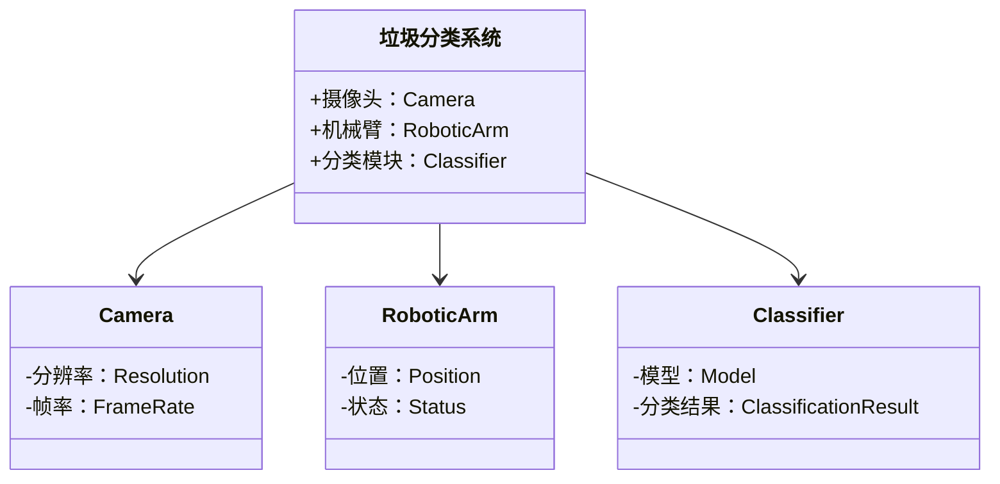
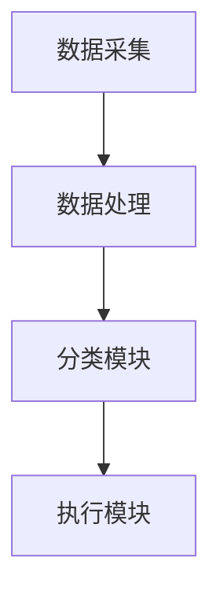
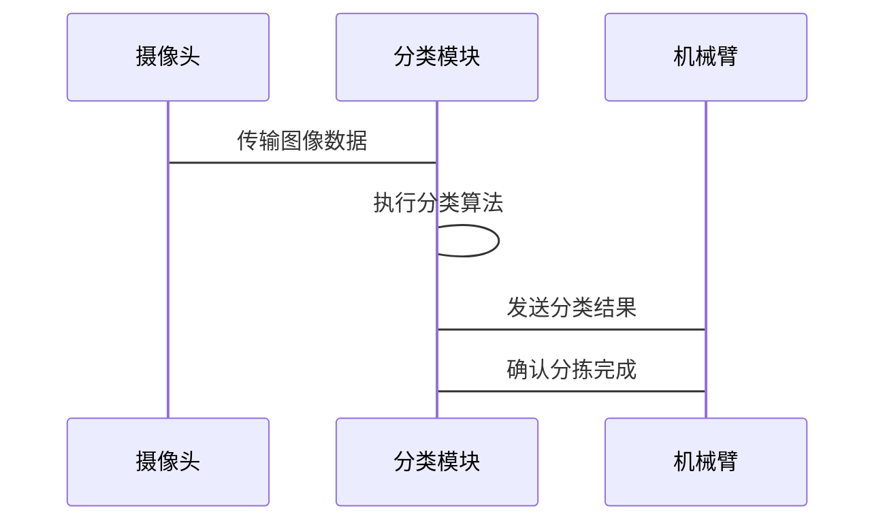

                 


# AI Agent在智能垃圾分类中的实践

> 关键词：AI Agent, 智能垃圾分类, 机器学习, 图像识别, 系统架构

> 摘要：本文探讨了AI Agent在智能垃圾分类中的应用实践，分析了其核心概念、算法原理、系统架构及项目实现。通过改进的卷积神经网络算法和系统设计，展示了AI Agent在提高垃圾分类效率和准确率中的重要作用。

---

# 第1章: AI Agent与智能垃圾分类的背景

## 1.1 智能垃圾分类的背景与现状

### 1.1.1 当前垃圾分类的重要性
随着城市化进程的加快，垃圾量急剧增加，垃圾分类成为全球关注的焦点。智能垃圾分类通过技术手段提高分类效率和准确性，是解决垃圾处理问题的重要方向。

### 1.1.2 传统垃圾分类的痛点与挑战
传统垃圾分类依赖人工操作，存在效率低、成本高、分类准确率低等问题。人工分类容易受到疲劳、经验不足等因素的影响，导致分类错误率较高。

### 1.1.3 AI Agent在垃圾分类中的应用前景
AI Agent作为一种智能代理，能够通过感知环境、自主决策并执行任务，为垃圾分类提供高效、准确的解决方案。AI Agent可以实时分析垃圾图像，自动分类并指导分拣机械臂完成任务。

## 1.2 AI Agent的基本概念与特点

### 1.2.1 AI Agent的定义
AI Agent是指能够感知环境、自主决策并执行任务的智能实体。它能够通过传感器获取信息，结合内部知识库和决策算法，做出最优选择并执行操作。

### 1.2.2 AI Agent的核心特点
- **自主性**：能够自主决策和执行任务，无需外部干预。
- **反应性**：能够实时感知环境并做出快速反应。
- **学习能力**：通过机器学习算法不断优化分类模型。
- **协作性**：能够与其他系统或设备协同工作，完成复杂任务。

### 1.2.3 AI Agent与传统AI的区别
| 特性 | AI Agent | 传统AI |
|------|----------|--------|
| 自主性 | 高 | 低 |
| 反应性 | 高 | 中 |
| 学习能力 | 强 | 弱 |
| 任务执行 | 自动化 | 手动或半自动化 |

## 1.3 本章小结
本章介绍了AI Agent在智能垃圾分类中的背景，分析了传统垃圾分类的痛点，并阐述了AI Agent的核心概念和特点。AI Agent通过自主性和反应性，能够显著提高垃圾分类的效率和准确性。

---

# 第2章: AI Agent在智能垃圾分类中的核心概念与联系

## 2.1 AI Agent的核心概念

### 2.1.1 AI Agent的构成要素
AI Agent的构成包括感知模块、决策模块、执行模块和知识库。感知模块负责获取环境信息，决策模块基于感知信息做出分类决策，执行模块负责执行分类任务，知识库提供分类所需的知识和规则。

### 2.1.2 AI Agent的分类与应用场景
AI Agent可以分为基于规则的Agent和基于机器学习的Agent。在垃圾分类中，基于机器学习的Agent通过深度学习模型实现高精度分类。

## 2.2 AI Agent与智能垃圾分类的关系

### 2.2.1 智能垃圾分类中的AI Agent角色
AI Agent在垃圾分类中扮演感知者和决策者的角色。它通过图像识别技术感知垃圾种类，并根据分类规则做出分类决策。

### 2.2.2 AI Agent在垃圾分类中的功能与价值
- **提高分类效率**：通过自动化分类减少人工操作时间。
- **提高分类准确率**：基于深度学习的模型能够实现高精度分类。
- **降低成本**：自动化分类减少了人工成本。

## 2.3 AI Agent与相关技术的对比

### 2.3.1 AI Agent与传统机器学习的对比
| 特性 | AI Agent | 传统机器学习 |
|------|----------|--------------|
| 自主性 | 高 | 低 |
| 反应性 | 高 | 中 |
| 任务执行 | 自动化 | 手动或半自动化 |

### 2.3.2 AI Agent与规则引擎的对比
| 特性 | AI Agent | 规则引擎 |
|------|----------|-----------|
| 灵活性 | 高 | 中 |
| 复杂问题处理 | 强 | 弱 |
| 学习能力 | 强 | 无 |

### 2.3.3 AI Agent与物联网技术的对比
AI Agent结合物联网技术，能够实现垃圾分拣的全流程自动化。物联网技术提供实时数据采集，AI Agent负责数据分析和分类决策。

## 2.4 本章小结
本章深入探讨了AI Agent的核心概念，分析了其在智能垃圾分类中的功能与价值，并通过对比其他技术，突出了AI Agent的独特优势。

---

# 第3章: AI Agent在智能垃圾分类中的算法原理

## 3.1 垃圾分类算法的原理与实现

### 3.1.1 垃圾分类的常见算法
- **支持向量机（SVM）**：适用于小规模数据集。
- **随机森林**：适用于特征较多的场景。
- **卷积神经网络（CNN）**：适用于图像分类任务。

### 3.1.2 基于图像识别的垃圾分类算法
图像识别是垃圾分类的重要技术，通过摄像头获取垃圾图像，利用深度学习模型进行分类。

### 3.1.3 基于深度学习的垃圾分类算法
深度学习模型（如ResNet、Inception）在图像分类任务中表现优异，适用于复杂场景。

## 3.2 AI Agent的算法实现

### 3.2.1 基于卷积神经网络的图像分类
改进的卷积神经网络（CNN）用于垃圾图像分类。网络结构包括卷积层、池化层和全连接层。

### 3.2.2 基于改进的卷积神经网络的垃圾分类算法
改进的CNN通过增加Batch Normalization层和Dropout层，提高了模型的泛化能力和分类准确率。

### 3.2.3 算法的优化与调优
- **数据增强**：通过旋转、翻转等操作增加训练数据量。
- **学习率调整**：使用Adam优化器，动态调整学习率。
- **模型剪枝**：减少网络参数，提高推理速度。

## 3.3 算法的数学模型与公式

### 3.3.1 卷积神经网络的数学模型
卷积层的数学表达式为：
$$
f(x) = \max\left(0, x + b\right)
$$
其中，$x$ 是输入，$b$ 是偏置。

### 3.3.2 损失函数与优化器
交叉熵损失函数：
$$
L = -\frac{1}{N}\sum_{i=1}^{N} y_i \log p_i + (1 - y_i)\log(1 - p_i)
$$
其中，$y_i$ 是标签，$p_i$ 是预测概率。

优化器使用Adam算法，学习率$\alpha=0.001$。

### 3.3.3 算法的训练与推理流程
1. 数据预处理：图像归一化、数据增强。
2. 模型训练：使用训练集训练模型，调整超参数。
3. 模型推理：输入测试图像，输出分类结果。

## 3.4 本章小结
本章详细讲解了AI Agent在智能垃圾分类中的算法原理，改进的卷积神经网络模型和优化策略，为后续系统实现奠定了基础。

---

# 第4章: AI Agent在智能垃圾分类中的系统架构设计

## 4.1 系统功能设计

### 4.1.1 系统功能模块
- **数据采集模块**：通过摄像头采集垃圾图像。
- **数据处理模块**：对图像进行预处理和特征提取。
- **分类模块**：利用改进的CNN模型进行分类。
- **执行模块**：根据分类结果驱动分拣机械臂。

### 4.1.2 系统功能流程
1. 数据采集模块获取垃圾图像。
2. 数据处理模块提取图像特征。
3. 分类模块输出分类结果。
4. 执行模块驱动机械臂分拣垃圾。

## 4.2 系统架构设计

### 4.2.1 领域模型类图


### 4.2.2 系统架构图


### 4.2.3 系统接口设计
- **数据接口**：摄像头提供图像数据接口。
- **控制接口**：机械臂提供运动控制接口。
- **通信接口**：系统各模块之间通过API通信。

### 4.2.4 系统交互流程图


## 4.3 本章小结
本章设计了智能垃圾分类系统的架构，包括功能模块、类图和交互流程图，为后续实现提供了清晰的指导。

---

# 第5章: AI Agent在智能垃圾分类中的项目实战

## 5.1 项目环境安装

### 5.1.1 安装Python
```bash
sudo apt-get install python3 python3-dev
```

### 5.1.2 安装深度学习库
```bash
pip install numpy matplotlib keras tensorflow opencv-python
```

## 5.2 系统核心实现源代码

### 5.2.1 数据预处理代码
```python
import cv2
import numpy as np

def preprocess_image(image_path):
    image = cv2.imread(image_path)
    image = cv2.resize(image, (224, 224))
    image = image.astype(np.float32) / 255.0
    return image
```

### 5.2.2 分类模型代码
```python
from keras.layers import Dense, Activation, Dropout, Flatten, Conv2D, MaxPooling2D
from keras.models import Sequential

def build_model():
    model = Sequential()
    model.add(Conv2D(32, (3, 3), activation='relu', input_shape=(224, 224, 3)))
    model.add(MaxPooling2D((2, 2)))
    model.add(Conv2D(64, (3, 3), activation='relu'))
    model.add(MaxPooling2D((2, 2)))
    model.add(Flatten())
    model.add(Dense(256, activation='relu'))
    model.add(Dropout(0.5))
    model.add(Dense(10, activation='softmax'))
    model.compile(optimizer='adam', loss='categorical_crossentropy', metrics=['accuracy'])
    return model
```

### 5.2.3 分拣机械臂控制代码
```python
import serial

ser = serial.Serial('COM3', 9600)

def move_arm(position):
    ser.write(f'position={position}\n'.encode())
```

## 5.3 项目小结
本章通过实际项目展示了AI Agent在智能垃圾分类中的应用，从环境搭建到代码实现，详细讲解了系统的实现过程。

---

# 第6章: 总结与展望

## 6.1 小结
本文详细探讨了AI Agent在智能垃圾分类中的应用，从背景、核心概念、算法原理到系统设计和项目实现，全面分析了其在提高垃圾分类效率和准确率中的重要作用。

## 6.2 注意事项
- 数据质量对分类准确率影响较大，需确保数据多样性和代表性。
- 模型优化需结合实际场景，避免过度拟合。
- 系统部署需考虑硬件性能和环境适应性。

## 6.3 拓展阅读
- 《Deep Learning》 - Ian Goodfellow
- 《Hands-On Machine Learning with Scikit-Learn, Keras, and TensorFlow》 - Aurélien Géron

---

# 作者：AI天才研究院 & 禅与计算机程序设计艺术

