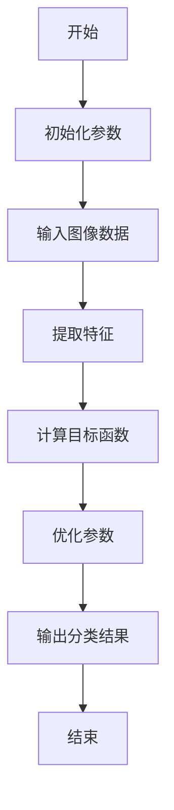
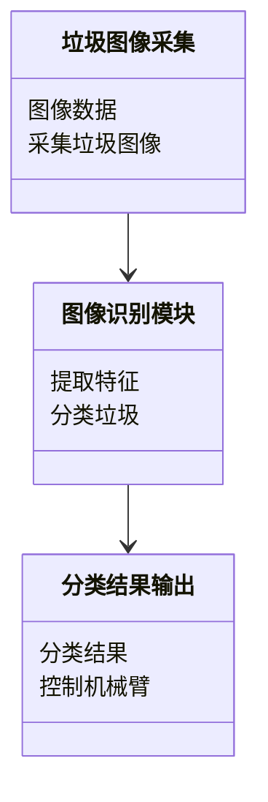
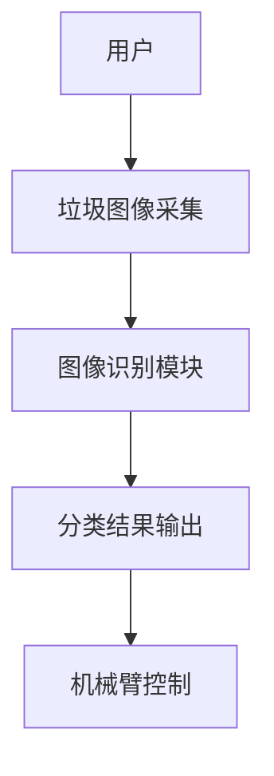
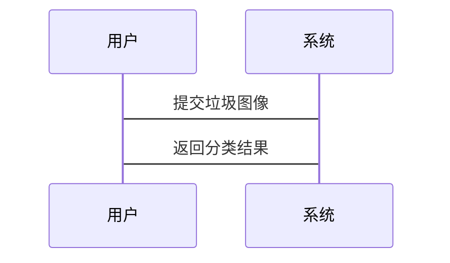

                 


# AI Agent在智能垃圾分类系统中的实践

> 关键词：AI Agent, 智能垃圾分类系统, 多目标优化算法, 系统架构设计, 项目实战

> 摘要：本文将详细探讨AI Agent在智能垃圾分类系统中的应用实践。首先，我们将介绍AI Agent和智能垃圾分类系统的背景，分析其核心概念与联系。接着，我们将深入讲解AI Agent在垃圾分类中的算法原理，包括多目标优化算法的实现和数学模型的构建。随后，我们将从系统架构设计的角度，分析智能垃圾分类系统的整体结构与实现方案。最后，我们将通过实际项目案例，展示AI Agent在智能垃圾分类系统中的具体应用，并总结经验与教训。

---

## 第一部分: AI Agent与智能垃圾分类系统背景介绍

### 第1章: AI Agent与智能垃圾分类系统概述

#### 1.1 AI Agent的基本概念
##### 1.1.1 AI Agent的定义
AI Agent（人工智能代理）是一种能够感知环境并采取行动以实现目标的智能体。它可以理解为一种软件或实体，通过传感器获取信息，利用推理和决策能力完成特定任务。

##### 1.1.2 AI Agent的核心特点
- **自主性**：AI Agent能够在没有外部干预的情况下独立运行。
- **反应性**：能够实时感知环境并做出响应。
- **目标导向**：通过设定目标来指导行为。
- **学习能力**：能够通过经验改进自身的决策能力。

##### 1.1.3 AI Agent与传统自动分类系统的区别
| 特性            | AI Agent                          | 传统自动分类系统                 |
|-----------------|----------------------------------|----------------------------------|
| 智能性          | 高                                | 低                                |
| 自主性          | 高                                | 低                                |
| 学习能力        | 高                                | 无或低                            |
| 适应性          | 高                                | 低                                |

#### 1.2 智能垃圾分类系统的背景
##### 1.2.1 垃圾分类的重要性
随着城市化进程的加快，垃圾量急剧增加，垃圾分类成为解决环境污染和资源回收的重要手段。

##### 1.2.2 智能垃圾分类系统的现状
传统的人工分类效率低，且容易出错。智能垃圾分类系统通过AI技术提高分类效率和准确性。

##### 1.2.3 智能垃圾分类系统的未来发展趋势
智能化、自动化和高效化将是未来的主要发展方向。

#### 1.3 AI Agent在智能垃圾分类中的应用
##### 1.3.1 AI Agent在垃圾分类中的作用
AI Agent可以通过图像识别和决策算法实现高效分类。

##### 1.3.2 AI Agent与智能垃圾分类系统的结合方式
AI Agent通过与垃圾分类系统的接口交互，实现垃圾的自动分类。

##### 1.3.3 AI Agent在垃圾分类中的优势
- **高效率**：AI Agent能够快速处理大量数据。
- **高准确性**：通过深度学习算法提高分类准确率。
- **灵活性**：能够适应不同类型的垃圾和分类规则。

### 第2章: AI Agent与智能垃圾分类系统的核心概念与联系

#### 2.1 AI Agent的核心原理
##### 2.1.1 知识表示与推理
通过符号逻辑或概率模型表示知识，并进行推理。

##### 2.1.2 行为规划与决策
基于当前状态和目标，规划最优行为并做出决策。

##### 2.1.3 多智能体协作
多个AI Agent协作完成复杂任务。

#### 2.2 智能垃圾分类系统的功能模块
##### 2.2.1 图像识别模块
通过摄像头采集垃圾图像，并识别其类型。

##### 2.2.2 数据处理模块
对图像数据进行预处理和特征提取。

##### 2.2.3 系统控制模块
根据分类结果控制机械臂完成垃圾分拣。

#### 2.3 AI Agent与智能垃圾分类系统的实体关系图
```mermaid
er
    entity AI Agent {
        id
        knowledge_base
        decision_making
    }
    entity 垃圾分类系统 {
        id
        image_recognition
        data_processing
    }
    AI Agent -[1..n]-> 垃圾分类系统
```

---

## 第二部分: AI Agent在智能垃圾分类中的算法原理

### 第3章: AI Agent的算法实现

#### 3.1 多目标优化算法
##### 3.1.1 算法原理
多目标优化算法旨在在多个目标之间找到平衡点，例如分类速度和分类准确率。

##### 3.1.2 算法流程图


##### 3.1.3 数学模型
$$
\text{目标函数} = \lambda_1 \cdot \text{准确率} + \lambda_2 \cdot \text{速度}
$$
其中，$\lambda_1$和$\lambda_2$是权重系数。

#### 3.2 图像识别算法
##### 3.2.1 基于深度学习的图像识别
使用卷积神经网络（CNN）进行垃圾图像分类。

##### 3.2.2 算法实现
```python
import tensorflow as tf
from tensorflow.keras import layers

model = tf.keras.Sequential([
    layers.Conv2D(32, (3,3), activation='relu', input_shape=(64,64,3)),
    layers.MaxPooling2D((2,2)),
    layers.Conv2D(64, (3,3), activation='relu'),
    layers.MaxPooling2D((2,2)),
    layers.Flatten(),
    layers.Dense(128, activation='relu'),
    layers.Dense(10, activation='softmax')
])
```

---

## 第三部分: 智能垃圾分类系统的架构设计

### 第4章: 系统架构设计

#### 4.1 项目背景
智能垃圾分类系统的目的是提高垃圾分类的效率和准确性。

#### 4.2 系统功能设计
##### 4.2.1 领域模型类图


#### 4.3 系统架构图


#### 4.4 接口设计
##### 4.4.1 系统接口
- 输入接口：垃圾图像数据
- 输出接口：分类结果和控制信号

##### 4.4.2 交互流程图


---

## 第四部分: 项目实战

### 第5章: 项目实战

#### 5.1 环境安装
安装必要的库：
```bash
pip install tensorflow numpy matplotlib
```

#### 5.2 系统核心实现
##### 5.2.1 图像识别模块
```python
import cv2
import numpy as np

def load_image(path):
    img = cv2.imread(path)
    img = cv2.resize(img, (64, 64))
    return img / 255.0

# 训练模型（假设已训练好）
model.load_weights('model.h5')

# 分类垃圾
image = load_image('garbage.jpg')
prediction = model.predict(np.array([image]))
print("分类结果:", np.argmax(prediction[0]))
```

##### 5.2.2 系统控制模块
```python
import serial

ser = serial.Serial('COM3', 9600)

def control_arm(action):
    ser.write(action.encode())

control_arm('分拣可回收物')
```

#### 5.3 代码解读与分析
- **图像加载与预处理**：将垃圾图像 resize 为固定大小，并归一化处理。
- **模型预测**：使用预训练的模型对图像进行分类。
- **机械臂控制**：通过串口发送指令，控制机械臂完成分拣。

#### 5.4 实际案例分析
通过实际案例分析，验证系统的分类准确率和效率。

#### 5.5 项目小结
总结项目的实现过程，分析优缺点，并提出改进建议。

---

## 第五部分: 最佳实践

### 第6章: 最佳实践

#### 6.1 小结
AI Agent在智能垃圾分类系统中的应用前景广阔，能够显著提高分类效率和准确性。

#### 6.2 注意事项
- 确保数据质量和多样性，避免过拟合。
- 定期更新模型，以应对垃圾类型的变化。

#### 6.3 拓展阅读
推荐相关书籍和论文，供读者深入学习。

---

## 作者：AI天才研究院/AI Genius Institute & 禅与计算机程序设计艺术 /Zen And The Art of Computer Programming

