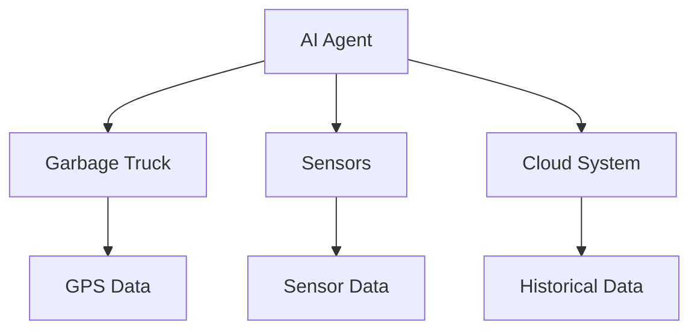
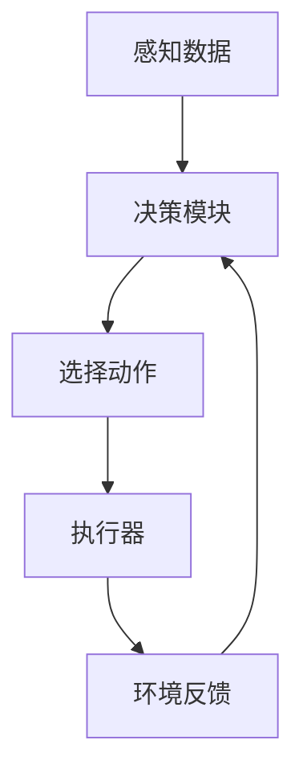

                 

# AI Agent在智能垃圾回收中的实践

## 关键词：AI Agent, 智能垃圾回收, 人工智能, 自动化技术, 垃圾分类, 环境保护

## 摘要：本文探讨了AI Agent在智能垃圾回收中的应用，分析了AI Agent的核心原理、算法模型、系统架构，通过实际案例展示了如何利用AI技术优化垃圾回收流程，提升效率和环保效果。

---

# 第1章: AI Agent与智能垃圾回收概述

## 1.1 AI Agent的基本概念
### 1.1.1 AI Agent的定义
AI Agent（人工智能代理）是指能够感知环境、自主决策并执行任务的智能体。它通过传感器获取数据，利用算法进行分析，并通过执行器与环境交互。

### 1.1.2 AI Agent的核心特点
- **自主性**：能够在没有人工干预的情况下独立运作。
- **反应性**：能够实时感知环境变化并做出反应。
- **目标导向**：具有明确的目标，如优化垃圾回收路径。
- **学习能力**：能够通过数据优化自身的决策模型。

### 1.1.3 AI Agent与传统垃圾回收的区别
传统垃圾回收依赖人工操作，效率低下且资源浪费。AI Agent通过自动化和智能化，显著提升了效率和环保效果。

---

## 1.2 智能垃圾回收的背景与现状
### 1.2.1 垃圾回收问题的背景
随着城市化进程的加快，垃圾量急剧增加，传统回收方式已无法满足需求。垃圾分类不准确、回收路径不合理等问题亟待解决。

### 1.2.2 当前垃圾回收的主要挑战
- **效率低下**：垃圾车路线规划不合理，导致浪费时间和能源。
- **分类错误**：人工分类的准确性较低，影响后续处理。
- **资源浪费**：非智能的垃圾收集方式导致运输成本增加。

### 1.2.3 智能垃圾回收的技术优势
- **优化路径规划**：AI Agent能够实时计算最优路线，减少运输距离。
- **提高分类准确性**：通过图像识别技术，实现精准的垃圾分类。
- **降低运营成本**：智能化管理能够显著减少人力和资源浪费。

---

## 1.3 AI Agent在垃圾回收中的应用前景
### 1.3.1 AI Agent在垃圾回收中的潜在应用领域
- **智能调度系统**：优化垃圾车的路线和时间安排。
- **实时监控与反馈**：通过传感器实时监测垃圾收集情况。
- **智能分类系统**：利用AI技术实现自动化的垃圾分类。

### 1.3.2 企业采用AI Agent的优势
- **提升效率**：通过智能化管理，减少垃圾收集时间。
- **降低成本**：优化路线和资源分配，降低运营成本。
- **环保效果**：提高垃圾分类准确率，促进资源再利用。

### 1.3.3 AI Agent应用的挑战与机遇
- **技术挑战**：AI算法的实时性和准确性需要进一步提升。
- **数据挑战**：需要大量高质量的数据来训练模型。
- **伦理挑战**：隐私和数据安全问题需要重视。

---

## 1.4 本章小结
本章介绍了AI Agent的基本概念及其在智能垃圾回收中的应用背景。通过分析当前垃圾回收的主要挑战和AI Agent的技术优势，展示了其在优化垃圾回收流程中的巨大潜力。

---

# 第2章: AI Agent的核心概念与联系

## 2.1 AI Agent的核心原理
### 2.1.1 AI Agent的感知机制
AI Agent通过传感器、摄像头等设备获取环境数据，如垃圾的位置、类型和数量。

### 2.1.2 AI Agent的决策机制
AI Agent利用机器学习算法（如强化学习）对感知数据进行分析，制定最优决策。

### 2.1.3 AI Agent的执行机制
通过执行器（如垃圾车）将决策转化为实际操作，如调整路线、启动收集等。

---

## 2.2 AI Agent与垃圾回收系统的关系
### 2.2.1 AI Agent在垃圾回收中的角色
AI Agent作为系统的“大脑”，负责协调和优化垃圾收集的各个流程。

### 2.2.2 AI Agent与垃圾车的交互
- **实时通信**：垃圾车与AI Agent保持实时通信，汇报当前位置和状态。
- **路径优化**：AI Agent根据实时数据动态调整垃圾车的行驶路线。

### 2.2.3 AI Agent与传感器的结合
- **数据采集**：传感器收集垃圾桶的填充状态、地理位置等信息。
- **数据融合**：AI Agent将多源数据融合，提高决策的准确性。

---

## 2.3 AI Agent的核心要素对比表格
| 核心要素 | 描述 | 特点 |
|----------|------|------|
| 感知模块 | 数据采集 | 多源数据融合 |
| 决策模块 | 智能决策 | 基于模型推理 |
| 执行模块 | 系统控制 | 实时反馈 |

---

## 2.4 AI Agent的ER实体关系图

---

## 2.5 本章小结
本章详细讲解了AI Agent的核心原理及其与垃圾回收系统的联系，通过对比表格和实体关系图展示了系统的构成和交互方式。

---

# 第3章: AI Agent的算法原理

## 3.1 AI Agent的算法原理
### 3.1.1 强化学习算法
- **定义**：通过奖励机制，优化AI Agent的决策策略。
- **应用**：用于路径规划和任务调度。

### 3.1.2 图搜索算法
- **Dijkstra算法**：用于计算两点之间的最短路径。
- **A*算法**：结合启发式搜索，优化路径规划。

---

## 3.2 AI Agent的数学模型
### 3.2.1 强化学习模型
$$ R = r_1 + r_2 + ... + r_n $$
其中，$R$ 是总奖励，$r_i$ 是每一步的奖励。

### 3.2.2 路径规划模型
$$ \text{距离} = \sum_{i=1}^{n} |x_i - x_{i-1}| + |y_i - y_{i-1}| $$

---

## 3.3 AI Agent的算法流程图

---

## 3.4 本章小结
本章介绍了AI Agent的核心算法及其数学模型，通过流程图展示了算法的执行过程。

---

通过以上章节的分析，我们可以看到AI Agent在智能垃圾回收中的巨大潜力。接下来的章节将详细介绍系统的架构设计、项目实战以及最佳实践，帮助读者更好地理解和应用这一技术。

