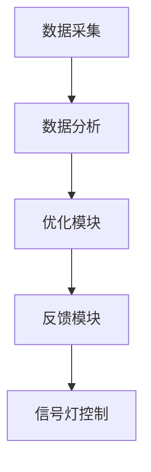

                 


# AI Agent在智能城市交通优化中的应用

> 关键词：AI Agent, 智能城市, 交通优化, 强化学习, 多目标优化

> 摘要：随着城市化进程的加快，交通拥堵问题日益严重，传统的交通管理方法已难以应对复杂的交通状况。AI Agent作为一种智能代理技术，能够通过感知、决策和执行来优化交通流量，提高道路利用率，减少拥堵和排放。本文详细探讨了AI Agent在智能城市交通优化中的应用，从核心概念、算法原理、数学模型到系统架构设计，再到项目实战，为读者提供全面的指导。

---

# 第一部分: AI Agent在智能城市交通优化中的应用概述

## 第1章: 智能城市交通优化的背景与挑战

### 1.1 智能城市的发展现状

#### 1.1.1 智能城市的定义与特征
智能城市是指通过先进信息通信技术（ICT）和数据驱动的解决方案，优化城市资源分配、提升居民生活质量的城市发展模式。其主要特征包括：

- **智能化**：利用AI、大数据、物联网等技术实现城市服务的智能化。
- **互联性**：通过网络将城市中的各个系统和设备连接起来，实现信息共享。
- **高效性**：通过智能化管理，提高资源利用效率，减少浪费。

#### 1.1.2 智能城市交通系统的重要性
智能交通系统（ITS）是智能城市的重要组成部分，其目标是通过优化交通管理，提高道路利用率，减少拥堵和排放。交通系统的好坏直接影响城市的运行效率和居民生活质量。

#### 1.1.3 当前城市交通的主要问题
- **交通拥堵**：高峰时段交通流量过大，导致道路利用率低。
- **资源浪费**：交通信号灯、道路资源未被充分利用。
- **环境污染**：交通拥堵导致尾气排放增加，加剧环境污染。

### 1.2 AI Agent的基本概念与优势

#### 1.2.1 AI Agent的定义与特点
AI Agent（智能代理）是一种能够感知环境、做出决策并执行操作的智能系统。其特点包括：

- **自主性**：能够在没有外部干预的情况下独立运行。
- **反应性**：能够实时感知环境变化并做出反应。
- **学习能力**：通过数据和经验不断优化自身行为。

#### 1.2.2 AI Agent在交通优化中的应用优势
AI Agent能够通过以下方式优化交通系统：

- **实时优化**：根据实时交通数据调整信号灯配时，优化交通流量。
- **多目标优化**：在减少拥堵的同时，考虑环境影响、交通效率等多个目标。
- **自适应性**：能够根据交通状况的变化自动调整策略。

#### 1.2.3 AI Agent与其他交通优化技术的对比
| 技术 | 优点 | 缺点 |
|------|------|------|
| 传统交通信号控制 | 实施简单，成本低 | 无法应对复杂变化，效率有限 |
| 深度学习 | 高准确性，能够处理复杂数据 | 计算资源需求高，解释性差 |
| AI Agent | 实时性高，适应性强 | 开发和维护复杂 |

### 1.3 智能城市交通优化的核心问题

#### 1.3.1 交通流量预测与优化
通过历史数据和实时信息，预测交通流量，优化信号灯配时，减少拥堵。

#### 1.3.2 交通信号控制与协调
通过AI Agent协调多个信号灯的配时，提高道路利用率。

#### 1.3.3 多目标优化与资源分配
在优化交通流量的同时，考虑环境影响、能源消耗等多目标，进行资源的合理分配。

### 1.4 本章小结
本章介绍了智能城市的发展现状，阐述了AI Agent的基本概念和优势，并指出了智能城市交通优化的核心问题。

---

## 第2章: AI Agent的原理与技术实现

### 2.1 AI Agent的基本原理

#### 2.1.1 AI Agent的感知层
AI Agent通过传感器、摄像头等设备感知交通流量、车辆位置等信息。

#### 2.1.2 AI Agent的决策层
基于感知到的信息，AI Agent利用算法（如强化学习）做出决策，优化信号灯配时。

#### 2.1.3 AI Agent的执行层
根据决策结果，AI Agent通过控制信号灯、调整交通流向等方式执行优化策略。

### 2.2 AI Agent的核心算法

#### 2.2.1 强化学习算法
强化学习是一种通过试错学习来优化策略的方法。在交通优化中，AI Agent通过调整信号灯配时，最大化交通流畅度。

```python
# 强化学习算法示例代码
import numpy as np
from collections import deque

class Agent:
    def __init__(self, state_space, action_space):
        self.state_space = state_space
        self.action_space = action_space
        self.memory = deque(maxlen=1000)
        self.gamma = 0.99  # 折扣因子
        self.epsilon = 1.0  # 探索率
        self.epsilon_min = 0.01
        self.batch_size = 64

    def remember(self, state, action, reward, next_state, done):
        self.memory.append((state, action, reward, next_state, done))

    def act(self, state):
        if np.random.random() < self.epsilon:
            return np.random.randint(0, self.action_space)
        else:
            # 假设有一个神经网络模型来预测动作
            return np.argmax(self.model.predict(state))

    def replay(self):
        # 从记忆中随机抽取一批样本
        minibatch = np.random.choice(len(self.memory), self.batch_size)
        states = []
        actions = []
        rewards = []
        next_states = []
        dones = []
        for i in minibatch:
            state, action, reward, next_state, done = self.memory[i]
            states.append(state)
            actions.append(action)
            rewards.append(reward)
            next_states.append(next_state)
            dones.append(done)

        # 训练模型
        targets = rewards + self.gamma * np.max(self.model.predict(np.array(next_states)))
        self.model.fit(np.array(states), targets, epochs=1, verbose=0)
```

#### 2.2.2 遗传算法
遗传算法是一种基于生物进化原理的优化算法，适用于复杂的多目标优化问题。

```python
# 遗传算法示例代码
import random

def fitness(individual):
    # 计算适应度，例如交通流畅度
    return sum(individual)

def mutate(individual):
    # 突变操作
    if random.random() < 0.1:
        idx = random.randint(0, len(individual)-1)
        individual[idx] = 1 - individual[idx]
    return individual

def crossover(parent1, parent2):
    # 单点交叉
    point = random.randint(1, len(parent1)-1)
    return parent1[:point] + parent2[point:], parent2[:point] + parent1[point:]

# 初始化种群
population = [random.choices([0,1], k=10) for _ in range(100)]

# 进化过程
for _ in range(100):
    # 计算适应度
    fitness_values = [fitness(individual) for individual in population]
    # 选择
    selected = [population[i] for i in sorted(range(len(fitness_values)), key=lambda x: -fitness_values[x])[:50]]
    # 交叉
    new_population = []
    for i in range(0, len(selected), 2):
        p1, p2 = selected[i], selected[i+1]
        c1, c2 = crossover(p1, p2)
        new_population.extend([mutate(c1), mutate(c2)])
    population = new_population
```

#### 2.2.3 贪婪算法
贪婪算法是一种简单而有效的贪心策略，适用于局部优化问题。

### 2.3 AI Agent与大数据、云计算的结合

#### 2.3.1 大数据在AI Agent中的应用
大数据技术用于收集和分析大量的交通数据，为AI Agent提供决策支持。

#### 2.3.2 云计算对AI Agent的支撑
云计算提供了强大的计算资源，支持AI Agent的训练和推理。

#### 2.3.3 大数据与云计算对AI Agent的协同作用
通过大数据分析获取交通规律，利用云计算进行实时计算，提升AI Agent的决策效率。

### 2.4 本章小结
本章详细介绍了AI Agent的基本原理及其核心算法，包括强化学习、遗传算法和贪婪算法，并探讨了AI Agent与大数据、云计算的结合。

---

## 第3章: AI Agent的算法原理与数学模型

### 3.1 强化学习算法的数学模型

#### 3.1.1 状态空间和动作空间
- 状态空间：表示交通系统中的各种状态，例如交通流量、信号灯状态。
- 动作空间：表示AI Agent可以执行的动作，例如调整信号灯配时。

#### 3.1.2 奖励函数
奖励函数用于衡量AI Agent的行为是否达到优化目标。

$$ R(s, a) = \text{流畅度} + \text{等待时间} \times (-1) $$

#### 3.1.3 策略函数
策略函数表示AI Agent在给定状态下的动作选择概率。

$$ \pi(a|s) = P(\text{选择动作 }a \mid \text{状态 }s) $$

### 3.2 遗传算法的数学模型

#### 3.2.1 适应度函数
适应度函数用于评估个体的优劣。

$$ f(x) = \sum_{i=1}^{n} w_i x_i $$

其中，$w_i$ 是权重，$x_i$ 是个体的特征。

#### 3.2.2 选择、交叉和突变操作
选择操作基于适应度值选择个体；交叉操作生成新的个体；突变操作随机改变个体的特征。

### 3.3 本章小结
本章通过数学模型详细解释了强化学习和遗传算法的原理，为AI Agent的实现提供了理论基础。

---

## 第4章: AI Agent的系统架构设计

### 4.1 系统架构概述

#### 4.1.1 数据采集模块
通过传感器、摄像头等设备采集交通数据。

#### 4.1.2 数据分析模块
对采集到的数据进行处理和分析，提取有用的信息。

#### 4.1.3 优化模块
利用AI算法对交通信号进行优化。

#### 4.1.4 反馈模块
将优化结果反馈到系统中，进行实时调整。

### 4.2 系统架构图（Mermaid）



### 4.3 系统接口设计
系统需要与交通信号灯、摄像头等设备进行接口对接，确保数据的实时传输和处理。

### 4.4 本章小结
本章通过系统架构设计，展示了AI Agent在智能交通系统中的应用，为后续的项目实现提供了指导。

---

## 第5章: 项目实战

### 5.1 环境安装
需要安装以下库：
- Python 3.8+
- Scikit-learn
- Keras
- TensorFlow

### 5.2 核心代码实现

#### 5.2.1 强化学习代码

```python
import numpy as np
import random

class TrafficAgent:
    def __init__(self, state_size, action_size):
        self.state_size = state_size
        self.action_size = action_size
        self.gamma = 0.99
        self.epsilon = 1.0
        self.epsilon_min = 0.01
        self.batch_size = 64

    def remember(self, state, action, reward, next_state, done):
        # 实际实现中需要一个记忆库，这里简化为直接存储
        self.memory = (state, action, reward, next_state, done)

    def act(self, state):
        if random.random() < self.epsilon:
            return random.randint(0, self.action_size - 1)
        return np.argmax(self.model.predict(state))

    def replay(self):
        if len(self.memory) < self.batch_size:
            return
        # 提取记忆
        state, action, reward, next_state, done = self.memory
        target = reward + self.gamma * np.max(self.model.predict(next_state))
        target_f = self.model.predict(state)
        target_f[0][action] = target
        self.model.fit(state, target_f, epochs=1, verbose=0)
```

#### 5.2.2 交通流预测代码

```python
from sklearn.linear_model import LinearRegression

# 假设我们有历史数据
X = np.array([[1, 2], [3, 4], [5, 6]])  # 特征
y = np.array([7, 8, 9])  # 目标

model = LinearRegression()
model.fit(X, y)

# 预测新数据
new_X = np.array([[7, 8]])
prediction = model.predict(new_X)
print(prediction)
```

### 5.3 案例分析
通过实际案例分析，展示AI Agent在交通优化中的应用效果。

### 5.4 项目小结
本章通过项目实战，详细讲解了AI Agent在交通优化中的实现过程，为读者提供了实际操作的指导。

---

## 第6章: 总结与展望

### 6.1 总结
本文详细探讨了AI Agent在智能城市交通优化中的应用，从理论基础到实际应用，为读者提供了全面的指导。

### 6.2 展望
未来，随着AI技术的不断发展，AI Agent在交通优化中的应用将更加广泛，算法也将更加复杂和高效。

### 6.3 注意事项
在实际应用中，需要考虑数据隐私、算法计算资源消耗等问题。

### 6.4 拓展阅读
推荐阅读相关领域的书籍和论文，深入学习AI Agent和交通优化的知识。

---

## 作者：AI天才研究院/AI Genius Institute & 禅与计算机程序设计艺术 /Zen And The Art of Computer Programming

---

通过以上内容，读者可以全面了解AI Agent在智能城市交通优化中的应用，从理论到实践，逐步掌握相关技术。

