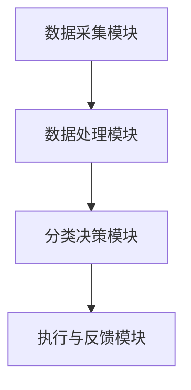
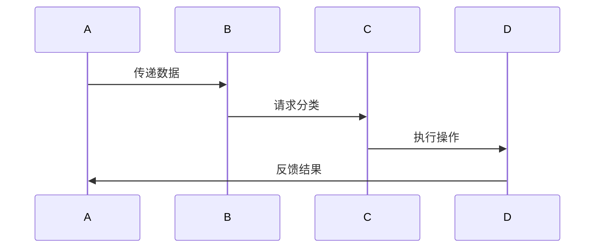

                 


# AI Agent在智能城市垃圾分类中的实践

> 关键词：AI Agent, 智能城市, 垃圾分类, 图像识别, 决策树算法, 系统架构

> 摘要：随着智能城市的发展，AI Agent在垃圾分类中的应用越来越广泛。本文从AI Agent的基本概念出发，分析其在智能城市垃圾分类中的优势和挑战，详细探讨了AI Agent在垃圾分类中的算法原理、系统架构设计以及实际项目中的应用案例。通过对实际案例的分析，总结了AI Agent在垃圾分类中的实践经验，并提出了未来的发展方向。

---

# 第一部分: AI Agent与智能城市垃圾分类的背景

## 第1章: AI Agent与智能城市概述

### 1.1 AI Agent的基本概念

#### 1.1.1 AI Agent的定义

AI Agent（人工智能代理）是指能够感知环境、自主决策并执行任务的智能体。它能够通过传感器获取信息，利用算法进行分析和决策，并通过执行器与环境交互。

$$
\text{AI Agent} = \{\text{感知} \rightarrow \text{决策} \rightarrow \text{执行}\}
$$

#### 1.1.2 AI Agent的核心特征

| 特征 | 描述 |
|------|------|
| 自主性 | 能够自主决策和行动 |
| 反应性 | 能够实时感知环境并做出反应 |
| 学习性 | 能够通过经验改进性能 |

#### 1.1.3 AI Agent与传统AI的区别

| 方面 | AI Agent | 传统AI |
|------|----------|---------|
| 任务 | 独立完成任务 | 依赖人工干预 |
| 环境 | 能够与环境交互 | 仅限于数据处理 |

### 1.2 智能城市的定义与特点

#### 1.2.1 智能城市的定义

智能城市是指通过物联网、大数据、人工智能等技术，实现城市资源优化配置和高效管理的城市形态。

#### 1.2.2 智能城市的核心特征

| 特征 | 描述 |
|------|------|
| 数字化 | 所有资源和服务数字化 |
| 智能化 | 能够自主决策和优化 |
| 互联性 | 各系统和设备高度互联 |

#### 1.2.3 智能城市与传统城市的区别

| 方面 | 智能城市 | 传统城市 |
|------|----------|---------|
| 资源利用 | 高效 | 低效 |
| 服务模式 | 智能化 | 人工化 |
| 管理方式 | 自主决策 | 人工决策 |

### 1.3 AI Agent在垃圾分类中的应用前景

#### 1.3.1 AI Agent在垃圾分类中的优势

| 优势 | 描述 |
|------|------|
| 高效性 | 提高分类速度和准确率 |
| 智能性 | 能够自适应不同场景 |
| 可扩展性 | 支持多种分类标准 |

#### 1.3.2 当前AI Agent在垃圾分类中的应用现状

| 应用案例 | 描述 |
|----------|------|
| 国内案例 | 北京市某社区AI垃圾分类系统 |
| 国外案例 | 美国某城市智能垃圾桶试点项目 |

---

## 第2章: 垃圾分类的背景与挑战

### 2.1 垃圾分类的重要性

#### 2.1.1 垃圾分类对环境保护的意义

垃圾是放错地方的资源。通过分类，可以减少环境污染，提高资源利用率。

#### 2.1.2 垃圾分类对资源利用的价值

通过分类，可以将可回收物再利用，减少资源浪费。

### 2.2 当前垃圾分类的主要挑战

#### 2.2.1 人工分类的效率问题

| 问题 | 描述 |
|------|------|
| 低效性 | 人工分类速度慢 |
| 易疲劳 | 长时间工作易疲劳 |
| 易出错 | 分类错误率高 |

#### 2.2.2 分类标准的多样性

| 问题 | 描述 |
|------|------|
| 标准复杂 | 不同地区分类标准不同 |
| 难以统一 | 难以实现统一管理 |

#### 2.2.3 垃圾分类系统的复杂性

| 问题 | 描述 |
|------|------|
| 系统集成 | 各子系统协同困难 |
| 管理复杂 | 系统维护成本高 |

---

## 第3章: AI Agent在垃圾分类中的应用前景

### 3.1 AI Agent在垃圾分类中的优势

| 优势 | 描述 |
|------|------|
| 高效性 | 提高分类速度和准确率 |
| 智能性 | 能够自适应不同场景 |
| 可扩展性 | 支持多种分类标准 |

### 3.2 当前AI Agent在垃圾分类中的应用现状

| 应用案例 | 描述 |
|----------|------|
| 国内案例 | 北京市某社区AI垃圾分类系统 |
| 国外案例 | 美国某城市智能垃圾桶试点项目 |

---

# 第二部分: AI Agent在垃圾分类中的核心概念与原理

## 第4章: AI Agent的核心概念与原理

### 4.1 AI Agent的基本原理

#### 4.1.1 信息感知与处理

AI Agent通过传感器获取环境信息，并进行预处理和特征提取。

#### 4.1.2 决策与执行

AI Agent基于处理后的信息，利用算法进行决策，并通过执行器执行任务。

#### 4.1.3 学习与优化

AI Agent通过机器学习算法不断优化自身的分类模型，提高分类准确率。

### 4.2 AI Agent的分类与特点

| 类型 | 描述 |
|------|------|
| 基于规则的AI Agent | 通过预设规则进行分类 |
| 基于机器学习的AI Agent | 利用机器学习算法进行分类 |
| 基于深度学习的AI Agent | 利用深度学习算法进行分类 |

---

## 第5章: 垃圾分类中的AI Agent系统架构

### 5.1 系统架构概述

#### 5.1.1 数据采集模块

| 功能 | 描述 |
|------|------|
| 传感器 | 采集垃圾图像或数据 |
| 数据预处理 | 对采集的数据进行清洗和标准化 |

#### 5.1.2 数据处理模块

| 功能 | 描述 |
|------|------|
| 特征提取 | 提取垃圾的关键特征 |
| 数据存储 | 存储处理后的数据 |

#### 5.1.3 分类决策模块

| 功能 | 描述 |
|------|------|
| 分类算法 | 使用机器学习或深度学习算法进行分类 |
| 决策优化 | 不断优化分类模型 |

#### 5.1.4 执行与反馈模块

| 功能 | 描述 |
|------|------|
| 执行器 | 根据分类结果执行相应的操作 |
| 反馈机制 | 根据执行结果反馈信息 |

### 5.2 系统架构的优化与设计

#### 5.2.1 模块间的交互关系



#### 5.2.2 系统的可扩展性设计

| 设计 | 描述 |
|------|------|
| 模块化设计 | 各模块独立，便于扩展 |
| 标准化接口 | 模块间接口标准化，便于集成 |

#### 5.2.3 系统的容错与纠错机制

| 机制 | 描述 |
|------|------|
| 错误检测 | 及时发现分类错误 |
| 自动修复 | 自动调整模型参数 |

---

## 第6章: 垃圾分类中的图像识别算法

### 6.1 图像识别的基本原理

#### 6.1.1 图像采集与预处理

| 步骤 | 描述 |
|------|------|
| 采集 | 使用摄像头采集垃圾图像 |
| 预处理 | 调整图像亮度、对比度等 |

#### 6.1.2 特征提取与分类

| 步骤 | 描述 |
|------|------|
| 特征提取 | 提取垃圾的关键特征 |
| 分类器选择 | 选择合适的分类器（如支持向量机、随机森林等） |

#### 6.1.3 分类器的选择与优化

| 方法 | 描述 |
|------|------|
| 参数调整 | 调整分类器参数以提高准确率 |
| 模型评估 | 使用交叉验证评估模型性能 |

### 6.2 基于深度学习的图像识别算法

#### 6.2.1 CNN网络结构

| 层 | 描述 |
|------|------|
| 输入层 | 接收垃圾图像 |
| 卷积层 | 提取图像特征 |
| 池化层 | 减少特征维度 |
| 全连接层 | 分类垃圾类型 |

#### 6.2.2 模型训练与优化

| 步骤 | 描述 |
|------|------|
| 数据集准备 | 准备训练数据 |
| 模型训练 | 使用训练数据训练模型 |
| 模型优化 | 调整模型参数以提高准确率 |

---

## 第7章: 垃圾分类中的决策树算法

### 7.1 决策树的基本原理

#### 7.1.1 决策树的构建过程

| 步骤 | 描述 |
|------|------|
| 特征选择 | 选择关键特征 |
| 决策节点 | 构建决策节点 |
| 叶节点 | 确定最终分类结果 |

#### 7.1.2 决策树的分类与预测

| 步骤 | 描述 |
|------|------|
| 数据输入 | 输入待分类的垃圾 |
| 特征判断 | 判断垃圾的特征 |
| 分类结果 | 输出分类结果 |

#### 7.1.3 决策树的优化与剪枝

| 方法 | 描述 |
|------|------|
| 前剪枝 | 在构建过程中剪枝 |
| 后剪枝 | 在构建完成后剪枝 |

### 7.2 基于决策树的垃圾分类系统设计

#### 7.2.1 数据集的准备与处理

| 步骤 | 描述 |
|------|------|
| 数据收集 | 收集各种垃圾的图像 |
| 数据标注 | 标注每张图像的垃圾类型 |

#### 7.2.2 系统功能设计

| 功能 | 描述 |
|------|------|
| 图像采集 | 采集垃圾图像 |
| 特征提取 | 提取垃圾的特征 |
| 分类决策 | 利用决策树进行分类 |
| 结果展示 | 显示分类结果 |

---

## 第8章: 垃圾分类中的系统架构设计

### 8.1 问题场景介绍

| 问题 | 描述 |
|------|------|
| 分类效率低 | 人工分类效率低 |
| 分类错误率高 | 分类错误率高 |
| 系统维护难 | 系统维护难度大 |

### 8.2 系统功能设计

| 功能模块 | 描述 |
|------|------|
| 数据采集模块 | 采集垃圾图像 |
| 数据处理模块 | 处理和存储数据 |
| 分类决策模块 | 利用AI Agent进行分类 |
| 执行与反馈模块 | 执行分类结果并反馈 |

### 8.3 系统架构设计


### 8.4 系统接口设计

| 接口 | 描述 |
|------|------|
| 数据接口 | 数据采集模块与数据处理模块的接口 |
| 分类接口 | 数据处理模块与分类决策模块的接口 |
| 执行接口 | 分类决策模块与执行与反馈模块的接口 |

### 8.5 系统交互设计



---

## 第9章: 垃圾分类中的项目实战

### 9.1 项目背景与目标

#### 9.1.1 项目背景

随着城市化进程的加快，垃圾量急剧增加，传统的人工分类方式已经无法满足需求。

#### 9.1.2 项目目标

通过AI Agent实现垃圾的智能分类，提高分类效率和准确率。

### 9.2 系统核心实现

#### 9.2.1 环境安装

| 工具 | 描述 |
|------|------|
| Python | 程序开发语言 |
| TensorFlow | 深度学习框架 |
| OpenCV | 图像处理库 |

#### 9.2.2 核心代码实现

```python
import tensorflow as tf
from tensorflow.keras import layers

# 定义模型
model = tf.keras.Sequential([
    layers.Conv2D(32, (3,3), activation='relu', input_shape=(100, 100, 3)),
    layers.MaxPooling2D((2,2)),
    layers.Conv2D(64, (3,3), activation='relu'),
    layers.MaxPooling2D((2,2)),
    layers.Flatten(),
    layers.Dense(128, activation='relu'),
    layers.Dense(10, activation='softmax')
])

# 编译模型
model.compile(optimizer='adam', loss='sparse_categorical_crossentropy', metrics=['accuracy'])

# 训练模型
model.fit(train_images, train_labels, epochs=10, validation_data=(test_images, test_labels))
```

---

## 第10章: 总结与展望

### 10.1 总结

通过本文的介绍，我们可以看到AI Agent在智能城市垃圾分类中的巨大潜力。AI Agent能够显著提高分类效率和准确率，同时降低人工成本。

### 10.2 未来展望

随着技术的不断进步，AI Agent在垃圾分类中的应用将更加广泛。未来，我们可以探索更多AI Agent在智能城市中的应用，如智能交通、智能能源管理等。

---

# 作者：AI天才研究院/AI Genius Institute & 禅与计算机程序设计艺术 /Zen And The Art of Computer Programming

