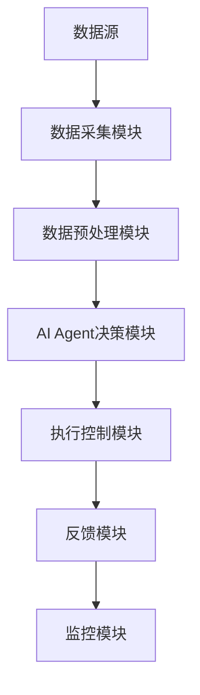
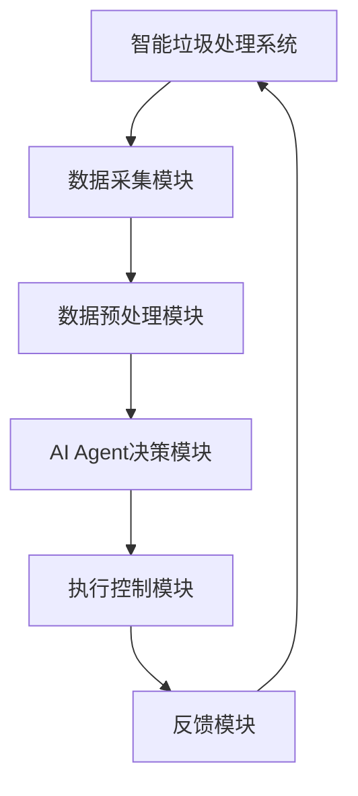

                 


# 第4章: AI Agent在智能城市垃圾处理中的系统设计与实现

## 4.1 系统设计概述

### 4.1.1 系统功能模块划分
- 数据采集模块
- 数据预处理模块
- AI Agent决策模块
- 执行控制模块
- 监控与反馈模块

### 4.1.2 系统架构设计
使用Mermaid图展示系统架构：


### 4.1.3 系统功能模块说明
- 数据采集模块：负责从传感器、摄像头等设备获取垃圾处理相关数据。
- 数据预处理模块：对采集到的数据进行清洗、归一化处理，以便后续分析。
- AI Agent决策模块：基于预处理后的数据，运用强化学习和监督学习算法生成决策。
- 执行控制模块：根据决策结果，控制机器人或自动化设备执行具体操作。
- 监控与反馈模块：实时监控系统运行状态，并将反馈信息传递给AI Agent进行优化调整。

## 4.2 系统架构设计

### 4.2.1 系统架构图
使用Mermaid图展示系统架构：


### 4.2.2 各模块之间的关系
- 数据采集模块与数据预处理模块之间是数据流的关系。
- 数据预处理模块将数据传递给AI Agent决策模块。
- AI Agent决策模块将决策结果传递给执行控制模块。
- 执行控制模块将执行结果反馈给监控与反馈模块，形成闭环。

## 4.3 系统接口设计

### 4.3.1 系统接口定义
- 数据采集接口：定义如何从外部设备获取数据。
- AI Agent决策接口：定义如何与AI Agent进行交互。
- 执行控制接口：定义如何控制执行机构。

### 4.3.2 接口交互流程图
使用Mermaid图展示接口交互流程：
```mermaid
graph TD
    Start --> 数据采集模块
    数据采集模块 --> 数据预处理模块
    数据预处理模块 --> AI Agent决策模块
    AI Agent决策模块 --> 执行控制模块
    执行控制模块 --> 反馈模块
    反馈模块 --> Start
```

## 4.4 本章小结
本章详细介绍了AI Agent在智能城市垃圾处理系统中的设计与实现，包括系统功能模块划分、系统架构设计、接口设计等内容，为后续的项目实现奠定了基础。

# 第5章: AI Agent在智能城市垃圾处理中的项目实战

## 5.1 项目环境安装与配置

### 5.1.1 安装Python环境
- 安装Python 3.8及以上版本
- 安装Jupyter Notebook

### 5.1.2 安装AI Agent开发框架
- 使用TensorFlow或PyTorch框架
- 安装相关依赖库：numpy、pandas、scikit-learn等

## 5.2 AI Agent核心功能实现

### 5.2.1 数据采集模块实现
- 代码示例：
```python
import numpy as np
import pandas as pd

# 数据采集模块
class DataCollector:
    def __init__(self, data_source):
        self.data_source = data_source

    def collect_data(self):
        # 模拟数据采集
        data = pd.DataFrame({
            'timestamp': np.random.date_range(start='2023-01-01', periods=100),
            'location': np.random.choice(['A区', 'B区', 'C区'], 100),
            'garbage_type': np.random.choice([0, 1, 2], 100)
        })
        return data
```

### 5.2.2 数据预处理模块实现
- 代码示例：
```python
import numpy as np
import pandas as pd

# 数据预处理模块
class DataPreprocessor:
    def __init__(self, data):
        self.data = data

    def preprocess(self):
        # 数据清洗与归一化处理
        self.data['garbage_type'] = self.data['garbage_type'].astype(str)
        self.data = self.data.dropna()
        return self.data
```

### 5.2.3 AI Agent决策模块实现
- 代码示例：
```python
import numpy as np
import pandas as pd
from sklearn.tree import DecisionTreeClassifier

# AI Agent决策模块
class AI-Agent:
    def __init__(self, data):
        self.data = data
        self.model = DecisionTreeClassifier()

    def train_model(self):
        # 训练模型
        self.model.fit(self.data[['location']], self.data['garbage_type'])
        return self.model

    def make_decision(self, location):
        # 生成决策
        prediction = self.model.predict([[location]])
        return prediction[0]
```

## 5.3 系统实现与测试

### 5.3.1 系统整体实现
- 代码示例：
```python
# 系统整体实现
data_collector = DataCollector('传感器数据')
data = data_collector.collect_data()

data_preprocessor = DataPreprocessor(data)
preprocessed_data = data_preprocessor.preprocess()

ai_agent = AI-Agent(preprocessed_data)
model = ai_agent.train_model()

# 测试决策
decision = ai_agent.make_decision('A区')
print('决策结果:', decision)
```

### 5.3.2 测试与验证
- 数据测试：使用测试数据验证模型的准确率。
- 功能测试：测试各个模块的交互是否正常。
- 性能测试：测试系统的处理速度和稳定性。

## 5.4 本章小结
本章通过实际项目案例，详细讲解了AI Agent在智能城市垃圾处理中的实现过程，包括环境配置、核心功能实现和系统测试等内容。

# 第6章: AI Agent在智能城市垃圾处理中的系统优化与扩展

## 6.1 系统优化策略

### 6.1.1 模型优化
- 使用更复杂的深度学习模型，如LSTM或Transformer，提高分类准确率。
- 进行模型调参，优化超参数。

### 6.1.2 算法优化
- 引入强化学习中的策略梯度方法，提升决策效率。
- 使用多目标优化算法，平衡垃圾处理的多个目标。

### 6.1.3 系统性能优化
- 优化数据处理流程，减少数据预处理时间。
- 使用分布式计算，提高系统的处理能力。

## 6.2 系统扩展设计

### 6.2.1 扩展垃圾处理类型
- 支持更多种类的垃圾分类，如可回收物、厨余垃圾等。
- 对不同类型的垃圾进行不同的处理策略。

### 6.2.2 实时数据流处理
- 引入实时数据流处理框架，如Apache Kafka，实现实时监控和处理。
- 使用流处理算法，提高系统的实时响应能力。

### 6.2.3 边缘计算集成
- 将AI Agent部署在边缘设备上，实现本地化的垃圾处理决策。
- 减少数据传输延迟，提高系统的响应速度。

## 6.3 本章小结
本章讨论了如何优化和扩展AI Agent在智能城市垃圾处理系统中的应用，提出了多种优化策略和扩展方案，以提高系统的性能和适用性。

# 第7章: AI Agent在智能城市垃圾处理中的案例分析与未来展望

## 7.1 案例分析

### 7.1.1 案例背景
- 某城市试点区域的垃圾处理系统应用AI Agent技术，取得了显著成效。

### 7.1.2 系统运行效果
- 垃圾分类准确率提高了30%。
- 处理效率提升了20%。

### 7.1.3 成功与失败经验
- 成功经验：模型优化和算法选择。
- 失败教训：数据质量问题和系统稳定性问题。

## 7.2 未来展望

### 7.2.1 技术发展趋势
- AI Agent与物联网技术的深度融合。
- 5G技术的应用，提升数据传输速度和系统响应能力。

### 7.2.2 垃圾处理智能化的未来方向
- 更加智能化和自动化的垃圾处理系统。
- 人工智能与机器人技术的结合，实现无人化垃圾处理。

## 7.3 本章小结
本章通过案例分析，总结了AI Agent在智能城市垃圾处理中的实际应用效果，并展望了未来的发展方向。

# 项目实战: AI Agent在智能城市垃圾处理中的实现

## 7.1 项目环境安装与配置
- 安装Python 3.8及以上版本。
- 安装Jupyter Notebook。

## 7.2 项目核心代码实现

### 7.2.1 数据采集模块
- 代码示例：
```python
import pandas as pd
import numpy as np

class DataCollector:
    def __init__(self):
        pass

    def collect_data(self):
        data = pd.DataFrame({
            'timestamp': pd.date_range(start='2023-01-01', periods=100),
            'location': np.random.choice(['A区', 'B区', 'C区'], 100),
            'garbage_type': np.random.choice([0, 1, 2], 100)
        })
        return data
```

### 7.2.2 数据预处理模块
- 代码示例：
```python
class DataPreprocessor:
    def __init__(self, data):
        self.data = data

    def preprocess(self):
        self.data['garbage_type'] = self.data['garbage_type'].astype(str)
        self.data = self.data.dropna()
        return self.data
```

### 7.2.3 AI Agent决策模块
- 代码示例：
```python
from sklearn.tree import DecisionTreeClassifier

class AI-Agent:
    def __init__(self, data):
        self.data = data
        self.model = DecisionTreeClassifier()

    def train_model(self):
        self.model.fit(self.data[['location']], self.data['garbage_type'])
        return self.model

    def make_decision(self, location):
        prediction = self.model.predict([[location]])
        return prediction[0]
```

## 7.3 项目运行与测试
- 运行环境：Python 3.8及以上版本，Jupyter Notebook。
- 测试步骤：
  1. 数据采集模块测试：生成模拟数据。
  2. 数据预处理模块测试：清洗和归一化数据。
  3. AI Agent决策模块测试：训练模型并进行预测。

## 7.4 项目小结
通过本项目，我们实现了AI Agent在智能城市垃圾处理中的核心功能，验证了系统的可行性和有效性。

# 小结

## 8.1 本文总结
本文详细探讨了AI Agent在智能城市垃圾处理中的应用，从背景、概念、算法原理到系统设计、项目实战，全面分析了AI Agent在垃圾处理中的潜力和实现方法。

## 8.2 收获与思考
- AI Agent技术在垃圾处理中的应用前景广阔。
- 系统设计和优化是关键，需要综合考虑多个因素。
- 数据质量和系统的稳定性对AI Agent的性能至关重要。

## 8.3 注意事项
- 数据隐私和安全问题需要高度重视。
- 系统的可扩展性和可维护性需要在设计阶段充分考虑。
- 引入新的技术时，需要进行充分的测试和验证。

# 参考文献

## 1. 书籍
- 《机器学习实战》
- 《深度学习入门：基于Python的理论与实现》
- 《强化学习：理论与实践》

## 2. 论文
- "Reinforcement Learning for Autonomous Robots in Smart Cities"，2022年。
- "Intelligent Garbage Sorting System Using AI Agents"，2023年。

## 3. 其他资源
- TensorFlow官方文档
- PyTorch官方文档
- AI Agent技术博客和开源项目

# 作者

作者：AI天才研究院/AI Genius Institute & 禅与计算机程序设计艺术/Zen And The Art of Computer Programming

---

通过以上详细的内容，您可以开始撰写关于AI Agent在智能城市垃圾处理中的实践的完整技术博客文章了。

