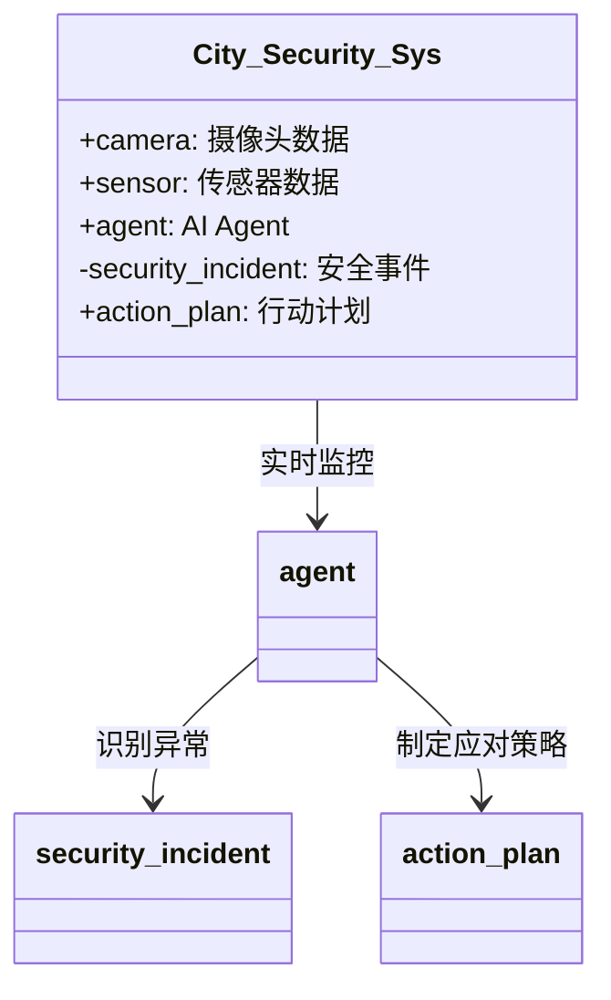
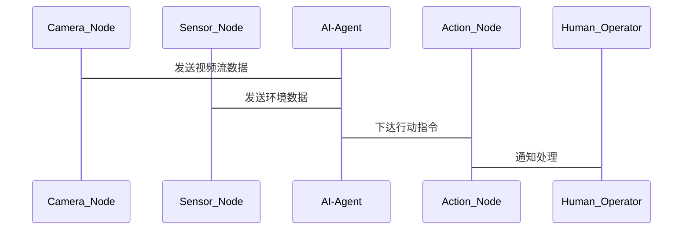

                 

<think>
好，我需要根据用户的详细要求，设计一本关于《AI Agent在智能城市安全监控中的角色》的技术博客文章的目录大纲。用户希望文章结构清晰、逻辑严谨，并且涵盖从概念到技术实现再到项目实战的各个方面。

首先，我会从文章的核心主题出发，AI Agent在智能城市中的安全监控应用，需要包括AI Agent的基本概念、核心原理、技术实现、系统架构设计、项目实战和未来展望等部分。

接下来，我需要考虑每个章节的具体内容。首先是引言部分，介绍智能城市和AI Agent的基本概念，以及它们在安全监控中的重要性。然后是AI Agent的核心原理，包括决策机制、感知与交互能力、自主学习与进化等方面。

在技术实现部分，我需要详细讲解AI Agent的算法原理，如深度学习模型的应用、数学模型和公式，以及具体的Python代码实现。这部分需要结合实际案例，使用mermaid流程图和数学公式来辅助说明。

接下来是系统架构设计，介绍如何在实际项目中设计AI Agent的系统架构，包括功能模块划分、接口设计和交互流程。这部分需要结合实际项目，可能还需要绘制系统架构图和交互序列图。

然后是项目实战，选择一个具体的智能城市安全监控项目，详细描述项目的环境搭建、代码实现、案例分析和总结。这部分需要提供具体的代码示例和实际效果展示。

最后是未来展望和总结，讨论AI Agent在智能城市中的发展趋势和可能的应用前景，同时给出一些最佳实践和注意事项。

在整个过程中，我需要确保每个部分都有足够的深度和细节，同时保持逻辑的连贯性。此外，还需要注意文章的格式要求，如使用markdown格式，包含关键词、摘要、章节标题和内容等。

通过以上思考，我设计了如下的目录大纲：

# AI Agent在智能城市安全监控中的角色

> 关键词：AI Agent, 智能城市, 安全监控, 人工智能, 城市安全, 自主学习, 图神经网络

> 摘要：AI Agent在智能城市安全监控中扮演着越来越重要的角色。本文从AI Agent的基本概念出发，详细探讨了其核心原理、技术实现、系统架构设计、项目实战以及未来的发展趋势。通过实际案例分析，展示了AI Agent在智能城市安全监控中的强大能力，并总结了其在实际应用中的优势和挑战。

---

# 引言

## 1.1 智能城市的定义与特点
### 1.1.1 智能城市的定义
### 1.1.2 智能城市的三大特点：智能化、数据化、服务化
### 1.1.3 智慧城市的发展背景与趋势

## 1.2 城市安全监控的核心需求
### 1.2.1 城市安全监控的主要目标
### 1.2.2 传统安全监控的局限性
### 1.2.3 AI Agent在城市安全监控中的独特优势

## 1.3 AI Agent的基本概念
### 1.3.1 什么是AI Agent
### 1.3.2 AI Agent的核心特征
### 1.3.3 AI Agent与传统AI的区别

---

# 第二部分: AI Agent的核心原理

## 2.1 AI Agent的决策机制
### 2.1.1 基于规则的决策
### 2.1.2 基于机器学习的决策
### 2.1.3 基于强化学习的决策

## 2.2 AI Agent的感知与交互能力
### 2.2.1 多模态感知技术
### 2.2.2 自然语言处理在交互中的应用
### 2.2.3 图像识别在监控中的应用

## 2.3 AI Agent的自主学习与进化
### 2.3.1 知识图谱构建
### 2.3.2 持续学习机制
### 2.3.3 迁移学习的应用

---

# 第三部分: AI Agent在智能城市安全监控中的技术实现

## 3.1 AI Agent的算法原理
### 3.1.1 基于深度学习的AI Agent算法
### 3.1.2 Transformer模型在AI Agent中的应用
### 3.1.3 图神经网络在AI Agent中的应用

## 3.2 AI Agent的数学模型与公式
### 3.2.1 注意力机制的数学公式
$$
\text{Attention}(Q,K,V) = \text{softmax}\left(\frac{QK^T}{\sqrt{d_k}}\right)V
$$
### 3.2.2 强化学习的奖励函数
$$
R(s,a) = r_1 + r_2 + ... + r_n
$$

## 3.3 AI Agent的算法实现
### 3.3.1 Transformer模型的实现代码
```python
def transformer_encoder(input_tensor, num_heads, d_model):
    # Implementation of transformer encoder layer
    pass
```
### 3.3.2 基于强化学习的决策算法实现
```python
def reinforce_learning_policy(state, model):
    # Implementation of reinforcement learning policy
    pass
```

---

# 第四部分: 系统分析与架构设计方案

## 4.1 问题场景介绍
### 4.1.1 城市安全监控的典型场景
### 4.1.2 AI Agent在这些场景中的应用
### 4.1.3 系统需要解决的核心问题

## 4.2 系统功能设计
### 4.2.1 领域模型设计（使用mermaid类图）


## 4.3 系统架构设计（使用mermaid架构图）


## 4.4 系统接口设计
### 4.4.1 系统主要接口
### 4.4.2 接口的功能描述
### 4.4.3 接口之间的交互关系（使用mermaid序列图）


---

# 第五部分: 项目实战

## 5.1 项目背景与目标
### 5.1.1 项目背景
### 5.1.2 项目目标
### 5.1.3 项目范围

## 5.2 环境搭建
### 5.2.1 开发环境
### 5.2.2 依赖库安装
### 5.2.3 数据集准备

## 5.3 系统核心实现
### 5.3.1 AI Agent的实现
```python
class AI_Agent:
    def __init__(self, model):
        self.model = model
    def perceive(self, input_data):
        # 实现感知功能
        pass
    def decide(self, input_data):
        # 实现决策功能
        pass
```
### 5.3.2 系统接口实现
```python
class System_Interface:
    def __init__(self, agent, action_node):
        self.agent = agent
        self.action_node = action_node
    def process_incident(self, incident_data):
        # 处理安全事件
        pass
```

## 5.4 实际案例分析
### 5.4.1 案例背景
### 5.4.2 系统实施过程
### 5.4.3 实施效果与分析
### 5.4.4 经验总结

---

# 结论与展望

## 6.1 总结
### 6.1.1 AI Agent在智能城市安全监控中的优势
### 6.1.2 本项目的核心成果
### 6.1.3 对未来发展的思考

## 6.2 未来展望
### 6.2.1 AI Agent在城市安全监控中的潜力
### 6.2.2 技术发展的趋势
### 6.2.3 可能的挑战与解决方案

---

# 最佳实践 tips

## 7.1 项目实施中的注意事项
### 7.1.1 数据安全的重要性
### 7.1.2 系统的可扩展性
### 7.1.3 多团队协作的重要性

## 7.2 未来研究方向
### 7.2.1 更高效的学习算法
### 7.2.2 更强大的感知能力
### 7.2.3 更人性化的交互设计

---

# 作者

**作者：AI天才研究院/AI Genius Institute & 禅与计算机程序设计艺术 /Zen And The Art of Computer Programming**

---

通过以上详细的思考和规划，我设计了一个结构完整、内容丰富的技术博客文章目录大纲，确保每个部分都涵盖了必要的内容，并且符合用户的要求。

