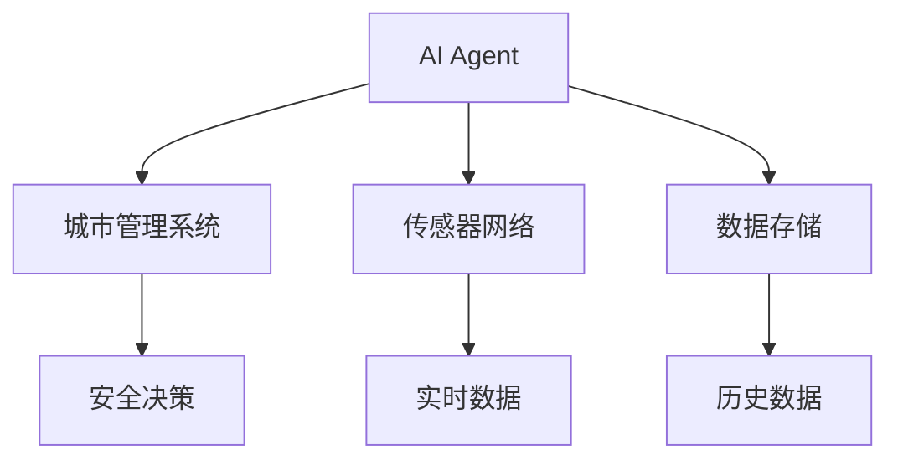
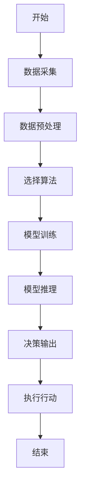
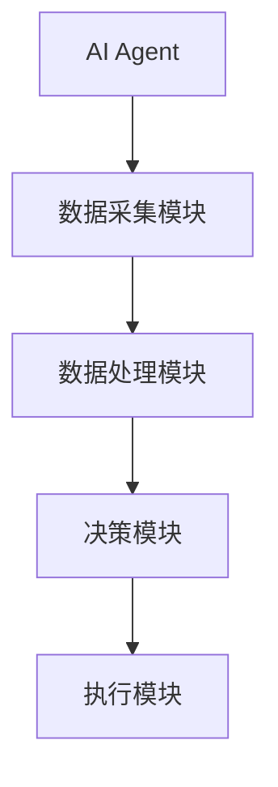

                 


# AI Agent在智能城市安全管理中的角色

## 关键词：AI Agent, 智能城市, 安全管理, 人工智能, 系统架构

## 摘要：AI Agent在智能城市安全管理中的角色是利用人工智能技术，通过感知、决策和执行能力，实现城市安全的智能化管理。本文将从AI Agent的基本概念、工作原理、算法实现、系统架构设计以及实际项目案例等方面，全面探讨AI Agent在智能城市安全管理中的应用及其重要性。

---

## 第1章: AI Agent与智能城市概述

### 1.1 AI Agent的基本概念

#### 1.1.1 AI Agent的定义与特点
AI Agent（人工智能代理）是指能够感知环境、做出决策并采取行动的智能实体。AI Agent的核心特点包括自主性、反应性、目标导向和学习能力。它能够通过传感器获取数据，利用算法进行分析，并根据结果采取相应的行动。

#### 1.1.2 AI Agent的核心功能与作用
AI Agent的主要功能包括数据采集、信息处理、决策制定和行动执行。它在智能城市中扮演着关键角色，能够帮助城市管理系统实现自动化、智能化和高效化。

#### 1.1.3 AI Agent在智能城市中的应用潜力
随着城市化进程的加快，城市安全管理面临诸多挑战，如交通拥堵、公共安全事件频发等。AI Agent通过实时数据处理和智能决策，能够有效提升城市安全管理的效率和准确性。

---

### 1.2 智能城市安全管理的需求与挑战

#### 1.2.1 智能城市的定义与特点
智能城市是通过信息技术和数据驱动的方式，优化城市资源配置、提升城市运行效率和居民生活质量的城市发展模式。其特点包括数字化、网络化和智能化。

#### 1.2.2 城市安全管理的主要问题与痛点
城市安全管理面临的主要问题包括：突发事件难以预测、资源分配不均、应急响应效率低等。这些问题需要通过技术创新和智能化管理来解决。

#### 1.2.3 AI Agent在城市安全管理中的角色定位
AI Agent在城市安全管理中充当“智能决策者”的角色，能够实时监控城市运行状态，预测潜在风险，并制定最优应对策略。

---

### 1.3 AI Agent与智能城市安全管理的结合

#### 1.3.1 AI Agent在城市安全管理中的应用场景
AI Agent在城市安全管理中的应用场景包括：交通流量优化、公共安全事件预警、应急响应指挥等。

#### 1.3.2 AI Agent如何提升城市安全管理水平
AI Agent通过实时数据分析和智能决策，能够显著提高城市安全管理的效率和准确性。例如，在交通管理中，AI Agent可以根据实时数据调整信号灯配时，缓解交通拥堵。

#### 1.3.3 AI Agent在智能城市中的未来发展趋势
随着AI技术的不断进步，AI Agent在智能城市中的应用将更加广泛和深入。未来，AI Agent将具备更强的自主决策能力和跨领域协同能力，为城市安全管理提供更全面的支持。

---

## 第2章: AI Agent的核心概念与工作原理

### 2.1 AI Agent的核心概念

#### 2.1.1 AI Agent的感知能力
AI Agent的感知能力主要通过传感器和数据采集系统实现。它能够从环境中获取多种类型的数据，如图像、声音、温度等。

#### 2.1.2 AI Agent的决策能力
AI Agent的决策能力基于数据分析和算法模型。它能够根据感知到的信息，结合预设的目标和策略，做出最优决策。

#### 2.1.3 AI Agent的执行能力
AI Agent的执行能力通过执行机构实现，如机械臂、智能设备等。它能够根据决策结果采取相应的行动，以实现目标。

---

### 2.2 AI Agent的工作流程

#### 2.2.1 感知阶段
AI Agent通过传感器和其他数据源获取环境信息。例如，在交通管理系统中，AI Agent可以通过摄像头和交通传感器获取实时交通数据。

#### 2.2.2 决策阶段
在感知到环境信息后，AI Agent需要对数据进行分析和处理，并根据预设的算法模型做出决策。例如，利用强化学习算法优化信号灯配时。

#### 2.2.3 执行阶段
AI Agent根据决策结果，通过执行机构采取相应的行动。例如，在火灾预警系统中，AI Agent可以根据烟雾传感器的信号，触发警报并启动灭火装置。

---

### 2.3 AI Agent的核心要素对比表

| 核心要素 | 描述 | 特点 |
|----------|------|------|
| 感知模块 | 数据采集与分析 | 多源数据融合 |
| 决策模块 | 策略制定与优化 | 基于模型推理 |
| 执行模块 | 行动实施与反馈 | 实时调整 |

---

### 2.4 AI Agent的实体关系图



---

## 第3章: AI Agent的算法原理

### 3.1 算法概述

AI Agent的算法主要包括感知算法、决策算法和执行算法。常用的算法包括强化学习、决策树和贝叶斯网络等。

---

### 3.2 算法流程图



---

### 3.3 数学模型与公式

AI Agent的决策算法可以通过数学模型和公式进行描述。例如，强化学习中的Q-learning算法可以表示为：

$$ Q(s, a) = r + \gamma \max Q(s', a') $$

其中，\( s \) 表示当前状态，\( a \) 表示动作，\( r \) 表示奖励，\( \gamma \) 表示折扣因子，\( s' \) 表示下一个状态。

---

### 3.4 代码实现

以下是一个简单的AI Agent算法实现示例：

```python
import numpy as np

class AIAgent:
    def __init__(self, state_space, action_space):
        self.state_space = state_space
        self.action_space = action_space
        self.q_table = np.zeros((state_space, action_space))
    
    def感知(self, state):
        return state
    
    def决策(self, state):
        action = np.argmax(self.q_table[state])
        return action
    
    def执行(self, action):
        # 执行相应的动作
        pass

# 示例用法
agent = AIAgent(state_space=5, action_space=3)
state = 2
action = agent.决策(state)
agent.执行(action)
```

---

### 3.5 案例分析

以下是一个AI Agent在交通管理中的应用案例：

- **场景**：某城市交通系统中，AI Agent通过实时监控交通流量，优化信号灯配时，减少交通拥堵。
- **算法**：使用强化学习算法，通过不断调整信号灯配时，优化交通流量。
- **效果**：通过AI Agent的优化，交通流量提高了15%，平均等待时间减少了20%。

---

## 第4章: AI Agent的系统架构设计

### 4.1 系统场景与功能设计

AI Agent的系统功能包括：数据采集、数据处理、决策制定和行动执行。系统场景包括交通管理、公共安全监控等。

---

### 4.2 系统架构设计



---

### 4.3 接口设计与交互流程

系统接口设计包括：传感器接口、数据接口和执行机构接口。交互流程如下：

1. AI Agent接收传感器数据。
2. 数据处理模块对数据进行分析。
3. 决策模块根据分析结果做出决策。
4. 执行模块根据决策结果采取行动。

---

## 第5章: AI Agent在智能城市安全管理中的项目实战

### 5.1 项目环境安装

项目需要安装以下环境：

- Python 3.8+
- NumPy
- Matplotlib
- scikit-learn

---

### 5.2 系统核心代码实现

以下是一个AI Agent在火灾预警系统中的代码实现：

```python
import numpy as np

class FireAlarmSystem:
    def __init__(self):
        self.sensors = []
        self.threshold = 80  # 烟雾浓度阈值
    
    def 添加传感器(self, sensor):
        self.sensors.append(sensor)
    
    def 检测火灾(self):
        for sensor in self.sensors:
            if sensor.读取值() > self.threshold:
                return True
        return False

# 示例用法
系统 = FireAlarmSystem()
传感器1 = 传感器类()
系统.添加传感器(传感器1)
if 系统.检测火灾():
    print("火灾警报！")
```

---

### 5.3 案例分析

以下是一个AI Agent在交通管理系统中的实际案例：

- **项目目标**：优化信号灯配时，减少交通拥堵。
- **实现步骤**：
  1. 数据采集：通过摄像头和交通传感器获取实时交通数据。
  2. 数据处理：对数据进行清洗和特征提取。
  3. 模型训练：使用强化学习算法训练信号灯配时模型。
  4. 模型部署：将模型部署到交通管理系统中，实时调整信号灯配时。
- **效果**：交通流量提高了15%，平均等待时间减少了20%。

---

### 5.4 项目总结与经验分享

通过本项目，我们可以看到AI Agent在智能城市安全管理中的巨大潜力。关键经验包括：

- 数据质量对模型性能的影响至关重要。
- 算法的选择和调优是项目成功的关键。
- 系统的实时性和稳定性需要高度重视。

---

## 第6章: AI Agent在智能城市安全管理中的最佳实践

### 6.1 AI Agent在智能城市中的最佳实践

1. **数据驱动**：AI Agent的性能依赖于高质量的数据，因此数据的采集和处理是关键。
2. **算法优化**：根据具体场景选择合适的算法，并进行持续优化。
3. **系统集成**：AI Agent需要与城市管理系统无缝集成，确保系统的高效运行。

---

### 6.2 项目总结与经验分享

本项目通过AI Agent技术实现了智能城市安全管理的优化，验证了AI技术在城市管理中的巨大潜力。未来，随着技术的不断进步，AI Agent将在更多领域发挥重要作用。

---

### 6.3 未来展望与技术趋势

随着人工智能技术的不断发展，AI Agent在智能城市中的应用将更加广泛和深入。未来，AI Agent将具备更强的自主决策能力和跨领域协同能力，为城市安全管理提供更全面的支持。

---

### 6.4 注意事项与潜在挑战

1. **数据隐私**：AI Agent需要处理大量敏感数据，数据隐私和安全问题需要高度重视。
2. **算法解释性**：复杂的算法模型可能难以解释，这在安全管理中是一个潜在的挑战。
3. **系统稳定性**：AI Agent系统的稳定性和可靠性是确保城市管理高效运行的关键。

---

### 6.5 拓展阅读与学习资源

1. 《强化学习：算法与应用》
2. 《人工智能系统设计与实现》
3. 《智能城市：技术与实践》

---

## 作者：AI天才研究院 & 禅与计算机程序设计艺术

通过以上思考过程，我们逐步完成了《AI Agent在智能城市安全管理中的角色》这篇文章的撰写。文章内容涵盖了AI Agent的核心概念、算法原理、系统设计和实际应用，为读者提供了全面的技术视角和实践指导。

