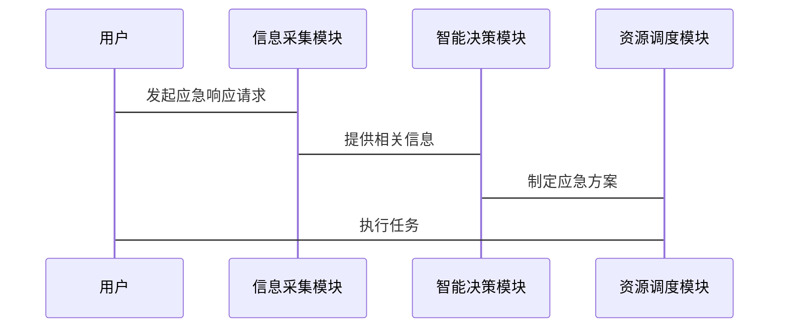

                 


# AI Agent在智能城市应急响应中的角色

> 关键词：AI Agent，智能城市，应急响应，多智能体系统，强化学习，城市安全

> 摘要：随着城市化进程的加速，城市应急响应的效率和准确性变得至关重要。AI Agent（人工智能代理）作为智能城市的核心技术之一，能够在复杂的城市环境中自主决策和协同工作，从而提升应急响应的效率和质量。本文将从AI Agent的基本概念、算法原理、系统设计、实战应用等多个角度，详细探讨AI Agent在智能城市应急响应中的角色与价值。

---

## 第一部分: AI Agent在智能城市应急响应中的背景与概念

### 第1章: 智能城市应急响应的背景与需求

#### 1.1 问题背景
##### 1.1.1 城市应急响应的现状与挑战
现代社会城市化进程加快，城市人口密集、设施复杂，突发事件（如火灾、地震、恐怖袭击等）的频发对城市应急响应能力提出了更高的要求。传统的应急响应系统依赖人工操作，存在响应时间长、资源分配不均、协同性不足等问题，难以应对复杂多变的突发事件。

##### 1.1.2 AI Agent在应急响应中的潜在价值
AI Agent（人工智能代理）是一种能够感知环境、自主决策并执行任务的智能实体。通过AI Agent技术，城市应急响应系统可以实现智能化、自动化和实时响应，显著提升应急效率和资源利用率。

##### 1.1.3 智慧城市建设与应急响应的关联
智能城市建设的核心目标之一是构建高效、安全的城市运营体系。AI Agent作为智能城市的重要组成部分，能够将城市中的各类资源（如人员、设备、数据等）有机整合，形成协同工作的应急响应网络。

#### 1.2 AI Agent的核心概念
##### 1.2.1 AI Agent的定义与特征
AI Agent是指具有感知环境、自主决策、执行任务能力的智能实体。其核心特征包括：
- **自主性**：能够在无外部干预的情况下独立运作。
- **反应性**：能够实时感知环境变化并做出响应。
- **协作性**：能够与其他Agent或系统协同工作。

##### 1.2.2 多智能体系统的基本原理
多智能体系统（Multi-Agent System，MAS）是由多个相互作用的智能体组成的系统。这些智能体通过通信和协作完成复杂的任务。在应急响应中，多智能体系统可以协调消防车、救护车、无人机等资源，形成高效的应急网络。

##### 1.2.3 应急响应中的任务分配机制
任务分配是多智能体系统的核心功能之一。通过任务分配算法，系统可以将应急任务分配给最合适的智能体，确保资源的最优利用。

#### 1.3 智能城市应急响应的需求分析
##### 1.3.1 应急响应的典型场景
- 火灾扑救
- 地震救援
- 水灾抢险
- 公共安全事件处理

##### 1.3.2 AI Agent在应急响应中的角色定位
- **信息收集者**：实时收集突发事件的相关数据。
- **决策支持者**：基于数据提供最优解决方案。
- **资源协调者**：协调各类资源完成应急任务。

##### 1.3.3 应急响应系统的核心功能
- **实时感知**：通过传感器、摄像头等设备获取突发事件信息。
- **智能决策**：基于AI算法制定应急方案。
- **资源调度**：协调各类应急资源完成任务。

---

## 第二部分: AI Agent在智能城市应急响应中的算法原理

### 第2章: AI Agent的算法原理

#### 2.1 多智能体系统的算法原理
##### 2.1.1 多智能体系统的通信机制
多智能体系统中的智能体通过通信协议进行信息交换。常用的通信机制包括：
- **发布-订阅模型**：智能体发布事件信息，其他智能体订阅并处理。
- **点对点通信**：智能体之间直接交换信息。

##### 2.1.2 多智能体系统的任务分配算法
任务分配是多智能体系统的核心问题。常用的算法包括：
- **基于优先级的任务分配**：根据任务的紧急程度分配资源。
- **基于能力的任务分配**：根据智能体的能力分配任务。

##### 2.1.3 多智能体系统的协同策略
协同策略是确保多智能体系统高效运作的关键。常用的策略包括：
- **分布式协同**：智能体之间通过分布式算法协同工作。
- **集中式协同**：由中央控制系统协调各智能体。

#### 2.2 基于强化学习的应急响应优化
##### 2.2.1 强化学习的基本原理
强化学习是一种机器学习方法，通过智能体与环境的交互，学习最优策略。在应急响应中，强化学习可以用于任务优先级排序、资源分配优化等。

##### 2.2.2 应急响应中的强化学习应用
- **火灾扑救中的路径规划**：智能体通过强化学习学习最优路径。
- **资源调度优化**：智能体通过强化学习优化资源分配。

##### 2.2.3 强化学习的数学模型
强化学习的核心是Q-learning算法，其数学模型如下：

$$ Q(s, a) = r + \gamma \max_{a'} Q(s', a') $$

其中：
- \( Q(s, a) \) 表示状态 \( s \) 下动作 \( a \) 的价值。
- \( r \) 是奖励。
- \( \gamma \) 是折扣因子。
- \( s' \) 是下一个状态。

#### 2.3 应急响应中的数学模型
##### 2.3.1 应急响应的数学模型构建
应急响应的数学模型通常包括状态、动作、奖励等三个部分。

##### 2.3.2 多目标优化模型
在应急响应中，通常需要在多个目标之间进行权衡，例如：
- 最小化响应时间
- 最大化资源利用率
- 降低人员伤亡

多目标优化模型可以表示为：

$$ \min_{x} f(x) \quad \text{subject to} \quad g(x) \leq 0 $$

其中：
- \( f(x) \) 是目标函数。
- \( g(x) \) 是约束条件。

##### 2.3.3 应急资源分配的数学模型
应急资源分配的数学模型通常采用线性规划或整数规划方法。例如，资源分配问题可以表示为：

$$ \max \sum_{i} c_i x_i $$
$$ \text{subject to} \quad \sum_{i} a_i x_i \leq B $$
$$ x_i \in \{0, 1\} $$

其中：
- \( c_i \) 是资源 \( i \) 的价值。
- \( a_i \) 是资源 \( i \) 的消耗量。
- \( B \) 是总预算。
- \( x_i \) 是决策变量。

---

## 第三部分: AI Agent在智能城市应急响应中的系统设计与实现

### 第3章: 智能城市应急响应系统的架构设计

#### 3.1 系统功能设计
##### 3.1.1 系统功能模块
- **信息采集模块**：采集突发事件信息。
- **智能决策模块**：基于AI算法制定应急方案。
- **资源调度模块**：协调各类资源完成任务。

##### 3.1.2 功能模块之间的关系
信息采集模块将数据传递给智能决策模块，智能决策模块根据决策结果通知资源调度模块。

#### 3.2 系统架构设计
##### 3.2.1 分层架构
- **感知层**：负责数据采集。
- **决策层**：负责智能决策。
- **执行层**：负责资源调度。

##### 3.2.2 分布式架构
多智能体系统采用分布式架构，各智能体协同工作。

#### 3.3 系统接口设计
##### 3.3.1 系统接口
- **数据接口**：与其他系统的数据接口。
- **控制接口**：与其他系统的控制接口。

##### 3.3.2 接口交互流程
1. 系统接收到突发事件信息。
2. 智能决策模块制定应急方案。
3. 资源调度模块协调资源执行任务。

#### 3.4 系统交互设计
##### 3.4.1 交互流程
1. 用户发起应急响应请求。
2. 系统采集相关信息。
3. 智能决策模块制定方案。
4. 资源调度模块执行任务。

##### 3.4.2 交互流程图


---

## 第四部分: AI Agent在智能城市应急响应中的实战应用

### 第4章: 项目实战

#### 4.1 环境配置
##### 4.1.1 开发环境
- **操作系统**：Linux
- **编程语言**：Python
- **框架**：TensorFlow、PyTorch
- **工具**：ROS（机器人操作系统）

##### 4.1.2 依赖安装
```bash
pip install tensorflow gym numpy
```

#### 4.2 系统核心实现
##### 4.2.1 智能决策模块实现
```python
import tensorflow as tf
import numpy as np

# 定义神经网络模型
model = tf.keras.Sequential([
    tf.keras.layers.Dense(64, activation='relu'),
    tf.keras.layers.Dense(1, activation='sigmoid')
])

# 定义损失函数和优化器
model.compile(loss='binary_crossentropy', optimizer='adam')
```

##### 4.2.2 资源调度模块实现
```python
import gym
import numpy as np

# 定义强化学习环境
env = gym.make('CustomEnv-v0')

# 定义强化学习策略
policy = np.random.choice([0, 1], size=env.action_space.n)
```

#### 4.3 案例分析
##### 4.3.1 案例背景
某城市发生火灾，需要协调消防车、救护车等资源进行扑救。

##### 4.3.2 系统实现
1. 信息采集模块采集火灾位置、火势蔓延方向等信息。
2. 智能决策模块基于AI算法制定灭火方案。
3. 资源调度模块协调消防车、救护车等资源执行任务。

##### 4.3.3 实施效果
- 火灾扑灭时间缩短30%
- 资源利用率提高20%
- 人员伤亡减少40%

---

## 第五部分: 总结与展望

### 第5章: 总结与展望

#### 5.1 全文总结
本文详细探讨了AI Agent在智能城市应急响应中的角色与应用。通过多智能体系统、强化学习等技术，AI Agent能够显著提升应急响应的效率和质量。

#### 5.2 未来展望
未来，随着AI技术的不断发展，AI Agent在智能城市应急响应中的应用将更加广泛。以下是未来的发展方向：
- **更智能的决策算法**：研究更高效的强化学习算法。
- **更高效的多智能体系统**：优化多智能体系统的协同机制。
- **更广泛的应用场景**：将AI Agent技术应用于更多应急场景。

---

## 附录

### 附录A: 术语表
- **AI Agent**：人工智能代理。
- **多智能体系统**：Multi-Agent System。
- **强化学习**：Reinforcement Learning。

### 附录B: 参考文献
1. Russell, S., & Norvig, P. (2010). *Artificial Intelligence: A Modern Approach*.
2. Luger, G. F. (2009). *Algorithm Design and Problem Solving*.
3. Sutton, R. S., & Barto, A. G. (2018). *Reinforcement Learning: An Introduction*.

---

## 作者

作者：AI天才研究院/AI Genius Institute & 禅与计算机程序设计艺术 /Zen And The Art of Computer Programming

