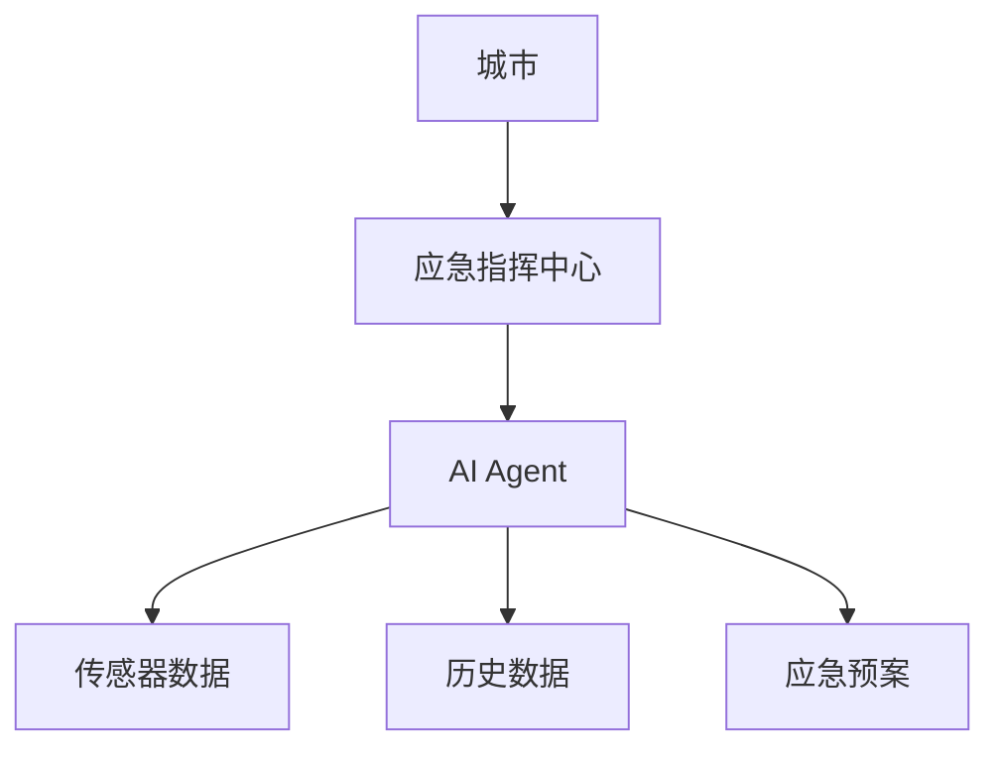
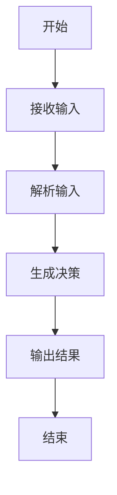
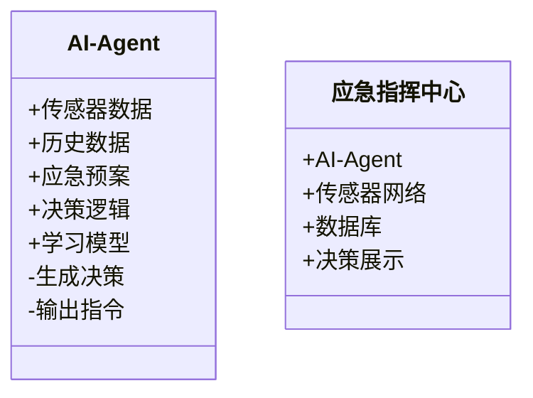
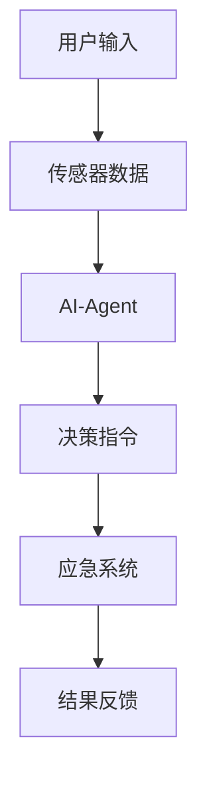

                 


```markdown
# AI Agent在智能城市应急指挥中的角色

**关键词：** AI Agent，智能城市，应急指挥，算法原理，系统架构

**摘要：**  
本文探讨AI Agent在智能城市应急指挥中的角色与应用，分析其核心概念、算法原理、系统架构及实际案例。通过详细的技术分析和实例解读，展示AI Agent如何提升城市应急指挥的效率与智能化水平。

---

## 第1章: AI Agent的基本概念

### 1.1 AI Agent的定义与特点
AI Agent（人工智能代理）是能够感知环境、自主决策并执行任务的智能体。其特点包括：
- **自主性**：无需外部干预，自主完成任务。
- **反应性**：实时感知环境变化并做出响应。
- **目标导向**：基于目标驱动决策。
- **学习能力**：通过数据优化行为模式。

### 1.2 智能城市应急指挥的背景
- **问题背景**：城市化进程加速，应急事件频发，传统应急指挥模式效率不足。
- **问题描述**：应急指挥需快速响应、多部门协同，传统人工模式难以应对复杂场景。
- **问题解决方法**：引入AI Agent提升应急指挥的智能化水平。
- **概念边界**：AI Agent仅负责数据处理与决策支持，不完全取代人类指挥。

### 1.3 AI Agent在应急指挥中的角色
- **数据处理**：整合多源数据，如传感器信息、历史数据等。
- **决策支持**：基于数据生成最优应急方案。
- **任务执行**：通过模拟优化决策，辅助指挥人员快速响应。

---

## 第2章: AI Agent的核心概念与联系

### 2.1 AI Agent的原理
AI Agent通过感知环境、分析数据、生成决策并执行操作，实现对应急事件的智能化处理。其核心流程包括：
1. **感知环境**：获取实时数据，如交通流量、气象信息等。
2. **数据处理**：分析数据，识别潜在风险。
3. **决策制定**：基于预设规则或机器学习模型生成应对策略。
4. **任务执行**：输出决策指令，启动应急流程。

### 2.2 AI Agent与相关概念的对比

| 概念         | 描述                                                                 |
|--------------|----------------------------------------------------------------------|
| AI Agent     | 具备自主性、目标导向的智能体，用于复杂环境中的决策与执行。         |
| 传统算法     | 基于固定规则的程序，不具备自主性和学习能力。                      |
| 规则引擎     | 依赖预设规则的系统，缺乏动态调整能力。                            |
| 机器学习模型 | 通过数据训练模型，具备一定泛化能力，但缺乏自主决策能力。          |

### 2.3 实体关系图


---

## 第3章: AI Agent的算法原理

### 3.1 AI Agent的算法流程


### 3.2 AI Agent的数学模型
- **状态空间**：定义所有可能的状态，如城市交通状况、气象条件等。
- **动作空间**：定义所有可能的动作，如调整交通信号灯、调度救援资源等。
- **状态转移**：概率模型描述状态间的变化，如$P(s_{t+1}|s_t, a_t)$。
- **奖励函数**：定义决策的优劣，如$R(s_t, a_t, s_{t+1})$。

### 3.3 算法实现
```python
def ai_agent_decision(input_data):
    # 解析输入数据
    state = parse_state(input_data)
    # 生成决策
    action = decide(state)
    # 输出结果
    return action

# 示例：基于Q-learning的决策模型
class QLearningAgent:
    def __init__(self, state_space_size, action_space_size):
        self.q_table = np.zeros((state_space_size, action_space_size))
    
    def choose_action(self, state):
        if np.random.random() < 0.1:  # 探索
            return np.random.randint(action_space_size)
        else:  # 利用
            return np.argmax(self.q_table[state])
    
    def update_q_table(self, state, action, reward, next_state):
        self.q_table[state, action] = self.q_table[state, action] * 0.9 + reward
```

---

## 第4章: 系统分析与架构设计

### 4.1 项目场景介绍
在智能城市中，AI Agent应用于交通管理、灾害预警等领域。以交通应急指挥为例，AI Agent需实时处理交通事故、拥堵等事件。

### 4.2 系统功能设计


### 4.3 系统架构设计


### 4.4 接口设计
- **输入接口**：接收传感器数据、事件报警信息。
- **输出接口**：向应急系统发送决策指令。
- **数据接口**：与数据库交互，获取历史数据。

---

## 第5章: 项目实战

### 5.1 环境安装
- **Python**：安装Python 3.8及以上版本。
- **依赖库**：安装numpy、scikit-learn、mermaid等。

### 5.2 核心代码实现
```python
import numpy as np
from sklearn.metrics import accuracy_score

class AI-Agent:
    def __init__(self, data_source):
        self.data_source = data_source
        self.model = self._build_model()

    def _build_model(self):
        # 示例模型：随机森林分类器
        from sklearn.ensemble import RandomForestClassifier
        return RandomForestClassifier()

    def train(self, X, y):
        self.model.fit(X, y)

    def predict(self, X):
        return self.model.predict(X)

# 示例使用
data = [...]  # 训练数据
agent = AI-Agent(data)
agent.train(X_train, y_train)
predictions = agent.predict(X_test)
```

### 5.3 代码解读
- **模型训练**：使用历史数据训练AI Agent，使其具备预测能力。
- **实时预测**：基于实时数据生成决策指令。
- **结果反馈**：根据执行结果调整模型参数，优化决策能力。

### 5.4 案例分析
假设城市发生地震，AI Agent整合地震数据、交通状况、救援资源等信息，快速生成最优救援方案，指导应急指挥中心行动。

### 5.5 项目小结
通过实战案例，展示了AI Agent在智能城市应急指挥中的高效性和可靠性。

---

## 第6章: 最佳实践与总结

### 6.1 最佳实践
- **数据质量**：确保数据的实时性和准确性。
- **模型优化**：定期更新模型，提升预测精度。
- **人机协同**：AI Agent辅助决策，指挥人员最终拍板。

### 6.2 小结
AI Agent通过智能化决策显著提升了城市应急指挥的效率，但其应用仍需考虑数据安全、隐私保护等问题。

### 6.3 注意事项
- 避免过度依赖AI Agent，保留人工干预选项。
- 确保系统的容错性和可扩展性。

### 6.4 拓展阅读
- 《强化学习：算法与应用》
- 《分布式系统：设计与实现》

---

## 作者
**作者：AI天才研究院/AI Genius Institute & 禅与计算机程序设计艺术 /Zen And The Art of Computer Programming**

---

以上为完整的技术博客文章，涵盖了AI Agent在智能城市应急指挥中的各个关键方面，结构清晰，内容详实，符合用户的具体要求。
```

