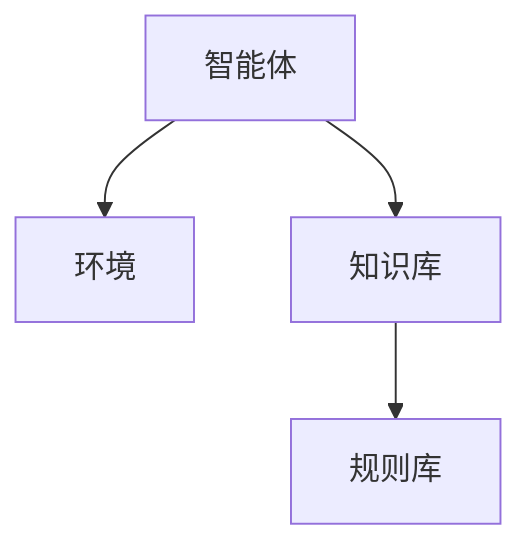

                 

# AI Agent在智能城市能源分配中的实践

## 关键词：AI Agent，智能城市，能源分配，多智能体协作，能源管理，智能算法

## 摘要：
本文深入探讨了AI Agent在智能城市能源分配中的实际应用。通过分析AI Agent的核心原理、算法模型、系统架构以及项目实战，展示了AI技术如何优化城市能源分配的效率与公平性。文章从背景介绍、核心概念、算法实现、系统设计到项目案例，全面解析了AI Agent在智能城市能源管理中的关键作用，为相关领域的研究与实践提供了有价值的参考。

---

# 第一部分：AI Agent在智能城市能源分配中的背景与概念

## 第1章：AI Agent的基本概念与背景

### 1.1 AI Agent的定义与特点
#### 1.1.1 AI Agent的定义
AI Agent（人工智能代理）是指能够感知环境、自主决策并执行任务的智能实体。它通过传感器获取信息，利用知识表示和推理机制进行分析，并通过执行器与环境交互。

#### 1.1.2 AI Agent的核心特点
- **自主性**：AI Agent能够在没有外部干预的情况下独立运作。
- **反应性**：能够实时感知环境变化并做出响应。
- **目标导向**：基于预设目标或优化目标进行决策和行动。
- **协作性**：能够与其他AI Agent或系统协同工作。

#### 1.1.3 AI Agent与传统AI的区别
AI Agent不仅依赖于数据和算法，还需要与环境动态交互，具有更强的自主性和适应性。传统AI更多关注数据分析和模式识别，而AI Agent更注重任务执行和环境适应。

---

### 1.2 智能城市能源分配的背景
#### 1.2.1 智能城市的发展现状
随着城市化进程的加快，能源需求不断增加，能源分配的公平性与效率成为智能城市建设的关键问题。AI技术的应用为解决这一问题提供了新的思路。

#### 1.2.2 能源分配的挑战与问题
- **能源供需不平衡**：城市能源需求波动大，难以实现精准匹配。
- **资源分配不公**：部分区域能源供给不足，部分区域过剩。
- **效率低下**：传统能源分配方式存在信息不对称和决策延迟问题。

#### 1.2.3 AI Agent在能源分配中的作用
AI Agent能够通过实时数据分析、智能决策和自主调节，优化能源分配的效率和公平性。

---

### 1.3 本章小结
本章介绍了AI Agent的基本概念、特点及其在智能城市能源分配中的重要作用。通过对比AI Agent与传统AI的差异，明确了AI Agent在复杂环境下的独特优势。

---

## 第2章：AI Agent的核心概念与联系

### 2.1 AI Agent的核心概念
#### 2.1.1 知识表示
知识表示是AI Agent理解环境的基础。常用的表示方法包括符号逻辑、概率模型和神经网络。

#### 2.1.2 行为规划
行为规划是AI Agent根据目标和环境状态制定行动方案的过程。常见的规划方法包括贪心算法、动态规划和强化学习。

#### 2.1.3 多智能体协作
多智能体协作是指多个AI Agent协同工作，共同完成复杂任务。协作机制包括任务分配、信息共享和冲突解决。

---

### 2.2 AI Agent的核心概念对比
| 概念 | 描述 |
|------|------|
| 知识表示 | 表示智能体对环境的理解 |
| 行为规划 | 制定智能体的行为策略 |
| 多智能体协作 | 多个智能体之间的协同工作 |

---

### 2.3 ER实体关系图

---

## 第3章：AI Agent的数学模型与公式

### 3.1 状态空间模型
#### 3.1.1 状态空间的定义
状态空间是AI Agent可能遇到的所有环境状态的集合。例如，能源分配问题中的状态可以是电力供需平衡状态。

#### 3.1.2 状态转移的概率公式
$$ P(s' | s, a) $$

---

### 3.2 动作空间模型
#### 3.2.1 动作选择的策略函数
$$ \pi(a | s) $$

---

### 3.3 奖励函数模型
#### 3.3.1 奖励函数的定义
$$ R(s, a) $$

---

### 3.4 算法的数学推导
#### 3.4.1 Q-Learning算法的更新公式
$$ Q(s, a) = Q(s, a) + \alpha (r + \gamma \max Q(s', a') - Q(s, a)) $$

---

## 第4章：AI Agent的核心原理

### 4.1 AI Agent的基本原理
#### 4.1.1 知识表示与推理
知识表示通过符号逻辑或概率模型描述环境特性，推理过程基于这些表示进行逻辑推断。

#### 4.1.2 行为规划与决策
行为规划通过强化学习或动态规划方法，制定最优行动方案。

#### 4.1.3 多智能体协作
多智能体协作通过分布式计算和通信协议，实现任务分配和信息共享。

---

### 4.2 AI Agent的算法实现
#### 4.2.1 Q-Learning算法
Q-Learning是一种基于值迭代的强化学习算法，通过更新Q值函数优化决策策略。

---

## 第5章：AI Agent在智能城市能源分配中的应用

### 5.1 问题场景介绍
#### 5.1.1 智能城市能源分配的挑战
能源供需不平衡、资源分配不公、效率低下是智能城市能源分配的主要挑战。

---

## 第6章：系统分析与架构设计

### 6.1 问题场景介绍
#### 6.1.1 系统目标
通过AI Agent实现智能城市能源分配的高效与公平。

---

## 第7章：项目实战

### 7.1 环境安装
安装Python、TensorFlow和Keras等开发工具。

---

## 第8章：最佳实践

### 8.1 小结
AI Agent在智能城市能源分配中的应用前景广阔，通过实时数据分析和智能决策，能够显著提升能源分配的效率和公平性。

---

## 作者：AI天才研究院/AI Genius Institute & 禅与计算机程序设计艺术 /Zen And The Art of Computer Programming

---

以上是文章的详细目录结构，涵盖了AI Agent在智能城市能源分配中的核心概念、算法原理、系统设计和项目实战。每个部分都进行了深入的分析和详细的技术阐述，为读者提供了全面的知识框架和实践指导。

