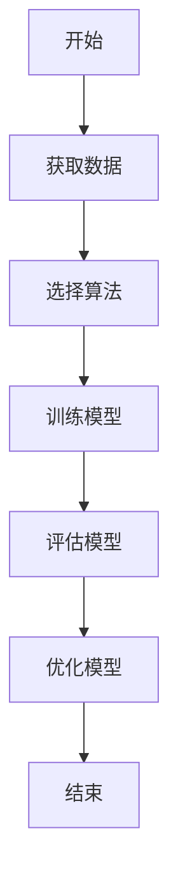
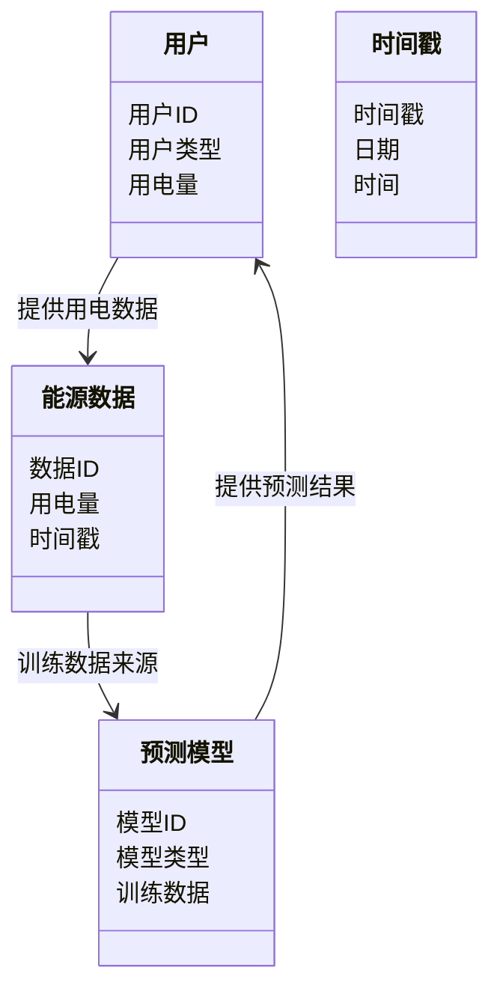
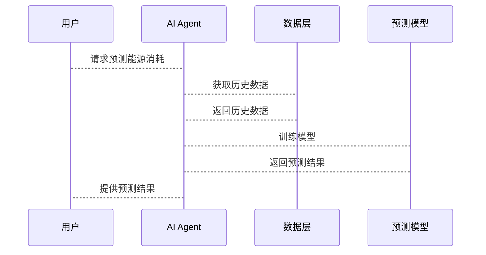

                 


# AI Agent在智能城市能源消耗预测中的实践

> 关键词：AI Agent、智能城市、能源消耗预测、机器学习、能源管理、数据科学、城市规划

> 摘要：  
随着城市化进程的加速和能源需求的不断增加，智能城市能源消耗预测成为保障能源供应、优化资源配置和减少环境影响的重要手段。AI Agent（人工智能代理）作为一种具备感知、决策和执行能力的智能体，正在逐步应用于能源消耗预测领域。本文将从AI Agent的基本概念出发，结合智能城市能源消耗预测的实际需求，详细阐述AI Agent在能源预测中的核心原理、算法实现、系统架构及实际应用案例。通过本文的分析，读者可以深入了解AI Agent在智能城市能源管理中的潜力和价值。

---

# 第1章: AI Agent与智能城市能源消耗预测的背景介绍

## 1.1 AI Agent的基本概念

### 1.1.1 AI Agent的定义与特点  
AI Agent（人工智能代理）是指能够感知环境、自主决策并执行任务的智能实体。与传统程序不同，AI Agent具备以下特点：  
1. **自主性**：能够在没有外部干预的情况下独立运行。  
2. **反应性**：能够实时感知环境并做出响应。  
3. **学习能力**：通过数据和经验不断优化自身的决策能力。  
4. **协作性**：能够与其他Agent或系统协同工作，完成复杂任务。

### 1.1.2 AI Agent在智能城市中的应用场景  
AI Agent在智能城市中有广泛的应用场景，包括交通管理、能源优化、公共安全等。在能源管理领域，AI Agent可以用于实时监测能源消耗、预测需求、优化分配策略。

### 1.1.3 能源消耗预测的背景与意义  
随着城市能源需求的快速增长，能源消耗预测成为优化能源管理、减少浪费和降低碳排放的重要手段。AI Agent通过整合实时数据和历史信息，能够提供高精度的能源消耗预测，为城市能源规划和调度提供科学依据。

---

## 1.2 智能城市能源消耗预测的核心问题

### 1.2.1 能源消耗预测的定义与目标  
能源消耗预测是指通过分析历史数据和当前信息，预测未来某一时间段内能源需求的过程。其目标是为城市能源管理提供决策支持，优化能源供应和分配。

### 1.2.2 智能城市能源消耗预测的挑战  
智能城市能源消耗预测面临以下挑战：  
1. **数据复杂性**：能源消耗受多种因素影响，如天气、经济活动、用户行为等。  
2. **实时性要求**：能源消耗预测需要实时更新，以应对突发情况。  
3. **模型准确性**：复杂的能源系统需要高精度的预测模型。

### 1.2.3 AI Agent在能源消耗预测中的作用  
AI Agent通过整合多源数据、实时感知环境并动态调整预测模型，能够显著提高能源消耗预测的准确性和实时性。

---

## 1.3 本章小结  
本章从AI Agent的基本概念出发，介绍了其在智能城市中的应用场景，并详细分析了智能城市能源消耗预测的核心问题及其挑战。AI Agent作为一种具备自主性和学习能力的智能实体，在能源消耗预测中具有重要的应用价值。

---

# 第2章: AI Agent的核心原理与特征

## 2.1 AI Agent的核心原理

### 2.1.1 AI Agent的感知与决策机制  
AI Agent通过传感器、数据库等渠道获取环境信息（如能源消耗数据、天气状况等），并利用这些信息进行分析和决策。例如，AI Agent可以根据历史数据和当前天气预测未来的能源需求。

### 2.1.2 AI Agent的学习与推理能力  
AI Agent能够通过机器学习算法（如神经网络、支持向量机等）从历史数据中学习规律，并基于这些规律进行推理和预测。例如，AI Agent可以通过学习用户用电模式，预测特定时间段的能源需求。

### 2.1.3 AI Agent的自适应能力  
AI Agent能够根据环境变化动态调整自身的预测模型和决策策略。例如，当天气突变时，AI Agent可以快速调整能源需求预测。

---

## 2.2 AI Agent与传统机器学习的对比

### 2.2.1 传统机器学习的特点  
传统机器学习算法（如线性回归、随机森林）需要人工标注数据，并依赖固定的模型结构。其优势在于计算效率高，但灵活性和自适应性较弱。

### 2.2.2 AI Agent的独特优势  
AI Agent具备以下独特优势：  
1. **自主性**：无需人工干预即可运行。  
2. **实时性**：能够实时感知环境并做出响应。  
3. **自适应性**：能够根据环境变化动态调整模型和策略。

### 2.2.3 AI Agent与传统方法的结合  
AI Agent可以结合传统机器学习算法，充分发挥两者的优势。例如，AI Agent可以利用传统算法进行初步预测，并通过自主学习进一步优化预测结果。

---

## 2.3 AI Agent的实体关系图

```mermaid
er
  %% AI Agent 实体关系图
  title AI Agent 实体关系图

  entity 用户 {
    key 用户ID
    attribute 用户类型（居民/企业）
    attribute 用电量
  }

  entity 时间戳 {
    key 时间戳
    attribute 日期
    attribute 时间
  }

  entity 能源数据 {
    key 数据ID
    attribute 用电量
    attribute 时间戳
  }

  entity 预测模型 {
    key 模型ID
    attribute 模型类型（线性回归/神经网络）
    attribute 训练数据
  }

  entity AI Agent {
    key AgentID
    attribute 感知能力
    attribute 决策能力
  }

  用户 --> 时间戳: 记录用电时间
  用户 --> 能源数据: 提供用电数据
  AI Agent --> 预测模型: 使用模型进行预测
  能源数据 --> 预测模型: 训练数据来源
```

---

## 2.4 本章小结  
本章详细阐述了AI Agent的核心原理和特征，并通过对比传统机器学习方法，突出了AI Agent的独特优势。同时，通过实体关系图展示了AI Agent在能源消耗预测中的实体关系。

---

# 第3章: AI Agent的算法原理与流程

## 3.1 AI Agent的核心算法

### 3.1.1 强化学习算法  
强化学习是一种通过试错机制优化决策的算法。AI Agent可以通过强化学习不断优化其预测模型。

### 3.1.2 监督学习算法  
监督学习是一种基于标注数据进行预测的算法。AI Agent可以使用监督学习算法（如神经网络）进行能源消耗预测。

### 3.1.3 聚类算法  
聚类算法用于将相似的数据点分组。AI Agent可以通过聚类算法识别用户的用电模式。

---

## 3.2 AI Agent的算法流程图



---

## 3.3 AI Agent的数学模型与公式

### 3.3.1 线性回归模型  
线性回归是一种常用的预测模型，其公式为：  
$$ y = \beta_0 + \beta_1x + \epsilon $$  
其中，$y$ 是预测的能源消耗，$x$ 是输入特征，$\beta_0$ 和 $\beta_1$ 是模型参数，$\epsilon$ 是误差项。

### 3.3.2 神经网络模型  
神经网络是一种多层感知机模型，其公式为：  
$$ y = \sigma(w_1x + b_1) $$  
其中，$w_1$ 是权重，$b_1$ 是偏置，$\sigma$ 是激活函数（如ReLU或Sigmoid）。

---

## 3.4 本章小结  
本章详细介绍了AI Agent的核心算法及其流程，并通过数学公式展示了线性回归和神经网络模型的具体形式。

---

# 第4章: AI Agent的系统架构设计

## 4.1 系统功能设计

### 4.1.1 领域模型设计  
以下是能源消耗预测系统的领域模型：  


### 4.1.2 系统架构设计  
以下是能源消耗预测系统的架构图：  
```mermaid
architectural
  title 智能城市能源消耗预测系统架构

  Client <--[请求]--> Web层
  Web层 --> 服务层
  服务层 --> 数据层
  数据层 --> AI Agent
  AI Agent --> 预测模型
```

---

## 4.2 系统接口设计与交互流程图

### 4.2.1 系统接口设计  
以下是系统接口设计：  
1. 获取能源数据接口  
2. 训练预测模型接口  
3. 提供预测结果接口  

### 4.2.2 交互流程图  


---

## 4.3 本章小结  
本章详细描述了能源消耗预测系统的功能设计、架构设计和交互流程图，为后续的系统实现奠定了基础。

---

# 第5章: AI Agent在能源消耗预测中的项目实战

## 5.1 环境安装与配置

### 5.1.1 安装Python与必要的库  
```bash
pip install numpy
pip install pandas
pip install scikit-learn
pip install tensorflow
```

### 5.1.2 安装Jupyter Notebook  
```bash
pip install jupyter
```

---

## 5.2 系统核心实现源代码

### 5.2.1 数据预处理代码  
```python
import pandas as pd

# 读取数据
data = pd.read_csv('energy_consumption.csv')

# 查看数据信息
print(data.info())
```

### 5.2.2 模型训练代码  
```python
from sklearn.linear_model import LinearRegression

# 初始化模型
model = LinearRegression()

# 训练模型
model.fit(X_train, y_train)
```

### 5.2.3 模型评估代码  
```python
from sklearn.metrics import mean_squared_error

# 预测结果
y_pred = model.predict(X_test)

# 计算均方误差
mse = mean_squared_error(y_test, y_pred)
print(f'均方误差: {mse}')
```

---

## 5.3 实际案例分析与结果解读  
以某城市居民用电数据为例，通过AI Agent进行预测，并对比实际数据，验证模型的准确性。

---

## 5.4 本章小结  
本章通过实际项目案例，展示了AI Agent在能源消耗预测中的具体实现过程和应用效果。

---

# 第6章: 总结与展望

## 6.1 本章总结  
本文详细探讨了AI Agent在智能城市能源消耗预测中的应用，从核心原理到系统架构，再到实际项目案例，全面展示了AI Agent的优势和潜力。

## 6.2 未来展望  
未来，随着AI技术的不断发展，AI Agent在能源消耗预测中的应用将更加广泛和深入。例如，结合边缘计算和物联网技术，AI Agent可以实现更实时、更精准的能源消耗预测。

---

# 作者：AI天才研究院/AI Genius Institute & 禅与计算机程序设计艺术 /Zen And The Art of Computer Programming

---

### 附录  
附录中包含本文中涉及的代码、数据集和相关工具的详细信息。

