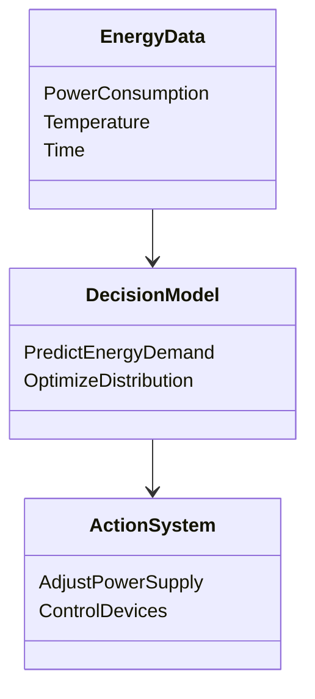
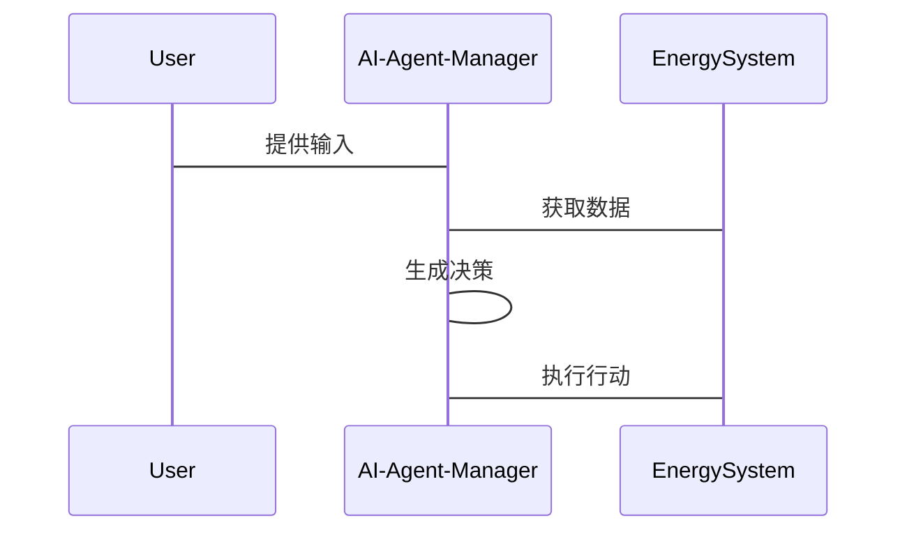

                 


# AI Agent在智能城市能源管理中的实践

## 关键词：AI Agent，智能城市，能源管理，算法原理，系统架构

## 摘要：
随着智能城市的快速发展，能源管理成为城市运营中的关键问题。AI Agent作为人工智能领域的重要技术，能够通过智能化决策和自主学习优化能源管理。本文从AI Agent的基本概念出发，探讨其在智能城市能源管理中的应用场景，分析其算法原理和系统架构，结合实际案例展示AI Agent在能源管理中的实践效果。文章还总结了AI Agent在能源管理中的优势与挑战，并展望了未来的发展方向。

---

# 第一部分：AI Agent在智能城市能源管理中的背景与概念

## 第1章：AI Agent与智能城市能源管理概述

### 1.1 AI Agent的基本概念
#### 1.1.1 AI Agent的定义
AI Agent（人工智能代理）是指能够感知环境、自主决策并执行任务的智能实体。它通过传感器获取信息，利用算法进行分析，并通过执行器完成目标。

#### 1.1.2 AI Agent的核心特征
- **自主性**：无需外部干预，自主完成任务。
- **反应性**：能够实时感知环境变化并做出响应。
- **学习性**：通过数据和反馈不断优化自身行为。
- **协作性**：能够与其他Agent或系统协同工作。

#### 1.1.3 AI Agent与传统算法的区别
| 特性 | AI Agent | 传统算法 |
|------|-----------|-----------|
| 决策方式 | 自主决策 | 确定性执行 |
| 学习能力 | 具备学习能力 | 无自适应能力 |
| 交互能力 | 支持实时交互 | 单向执行 |

### 1.2 智能城市能源管理的背景
#### 1.2.1 智能城市的概念与特点
智能城市是指通过物联网、大数据、人工智能等技术，实现城市资源的优化配置和高效管理。其特点包括智能化、数字化和可持续性。

#### 1.2.2 城市能源管理的挑战与需求
- **能源浪费**：传统能源管理方式效率低下，导致资源浪费。
- **需求波动**：能源需求随时间和场景变化，难以预测。
- **环境压力**：能源消耗对环境的影响日益显著。

#### 1.2.3 AI Agent在城市能源管理中的应用潜力
AI Agent能够通过实时数据分析和决策优化，提升能源管理的效率和可持续性。

### 1.3 AI Agent在智能城市能源管理中的应用现状
#### 1.3.1 当前AI Agent在能源管理中的应用案例
- **智能电网**：通过AI Agent优化电力分配和需求响应。
- **能源消费预测**：利用AI Agent预测能源需求，优化供应。

#### 1.3.2 AI Agent在智能城市能源管理中的优势
- **高效性**：快速响应和决策。
- **准确性**：基于大数据分析，提高预测精度。
- **灵活性**：适应不同的能源需求场景。

#### 1.3.3 当前应用中的主要问题与挑战
- **数据隐私**：能源数据的收集和处理涉及用户隐私问题。
- **系统复杂性**：AI Agent的多层级架构增加了系统设计的复杂性。
- **技术成熟度**：部分应用场景的技术尚未完全成熟。

### 1.4 本章小结
本章介绍了AI Agent的基本概念及其在智能城市能源管理中的应用背景，分析了AI Agent的优势和当前面临的挑战。

---

# 第二部分：AI Agent的核心概念与原理

## 第2章：AI Agent的核心概念与联系

### 2.1 AI Agent的核心原理
#### 2.1.1 AI Agent的感知与决策机制
AI Agent通过传感器获取环境信息，利用算法进行分析，生成决策并执行。

#### 2.1.2 AI Agent的学习与优化算法
- **强化学习**：通过奖励机制优化决策。
- **监督学习**：基于历史数据进行模式识别。

#### 2.1.3 AI Agent的自主性与适应性
AI Agent能够根据环境变化自适应调整行为，具备较强的灵活性。

### 2.2 AI Agent与智能城市能源管理的核心概念对比
#### 2.2.1 AI Agent与传统能源管理系统的对比
| 特性 | AI Agent | 传统能源管理系统 |
|------|-----------|-------------------|
| 决策方式 | 自主决策 | 人工决策或固定程序 |
| 学习能力 | 具备学习能力 | 无自适应能力 |
| 响应速度 | 实时响应 | 延迟响应 |

#### 2.2.2 AI Agent与智能城市其他技术的对比
- **物联网（IoT）**：AI Agent处理数据，IoT负责数据采集和传输。
- **大数据分析**：AI Agent基于数据分析做出决策。

#### 2.2.3 AI Agent在能源管理中的核心要素分析
- **数据来源**：能源消耗数据、天气数据、用户行为数据。
- **决策模型**：强化学习模型、预测模型。
- **执行机制**：智能设备、电力分配系统。

### 2.3 AI Agent的ER实体关系图
```mermaid
er
    actor: 用户
    system: AI Agent系统
    energy_data: 能源数据
    decision: 决策
    action: 行动
    actor --> system: 提供输入
    system --> energy_data: 获取数据
    system --> decision: 生成决策
    system --> action: 执行行动
```

### 2.4 本章小结
本章详细介绍了AI Agent的核心原理及其在智能城市能源管理中的应用，通过对比分析和ER图展示了其在系统中的作用。

---

## 第3章：AI Agent的核心算法原理

### 3.1 强化学习算法
#### 3.1.1 强化学习的基本原理
通过环境反馈（奖励或惩罚）优化决策策略。

#### 3.1.2 强化学习的数学模型
$$ R = r_t \text{，其中} t \text{为时间步，} r_t \text{为奖励} $$
$$ \text{目标：} \max_{\theta} Q(s,a) \text{，其中} s \text{为状态，} a \text{为动作，} \theta \text{为参数} $$

#### 3.1.3 强化学习的实现步骤
1. 初始化参数θ。
2. 与环境交互，获取状态s和奖励r。
3. 更新Q值函数：$$ Q(s,a) = Q(s,a) + \alpha (r + \gamma \max Q(s',a')) $$
4. 重复步骤2-3，直到收敛。

### 3.2 监督学习算法
#### 3.2.1 监督学习的基本原理
通过训练数据预测目标值。

#### 3.2.2 监督学习的数学模型
$$ y = f(x) \text{，其中} x \text{为输入，} y \text{为输出} $$
$$ \text{目标：} \min_{\theta} \sum_{i=1}^n (y_i - f_\theta(x_i))^2 $$

### 3.3 混合学习算法
#### 3.3.1 混合学习的基本原理
结合强化学习和监督学习的优势。

#### 3.3.2 混合学习的实现步骤
1. 使用监督学习进行初步预测。
2. 利用强化学习优化预测结果。
3. 综合两种方法的结果，生成最终决策。

### 3.4 本章小结
本章详细讲解了AI Agent的核心算法，包括强化学习、监督学习及其混合应用。

---

## 第4章：AI Agent的系统架构设计

### 4.1 系统功能设计
#### 4.1.1 领域模型


#### 4.1.2 系统架构


#### 4.1.3 接口设计
- 数据接口：获取能源数据。
- 决策接口：生成优化决策。
- 执行接口：控制设备。

### 4.2 系统交互设计
#### 4.2.1 交互流程


### 4.3 本章小结
本章通过领域模型和架构图展示了AI Agent在能源管理系统中的设计与实现。

---

## 第5章：AI Agent的项目实战

### 5.1 环境安装
- **Python**：安装Python 3.8及以上版本。
- **库依赖**：安装numpy、pandas、scikit-learn、keras等库。

### 5.2 核心功能实现
#### 5.2.1 强化学习实现
```python
import numpy as np
import keras

# 定义模型
model = keras.Sequential([
    keras.layers.Dense(32, activation='relu', input_shape=(n_states,)),
    keras.layers.Dense(1, activation='linear')
])

# 编译模型
model.compile(optimizer='adam', loss='mean_squared_error')

# 训练模型
model.fit(X_train, y_train, epochs=100, batch_size=32)
```

#### 5.2.2 监督学习实现
```python
from sklearn.linear_model import LinearRegression

# 创建模型
model = LinearRegression()

# 训练模型
model.fit(X_train, y_train)

# 预测结果
y_pred = model.predict(X_test)
```

### 5.3 案例分析
#### 5.3.1 实际案例
- **案例背景**：某城市电力需求预测。
- **数据来源**：历史用电数据、天气数据。
- **模型训练**：使用强化学习优化电力分配。
- **结果分析**：预测精度提升，节省能源成本。

### 5.4 本章小结
本章通过具体案例展示了AI Agent在能源管理中的实际应用，验证了其有效性和优势。

---

## 第6章：总结与展望

### 6.1 总结
AI Agent在智能城市能源管理中的应用前景广阔，能够显著提升能源管理的效率和可持续性。

### 6.2 展望
未来，随着AI技术的不断发展，AI Agent在能源管理中的应用将更加智能化和普及化。

### 6.3 最佳实践Tips
- **数据质量**：确保数据的准确性和完整性。
- **模型优化**：定期更新模型，适应环境变化。
- **安全性**：加强数据隐私保护，防止数据泄露。

### 6.4 注意事项
- AI Agent的部署需要考虑系统的兼容性和稳定性。
- 数据隐私和安全问题是需要重点关注的方向。

### 6.5 拓展阅读
推荐书籍：
- 《深度学习》—— Ian Goodfellow
- 《强化学习（第2版）》—— Richard S. Sutton

---

## 作者：AI天才研究院/AI Genius Institute & 禅与计算机程序设计艺术 /Zen And The Art of Computer Programming

---

以上是《AI Agent在智能城市能源管理中的实践》的详细目录大纲，涵盖从理论到实践的各个方面，确保读者能够系统地学习和应用AI Agent在智能城市能源管理中的实践。

