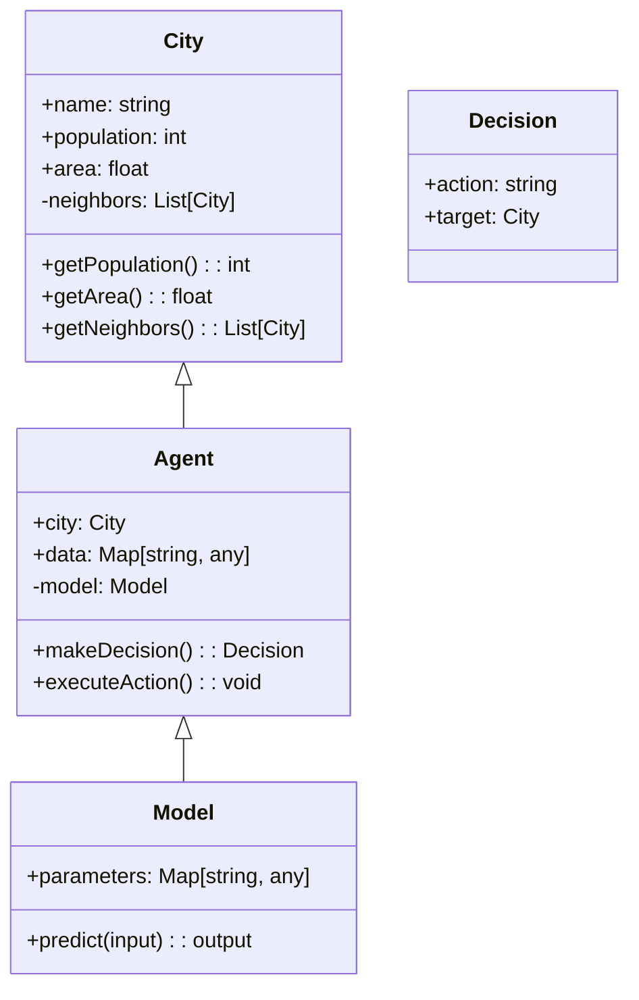
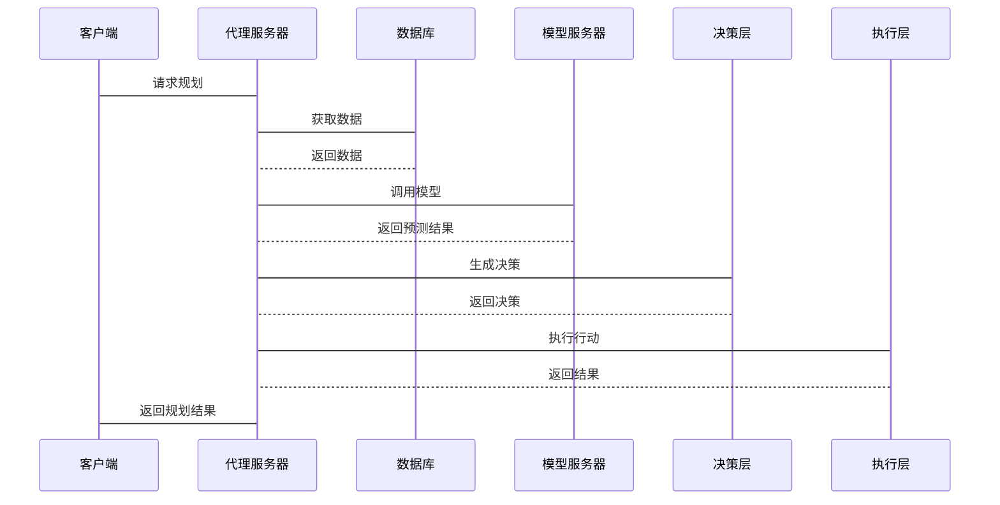

                 


# AI Agent在智能城市规划中的作用

> 关键词：AI Agent, 智能城市, 城市规划, 强化学习, 数学模型

> 摘要：本文探讨了AI Agent在智能城市规划中的作用，分析了其核心概念、算法原理、系统架构及实际应用。通过理论与实践结合，深入剖析了AI Agent如何提升城市规划的效率与质量。

---

# 第一部分: AI Agent与智能城市规划的背景介绍

## 第1章: AI Agent的基本概念与特点

### 1.1 AI Agent的定义与核心要素

AI Agent（智能体）是一种能够感知环境、自主决策并执行任务的实体。它具备以下核心要素：

- **感知能力**：通过传感器或数据输入获取环境信息。
- **决策能力**：基于感知信息，运用算法做出决策。
- **执行能力**：通过执行机构或接口将决策转化为行动。
- **学习能力**：通过反馈优化自身行为。

### 1.2 智能城市规划的背景

随着城市化进程的加快，城市规划面临数据复杂、资源有限、需求多样等挑战。AI Agent通过智能化手段，为城市规划提供了新的解决方案。

### 1.3 AI Agent与智能城市规划的结合点

AI Agent能够处理城市中的海量数据，优化资源配置，辅助决策，提升城市规划的科学性和效率。

---

## 第2章: AI Agent在智能城市规划中的核心概念

### 2.1 AI Agent的核心原理

AI Agent通过感知、决策、执行和学习四个步骤，实现对城市环境的优化。

### 2.2 AI Agent与城市规划的关系

AI Agent作为工具，帮助城市规划者更好地分析数据、模拟场景、优化方案。

### 2.3 AI Agent在城市规划中的应用范围

包括交通优化、资源分配、环境保护等多个方面。

---

# 第二部分: AI Agent在智能城市规划中的算法原理

## 第3章: 强化学习算法

### 3.1 强化学习的基本概念

强化学习是一种通过试错和奖励机制来优化决策的算法。核心公式为：

$$ Q(s,a) = r + \gamma \max_{a'} Q(s',a') $$

其中，\( Q(s,a) \) 表示状态 \( s \) 下动作 \( a \) 的价值，\( r \) 是奖励，\( \gamma \) 是折扣因子。

### 3.2 Q-learning算法

Q-learning是一种常用的强化学习算法，其流程如下：

1. 初始化Q表。
2. 环境提供当前状态 \( s \)。
3. 选择动作 \( a \) 并执行。
4. 获取奖励 \( r \) 和下一个状态 \( s' \)。
5. 更新Q表：\( Q(s,a) = Q(s,a) + \alpha (r + \gamma \max Q(s',a') - Q(s,a)) \)。

### 3.3 实验案例

以下是一个简单的Python实现：

```python
import numpy as np

# 初始化Q表
Q = np.zeros((4, 4))

# 状态空间：0,1,2,3
# 动作空间：0,1,2

# 参数
alpha = 0.1
gamma = 0.9

# 训练循环
for episode in range(100):
    state = 0
    while True:
        action = np.random.randint(0, 3)
        next_state = state + action
        if next_state >= 4:
            reward = -1
            next_state = 3
        else:
            reward = 1
        Q[state, action] = Q[state, action] + alpha * (reward + gamma * np.max(Q[next_state, :]) - Q[state, action])
        state = next_state
```

---

# 第三部分: AI Agent在智能城市规划中的系统架构

## 第4章: 系统功能设计

### 4.1 领域模型（Mermaid 类图）



### 4.2 系统架构（Mermaid 架构图）


### 4.3 接口设计

主要接口包括：
- 数据接口：获取城市数据。
- 模型接口：调用预测模型。
- 决策接口：输出决策结果。

### 4.4 交互设计（Mermaid 序列图）



---

# 第四部分: 项目实战

## 第5章: 实验环境与代码实现

### 5.1 环境安装

需要安装以下库：
```bash
pip install numpy matplotlib
```

### 5.2 核心代码实现

```python
import numpy as np
import matplotlib.pyplot as plt

# 初始化城市数据
class City:
    def __init__(self, name, population, area):
        self.name = name
        self.population = population
        self.area = area

# 初始化代理
class Agent:
    def __init__(self, city):
        self.city = city
        self.data = {}
    
    def collect_data(self):
        # 收集城市数据
        self.data['population'] = self.city.population
        self.data['area'] = self.city.area
    
    def make_decision(self):
        # 基于数据的决策
        if self.data['population'] > 1000:
            return "Expand infrastructure"
        else:
            return "Improve public services"

# 创建城市实例
city = City("Example City", 1500, 5.2)
agent = Agent(city)

# 执行代理
agent.collect_data()
decision = agent.make_decision()
print(decision)
```

### 5.3 案例分析

通过上述代码，AI Agent能够根据城市数据做出决策，帮助城市规划者优化资源配置。

### 5.4 项目小结

本项目展示了AI Agent在城市规划中的应用，从数据收集到决策制定，体现了其在智能城市中的重要性。

---

# 第五部分: 总结与展望

## 第6章: 总结与展望

### 6.1 总结

AI Agent通过智能化手段，显著提升了城市规划的效率和质量。其在数据处理、决策优化和资源分配等方面发挥着重要作用。

### 6.2 展望

随着技术的进步，AI Agent在智能城市中的应用将更加广泛，可能涉及更多的领域，如环境监测、能源管理等。

---

# 作者：AI天才研究院 & 禅与计算机程序设计艺术

---

这篇博客文章详细探讨了AI Agent在智能城市规划中的作用，从理论到实践，全面分析了其核心概念、算法原理、系统架构及实际应用。通过丰富的案例和代码示例，帮助读者深入理解AI Agent在智能城市中的重要性。

